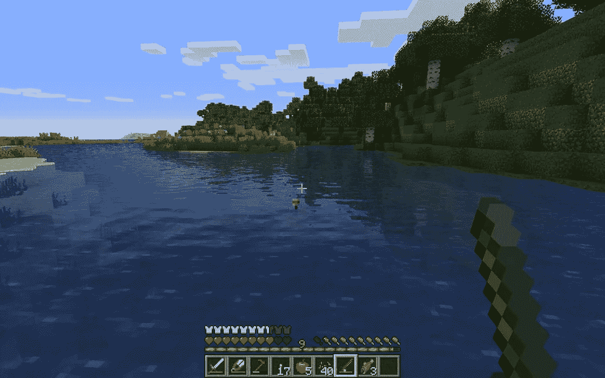
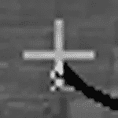
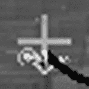
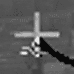
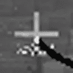

# 我们去钓鱼吧！用 Python、OpenCV 和 PyAutoGUI 编写《我的世界》1.17 自动钓鱼机器人

> 原文：<https://medium.com/geekculture/lets-go-fishing-writing-a-minecraft-1-17-auto-fishing-bot-in-python-opencv-and-pyautogui-6bfb5d539fcf?source=collection_archive---------13----------------------->



Let’s Go Fishing! ([screen credit](http://12tails.com/how-to-go-fishing-in-minecraft/))

我一直在 YouTube 上观看来自[sendex](https://www.youtube.com/channel/UCfzlCWGWYyIQ0aLC5w48gBQ)和[工程师 Man](https://www.youtube.com/channel/UCrUL8K81R4VBzm-KOYwrcxQ) 的一些游戏自动化和深度学习/人工智能，我想为了工作而学习它们(顺便说一句，我是这些人的超级粉丝)。

这与此相去甚远，但我的目标是最终通读成千上万的扫描文档并检索数据，这些数据可能是手写的或键入的。这意味着我必须将扫描结果作为图像读取，读取一个字符，转换成一个 numpy 数组，并对字符是/应该是什么做出一些决定。我最终会使用神经网络来“学习”字符并提高准确性，但现在，我想和孩子们一起做些有趣的事情。

昨天，新的《我的世界》“洞穴和悬崖”版本(1.17)发布了，我想为我写一个自动钓鱼的小程序可能会很有趣。这纯粹是一个教育的第一步，写一些有趣的东西，并在行动中看到。这并不是说阅读扫描文档不好玩，但是看到自动出现的绿色 XP 小气泡还是很酷的。都是为了眼前的满足，对吧？！？

开始了…

经过几次我不会让你厌烦的尝试和错误之后，我最终决定采用下面的方法…

*   当程序运行时，让角色准备好投射到一个可钓鱼的区域。施法应该是角色的第一个动作，这是使用 pyautogui.rightClick()完成的。
*   使用 PIL 抓取光标周围的一小块区域；例如，如果我将光标放在钓鱼浮子上，在钓鱼光标周围截取一个小正方形屏幕截图。
*   将图像转换为灰度，并将尺寸增大(即放大)到易于管理的程度。



*   继续拍摄每十分之一秒的灰色缩放屏幕截图。



*   当钓到一条鱼时，黑色的钓鱼线会下降到屏幕截图的下方，这样图像中就不会再有黑色像素了。


*   一旦一条鱼被“捕获”,再次使用 pyautogui.rightClick()来捕获捕获的鱼。
*   然后，循环整个过程来获得甜蜜的战利品和经验值！

现在对于代码…请注意，这是一个快速和肮脏的程序，以达到预期的结果。可以添加许多改进，但是 scope 只是一个概念验证，用于学习 OpenCV 中的图像操作。这仅用于教育目的！

您需要的四个外部库是 Pillow 或 PIL、pyautogui、OpenCV 和 numpy。我在虚拟环境中运行 Python 3.9.1。所以，安装这些:

```
pip install --upgrade numpy
pip install --upgrade opencv-python
pip install --upgrade Pillow
pip install --upgrade pyautogui
```

将以下文件保存到名为 autofish.py 的新项目中

```
import pyautogui
import cv2
from PIL import ImageGrab
from time import sleep
import numpy as np**def initializePyAutoGUI():**
    # Initialized PyAutoGUI
    # When fail-safe mode is True
    # moving the mouse to the upper-left
    # corner will abort your program. This prevents 
    # locking the program up.
    pyautogui.FAILSAFE = True**def take_capture(magnification):**
    mx, my = pyautogui.position()  # get the mouse cursor position
    x = mx - 15  # move to the left 15 pixels
    y = my - 15  # move up 15 pixels
    capture = ImageGrab.grab(
                  bbox=(x, y, x + 30, y + 30)
              )  # get the box down and to the right 15 pixels (from the cursor - 30 from the x, y position)
    arr = np.array(capture)  # convert the image to numpy array
    res = cv2.cvtColor(
              cv2.resize(
                  arr, 
                  None, 
                  fx=magnification, 
                  fy=magnification, 
                  interpolation=cv2.INTER_CUBIC
              ), cv2.COLOR_BGR2GRAY
          )  # magnify the screenshot and convert to grayscale
    return res**def autofish(tick_interval, threshold, magnification):**
    pyautogui.rightClick()  # cast the fishing line
    sleep(2)  # wait a couple of seconds before taking captures
    img = take_capture(magnification)  # take initial capture 

    # Continue looping to take a capture and convert and check 
    # until there are no black pixels in the capture. This will 
    # display the image, but it isn't necessary (the imshow method). # Once there are no black pixels in the capture:
    #     np.sum(img == 0) is looking for black pixels
    #     > threshold is the number of those pixels (0) 
    # exit the loop and reel in the catch (pyautogui.rightClick()). # Finally, wait a second and leave the auto-fish method.
    # This will cast, wait and catch one interval. See main method 
    # for looping. while np.sum(img == 0) > threshold:  
        img = take_capture(magnification)
        sleep(tick_interval)
        cv2.imshow('window', img)
        if cv2.waitKey(25) & 0xFF == ord('q'):
            cv2.destroyAllWindows()
            break
    pyautogui.rightClick()
    sleep(1) # This will wait 5 seconds to allow switching from Python program
# to Minecraft. Then loop through the autofish method for 100 
# cast and catch loops.
# 
# Launch Minecraft and load up your world
# Equip your fishing pole and be ready to cast into a fishable area
# Run program through IDLE or your IDE
# Switch to the Minecraft while running
# Position character so that it is ready to cast 
# and the cursor will be immediately on top of the bobber 
# Let it run...
# If you need more time, change sleep(5) to something more**def main():**
    initializePyAutoGUI()
    sleep(5)  
    i = 0
    while i < 100:
        autofish(0.01, 0, 5)
        i += 1

if __name__ == "__main__":
    main()
```

正如我之前说过的，我不能否认，这个程序的目的是学习图像捕捉，操作和阅读的基本知识，以便以简单有趣的方式有计划地做出决定。

我花了很长时间比较捕获和检测差异，但气泡使得不可能编码一致的东西。当我放大并查看光标捕获中的行时，我最终决定采用这种方法。

如果你有建议或改进，请告诉我。我很想听听你的想法。

编码快乐！

编辑更新:《我的世界》窗口需要在屏幕的左上角 800 X 600 的工作…