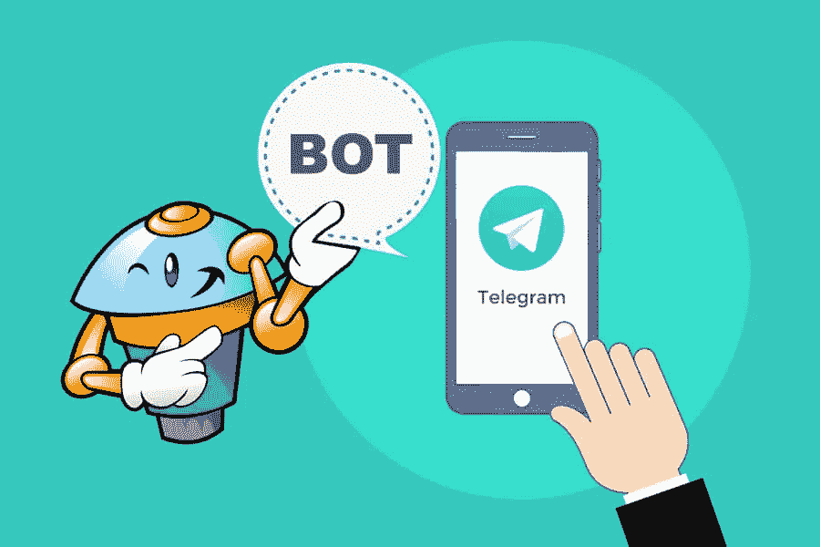
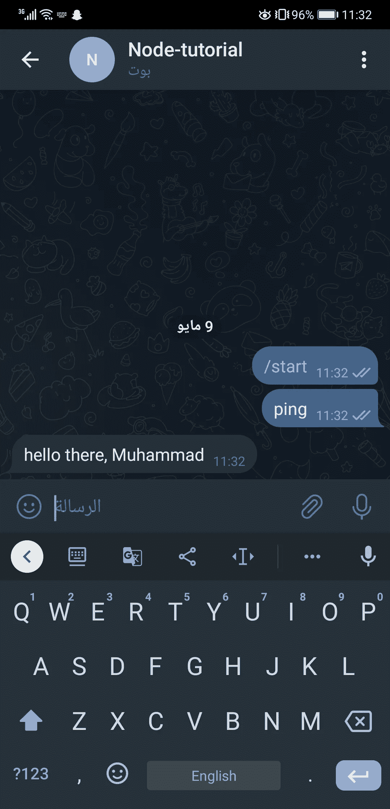
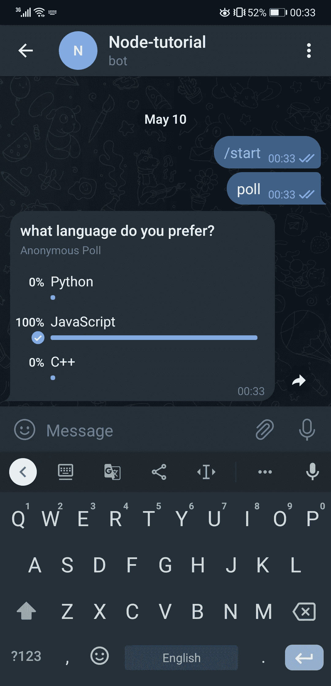

# 让我们用 Node.js 制作一个电报机器人

> 原文：<https://medium.com/geekculture/lets-make-a-telegram-bot-with-node-js-2f63da6f1bc7?source=collection_archive---------3----------------------->



Photo By Telegram Advisor

我很抱歉最近没有发帖子，我一直忙于其他项目，并试图申请国外的远程工作，所以我没有太多的时间来分享任何有趣的东西，但希望你们会喜欢这个😅

在这篇博客中，我们将发现用 node.js 制作一个电报机器人是多么容易，当我说容易时，我真的是指非常容易

老实说，我一直对毫无理由地制作一个电报机器人感到有点害怕，我只是想象它是一件复杂的事情，因为要获得一个令牌和东西，但最近我发现自己又一次陷入了可怕的睡眠灾难，所以我打开了我的笔记本电脑，启动了 vscode，并决定尝试看看它是否真的有那么难？？？？

**什么是电报机器人❓**

电报机器人本质上是一个基于事件和条件与用户交互的程序，基本上在这个场景中考虑它

你给机器人发一条信息，说“ping”，机器人就用图像、链接、视频、音频、地图或程序中描述的任何东西来响应

这个想法和你听说过的其他机器人没什么不同，所以让我们来看一个电报机器人的超级简单的例子

**电报机器人示例代码**

下面是一个用 Javascript 编写的最小机器人，它将检查每条消息，如果它等于“ping ”,然后用一个问候来响应

这段代码的结果如下



Apologies for the giant image 😂

话虽如此，让我们来看看关于制作你的第一个电报机器人的更多细节

**先决条件**

首先，我们需要用 npm 安装几个包来帮助我们完成项目，不用说用`npm init -y`初始化项目

```
npm i node-telegram-bot-api // the telegram bot api wrapper
npm i dotenv // to work with 
```

在我写这篇文章的时候，我运行的是 node 版本 17.4.0，你可以用`node --version`查看

**设置电报机器人**

好了，在我们进入编码部分之前，我们需要“注册”并验证我们的应用程序，幸运的是，这要感谢@BotFather，这是一个用来制作机器人的机器人，我知道这很疯狂😂

因此，在手机或 pc 上打开你的 telegram 应用程序，并查找@BotFather，说明会非常清楚，在获得你的令牌后，创建一个`.env`文件来安全地存储你的令牌，以便在你将项目推向公共回购的情况下没有人会看到它，然后创建一个`.gitignore`文件并将`.env`文件添加到其中，以便在你使用`git`的情况下不会被提交

**让我们的机器人打招呼**

下一个例子与前面的例子非常相似，但是我们将更深入地研究 api

我们首先导入我们需要的东西，即 api 包装器和`dotenv`

然后创建一个代表我们的机器人的`telegrambot`实例，它将与电报机器人 api 交互

这个 api 包装器的工作方式是事件，事件被发出，你的机器人相应地响应

因此，在这种情况下，我们有一个消息事件被激发，这意味着一条消息已被发送到聊天中的机器人，它接受一个回调作为参数，这个回调有一个有趣的参数，让我们`console.log()`看看它有什么有用的属性

正如你所看到的，它有许多有趣的属性，我们可以在我们的程序中使用

**让我们的机器人掷骰子**

我们可以做的另一件有趣的事情是和机器人玩掷骰子，是的，你基本上是在和自己玩😏，让我们看看如何实现它

看到了吗？很简单，现在如果你看你的手机，你应该看到一个动画骰子已经发送后，你发送“骰子”在聊天

**进行民意调查**

让用户参与投票并通过 node.js 实现这一点是很常见的，我们只是使用同一个 bot 对象来提示用户选择一个选项，如下例所示

现在让我们测试一下，看看结果



**接下来是什么？**

好了，现在你已经看到了如何制作自己的电报机器人，天空是无限的，你可以实现你想要的任何想法，我甚至不能开始列出这些知识可以做什么，无论你可以用 Node.js 做什么你现在可以用这个机器人做什么，一个 express.js 服务器来处理一些处理，并使用`axios` 通过 HTTP 与机器人通信？是的，这是可以做到的！

Web 抓取一些内容并回复？很简单，事实上，在这个博客上有 20 个掌声，我会去做的

但是您可能想知道如何理解 api？我强烈推荐你去看看回购协议，尤其是这里的用法部分

非常感谢你的阅读，我希望你今天在这里学到了一两件事，请在下面的评论中让我知道你正在建设♥️