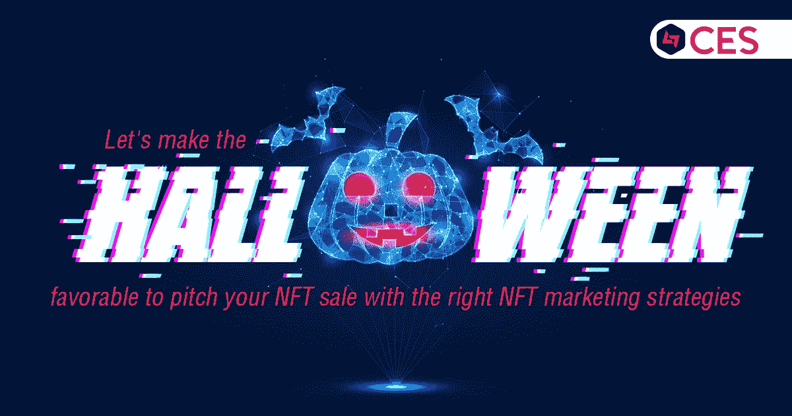

# 让我们利用合适的 NFT 营销策略，让万圣节有利于推销你的 NFT 销售。

> 原文：<https://medium.com/geekculture/lets-make-the-halloween-favorable-to-pitch-your-nft-sale-with-the-right-nft-marketing-strategies-10f58bd8453f?source=collection_archive---------18----------------------->

万圣节派对是令人兴奋的仪式，庆祝的目的是为了记住以各种方式支持我们生活的天堂灵魂的存在。这种趋势随着围绕万圣节庆祝活动演变的传说而发生了变化。与其说是一种以文化为导向的做法，不如说是对万圣节的情感和令人兴奋的服装吸引了全世界的人们来庆祝万圣节。虽然这些万圣节派对的情感吸引了观众参与并体验穿着恶魔服装的传统，但在这里，我们描绘了吸引志同道合者体验另一种虚拟体验的奇怪文化的绝佳机会，如 NFTs 和 metaverses 等新创新。而市场正在探索机会的维度。正确的营销策略与正确的万圣节主题营销活动将有利于提高你的 NFT 销售给潜在的观众

**万圣节对 NFTs 的影响**

万圣节在历史上与服装、糖果和不给糖就捣蛋联系在一起，但今年，随着元宇宙的发展，庆祝活动正在网上进行。为了吸引收藏者寻找主题物品，不可替代的代币或 NFT 正在以万圣节为主题进行开发。

由于加密和 NFT 领域的指数级增长，无数不可替代的爱好者进入了这个生态系统，使这个假期成为 NFT 历史上最大的假期。

类似于圣诞节，万圣节是一个绝佳的机会，为你的 NFTs 添加一些创意。如果你想在某个媒体上开展活动，NFT 营销服务将帮助你创建特别优惠或广告，通过各种社交媒体网站进行宣传。向下滚动更多内容，了解有关服务的深入信息。

**NFT 营销服务:SEO & CRO**

SEO 策略提高了您的数字收藏品的有机可见性。在这个 NFT 营销计划的帮助下，你们的 NFT 大使制作了包含特定搜索词的内容。顾客在网上购物时会使用这样的搜索词。由于独特的 SEO 策略，当潜在客户寻找它们时，你的 NFT 将出现在 SERPs 上。因此，使用这种策略可以导致大量的投标和巨额拍卖收入。如果你与 NFT 营销服务提供商合作，你可以利用一些搜索引擎优化的机会。

为了增加你的销售，你甚至可以结合转化率优化(CRO)技术。如果你拥有一个 NFT 平台来销售你的数码宝贝，使用 CRO 技术来提高你的销售额。通过各种渠道，如 SEO 和 PPC，转化你收到的访客是至关重要的。

因为它与 CRO 有关，所以要确保你进行了足够的测试。确保你的网站包含一个网页，专门用于用户评论、客户评价和访问者参与的弹出窗口。

**写博客**

通过博客，你可以在购买周期的不同阶段联系潜在客户。NFT 是一项新技术，因此请记住，有些人可能正在研究它们。因此，如果您利用这种 NFT 营销策略来提供信息，将会非常有益。

**电子邮件营销**

推广你的 NFTs 最有效的方法之一是通过电子邮件营销，这可以让你的听众了解 NFT 行业的最新发展。启动电子邮件营销活动真的很容易:选择你的目标受众，找到他们的电子邮件地址，将地址提供给电子邮件发送服务，制作内容，发送吸引人的电子邮件。如果你想吸引听众，你的材料必须切合他们的需求。此外，提供强有力的行动号召(CTA)。

**社交媒体推广**

使用社交媒体，你可以为你的万圣节 NFTs 建立一个社区。你的项目在社区中引起了轰动。项目所有者可以通过各种平台推广他们的数字艺术品。你应该在你的计划中包括 NFT 营销的顶级平台，其中一些是 Twitter，YouTube，Reddit，Telegram，LinkedIn 和脸书。

**使用影响者**

影响者有能力影响其追随者的购买选择。大多数 NFT 有影响力的人使用各种社交媒体网站。它们有助于你的 NFTs 的推广，增加获得和产生有价值的投标。您的 NFT 营销必须包括影响者推广策略，因为这些 NFT 影响者的方法将产生巨大的影响。它可以很容易地由 NFT 营销服务提供商建立。

**NFT 营销 AMA 会议**

ama 可以帮助向观众介绍计划，并帮助他们理解概念。此外，您可以在会议期间描述您产品的未来。

Telegram、Reddit 和 YouTube 是举办会议和获得更多关注者的最佳平台。此外，通过向社区提供赠品，您可以增强 ama 的吸引力和参与度。

**出现在时事通讯中**

许多区块链平台经常向他们的受众分发时事通讯。你可以要求他们在即将发布的版本中加入你的数码纪念品。数字艺术领域最好的新作品会出现在 NFT 日历简讯中。要在他们即将发布的电子邮件中突出您的发布，请联系他们。

**通过电子邮件注册您的状态:**

电子邮件是最棒也是最可行的媒介，可以直接接触到对你为未来带来的创新感兴趣的受众。通过分享你的创新范围和愿景来激励观众，将对你的销售比例产生巨大影响。

**新闻稿**

在知名网站上发布新闻稿可以提高你产品的可信度。你可以在新闻稿中描述你的 NFT 的价值和购买它们的好处。与 NFT 营销公司合作可以帮助你制作有效的新闻稿。

**聘请有经验的 NFT 营销服务公司**

当你已经投入了大量的时间和金钱来铸造你的收藏品，并且你的主要目标是进入市场并赚取丰厚的利润时，营销一个 NFT 项目可能是一项艰巨的任务。一家 NFT 营销服务公司可以为你提供营销方面的经验，这对你的项目至关重要。如果你想让你的 NFT 生意成功，雇佣一个 NFT 营销服务提供商是明智的。除了传播您的项目意识，公司还可以通过其他方式支持您在 NFT 的业务。

在各种地方，如 NFT 艺术市场，营销你的 NFTs 所需的技术和人员可以从真正的 [NFT 营销服务公司获得。](https://www.cryptocurrencyexchangescript.com/nft-marketing-services?utm_source=Google+&utm_medium=paid+Guestblog&utm_id=Ramya)

**外卖**

由于 NFTs 越来越受欢迎，许多企业和个人正在开发项目。市场上有大量的数字收藏品和艺术品。只有当你有一个复杂的 NFT 营销方法，你才能脱颖而出。为了取得出色的成果，您还应该与经验丰富的 NFT 营销服务提供商密切合作。

创建数字艺术后的下一步是将其推向市场，以获得大量的出价，为了以正确的方式完成，你将需要 NFT 营销服务公司的营销帮助。如果你有一个 NFT，请联系行业专业人士来帮助你营销你的数字作品。