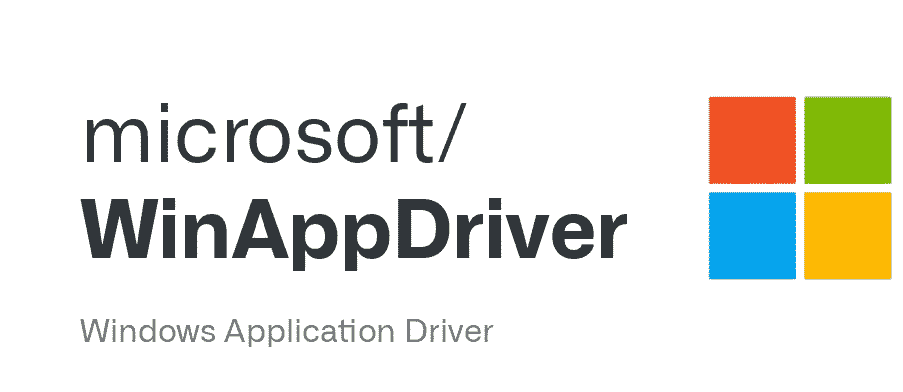

# 让我们解决 WinAppDriver 的一个痛点

> 原文：<https://medium.com/geekculture/lets-resolve-a-pain-point-of-winappdriver-bbe8e315f2a9?source=collection_archive---------11----------------------->

让我们解决使用 Windows 应用程序驱动程序的棘手问题..

## 痛点

老实说&告诉我你在使用 Windows 应用程序驱动时遇到的第一个痛点是什么..

> 手动启动 Windows 应用程序驱动程序双击 EXE 文件&手动退出 Windows 应用程序驱动程序