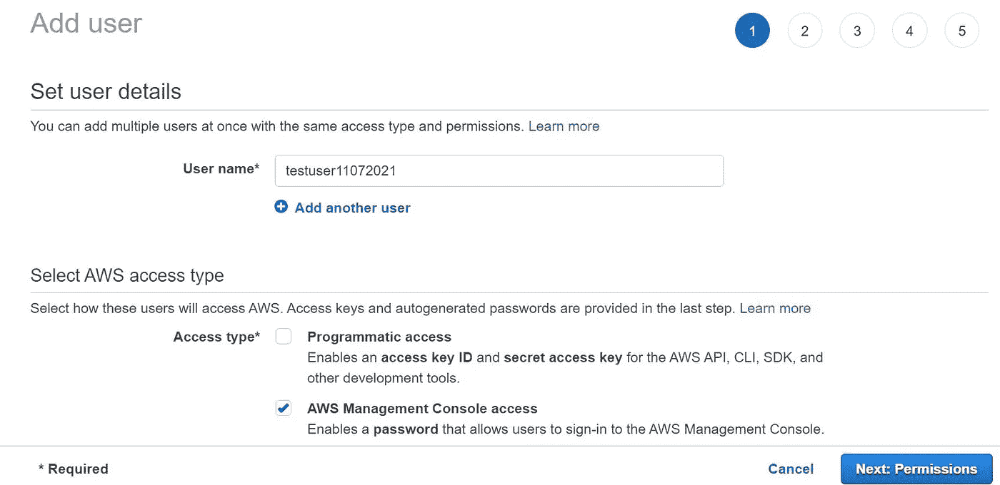
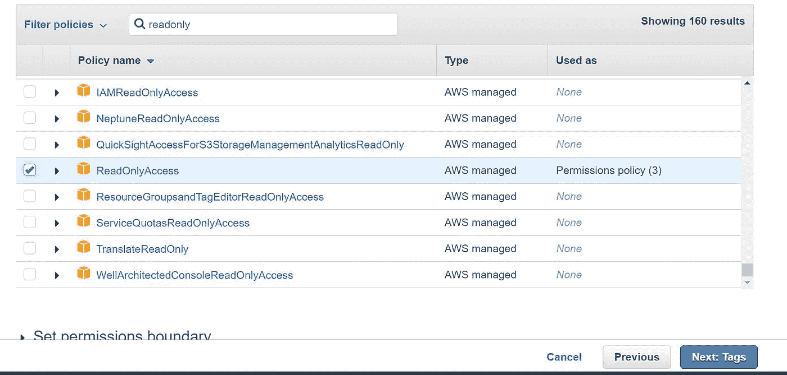
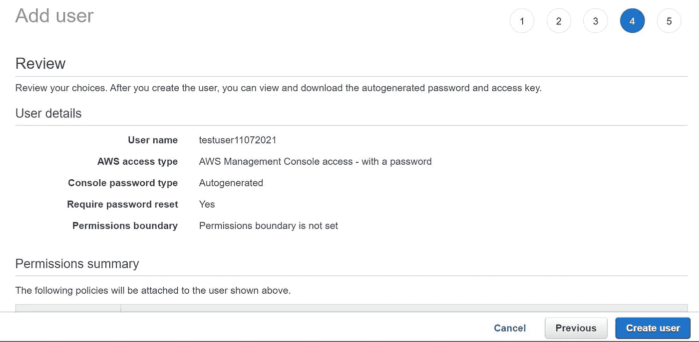
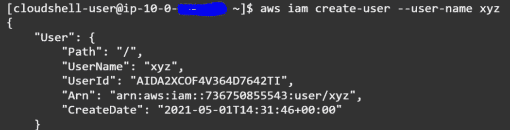
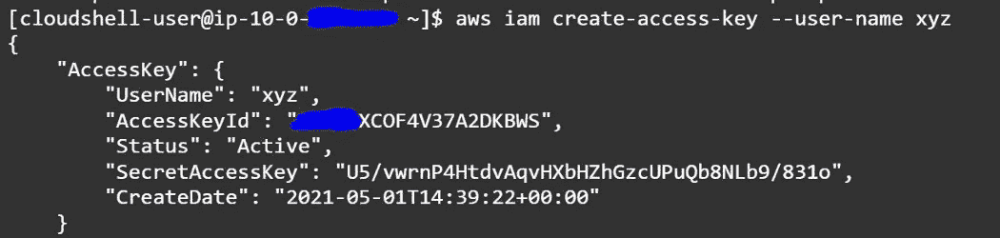
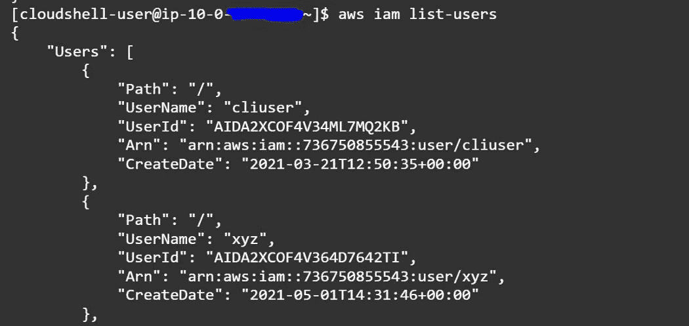

# 让我们谈谈 AWS 身份和访问管理(IAM)

> 原文：<https://medium.com/geekculture/lets-talk-aws-identity-and-access-management-iam-98e487f1503a?source=collection_archive---------18----------------------->

云计算的发展改变了我们在公共云中存储和保护数据的方式。虽然安全性是这里的一个主要问题，但是保护和限制数据访问的第一层是通过实现 AWS 身份和访问管理。

在这篇博客中，我们将讨论亚马逊网络服务的核心安全和用户管理服务之一，即身份和访问管理(AWS IAM)。我们还将了解如何创建 IAM 用户并授予所需的访问权限、与 IAM 交互的 CLI 命令以及 IAM 的最佳实践，以获得此服务的全部好处。

根据官方定义，“AWS 身份和访问管理(IAM)是一个 web 服务，用于安全地控制对 AWS 服务的访问。借助 IAM，您可以集中管理用户、访问密钥等安全凭证以及控制用户和应用程序可以访问哪些 AWS 资源的权限。”

使用 IAM，您可以创建和管理 AWS 用户和组，并使用权限来允许和拒绝他们对 AWS 资源的访问。

在我们开始研究控制台之前，让我们先了解一下 IAM 的主要方面。

1.  ***用户-*** AWS IAM 用户是您在 AWS 中创建的一个实体，用来表示使用它与 AWS 进行交互的人或应用程序。
2.  ***角色-***IAM 角色是一个有权限发出 **AWS** 服务请求的实体。角色被附加到 AWS 用户，比如帐户 A，通过它他们可以访问另一个帐户 B，或者角色被附加到 AWS 服务，比如 EC2，以便他们可以调用(API 调用)另一个服务，比如 S3。
3.  ***策略-*** 角色用于访问另一个帐户或服务，而策略是与用户相关联的权限。当用户尝试在任何其他帐户或服务中执行任何操作时，AWS 会评估附加的策略，并确定是否允许该请求。

AWS IAM Console view

*IAM 用户可以通过两种方式访问 AWS 资源:*

1.  *程序化访问* -用户需要 ***访问密钥 ID*** *和* ***秘密访问密钥*** 通过 AWS API、CLI、SDK 和其他开发工具使用 AWS 服务。
2.  *AWS 管理控制台访问-* 需要一个 ***密码*** ，通过该密码他可以访问控制台并按照给定的权限执行任务。

*创建 IAM 用户并授予管理控制台只读访问权限的步骤:*

1.  以 root 用户(帐户管理员)身份登录到您的控制台，然后转到 IAM 控制台。选择用户并提供用户名，然后选择 AWS 管理控制台访问。

2.接下来>转到权限页面，单击附加现有策略(这里我们只关注用户和策略，因此不创建任何组),然后选择 ReadonlyAccess。

3.查看详细信息，然后单击创建用户。现在创建了一个具有只读访问权限的新用户，您需要与他/她共享详细信息，以便访问控制台并开始工作。

*AWS IAM switch role -* 让我们考虑一个场景，您的 infosec 团队成员需要对每个帐户进行一些安全测试，我们应该给他对这些帐户的读取权限。在这种情况下，我们需要使用 ***切换角色*** 服务，并给予必要的帐户访问权限，以便用户可以执行所需的活动。

*接下来，我们需要始终确保遵守 AWS IAM 的最佳实践，它们如下:*

1.  授予[最小特权访问](http://docs.aws.amazon.com/wellarchitected/latest/security-pillar/permissions-management.html):建立最小特权原则确保身份只被允许执行完成特定任务所需的最少功能，同时平衡可用性和效率。
2.  使用 [AWS 组织](https://console.aws.amazon.com/organizations/home):在扩展 AWS 资源时集中管理和治理您的环境。轻松创建新的 AWS 帐户，对帐户进行分组以组织您的工作流，并对帐户或组应用策略以进行管理。
3.  启用身份联合:管理用户并从您的首选身份源访问多个服务。使用 [AWS 单点登录](https://console.aws.amazon.com/singlesignon/home)集中管理对多个 AWS 帐户的访问，并为用户提供从一个位置对其所有指定帐户的单点登录访问。
4.  启用 MFA:为了获得额外的安全性，我们建议您为所有用户[要求多因素身份验证(MFA)。](https://console.aws.amazon.com/iam/home?region=us-east-2#users)
5.  [定期轮换凭证](https://console.aws.amazon.com/iam/home?region=us-east-2#security_credentials):定期更换您自己的密码和访问密钥，并确保您帐户中的所有用户都这样做。
6.  启用 [IAM 访问分析器](https://console.aws.amazon.com/access-analyzer/home):启用 IAM 访问分析器来分析公共、跨帐户和跨组织访问。

用于 AWS IAM 的 CLI 命令:

1.  创建 IAM 用户—“AWS IAM 创建用户—用户名 xyz”

2.创建访问密钥-“AWS iam create-Access-Key-用户名 xyz”

3.列出 AWS IAM 用户-“AWS IAM 列表-用户”

请参考亚马逊的 AWS IAM 官方文档，链接"[https://docs.aws.amazon.com/iam/](https://docs.aws.amazon.com/iam/)"

AWS CLI 参考 https://docs.aws.amazon.com/cli/latest/reference/iam/[号](https://docs.aws.amazon.com/cli/latest/reference/iam/)

***AWS IAM 常见问题解答-***

1.  谁能够管理 AWS 帐户的用户？
    AWS 帐户持有人可以管理用户、组、安全凭证和权限。此外，您可以授予单个用户调用 IAM APIs 的权限，以便管理其他用户。例如，可以创建一个管理员用户来管理公司的用户——这是推荐的做法。当您授予用户管理其他用户的权限时，他们可以通过 IAM APIs、 [AWS CLI](http://aws.amazon.com/developertools/AWS-Identity-and-Access-Management/4143) 或 [IAM 控制台](https://console.aws.amazon.com/iam/home)来实现这一点。
2.  IAM 用户支持哪种密钥轮换？
    用户访问密钥和 X.509 证书可以像 AWS 帐户的根访问标识符一样进行轮换。您可以通过 IAM APIs、AWS CLI 或 IAM 控制台以编程方式管理和轮换用户的访问密钥和 X.509 证书。

请看 https://aws.amazon.com/iam/faqs/.的更多常见问题

***IAM 是您的 AWS 帐户的一项功能，无需额外付费。您只需为您的用户使用其他 AWS 服务付费。***

让我们在下一篇博客中了解更多关于交换机角色、用户策略、组和 AWS 的其他编程访问。

*结论——*

AWS 身份和访问管理必须在您的环境中强制使用。通过对 AWS 资源的细粒度访问控制、针对高权限用户的多因素身份验证、分析访问并将其与您的公司目录集成，充分利用它。

由于 IAM 可确保安全性和数据隐私，因此请务必遵循 IAM 的最佳实践。当涵盖所有方面时，您的数据是安全可靠的。