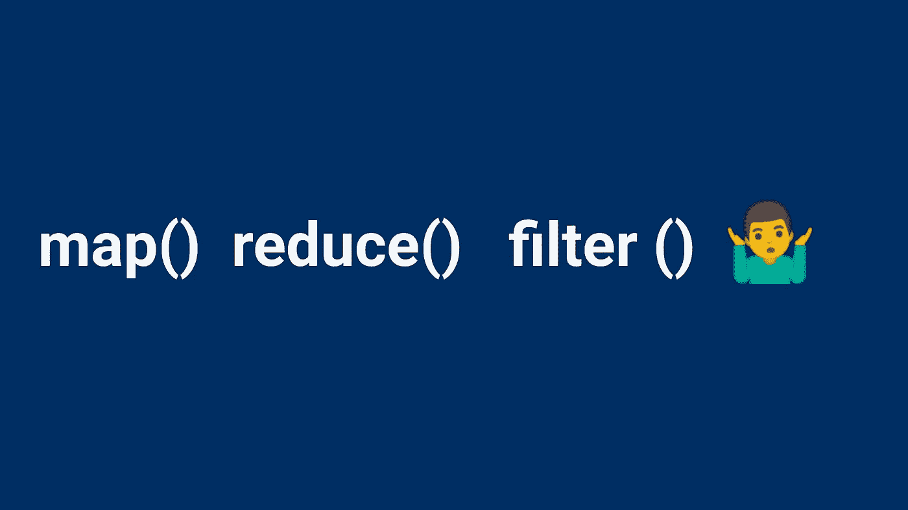

# Javascript 映射，减少，过滤 methods✌

> 原文：<https://medium.com/geekculture/lets-understand-map-reduce-filter-65a9d303b6cc?source=collection_archive---------24----------------------->

理解 JavaScript 映射、减少、过滤方法。



javascript array map, reduce filter methods

# 为什么我们需要它❔

我们经常会遇到需要在 javascript 数组或对象数组中执行一些操作的情况，作为一个 javascript 新手，我们首先想到的总是在 for/forEach 循环中运行数组或对象数组，以便迭代数组的元素并执行自定义操作，但是 javascript 为我们提供了一种更简单的方法，用更少的代码行做很多事情，JavaScript 提供的这些方法包括 map、reduce、filter 方法，使我们处理对象数组/数组的任务变得容易。尽管有许多 javascript 方法可以处理数组，但这里我们将集中讨论三种最常用的方法，即 map、reduce 和 filter。

# 简单的一行定义🎯

**1️⃣映射——用于修改一个数组中的元素，得到元素修改后的新数组。**

**2️⃣归约——在数组中执行一些操作并返回一个计算值。**

**3️⃣滤波器——获取满足特定条件的数组子集。**

# 让我们逐一了解他们每个人🕵️‍♀️

# 地图📌

**map 用于修改当前数组中的元素/对象数组。在传统的编程中，我们使用 for 循环，但在这里，javascript 的 map 方法将为我们做这件事。**

**让我们举一个例子**

假设我们有一个数字数组，我们希望将数组的每个元素加 5，我们可以简单地这样做:

```
**let numArr = [5,10,15,20];****numArr = numArr.map(element => {****return element + 5****});****console.log(numArr);**
```

这里 numArr 是数字数组，我们调用 numArr 中的 **map** 方法迭代每个元素，后面跟着一个回调函数，将 numArr 的每个元素加 5，我们得到下面的输出

**【10，15，20，25】**

**对对象阵列使用贴图方法**

假设我们有一个包含名字和姓氏的对象数组，并且我们需要使用现有的对象数组来获取雇员的全名，下面是我们的实现方法。

```
**var employee = [{fname: ‘Rahil’, lname: ‘Shaikh’},{fname: ‘Zahwa’, lname: ‘Ansari’}];****var empfullName = employee.map(emp => { 
return `${emp.fname}  ${emp.lname}`
});**OR**var empfullName = employee.map(emp => { 
return emp.fname + ' ' + emp.lname 
});****console.log(empfullName);**
```

**输出:['拉希尔·谢赫'，'扎赫瓦·安萨里']**

在这里，employee 是一个包含 fname 和 lname 的对象数组，我们通过调用一个 map 方法来创建一个新数组，该方法将 employee fname 和 lname 连接起来，以返回 employee 的全名。

🔷➖➖➖➖➖➖➖➖➖➖➖➖➖➖➖➖➖➖➖➖🔷

# 减少📌

**reduce 方法用于计算数组中元素的单个值。**

让我们再举一个例子，同样的 numar 有一个数组，假设我们需要计算 numar 的和，这里我们可以使用 reduce 方法来进行这个操作。

```
**let numArr = [5,10,15,20];****const sum = numArr.reduce((total, currentValue) => {****return total + currentValue****});****console.log(sum);**
```

**输出:50**

工作原理:

reduce 接受两个参数， **total 和 currentValue**

在第一次迭代(索引 0)中， **total** 是数组**的第一个元素，即 5**

**当前值**为 **10，**为当前迭代的下一个值(索引 1) **。**

一旦我们完成了第一次迭代**的求和，即 5 + 10 = 15** ， **total** 现在的值为 **15** ，而 **currentValue** 将是 10 之后的下一个元素的值，即 **15** (索引 2)，这就给出了求和 **15+15 = 30**

**total** 现在的值为 **30** ，而**current value**为 **20** (索引 3)，这给出了结果 **30+20 = 50** ，因为数组中没有更多的元素，所以迭代停止，50 的结果作为结果返回给 sum 变量。

🔷➖➖➖➖➖➖➖➖➖➖➖➖➖➖➖➖➖➖➖➖🔷

# 过滤器📌

**filter 用于根据某种条件创建一个包含原始数组元素子集的新数组。**

让我们举一个例子

我们有一个由一些随机数组成的数组，比如 randomNum，我们需要创建一个新的数组，其中包含 randomNum 数组中大于 10 的元素，下面是我们如何使用 filter 方法来实现这一点。

```
**const randomNum = [1,18,45,6,9,33,4];****const numGreaterThan10 = ** **randomNum.filter(num => {****return num > 10****});****console.log(numGreaterThan10);**
```

**输出:[ 18，45，33 ]**

这里我们将 filter 方法应用于 randomNum 数组，filter 将遍历 randomNum 数组的每个元素，并返回大于 10 的元素。

现在让我们举一个在对象数组中应用过滤方法的例子

我们有一个包含国家和城市的对象数组，我们需要过滤这个对象数组，只返回国家印度的城市，

```
**let places = [{country: ‘India’, city: ‘Mumbai’},{country: ‘USA’, city: ‘New York’},{country: ‘Turkey’, city: ‘Istanbul’},{country: ‘India’, city: ‘Delhi’},{country: ‘France’, city: ‘Paris’}]****const indianCities = places.filter(place => {** **return place.country === ‘India’
});****console.log(indianCities);**
```

**输出:[
{国家:'印度'，城市:'孟买' }，
{国家:'印度'，城市:'德里' }
]**

filter 方法迭代每个元素，即地点对象，并检查地点的国家是否是印度，如果是，则返回值。

🔷➖➖➖➖➖➖➖➖➖➖➖➖➖➖➖➖➖➖➖➖🔷

***现在你知道什么时候在数组中使用 map，reduce 和 filter 方法了，如果这篇文章有帮助的话，点赞吧👍分享知识🤘。***