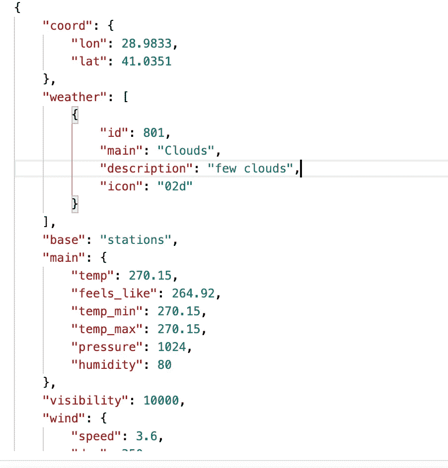
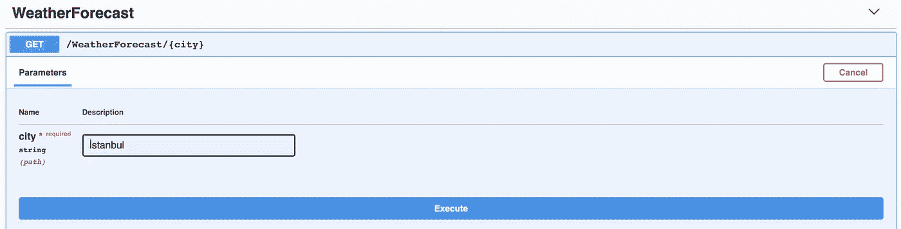
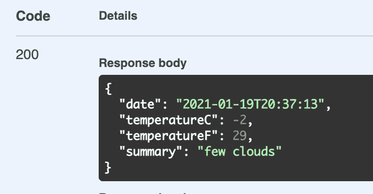

# 让我们用。网络 5

> 原文：<https://medium.com/geekculture/lets-write-microservice-with-net-5-d726d4fdedcc?source=collection_archive---------2----------------------->

## **微服务**这几天被提到很多。如果我们看看招聘启事。几乎都是想要微服务知识。


但是为什么呢？

让我们回顾一下过去，将我们项目的所有特性都集中在一个屋檐下曾经是很理想的。然而，这种情况产生了一些问题。这样的服务停机或维护问题

但是在**微服务**理念之后，就变了。今天，我们将项目分成几个小部分。而这些部分是独立的。比如沃尔创！

这种哲学的优点是什么？

*   维修费用
*   在服务崩溃的情况下，其余的服务继续处理
*   查找错误原因非常快
*   当您升级服务时，它可以继续运行
*   等等…

我们将编写一个微服务。净 5。我将分享我的 Git Hub 帐户的完整代码。

我们需要什么？

*   **Visual Studio 代码或 Visual studio**
*   **OpenWeatherMap API 键**
*   **。Net 5 SDK**

开始编码吧。

首先，我们需要创建一个 web API 项目。净 5。
当你直接运行代码时，它将工作并从天气服务中获取天气信息。但是我们将会改变这种情况。

我们需要一个包含 API 主机和 API 密钥的类。我们把它命名为 ServiceSettings 吧。并在 ApplicationSetting.json 中定义它

```
"ServiceSettings":{
    "OpenWeatherHost" : "api.openweathermap.org"
  },
```

如果我们向 startup.js 中的 ConfigurationServices 方法添加 define，那么它将从 JSON 文件中获取数据。

```
services.Configure<ServiceSettings>(Configuration.GetSection(nameof(ServiceSettings)));
```

我们没有定义 API 键。

是啊！因为 API 密匙很重要，所以我们不能把密匙放在应用程序的 JSON 文件中。为此，有一种方法可以隐藏 API 关键数据

打开终端窗口并运行

```
dotnet user-secrets init
dotnet user-secrets set ServiceSettings:ApiKey 7d33f2b4d71b3c87139011b (this key should be you your key)
```

现在我们需要一个客户。让我们创造它。这堂课的目标。它会将我们的应用程序连接到 OpenWeatherMap

你看到很酷的功能了吗？

记录是附带的新功能。净 5。之前。net 5 我们不得不在我们的代码库中定义一个类似的输出类，但是现在有了 record。我们可以在没有定义的情况下获得数据。



例如，在我们的类中，我们将从天气中获得描述，从 main 中获得 temp，从 date 中获得

GetFromJsonAsync 也是。它将获得一个 JSON 结果并将数据分配给预测记录类型。

作为微服务，我们需要检查服务是否健康，为此有一个包

```
**dotnet add package Microsoft.Extension.Http.Polly**
```

安装之后，我们需要在配置服务中定义我们的客户端类。

```
services.AddHttpClient<WeatherClient>().AddTransientHttpErrorPolicy(builder => builder.WaitAndRetryAsync(10, retryAtempt => TimeSpan.FromSeconds(Math.Pow(2, retryAtempt))));
```

AddTransientHttpErrorPolicy 附带 Polly 包。在客户端调用之后，如果没有返回响应，那么它将尝试 10 次。以指数级的速度。

但是停下来！有一个问题，它试图达到我们的服务，但我们需要检查 API 端。

我们需要编写一个从 IHealtyCheck 派生的类

当我们大摇大摆地提供服务时。我们的服务会完美的



通话后



如果要检查服务是否正常，只需在配置方法中定义地址。

终于，我们完成了第一个**微服务**。我将集中讨论这一点。保持联络

你可以从[这里](https://github.com/barkinkizilkaya/NetFiveMicroServis)下载代码

最诚挚的问候。

来源:[波利](https://docs.microsoft.com/tr-tr/dotnet/architecture/microservices/implement-resilient-applications/implement-http-call-retries-exponential-backoff-polly)，。 [Net 5 Api](https://docs.microsoft.com/tr-tr/dotnet/core/dotnet-five) ， [YouTube](https://www.youtube.com/user/jcasalt)