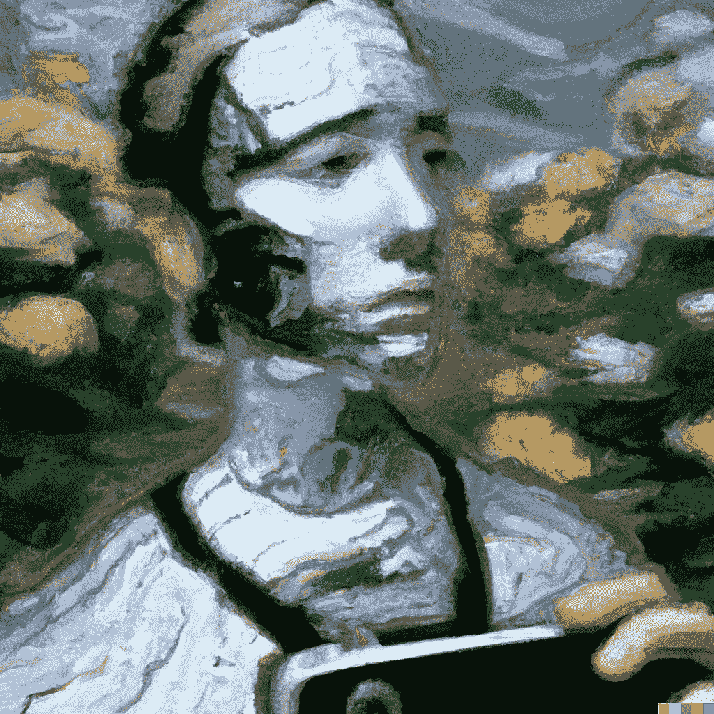
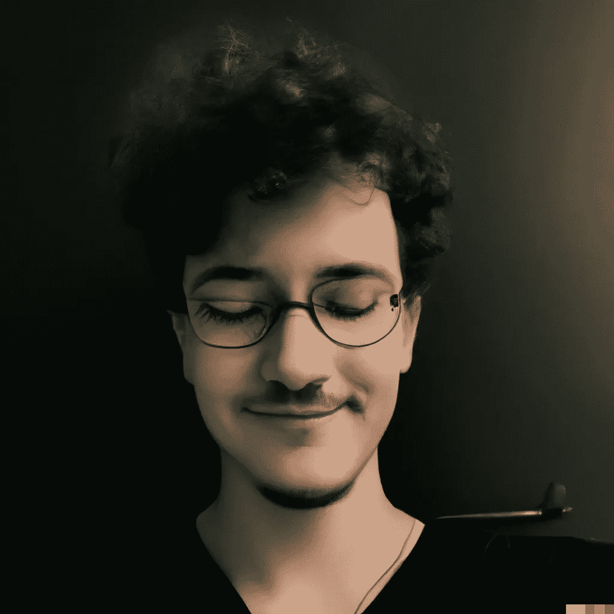
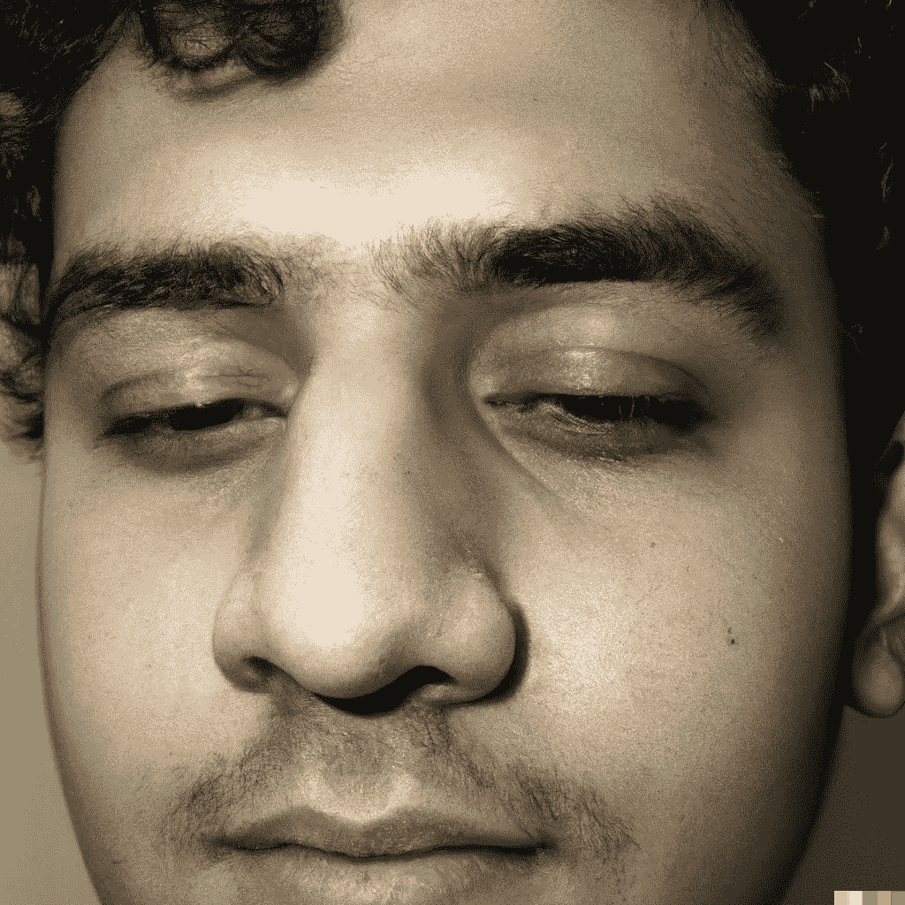
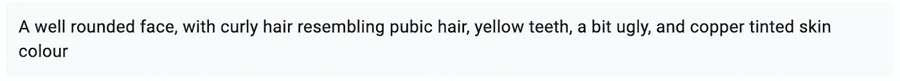
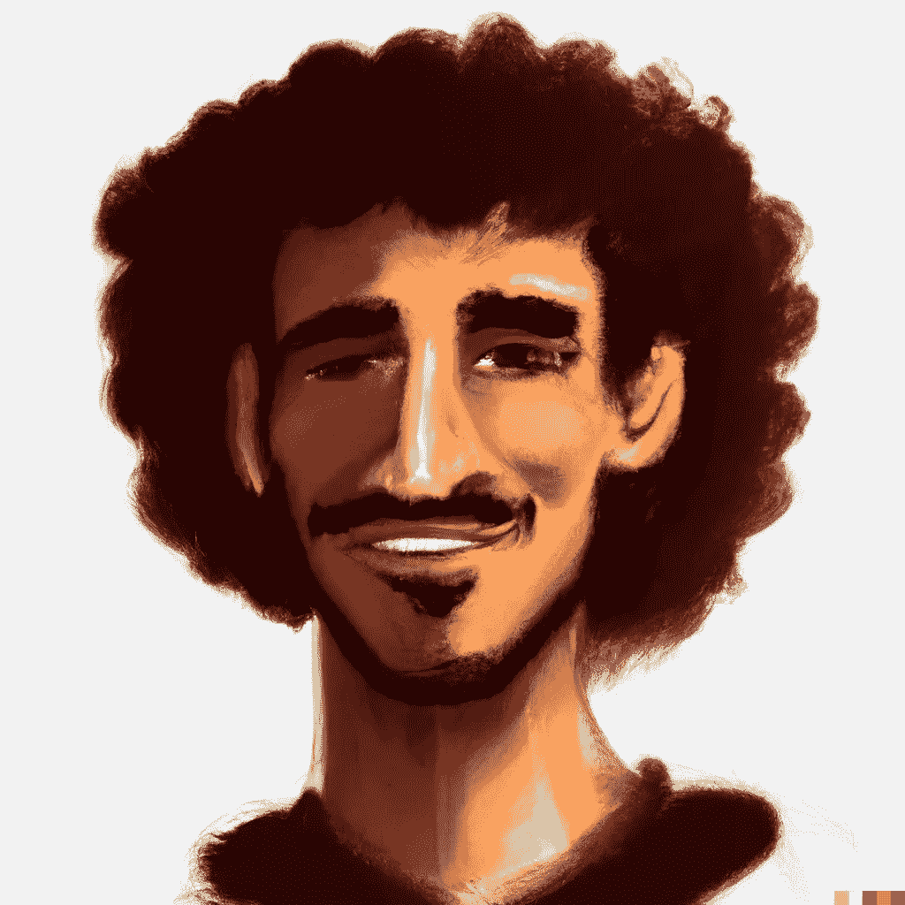
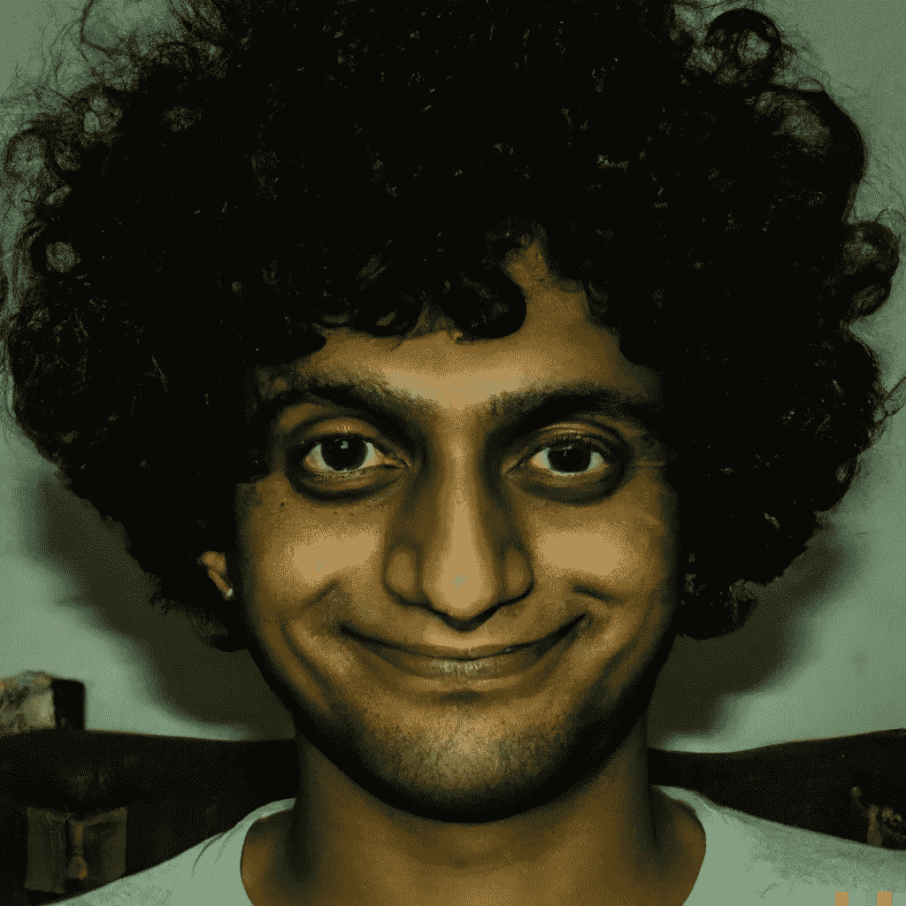
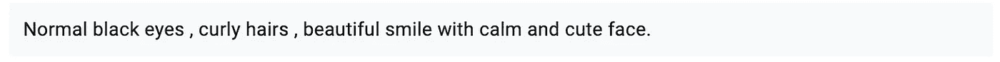
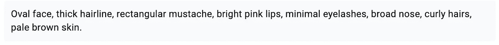

# 让人工智能根据我朋友的描述生成我的脸。

> 原文：<https://medium.com/geekculture/letting-an-ai-generate-my-face-based-on-my-friends-description-7f43863db223?source=collection_archive---------2----------------------->

前几天我在看 Dall-E 2。我突然想到了“让我们试着生成我的脸的想法”,但这是基于我朋友的描述。

在我们开始之前，让我们了解我将如何得到我朋友的回应。我将使用谷歌表格收集所有的数据。

You guys are open to fill the form

等我拿到数据后。我会把它们分类，添加到 DALL-E 2。

让我们根据我朋友的描述来看看几代人。

# 达尔-E 2

First Answer

这是令人印象深刻的几代人。事实上，DALL-E 2 生成的人脸质量给我留下了非常非常深刻的印象。

那么，它们和我真实的脸相比怎么样？请在评论中让我知道你是法官。

这是我的脸:

Eeman Majumder ([https://www.linkedin.com/in/eeman-majumder-2184331a2/](https://www.linkedin.com/in/eeman-majumder-2184331a2/))

试着填写上面的表格，我会把你的文章添加到这篇文章中。

对于 Dall E 2，请点击此处:

 [## DALL E

### 使用 OpenAI 的人工智能系统 DALL E 进行实验

labs.openai.com](https://labs.openai.com/) 

请在 twitter 上关注我的每日 AIML 更新:

感谢阅读😁，下周见👋🏼