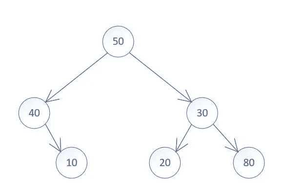

# Go 中二叉树的层次顺序遍历

> 原文：<https://medium.com/geekculture/level-order-traversal-of-binary-trees-in-go-311b05a2abcf?source=collection_archive---------30----------------------->

这是本系列的第 3 部分——在 Go 中使用二叉树。在本文中，我将展示如何在 Go 中执行二叉树的层次顺序遍历。

*   第 1 部分二叉树在 Go 中遍历(访问它[这里](https://vnaveen9296.medium.com/binary-tree-traversals-in-go-2bce834f449c)
*   第 2 部分在 Go 中遍历二叉树——使用迭代(访问它[这里](https://vnaveen9296.medium.com/binary-tree-traversals-in-go-part-2-1c0572c800a1)
*   第 3 部分 Go 中二叉树的层次顺序遍历(本文)
*   第四部分 Go 中二叉树的曲折层次顺序遍历(此处访问)
*   第 5 部分 Go 中二叉树的右侧视图
*   第 6 部分 Go 中的二叉树序列化

给定二叉树的根，返回其节点值的层次顺序遍历。(即从左到右，逐层)。你也可以在 Leetcode 上找到这个问题(问题# 102)。

例如，考虑下图中显示的树。该树的级别顺序输出为[[50]，[40，30]，[10，20，80]]。

Binary Tree

在层次顺序遍历中，首先访问树的根，然后是根的直接子代，然后是根的孙代，依此类推。对于给定的示例，我在下面提到了不同级别的节点值列表。

*   0 级:50
*   一级:40 30
*   第二级:10 20 80

我们可以看到，在访问下一个级别的节点之前，必须访问一个级别中的所有节点。像队列这样的先进先出(FIFO)数据结构可以用来容易地实现这种排序。简而言之，队列可以被描述为一种数据结构，其中项目从一端插入，从另一端移除。因此，我们至少需要以下操作来处理这个程序中的队列。

*   插入—在队列末尾插入新元素
*   移除—从队列前面移除元素
*   len —给出队列中的项目总数

我们可以在 Go 中定义一个队列数据类型，并在其上实现上述方法来处理队列。然而，我将使用 Go 片作为队列，如下所示。

Using a Go slice as a queue

主算法现在可以描述为一系列步骤。

**第一步**:检查根是否为零。如果是这样，我们可以跳过处理或者退出函数

**步骤 2:** 创建一个队列，将根插入队列，即我们从根开始遍历。

**步骤 3:** 创建一个整数切片来保存最终结果

**第 4 步队列处理:**只要队列不为空，就处理队列中的元素。注意，队列的当前大小表示属于同一级别的节点总数

**第五步:**处理属于同一级别的每个节点。这里的处理包括从队列中删除节点，将其值插入到保存当前级别节点值的数组中，最后将其子节点插入到队列中供以后处理。

**步骤 6:** 一旦属于同一级别的所有节点都被处理，那么“当前”级别的输出将被插入到最终结果中

我也在下面展示了整个程序以供参考。