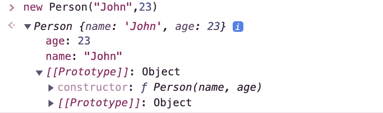
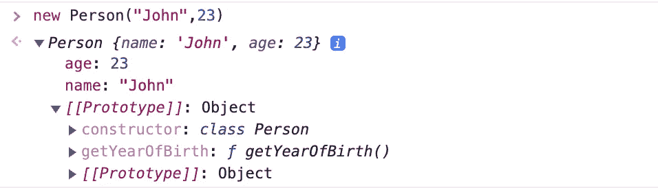
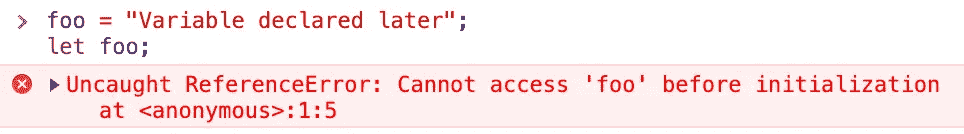
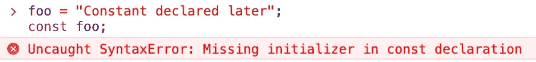

# 提升您的 JavaScript 水平(第 1 部分)

> 原文：<https://medium.com/geekculture/leveling-up-your-javascript-part-1-es6-edition-13447e30980?source=collection_archive---------4----------------------->


image from [wallpaperbat.com](https://wallpaperbat.com)

继我的上一篇文章[编写干净的 JavaScript](/geekculture/writing-clean-javascript-es6-edition-834e83abc746) 之后，我决定更进一步，讨论在我的职业生涯中证明有用的相当高级的 **JavaScript** 概念。

我将要讨论的概念是这门语言的基础，不管你使用什么样的框架，这些概念都会存在。此外，当您决定学习或使用流行的 JavaScript 库或框架时，很好地掌握这些概念将是非常宝贵的。

这是由两部分组成的系列文章的第一部分，在这个系列文章中，我介绍了提高 JavaScript 技能应该掌握的几个重要概念。

# 1.“这”是什么？

如果你已经有了一些使用其他语言的经验，比如 C++或者 Java，你可能已经处理过关键字`this`，或者 Python 的`self`。对于这些语言，`this`指的是在一个类的方法中被调用时当前对象的实例。

然而，JavaScript 使用`this`的方式有所不同:`[this](https://developer.mozilla.org/en-US/docs/Web/JavaScript/Reference/Operators/this)`关键字可以在函数或方法的上下文之外使用——即在全局上下文中，根据使用的模式，它会有不同的行为。

## 全球背景

全局上下文只是定义为浏览器中的`[window](https://developer.mozilla.org/en-US/docs/Web/API/Window)`对象或节点 JS 中的`[global](https://nodejs.org/api/globals.html#globals_global)`对象的[全局对象](https://developer.mozilla.org/en-US/docs/Glossary/Global_object)。不管使用“严格”还是“非严格”模式，`this`在全局上下文中的行为总是相同的。

例如，以下内容在任何浏览器中都有效:

```
console.log(this === window) // truethis.foo = "This is a global variable"
console.log(window.foo) // This is a global variable
```

## 功能上下文

在函数内部，`this`的行为由调用函数的方式和使用的模式决定。

在 JavaScript 中，可以用 4 种不同的方式调用函数。在下面的例子中，我将展示`this`在每种情况下的表现:

**一、简单的函数调用**

在“非严格”模式下，调用函数时，`this`会引用全局对象。然而，在“严格”模式下`this`将被设置为`undefined.`

**二。方法调用**

在一个对象的方法内部，`this`将简单地引用包含它的对象:

但是如果我们将`getCountry`存储在另一个变量中会怎么样呢？

```
const getCountry = address.getCountry;
```

假设代码在使用“非严格”模式的浏览器中执行，`this`将退回到`window`。因此，`getCountry()`将计算为`window.country`，因为在这种情况下没有指定父对象:

```
console.log(getCountry()); // undefined
```

这就是我们为什么要用`[Function.prototype.bind](https://developer.mozilla.org/en-US/docs/Web/JavaScript/Reference/Global_objects/Function/bind)`的原因。`bind`方法，顾名思义，将*绑定*一个新的对象到指定的函数，公开对象的`this`。

```
const getCountry = address.getCountry.bind({ country: "USA" });
console.log(getCountry()); // USA
```

**三世。构造函数调用**

用`new`关键字初始化时，函数可以用作构造函数。当`new`关键字被使用时，一个新的对象被`this`引用初始化。省略`new`关键字会将`this`设置为回退全局值并导致错误。

为了防止这种行为，应该向构造函数添加额外的处理:

更多信息将在[原型章节](#48b9)中介绍。

**四。间接调用**

JavaScript 函数支持在被调用时通过`this`关键字引用其他对象。我们可以通过使用`[Function.prototype.call](https://developer.mozilla.org/en-US/docs/Web/JavaScript/Reference/Global_Objects/Function/call)`或`[Function.prototype.apply](https://developer.mozilla.org/en-US/docs/Web/JavaScript/Reference/Global_Objects/Function/apply)`来实现这个行为。`call`和`apply`做的完全一样。唯一的区别是`call`期望一个对象和尽可能多的参数，而`apply`期望所有的参数——除了对象之外——作为数组传递。

> 最后，注意 [ES6 箭头函数](https://developer.mozilla.org/en-US/docs/Web/JavaScript/Reference/Functions/Arrow_functions)没有自己的执行上下文，而是从它们的外部父类继承`this`。这就是为什么我们不能使用箭头函数来定义函数或类方法的原因。

有关`this`的更多详细示例，请查看本文[。](https://www.javascripttutorial.net/javascript-this/)

# 2.原型

所有 JavaScript 对象都从原型[继承属性和方法](https://developer.mozilla.org/en-US/docs/Learn/JavaScript/Objects/Object_prototypes)。原型允许我们给对象添加方法和属性，并相互继承特性。

当使用前面介绍的构造函数调用时，我们会注意到 JavaScript 会将*原型属性*添加到我们的对象中，该属性指向原始的构造函数:

```
function Person(name, age) {
  this.name = name;
  this.age = age;
}
```



我们可以在原始构造函数中添加一个方法来获取出生年份。添加此方法后，所有将`Person`作为其*原型对象*的对象将*继承*此方法:

```
Person.prototype.getYearOfBirth = function () {
  return new Date().getFullYear() - this.age;
};
```


使用相同的过程，我们可以添加或修改现有 JavaScript 原型对象的方法和属性，例如`Array.prototype`或`Date.prototype`，但是，这通常是不可取的。

我不会涉及任何关于原型的额外材料，但是你可以随时查看文档来了解高级概念。

# 3.班级

[ES6 类](https://developer.mozilla.org/en-US/docs/Web/JavaScript/Reference/Classes)只是基于 JavaScript 原型继承的特殊函数。这就是为什么 JavaScript 类总是被称为“语法糖”的原因。这些类没有提供其他 OOP 语言中的额外特性，比如面向对象的继承，但是，它们是构造对象的一个很好的模板。

这就是我们如何实现一个类似于我们之前的原型对象的类:



一般来说，ES6 类只是为常规原型对象提供了更简洁的语法，以类似于其他语言(如 Java 和 C++)中的类，而没有添加任何 OOP 特性。

# 4.领域

JavaScript 中的[作用域](https://developer.mozilla.org/en-US/docs/Glossary/Scope)定义了如何在整个代码中访问值和函数。根据定义，JavaScript 中的所有作用域都可以描述为**全局**或**局部。**

## 全球范围

简单来说，所有函数和花括号`{}`之外定义的东西都属于全局范围。在全局范围内定义的变量可以在代码中的任何地方使用。

通常，您希望尽可能地限制全局变量的数量，因为:

*   使用全局变量可能会导致代码缩放时的命名冲突。注意，重新声明`const`或`let`变量会抛出错误，而重新声明`var`会覆盖变量。
*   在浏览器中，全局变量是用户和页面上运行的任何脚本都可以访问的`window`对象的成员。因此，使用全局值可能会带来安全问题。
*   JavaScript 执行变量查找，从当前范围开始，向上到下一个父级，直到到达全局范围。拥有许多全局变量可能会导致性能问题。

## 局部范围

局部范围是局部变量的范围。局部范围由**功能**和**块**范围组成。

*   **功能范围**

在函数中声明的变量只能在同一个函数中访问。该规则适用于使用`var`、`let`或`const`声明的变量:

*   **封锁范围**

在 ES6 中引入，在任何花括号`{}`中使用`const`或`let`声明的变量都有块范围，这意味着它们只能在同一个块中访问。块作用域实际上是函数作用域的子集— *，除了带有隐式返回的箭头函数的情况*。

# 5.提升

在 JavaScript 中，提升是在代码执行之前将变量和函数声明移动到当前范围顶部的默认过程。这在技术上意味着您可以在声明变量之前使用它们。

```
foo = "Variable to declare later";
console.log(foo); *// Variable to declare later* var foo;
```

重要的是要知道只有声明被移动到顶部，而初始化没有被移动到顶部:

```
console.log(foo); *// undefined* var foo = "Variable initialized later";
```

在这里，`foo`的声明被移到了顶部，但是因为它只是在稍后才被初始化，所以它将首先保存值`undefined`。

## 分段范围和吊装

如前所述，`const`和`let`是块范围的。该块"*知道这些变量的*，但是在声明它们之前不能使用它们。用`const`和`let`声明的值在声明之前被称为处于"*时间死区"*"中。

在声明前初始化`let`会抛出一个`[ReferenceError](https://developer.mozilla.org/en-US/docs/Web/JavaScript/Reference/Global_Objects/ReferenceError)`:



然而，在声明之前初始化`const`会抛出一个[语法错误](https://developer.mozilla.org/en-US/docs/Web/JavaScript/Reference/Global_Objects/SyntaxError)，所以代码甚至不会运行:



## 功能提升

使用[函数声明](https://developer.mozilla.org/en-US/docs/Web/JavaScript/Reference/Statements/function)时，函数会被提升到当前作用域的顶部。这意味着您可以在声明函数之前使用它。

相比之下，如果使用[函数表达式](https://developer.mozilla.org/en-US/docs/Web/JavaScript/Reference/Operators/function)，函数就不会被提升，所以你只需要在函数被声明后使用它:

# 6.关闭

规范中[闭合](https://developer.mozilla.org/en-US/docs/Web/JavaScript/Closures)的定义是:

> 函数和声明该函数的词法环境的组合。

换句话说，闭包是一个内部函数，它可以访问其封闭函数或外部函数的变量。因此我们可以得出结论，一个闭包有三个作用域链:

*   访问自己的**块范围**
*   进入其封闭函数(或外部函数)的**范围**
*   访问**全局范围**

考虑下面的例子:

在下面的例子中，我们可以看到如何嵌套闭包，每个闭包都可以访问其封闭函数的所有变量、局部变量和全局变量。我在这里使用超时来演示闭包最重要的特性:

> 即使外部函数已经返回，内部函数仍然可以访问外部函数的值。

# 7.Currying

JavaScript 中的**闭包**的概念使我们能够从**curring**中受益，curring 是*一个重要的函数式编程概念*。

> Currying 是一种函数转换，它将一个函数从可调用的 as `f(a, b, c)`转换成可调用的 as `f(a)(b)(c)`

换句话说，一旦你传递了一个参数，一个 curried 函数将不会返回值。相反，该函数将继续返回一个新函数，期待集合中的下一个参数，直到所有参数都用完。一旦传递了最后一个参数，将返回所有函数的结果。下面是加法函数的实现:

一个更现实的 currying 用例是用预定义的参数实现事件处理程序。以下面这个简单的 React 组件为例:

在这种情况下，只有点击按钮时才会弹出警告。由于 closure，警告消息将与第一次调用 curried 函数时传递的消息相同。

你可以查看这篇文章来更好地理解 currying 及其用例。

# 8.生活

[life(立即调用的函数表达式)](https://developer.mozilla.org/en-US/docs/Glossary/IIFE)是一个一旦定义就被调用的函数。函数很重要，因为在这些函数内部声明的所有变量都不能被外部作用域访问。一般来说，当您希望直接执行一些代码并保证数据隐私时，您最有可能使用这些函数。

一个重要的用例是利用 IIFEs 和 JavaScript 的[模块模式](https://javascript.plainenglish.io/data-hiding-with-javascript-module-pattern-62b71520bddd)来实现一个**单例**对象:

稍后，当我们将单例对象导入到其他地方时，我们将只能访问一个实例:

```
import MySingletonDAO from "./MyDAO"const instance1 = MySingletonDAO.getInstance()
const instance2 = MySingletonDAO.getInstance()console.log(instance1 === instance2) // true
```

在这一部分中，我简要讨论了提高 JavaScript 技能需要掌握的几个概念。在下一部分中，我将更多地关注其他重要主题，如异步函数和迭代器。我希望你喜欢你的阅读，到时候见！

[](http://buymeacoffee.com/jalkhurfan)

Support me to write more!