# 利用 TigerGraph 图形数据库和 Web 服务器进行黑客马拉松注册

> 原文：<https://medium.com/geekculture/leveraging-a-tigergraph-graph-database-with-a-web-server-in-go-for-hackathon-registrations-f640de0d2fd2?source=collection_archive---------14----------------------->

## 使用 TigerGo 和 Gin Gonic 在 Golang 中创建一个 Web 服务器，以帮助黑客马拉松参赛者找到队友


Image from [Pixabay](https://pixabay.com/illustrations/lightbulb-artificial-intelligence-5442769/)

# 介绍

在我拥有的令人敬畏的经历中，我是大联盟 Hacks 的社区领袖。我喜欢参加黑客马拉松，我甚至有机会在 2020 年主办当地黑客日的德克萨斯州分会。黑客马拉松潜在的困难但最有趣的方面之一是找到使用相同框架和有相似兴趣的队友。那么，为什么不利用 graph——特别是 tiger graph——的力量来帮助黑客马拉松参赛者找到队友呢？

这个项目将使用新的 TigerGraph Go 包装器 TigerGo 和一个流行的 Go webserver 包 Gin Gonic 来创建一个支持图形的 web 服务器，从而创建一个 hackathon partner-finding 应用程序。

## 使用的工具

*   [TigerGo](https://genericp3rson.github.io/TigerGo/) :一个 TigerGraph 包装器(我创造的！)为了 Golang
*   [TigerGraph Cloud](https://tgcloud.io/) :创建和托管 TigerGraph 图形数据库的平台
*   [Gin Gonic](https://github.com/gin-gonic/gin) :创建网络服务器的流行 Golang 库

# 第一部分:创建图表

## 第一步:创建新的解决方案

首先，在 TigerGraph Cloud 上创建一个新的空白解决方案。为此，导航到[https://tgcloud.io/](https://tgcloud.io/)并创建一个帐户(如果您还没有)。接下来，导航到“我的解决方案”选项卡，然后按蓝色的“创建解决方案”按钮。

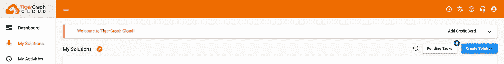

Press “My Solutions” then “Create Solution”

在第一页上，按“空白”选项，然后按下一步。

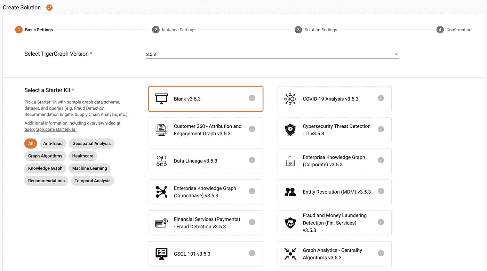

Select “Blank v3.5.3” and press next

不要更改第二页上的任何内容；这将建立一个免费的 TigerGraph 解决方案。在第三页上，根据需要配置选项。

> 注意:请记住您的解决方案的密码和子域！此外，该子域是当时其他解决方案所独有的，因此您可能无法在本例中使用该子域。

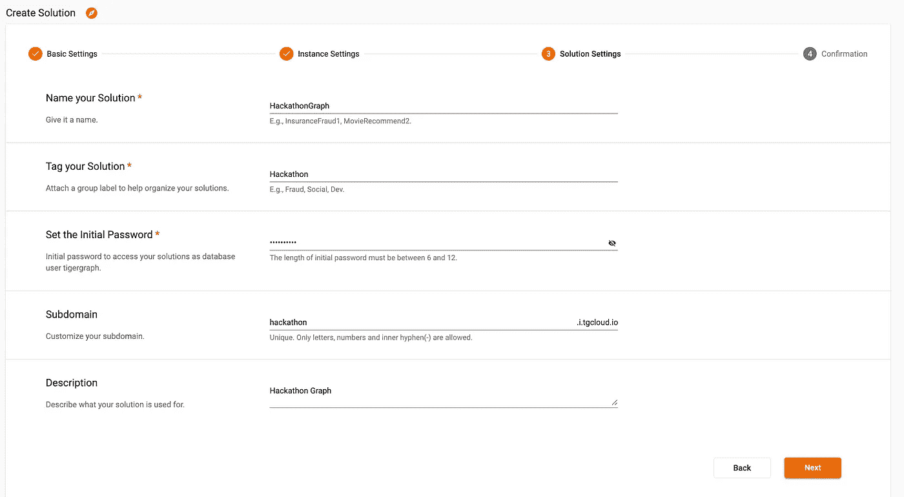

Configure the solution

确认最后一页一切正常，然后点击提交。接下来等待几分钟，直到解决方案状态变成一个绿点，表示“就绪”

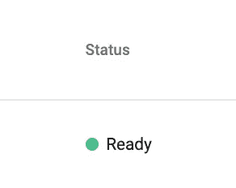

Wait till the status is ready.

## 第二步:打开 GraphStudio 并导入解决方案

一旦解决方案准备就绪，通过从四个方块的下拉列表中单击“GraphStudio”来打开 GraphStudio(悬停文本为“Applications”)。

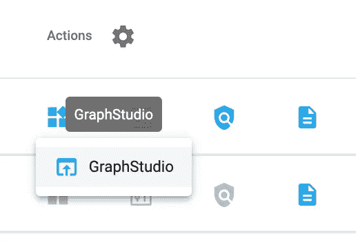

Click GraphStudio from the applications dropdown

> 注意:接下来，我将向您展示如何直接导入我的解决方案。如果您更愿意自己设置解决方案，请跳过这一步，按照剩下的步骤操作。如果您想立即导入解决方案，请完成这一步，安装查询，然后跳到第二部分。

在 GraphStudio 中，单击“导入现有工作室”按钮。

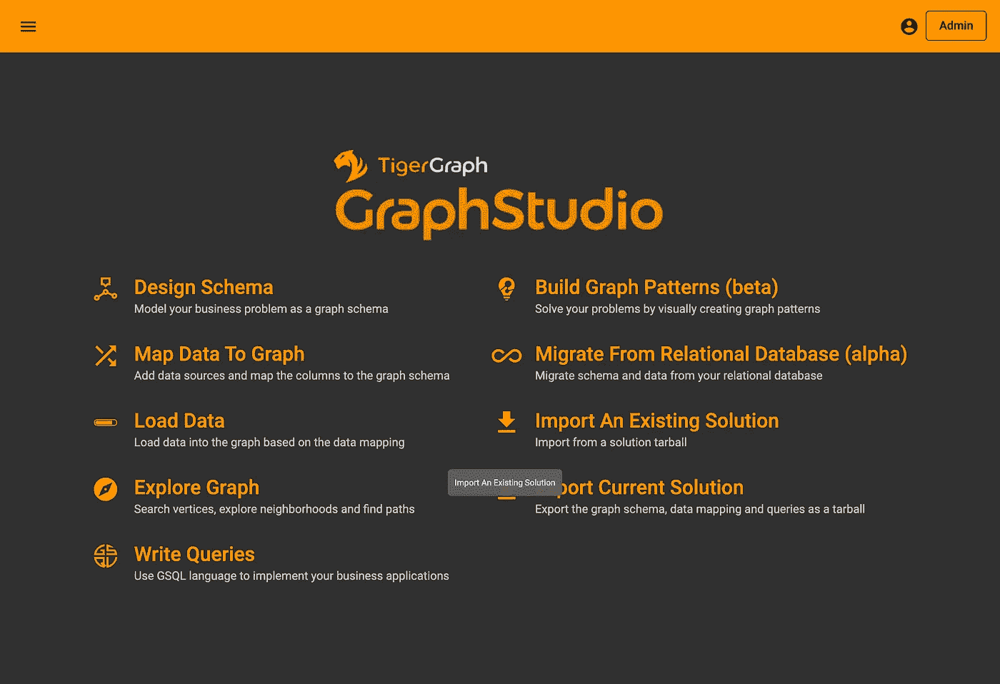

Click “Import an Existing Solution”

你可以在这里找到导入[的解决方案。](https://github.com/GenericP3rson/TigerGoGinExample/blob/master/HackGraph.tar.gz)

[](https://github.com/GenericP3rson/TigerGoGinExample/blob/master/HackGraph.tar.gz) [## tigerginexample/hack graph . tar . gz at master generic 3 rson/tigerginexample

### 此时您不能执行该操作。您已使用另一个标签页或窗口登录。您已在另一个选项卡中注销，或者…

github.com](https://github.com/GenericP3rson/TigerGoGinExample/blob/master/HackGraph.tar.gz) 

## 第三步:创建一个新的图表和模式

在左侧面板上，单击“全局视图”打开下拉菜单。在下拉列表中，单击“新建图表”在我的例子中，我将创建一个名为“HackGraph”的图

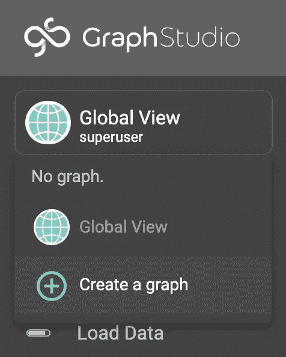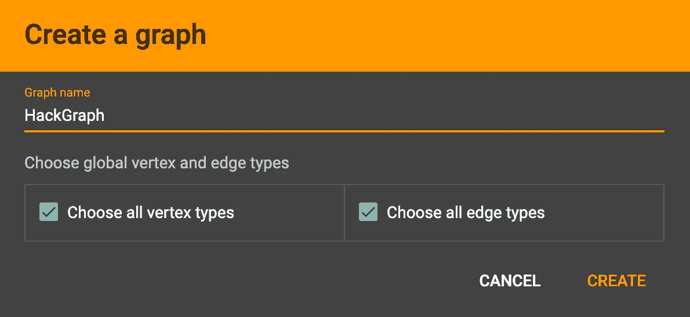

Create a new graph called “HackGraph”

接下来，按“设计模式”使用加号添加顶点，然后创建边。关于如何使用 TigerGraph Cloud 创建和设计模式的分步教程，请查看此视频。

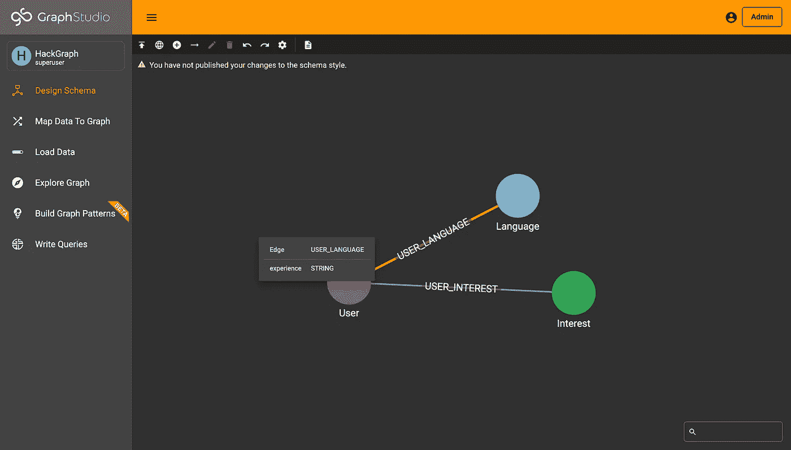

Graph Schema in GraphStudio

作为参考，这将是图形模式的脚本等价物。

```
CREATE VERTEX Language(PRIMARY_ID language STRING) WITH PRIMARY_ID_AS_ATTRIBUTE="true"
CREATE VERTEX User(PRIMARY_ID user STRING) WITH PRIMARY_ID_AS_ATTRIBUTE="true"
CREATE VERTEX Interest(PRIMARY_ID interest STRING) WITH PRIMARY_ID_AS_ATTRIBUTE="true"CREATE UNDIRECTED EDGE USER_LANGUAGE(FROM User, TO Language, experience STRING)
CREATE UNDIRECTED EDGE USER_INTEREST(FROM User, TO Interest)
```

一旦你创建了你的模式，点击发布按钮！

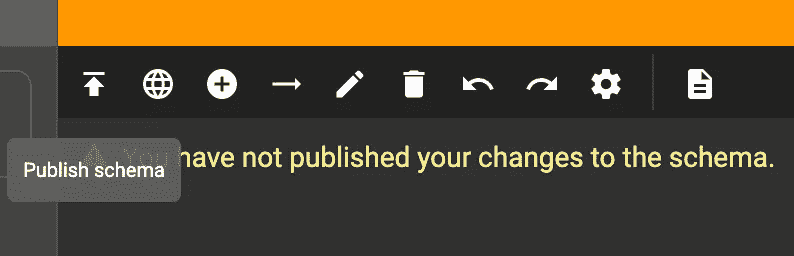

Press the up arrow to publish your schema

恭喜，您已经创建了您的第一个模式！

## 第四步:编写一个查询

接下来，您需要创建查询来实际建议队友。导航到“我的查询”选项卡。创建一个新的查询(我称之为“suggestTeammates”)。

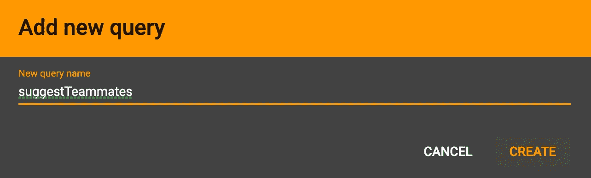

Create a new queries

如果您想了解 GSQL，请查阅 [GSQL 101 文档](https://docs.tigergraph.com/gsql-ref/current/tutorials/gsql-101/)。为此，我使用累加器创建了一个基本查询。对于与该用户共享一个顶点的所有用户，他们在相似性累加器上得到 1。在这种情况下，兴趣和语言顶点具有权重；然而，这可以被调整为或多或少地给出一个。

```
CREATE QUERY suggestTeammates(VERTEX<User> username) FOR GRAPH HackGraph SYNTAX v2 { 

  SumAccum<INT> @similarity;

  Seed = {username};

  Res1 = SELECT u FROM Seed:s - (USER_INTEREST:e1) - Interest:i - (USER_INTEREST:e2) - User:u
        WHERE u.user != username.user
        ACCUM u.@similarity += 1;

  Res2 = SELECT u FROM Seed:s - (USER_LANGUAGE:e1) - Language:l - (USER_LANGUAGE:e2) - User:u
        WHERE u.user != username.user AND e1.experience == e2.experience
        ACCUM u.@similarity += 1;

  Users = {User.*};

  Res = SELECT u FROM Users:u
        WHERE u.user != username.user
        ORDER BY u.@similarity DESC
        LIMIT 5;

  PRINT Res;

}
```

最后，安装查询。

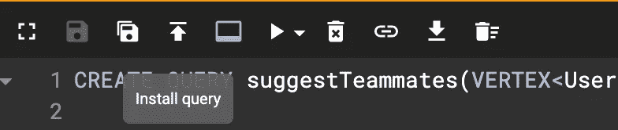

Install the query with the up arrow.

现在解决方案已经准备好了！您现在可以创建 Go 项目了。

# 第二部分:创建和配置一个新的 Golang 项目

## 第一步:去拿包裹

首先，初始化一个新的 Golang 项目。

```
go mod init test/gin
```

接下来，进口杜松子酒。

```
go get -u github.com/gin-gonic/gin
```

> 注意:你必须用这个抓住包裹。有时候运行`go mod tidy`的时候，会在运行代码的时候抛出错误。

最后，进口 TigerGo。

```
go get github.com/GenericP3rson/TigerGo
```

完美！一切都应该按照库的方式进行设置。

## 步骤二:连接到 TigerGraph 解决方案

首先创建一个文件来存放代码。例如，我将创建`index.go`。接下来，将 TigerGo 的快速入门代码[添加到文件中。](https://genericp3rson.github.io/TigerGo/)

```
package main import(
   "fmt" // fmt for printing stuff out
   "github.com/GenericP3rson/TigerGo" // TigerGo
)func main() {
   conn := TigerGo.TigerGraphConnection{
      Token: "TOKEN", 
      Host: "https://SUBDOMAIN.i.tgcloud.io",
      GraphName: "GRAPHNAME",
      Username: "tigergraph",
      Password: "PASSWORD"
   }
}
```

如果您还没有令牌，请将该字段留空，并使用以下内容生成一个令牌:

```
fmt.Println(conn.GetToken())
```

我建议将令牌和密码复制到单独的文档中，然后从主文档中调用它。

`token.go`

```
package mainfunc token() string {
   return "TOKEN_JUST_GENERATED"
}func password() string {
   return "PASSWORD"
}
```

`index.go`

```
import(
   "fmt"
   "github.com/GenericP3rson/TigerGo"
)func main() {
   conn := TigerGo.TigerGraphConnection{
      Token: token(), 
      Host: "https://SUBDOMAIN.i.tgcloud.io",
      GraphName: "GRAPHNAME",
      Username: "tigergraph",
      Password: password()
   }
}
```

太棒了。通过运行`conn.Echo()`测试连接。

```
go run .
```

如果一切顺利，您就可以开始了！

## 第三步:创建一个 Gin 服务器

现在我们可以连接到我们的解决方案，我们可以创建一个基本的 Gin 服务器，从一个`/echo`端点开始。

```
package mainimport (
   "fmt"
   "github.com/GenericP3rson/TigerGo"
   "github.com/gin-gonic/gin"
   "net/http"
)func main() {

   conn := TigerGo.TigerGraphConnection{
      Token: token(),
      Host: "https://SUBDOMAIN.i.tgcloud.io",
      GraphName: "HackGraph",
      Username:  "tigergraph",
      Password:  password(),
   } r := gin.Default() r.GET("/echo", func(c *gin.Context) {
      c.JSON(http.StatusOK, gin.H{
         "message": conn.Echo(),
      })
   }) r.Run(":8080")}
```

这会在`/echo`端点运行一个 GET 请求。它将返回一个`"message": conn.Echo()`的 JSON 对象(将是`"message": "Hello GSQL"`)。运行文件。

```
go run .
```

您可以通过访问[http://0 . 0 . 0 . 0:8080/echo/](http://0.0.0.0:8080/echo/)来确保一切正常。

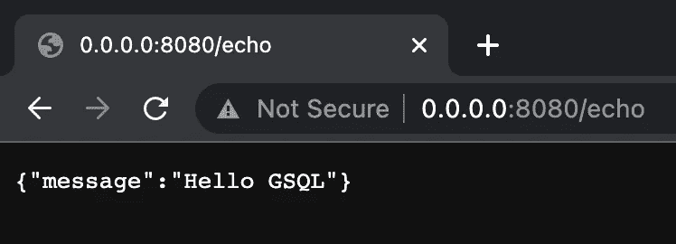

Hello GSQL in Brower

完美！一旦准备好了，让我们开始构建示例的端点！

# 第三部分:创建端点

对于这个项目，我将创建四个端点:`/join`、`/add-lang`、`/add-interest`和`/suggest-teammates`。

## 加入

当用户加入时，我们将使用参数`user`向服务器创建一个 POST 请求。

```
r.POST("/join", func(c *gin.Context) { usr := c.Query("user")
   fmt.Println(conn.UpsertVertex("User", usr, map[string]string{"user": usr}))})
```

为了验证端点是否工作，在 curl 中创建一个 POST 请求。

```
curl -X POST http://0.0.0.0:8080/join?user=Username
```

当运行这个命令时，一个新的用户名顶点将被插入到数据库中。

## 添加利息

`/add-interest`端点的功能类似。这一次，它将向上插入两个顶点，用户和兴趣，并向上插入一条连接这两个顶点的边。

```
r.POST("/add-interest", func(c *gin.Context) { usr := c.Query("user")
   interest := c.Query("interest") fmt.Println(conn.UpsertVertex("User", usr, map[string]string{"user": usr})) fmt.Println(conn.UpsertVertex("Interest", interest, map[string]string{"interest": interest})) fmt.Println(conn.UpsertEdge("User", usr, "USER_INTEREST", "Interest", interest, nil))})
```

POST 请求将输入两个参数:用户和兴趣。

```
curl -X POST "http://0.0.0.0:8080/add-interest?user=Username&interest=Graph"
```

太好了！这会创建一个新的`Graph`顶点，并将其连接到之前创建的`Username`顶点。

## 添加语言

API 将发出的最后一个 POST 请求是`/add-lang`请求。这将接受三个参数:edge 属性的用户、语言和体验。

```
r.POST("/add-lang", func(c *gin.Context) { usr := c.Query("user")
   lang := c.Query("lang")
   exp := c.Query("experience") fmt.Println(conn.UpsertVertex("User", usr, map[string]string{"user": usr})) fmt.Println(conn.UpsertVertex("Language", lang, map[string]string{"language": lang})) fmt.Println(conn.UpsertEdge("User", usr, "USER_LANGUAGE", "Language", lang, map[string]string{"experience": exp}))})
```

再次使用 curl 查询这个端点。

```
curl -X POST "http://0.0.0.0:8080/add-lang?user=Username&lang=Go&experience=beginner"
```

## 建议队友

最后，我们可以运行 GET 请求来运行我们在第一步中编写的查询！

```
r.GET("/suggest-teammates", func(c *gin.Context) { usr := c.Query("user") c.JSON(http.StatusOK, gin.H{
      "results": conn.RunInstalledQuery("suggestTeammates", map[string]string{"username": usr}),
   })})
```

用 curl 测试端点。

```
curl -X GET http://0.0.0.0:8080/suggest-teammates?user=Username
```

# 第四部分:后续步骤和资源

恭喜你。您现在已经在 Go querying TigerGraph 中创建了一个 web 服务器！点击查看完整代码[。](https://github.com/GenericP3rson/TigerGoGinExample)

[](https://github.com/GenericP3rson/TigerGoGinExample) [## GitHub-generic 3 rson/tigerginexample

### 此时您不能执行该操作。您已使用另一个标签页或窗口登录。您已在另一个选项卡中注销，或者…

github.com](https://github.com/GenericP3rson/TigerGoGinExample) 

接下来，您将需要构建一个网站或其他东西来使用您创建的端点。此外，您可以添加更多端点来查询更多细节，以形成更复杂的队友建议算法。

如果你想有任何问题或想在其他很酷的 TigerGraph 项目上工作，请随时加入 TigerGraph Discord！

[](https://discord.gg/tigergraph) [## 加入 TigerGraph Discord 服务器！

### 查看 Discord 上的 TigerGraph 社区-与 1，287 名其他成员一起玩，享受免费的语音和文本聊天。

不和谐. gg](https://discord.gg/tigergraph) 

> 注:除特别注明外，所有图片均由作者创作。