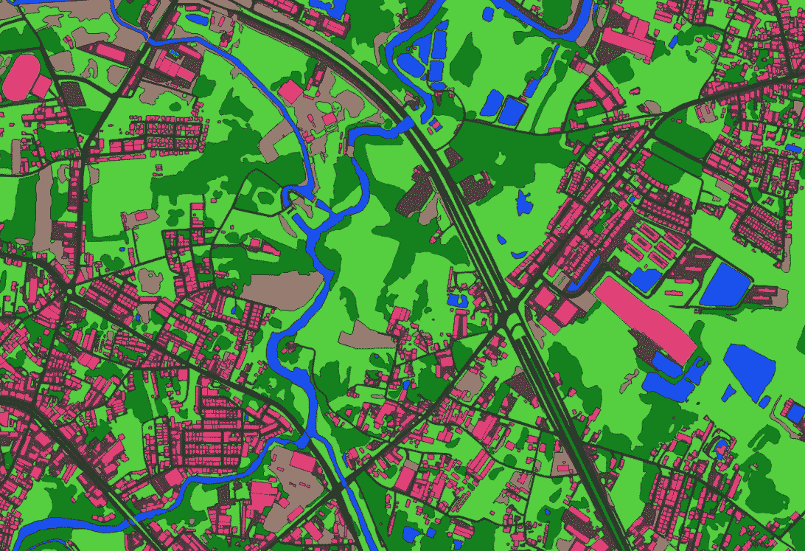
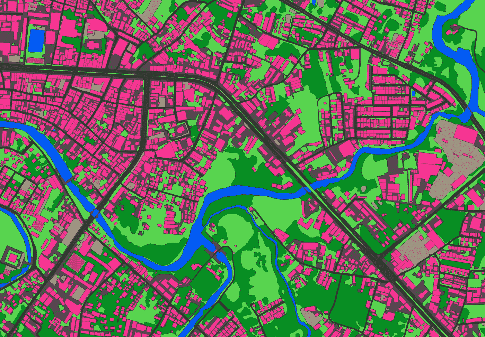

# 利用空中客车图像和 Ecopia 矢量地图进行土地管理

> 原文：<https://medium.com/geekculture/leveraging-airbus-imagery-ecopia-vector-maps-for-land-administration-14684bb6908f?source=collection_archive---------16----------------------->

**Ecopia Vector Maps of Rayong, Thailand.** These digital maps werecreatedleveraging industry-leading artificial intelligence-based systems to extract land cover classes from their Airbus imagery.

地方政府依靠高分辨率数字地图来帮助他们规划智能城市计划、交通项目、洪水风险建模、公平评估财产税收等。随着城市的发展，最新的土地利用/土地覆盖层对于高级分析和建模越来越重要。

然而，获取影像和土地利用/土地覆盖层的过程给全球土地管理应用带来了诸多挑战。

# 挑战

获取高分辨率数字地图所需的最新影像可能是一项艰巨的任务。手动创建土地利用/土地覆盖面是一个极其耗费资源的过程，无法跨大型数据集进行扩展。尽管存在自动提取解决方案，但它们通常不准确，导致数据不可靠。

# 解决方案和应用

通过利用来自空中客车的最新图像和 Ecopia AI 的高级人工智能提取功能，市政客户现在可以请求快速提取的数字地图。除了空客的高分辨率卫星图像，还可以通过 [OneAtlas 平台](http://oneatlas.airbus.com)或按需请求 Ecopia 矢量地图。这些产品可在一个城市乃至整个大陆范围内使用，支持大量土地管理使用案例，包括:

**洪水建模、绘图&风险评估:**通过利用土地利用/土地覆盖特征创建高分辨率数字地图，地方政府可以对易受洪水影响的区域进行绘图和建模。这种准确数据的快速交付将有助于组织更快、更确定地促进防洪策略。

**雨水排放评估&财产税:**获取数字地图，帮助您更好地评估您的雨水资产状况。地方政府可以根据其房产的不透水面积按比例向其公民征税，以获得收入。

**智能城市:**利用精确的土地利用/土地覆盖来释放洞察力，从而实现更好的智能城市基础设施规划，以及更高效的资源管理和分配。

**道路&交通:**快速获取您所在城市或地区完整的道路和交通网络情报。通过对自己感兴趣领域的最新了解，更轻松地分配内部资源和资产。

要了解更多关于我们与空客合作的信息，请阅读[官方新闻稿](https://www.businesswire.com/news/home/20210304005274/en)，[查看我们的产品演示](https://demo.ecopiatech.com/demo/054/001)，或访问我们的[合作伙伴页面](https://www.ecopiatech.com/partner-with-us)。