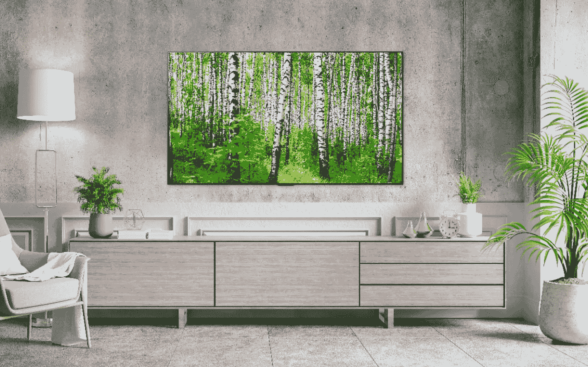

# LG Display 承诺在 2022 年推出更亮的有机发光二极管面板

> 原文：<https://medium.com/geekculture/lg-display-promises-brighter-oled-panels-for-2022-ed6899c80915?source=collection_archive---------14----------------------->

## 太好了！但是话说回来，我们以前听过这个，不是吗？嘿，等一下！

Remember last year’s OLED “Evo” panels that promised to be up to 20% brighter? Well, new year, new panels, new similar promises from LG Display. You can even add “up to” 10% more than 20%, apparently. (Image: LG)

即使在疫情时代，CES 2022 也是世界上最大的科技展，即将到来，一些制造商已经开始在这种背景下发布公告(大概是担心这些次要的展会会被忽视…