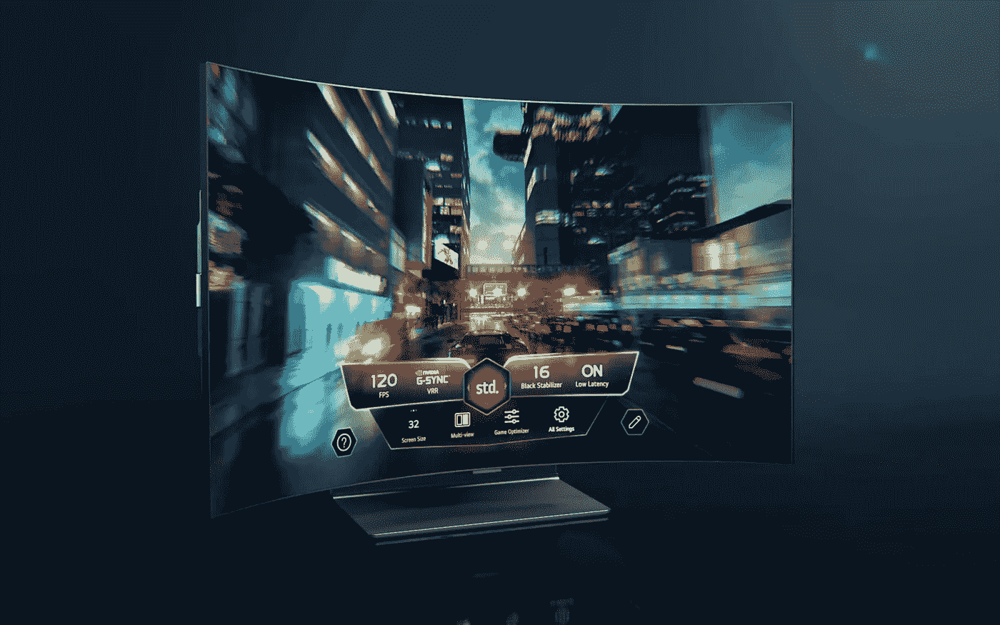

# LG 的可弯曲电视是无意义产品的定义

> 原文：<https://medium.com/geekculture/lgs-bendable-tv-is-the-definition-of-a-pointless-product-9bdeb948a0ea?source=collection_archive---------16----------------------->

## 不够宽，不够大，不够弯，不够便宜…这到底是给谁的？

The LG OLED Flex’s screen can go from totally flat to curved at the touch of a remote button. Is it that much of a useful feature to build a new product around, though? (Image: LG)

众所周知，几乎每一家主要的科技制造商都在不断寻找差异化的方法，炫耀其直接竞争对手无法提供的产品，声称自己被滥用的“创新者”标签…