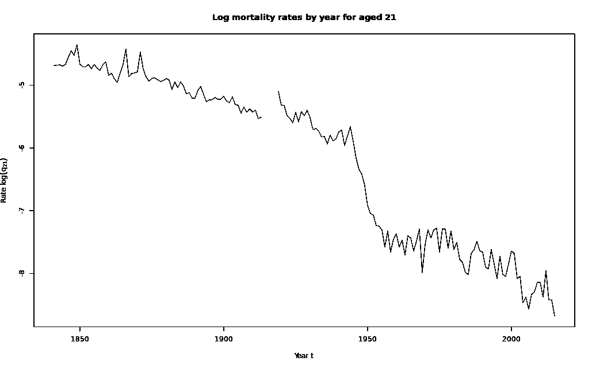
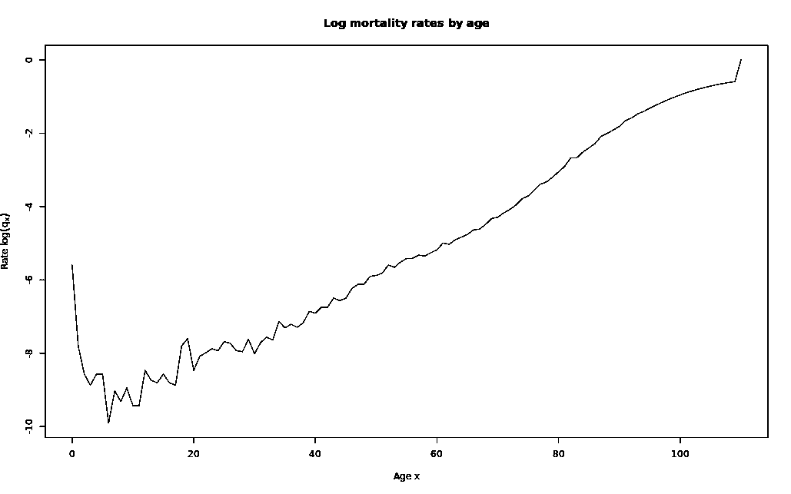
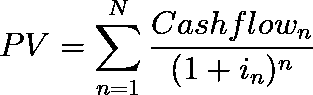
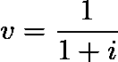
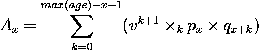
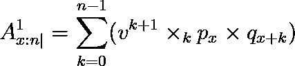
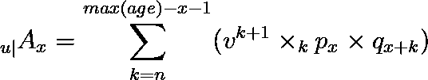

# 死亡中的生命:理解死亡率数据

> 原文：<https://medium.com/geekculture/life-in-death-understanding-mortality-data-f363d45baed6?source=collection_archive---------16----------------------->

## 死亡率表及其应用简介

Photo by [Sigmund](https://unsplash.com/@sigmund?utm_source=unsplash&utm_medium=referral&utm_content=creditCopyText) on [Unsplash](https://unsplash.com/s/photos/die?utm_source=unsplash&utm_medium=referral&utm_content=creditCopyText)

数据科学的核心是分析数据以获得可行见解的愿望。死亡统计是另一种需要考虑的数据。

死亡率表，不太病态地被称为*生命表*，显示了特定人群在每个年龄段的死亡率。这些比率是概率，描述了特定年份每千人中死亡的预期人数。死亡率表通常按人口统计学分类，如性别、种族、职业或社会经济地位，以说明生物和外部因素。

符号 *qₓ* 用于表示年龄为 *x* 的人在下一年内死亡的概率。另一方面，一个年龄为 *x* 的人下一年存活的概率由 *pₓ = 1 - qₓ.给出*

另一个重要的符号是 *ₙqₓ* ，一个年龄为 *x* 的人在接下来的 *n* 年内死亡的概率。它的对应物 *ₙpₓ* 是一个年龄为 *x* 的人在接下来的 *n* 年中存活的概率。

本文使用的数据来自于[人类死亡率数据库](https://www.mortality.org/)的最新总死亡率表，该数据库包含关于发达国家死亡率的开源数据集。

**探索死亡率表**

我们可以使用 R 来绘制数据，以观察任何一般趋势。我们使用死亡率的对数变换来减少分布的偏斜度。

Code gist by author

Plot generated by author in R

通过研究这些年来 21 岁人群的死亡率，我们注意到了一个下降的趋势。这些死亡率的下降可能要归功于医学和保健技术的进步，特别是 1935 年青霉素和磺胺药物的发现。此外，1914 年至 1918 年之间的差距是由于缺乏第一次世界大战期间的死亡率统计数据。

Code gist by author

Plot generated by author in R

如果我们按年龄绘制死亡率，我们会观察到，在婴儿死亡率明显较高之后，死亡的可能性会随着人们年龄的增长而稳步上升，正如我们所料。

**现值的概念**

分析死亡率数据可以提供关于人口健康和人类寿命的许多见解，但它最常见的应用是在评估和定价人寿保险。

在我们深入探讨常见的保险产品类型之前，首先要了解*现值*的概念。现值，顾名思义，就是给定投资的现在或当前价值。它是通过“回溯”或用利率贴现每一个未来的现金流找到的。

现值的一般公式如下

Equation produced by author in LaTeX

其中 *PV* 为现值， *i* 为年利率。

参见下面 r 中现值计算的示例。注意，定义 *v* 为标准符号:

Equation produced by author in LaTeX

Code gist by author

**死亡率数据在保险估价中的应用**

现在，我们可以使用死亡率表和现值的知识来计算以下人寿保险产品的预期现值(EPV)。乍一看，这些公式似乎令人生畏，但它们的一般形式是相同的。

对于一个年龄为 *x* 的人，EPV 是**年贴现因子**乘以**活到*x+k*年的概率**和 *x + k* 年内死亡的概率**的总和。**

‣终身寿险——只要一个人在设定的时间段内持续支付固定金额的保费，就可以为他的一生投保。

Equation produced by author in LaTeX

Code gist by author

‣定期人寿保险——只在特定的时间内为一个人提供保险。如果被保险人在此期间去世，将向其受益人支付死亡抚恤金。否则，除非该人选择续保，否则保单到期后不会收到任何付款。

Equation produced by author in LaTeX

Code gist by author

‣ **延期寿险**——如果被保险人在第一个 *u* 年内死亡，则不支付/支付有限的保险金。除此之外，该政策作为一个整体人寿保险。

Equation produced by author in LaTeX

Code gist by author

我们几乎没有触及死亡率数据的特征和用途。为了更进一步的研究，你可能想阅读一下 r。