# 救生器 CSS 定位器

> 原文：<https://medium.com/geekculture/life-saver-css-locators-ea45103d446?source=collection_archive---------11----------------------->

## 如何创建自己的自定义和动态 CSS 定位器

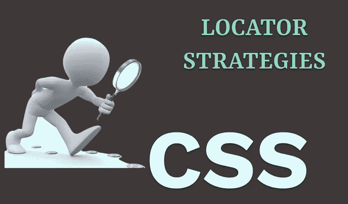

CSS 选择器被认为比 Xpath 快，所以学习创建自己的 CSS 选择器很重要。在 web 应用程序中使用持久的、设计良好的 CSS 选择器来定位元素是非常重要的，这样可以进行更健壮的测试。

我知道有一些现成的工具，比如 **ChroPath** 或者 **SelectorsHub** ，随时可以使用。你所要做的就是添加所需工具的浏览器扩展，一旦你选择了元素，它就会自动提供语法。此外，一些自动化工具，比如 Cypress，提供了自己的选择器平台，只需点击一下就可以选择元素。然而，了解如何创建自己的定制选择器总是很好的，这不仅给你更多的灵活性，而且如果现成的选择器不是你要找的，也可以节省时间。

在本教程结束时，你将能够为你的测试自动化创建设计良好的、持久的和动态的 CSS 选择器。让我们开始… ✍

# 1.使用 ID CSS 选择器

这是定位元素最常见的方式，因为每个元素的 id 都应该是唯一的。它可以与井号(#)一起使用。

```
**Syntax**: #query
```

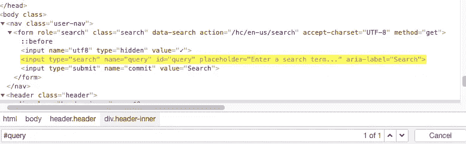

# 2.使用类 CSS 选择器

通过 CSS 选择器使用类名定位类似于使用 ID，但是在这种情况下，使用点(.)来代替散列符号。

```
**Syntax**: .header-inner
```

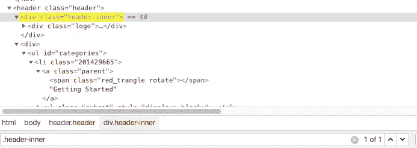

# 3.使用标签和 ID/类 CSS 选择器

可以使用**“tag # ID”。**

```
**Syntax**: input#query
```


也可以使用 **"tag.class"** 。

```
**Syntax:** div.header-inner
```

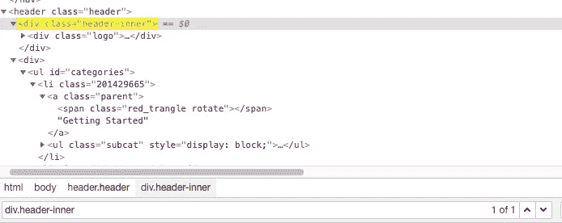

# **4。使用标签&属性&值**

在我看来，这个是用的最多的，也是最实用的。如果项目中有一个可用的定制属性，比如**数据测试**或**数据质量保证值**，那么您可以处理几乎所有的定位器问题。如果没有，请让您的开发人员添加那些数据属性，它们是救命稻草。下面是一个很好的例子，它有许多数据属性。

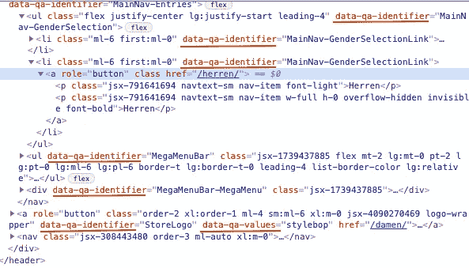

它可以用作**标签[attribute='value']** 。

```
**Syntax:** input[type=’search’]
```

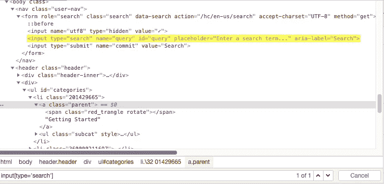

我们还可以使用多个属性来扩展这个语法

```
**Syntax:** input[type=’search’][name=’query’]
```

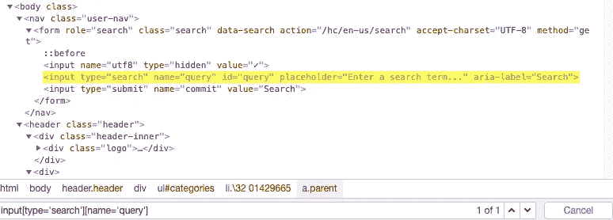

# **5。绝对路径 CSS 选择器**

考虑到元素在 DOM 中的完整层次结构，CSS 绝对路径指的是元素非常具体的位置。尽管这不是使用它的优选方式，但是在需要的情况下，它可以如下使用。

```
**Syntax:** body>nav>form
```

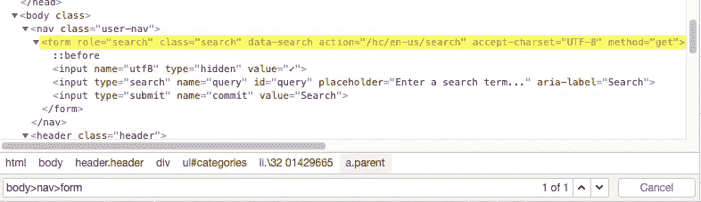

使用相对路径，我们也可以直接定位一个元素，而不管它在 DOM 中的位置。假设它是唯一的，或者是 DOM 中的第一个元素。在这种情况下，我想先选择`<input>.`

```
**Syntax:** input
```

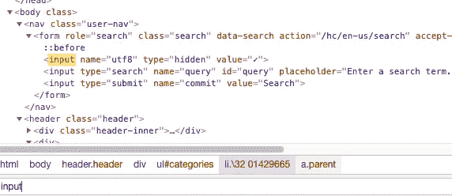

# **6。使用非绝对路径 CSS 选择器**

你应该在标签之间使用**空格**来定位元素。使用**。”对于类别**和**，“#”表示 id** 。

```
**Syntax**: .row .large .flash
```

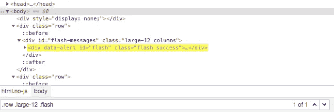

# 7.类别链接

对于一个 HTML 元素来说，有更多的类名是最常见的。你不应该在类之间使用**空白**来定位元素。如果需要，它也可以与 ID 属性或标记名结合使用。

```
**Syntax**: .flash.success
```

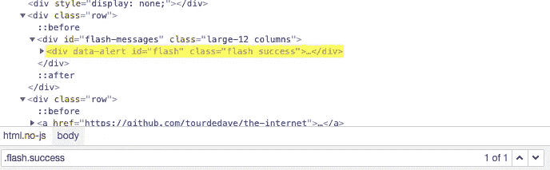

# 8.使用属性的包含文本

可以使用**标签[属性*= '包含文本']** 语法。

```
**Syntax**: aside[class*='article']
```

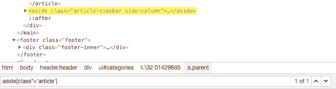

# 9.使用属性的起始文本

你可以使用 **tag[attribute^='starting 文本']** 语法。

```
**Syntax**: aside[class^='article']
```

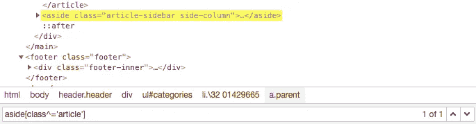

# 10.使用属性的结束文本

可以使用**标签[attribute$='ending text']** 语法。

```
**Syntax**: div[class$='articles']
```

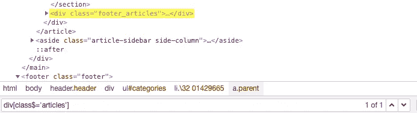

# 11.在 CSS 定位符之间使用逗号运算符

你可以在两个 CSS locator 语句之间使用**、**运算符来实现 or 运算。

```
**Syntax**: div[class='footer_articles'],div[class='clear']
```

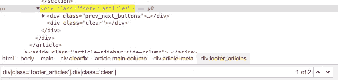

# 12.使用第一类型的 CSS 选择器

您可以使用**“标签:第一类型”**。它将选择第一个标签元素。

```
**Syntax**: ul#categories>li:first-of-type
```

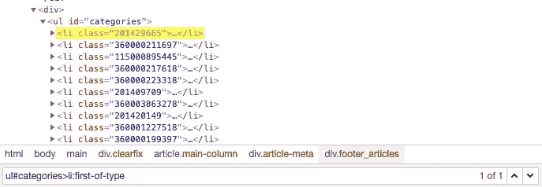

# 13.使用最后一个类型的 CSS 选择器

您可以使用**“标签:类型的最后一个”**。它将选择最后一个标签元素。

```
**Syntax**: ul#categories>li:last-of-type
```

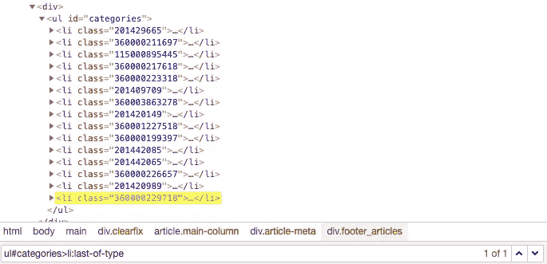

# 14.使用标签:第 n 个类型的 CSS 选择器

可以使用**“tag:n-of-type(*n*)”**。它将选择列表的第 n 个标签元素。

```
**Syntax**: ul#categories>li:nth-of-type(5)
```

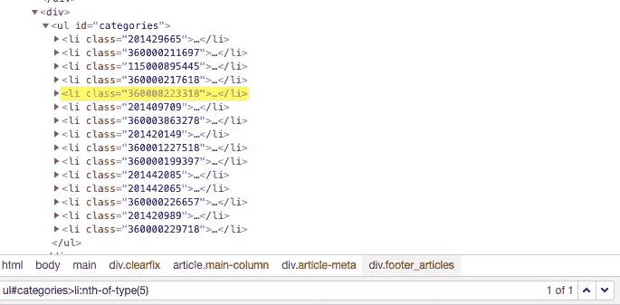

```
**Syntax**:ul#categories>li:nth-of-type(n) will select all elements.
```

# 15.通过 CSS 选择器选择元素的同级

有些情况下，我们可以选择一个元素，然后我们可以到达它的兄弟。在这种情况下，这种方法非常有用。

你可以使用 **"+"操作符**到达兄弟元素。

```
**Syntax**: div.prev_next_buttons+div
```

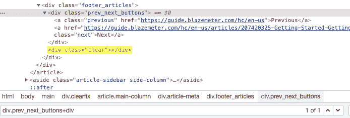

# 16.使用 NOT 运算符 CSS 选择器

当我们使用一种选择器策略来选择一个或多个元素时，使用 NOT 运算符排除其他元素，这种方法是有益的。

```
**Syntax**: div.large-12.columns:not(#content)
```

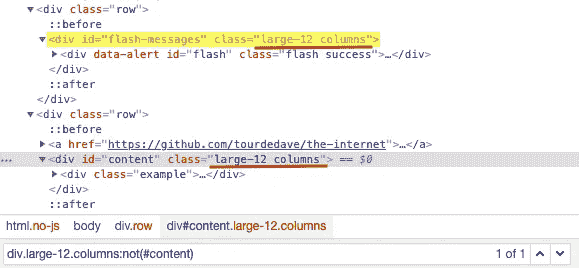

上面一个只是为了举例说明，否则用 ID 属性选择是明智的。😃

下面还可以看到一个例子。这一次，我想访问所有具有类“a-section”和“a-spacing-none”的元素，这给出了 80 个结果，但我不想访问具有“fluid-image-container”类的元素。那么使用 NOT 运算符将非常有用。

```
**Syntax**: div.a-section.a-spacing-none:not(.fluid-image-container)
```

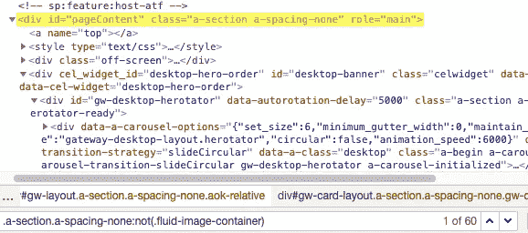

# 17.在 Selenium 中使用标签:n-child(n)CSS 选择器

可以用**" tag:n-child(*n*)"**。它将选择第 n 个孩子。

```
**Syntax**: div#navbar>:nth-child(2)
```

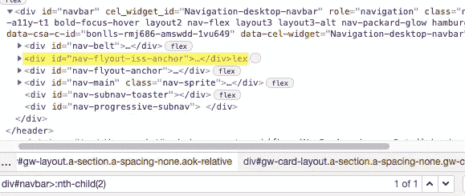

希望这篇文章对你有帮助。你也可以在这里找到[备忘单](https://www.red-gate.com/simple-talk/wp-content/uploads/imported/1269-Locators_table_1_0_2.pdf?file=4937)。

# ☕️快乐测试！☕️

你可以在 [Medium](https://ekremkurt1907.medium.com/followers) 上关注我更多文章，请在 [LinkedIn](https://www.linkedin.com/in/ekrem-k-3a094b19a/?locale=en_US) 上联系我

# 来源:

我使用了以下网站来定位 web 元素。

*   [https://guide . blaze meter . com/HC/en-us/articles/360002052998-The-Continuous-Testing-Journey-The-Continuous-Testing-Journey](https://guide.blazemeter.com/hc/en-us/articles/360002052998-The-Continuous-Testing-Journey-The-Continuous-Testing-Journey)
*   https://www.amazon.com/
*   【https://the-internet.herokuapp.com/secure 
*   [https://www.stylebop.com/](https://www.stylebop.com/damen/)