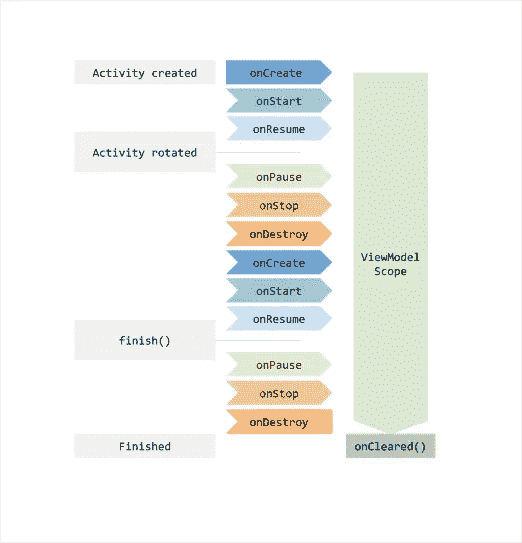
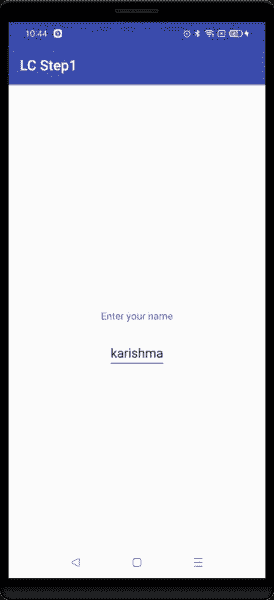
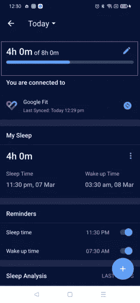
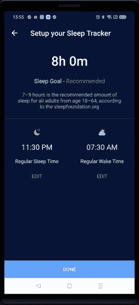

# 生命周期感知组件

> 原文：<https://medium.com/geekculture/lifecycle-aware-components-ba2be161ec30?source=collection_archive---------6----------------------->


Photo by [Mark Boss](https://unsplash.com/@vork?utm_source=unsplash&utm_medium=referral&utm_content=creditCopyText) on [Unsplash](https://unsplash.com/s/photos/lifecycle-android?utm_source=unsplash&utm_medium=referral&utm_content=creditCopyText)

架构组件是一组 android 库，以一种可测试、可重用、可维护的方式帮助您构建应用程序。

几乎没有生命周期感知的 android 架构组件:

1.  **ViewModel** :帮助创建、存储和检索数据，并与属于同一生命周期的其他组件进行通信。
2.  **生命周期所有者:**由活动和片段实现的接口，用于观察所有者生命周期的变化。
3.  **LiveData** :允许观察同一生命周期中不同组件的数据变化。

# 视图模型

ViewModel 是一个负责为活动和片段准备和管理数据的类。这也有助于观点之间的交流。

它是 MVVM 建筑的支柱。ViewModel 总是与一个作用域一起创建，并且只要该作用域还存在，它就会被保留。例如，我们将 ViewModel 范围与 activity 绑定，然后在 activity 运行之前，我们可以更改数据并获取数据更新。

它使用 LiveData 或 DataBinding 公开数据。

MVVM 架构的主要参与者是视图、视图模型和数据模型。活动和片段是视图，它们应该包含视图层次结构。
数据操作、业务逻辑、从服务器获取数据、数据库操作不应发生在视图层。对于这项工作，我们有视图模型。它通知视图关于 diff 事件。

这是我们在视图类中定义视图模型的方式:

```
UserModel userModel = new ViewModelProvider(this).get(UserModel.class);
```

`this`是指`lifecycleOwner`的一个实例。这意味着在 lifecycleOwner 存在之前，ViewModel 将一直存在。这意味着当屏幕旋转等配置更改发生时，ViewModel 将不受影响。

让我们看看下面的生命周期图:



Source @[https://developer.android.com/codelabs/android-lifecycles/img/1d42e8efcb42ff58.png](https://developer.android.com/codelabs/android-lifecycles/img/1d42e8efcb42ff58.png)

从图中可以看出，当屏幕旋转时，activity 和 fragment 实例被销毁，但 ViewModel 没有。

**示例**:



现在，当您旋转设备时，它不会保存其状态，并且会丢失 editText 的内容。

现在使用 ViewModel 做同样的事情。

现在旋转屏幕，您会看到数据被保留，在保留数据方面没有任何故障。所以 ViewModel 帮助我们处理配置更改。

**使用 ViewModel 处理配置更改**

ViewModel 是存储和管理 UI 相关数据的好选择。它允许快速访问数据，并帮助您避免在发生配置更改(如屏幕旋转和调整应用程序大小)时从网络或数据库预取数据。ViewModel 保留数据。在内存中，这意味着它是。很容易接近它们。

与保存的实例状态不同，视图模型在系统启动的进程死亡期间被销毁。这就是为什么您应该将视图模型对象与 onSaveInstanceState()(或其他一些磁盘持久性)结合使用，在保存的实例状态中隐藏标识符，以帮助视图模型在系统死亡后重新加载数据。

使用保存的实例状态作为系统启动的进程死亡的备份。

*   **在片段间共享数据**

通常，我们希望在片段之间共享数据。例如正常歌曲列表，然后是所选歌曲的细节或播放视图。我们可以通过使用他们活动范围来查看模型来实现这一点。

```
private val model: SharedViewModel by activityViewModels()
```

通过这种方法，两个片段是相互独立的。并且独立地使用共享视图模型。

# LiveData

LiveData 是一个数据持有者类，可以在给定的生命周期内进行观察。

观察者将被通知 livedata 类中包装数据的修改。

如果相应的生命周期进入`Lifecycle.State.DESTROYED`状态，添加了生命周期的观察者将被自动删除。

这个类被设计用来保存`[ViewModel](https://developer.android.com/reference/androidx/lifecycle/ViewModel)`的单个数据字段，但是也可以用来在应用程序的不同模块之间以一种分离的方式共享数据。

更多请看这里:[https://developer . Android . com/reference/androidx/life cycle/LiveData](https://developer.android.com/reference/androidx/lifecycle/LiveData)

让我们以 HealthifyMe app 中的睡眠追踪器为例来理解一下:



在红框中，我们有睡眠目标(8 小时)，以及用户完成了多少(4 小时)。

**步骤 1** :定义 LiveData 对象来存储数据，并定义一个方法来观察视图类中数据。

```
private val sleepGoalFetchedLiveData = MutableLiveData<SleepGoalData>()fun getSleepGoal(): LiveData<SleepGoalData> = sleepGoalFetchedLiveData
```

**第二步**:在 ViewModel 类中通过 API 调用取数据，在 onSuccess()中使用`sleepGoalFetchedLiveData.value = t`将数据保存在动态数据对象中

**第三步:**在 activity 中定义 viewModel 对象。`this`是指`lifecycleOwner`的一个实例。

```
private val sleepGoalViewModel: SleepGoalViewModel by *lazy* **{** ViewModelProviders.of(this).get(SleepGoalViewModel::class.*java*)
**}**
```

我们正在观察活动中的数据变化，因此活动将在设置实时数据时得到通知。

```
getSleepGoal().observe(context, NonNullObserver<SleepGoalData> **{
   //Ui update by getting it.sleepTi**
**}**)
```

SleepGoalData 类将包含睡眠时间和唤醒时间。目标将是这些值之间的差异。

```
var hourDiff = set(*getGoalHourAndMinuteDifference*(sleepTime.get(), wakeTime.get())) 
```

使用上面的代码，我们将得到我们的睡眠目标，我们将设置用户界面。

使用上面的例子，我们可以看到如何使用 viewModel 进行 API 调用和使用实时数据存储数据，并在我们的活动和片段中获得更新。

现在假设用户想要更新睡眠目标。他将点击上面截图中红色框内的编辑按钮。用户将进入下面的屏幕`SleepGoalFragment`。



现在，因为`**SleepGoalViewModel**`生命周期被绑定到活动生命周期，而 fragment 是活动的一部分，它将监听活动中发生的所有变化，反之亦然。

用户可以编辑睡眠时间和唤醒时间。一旦编辑用户点击完成按钮，我们就从`SleepGoalViewModel.`调用`saveSleepGoal` API

**第一步:**用活动生命周期定义 viewModel 对象。

```
private val sleepGoalViewModel: SleepGoalViewModel by *lazy* **{** ViewModelProviders.of(requireActivity()).get(SleepGoalViewModel::class.*java*)
**}**
```

现在在 done 按钮上单击调用 ViewModel 的 saveGoal 方法。

```
btn_done.setOnClickListener **{** sleepGoalViewModel.checkAndSaveGoal()
**}**
```

**第二步:**调用 API 保存数据，在 live data 中设置更新值。

因为 liveData 被观察到 activity 中，并且 ViewModel 生命周期被绑定到 activity，所以即使在 fragment 被关闭之后，activity 也会被通知更新的值。getSleepGoal()内部的回调。

```
getSleepGoal().observe(context, NonNullObserver<SleepGoalData> **{
   //Ui update by getting it.sleepTi**
**}**)
```

从上面的例子中，我们了解了 liveData 将如何帮助数据转换。

# 生命周期所有者

它是任何具有 android 生命周期的类都可以使用的接口。ViewModel 和 LiveData 都可以绑定到生命周期所有者。

许多 Android 组件和库需要订阅、初始化、取消订阅和停止组件。否则会导致内存泄漏。

步骤 1:实现`LifecycleObserver`来制作生命周期感知组件。

一旦创建了生命周期所有者，监听器将开始观察，一旦生命周期所有者被销毁，监听器将停止观察。现在活动。不需要。添加后，处理生命周期所有者将完成的所有状态。

您可以使用`getLifecycle().getCurrentState()`查询您的`LifecycleOwner`中的当前生命周期状态，比如活动

# 结论

由于 Android 应用程序中的许多操作都是生命周期驱动的，因此使用响应生命周期状态变化的生命周期感知组件来执行操作有助于产生组织更好、解耦和轻量级的组件，这反过来又有助于构建更易于维护和测试的代码库。

感谢您的阅读。👏我希望这篇文章对你有所帮助。非常感谢你的鼓掌帮助其他人找到这篇文章😃。

