# React 组件的生命周期

> 原文：<https://medium.com/geekculture/lifecycle-of-react-component-cc5a3033635d?source=collection_archive---------12----------------------->

正如我们已经讨论过的，类组件是有状态的，它使用了几种生命周期方法，而功能组件是无状态的，在前面的*中，我们使用 React Hook 方法 ***useEffect*** 使其有状态。*

*React 生命周期主要分为三个阶段 ***挂载**更新**卸载*** 。所有类级组件都将经历这些阶段的方法，您可以在组件中覆盖这些方法，以便在流程中的所需位置运行代码。*

*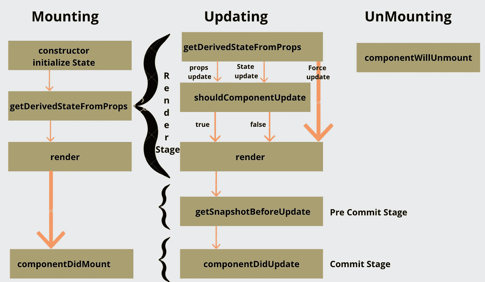*

***LifeCycle of React Component***

**

***React Lifecycle Stages***

# *安装[码笔](https://codepen.io/071eE211/pen/bGqEwvg)*

*挂载是创建 React 组件并将其插入 DOM 的第一步。*

*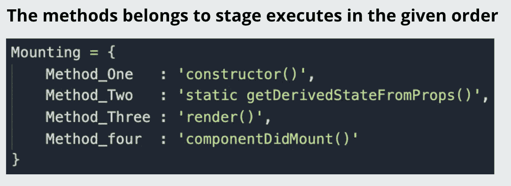*

***Methods in Mounting***

## ***建造师()***

*构造函数是组件挂载之前调用的第一个方法，它有助于初始化组件状态。每当类组件被初始化时，调用就会发生。 [**点击这里**](https://svignesh90-vs.medium.com/how-the-value-of-this-keyword-differs-in-arrow-vs-normal-function-9a124aec59a7) 了解更多关于' ***这个'*** 关键词。*

**

## *静态 getDerivedStateFromProps() [代码笔](https://codepen.io/071eE211/pen/bGqEwvg)*

*getDerivedStateFromProps 是一个*静态*方法，在 render 方法之前调用，但在组件的构造函数调用之后调用。*

*在这种情况下，*是必需的，只要从父组件传递的属性改变了子组件*的状态。该方法是 React 生命周期方法中的新方法，从 React 17 开始引入以取代*componentWillReceiveProps**

*在下面的例子中，父组件 ***AppContent*** 的 render 方法调用子组件***Rectangle***with*props*。*

***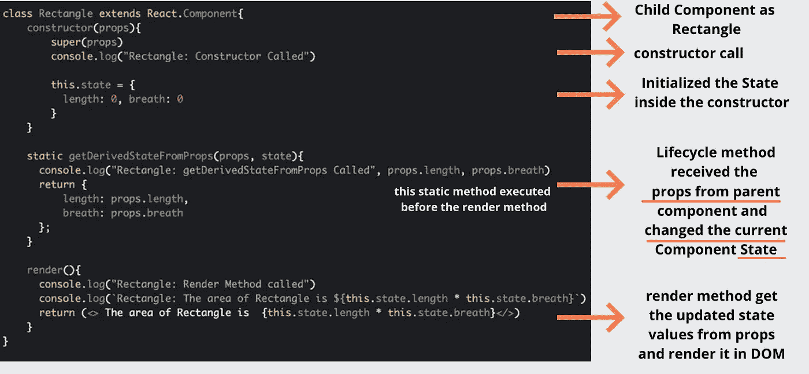*

*在子组件中，状态将在构造函数中被初始化，然后生命周期方法 getDerivedStateFromProps 将被调用，该方法的语法有两个参数，第一个参数为从父类接收的 ***props*** ，第二个参数为当前状态。现在 ***使用从父*** 接收的道具更新状态，然后 render 方法将被调用。现在看看输出的顺序*

*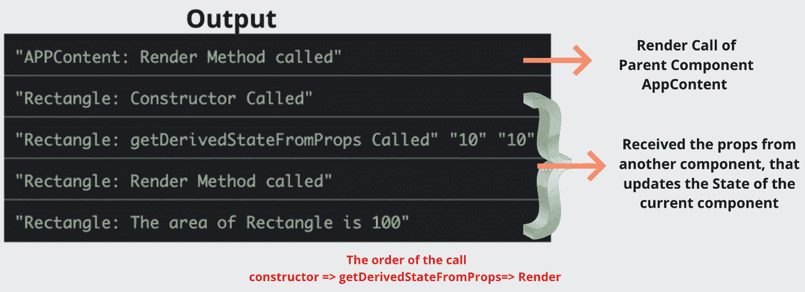*

***Output of getDerivedStateFromProps Method***

## *渲染()*

*在上面我们调用的方法中，render 方法会调用旁边的 **getDerivedStateFromProps。**我们已经看到了更多关于这些渲染调用的内容。那么，让我们进入下一个安装方法。*

## *componentidmount()[代码笔](https://codepen.io/071eE211/pen/RwprMaM)*

*每当组件装载到 DOM 上时，这个方法就会被调用，这意味着 render 方法已经完成，它将在一个生命周期中调用一次。一旦初始渲染完成，我们就可以进行 API 调用，并用 API 响应更新状态。在这种情况下，它主要是有帮助的。*

*甚至在 [***最后一个故事***](/geekculture/state-in-react-b228c8c47a7d) 中，我们也在无状态组件中使用 React Hook 方法 ***useEffect*** 做了同样的事情。如前所述，我们正在使用类组件转换同一个示例。*

***API 信息** [注册](http://home.openweathermap.org/)并从此处[获取免费 API 密钥](https://home.openweathermap.org/api_keys)*

*在下面的例子中，render 方法只被调用一次来呈现 ***AppContent*** 组件，在此期间，与状态相关的信息以默认数据呈现。*

*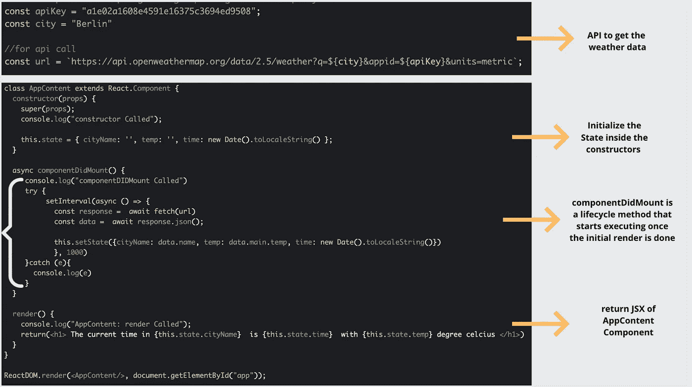*

*一旦开始渲染，生命周期的***componentdimount***方法就会被调用，并触发天气 API 来获取实时数据。在这个方法中，我们有 setInterval time 方法，它每隔一秒触发一次 API 调用，用 API 响应数据更新状态。正如我们已经知道的，只要状态改变，组件就会被重新呈现。*

*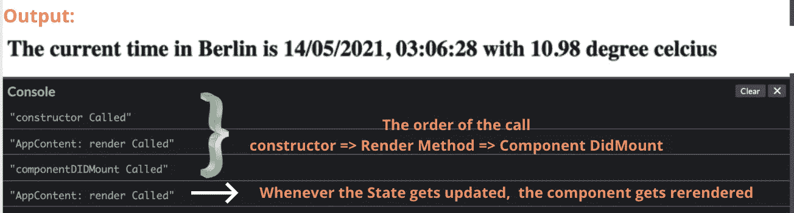*

***The output of componentDIDMount Method***

# ***更新***

*每当道具或状态发生变化时，就进入更新阶段。*

*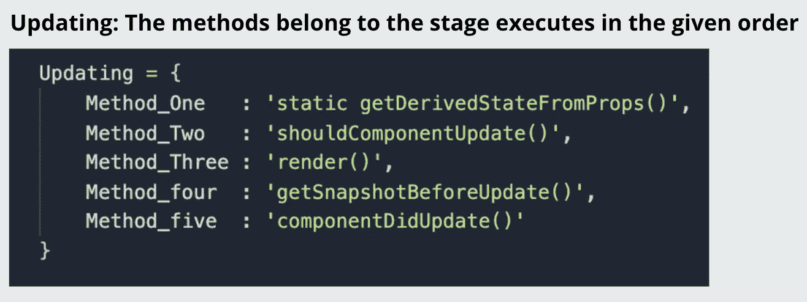*

***Methods in Updating***

## *静态 getDerivedStateFromProps()*

*getDerivedStateFromProps 是一个*静态*方法，在 render 方法之前调用，这是在更新阶段调用的第一个生命周期方法。我们已经在 ***挂载*** 阶段讨论过这个细节，这意味着这个方法在*挂载 ***更新*** 阶段都会被调用。那么，让我们继续下一种安装方法。**

## ****shouldcomponentdupdate()**[**代码笔**](https://codepen.io/071eE211/pen/NWpNXJb)**

**生命周期中的***shouldComponentUpdate***方法在***getDerivedStateFromProps***旁边被调用。正如我们已经讨论过的，只要有状态或道具改变，组件就会被重新渲染。如果你想控制重新渲染的行为，那么这个方法很有帮助。**

**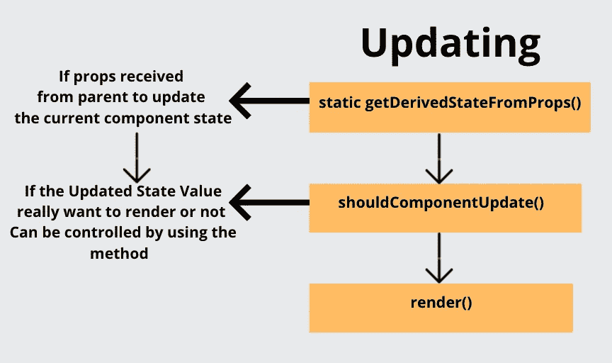**

*****shouldComponentUpdate*****

**在下面的例子中，父组件将长度和宽度的属性传递给子组件。**

**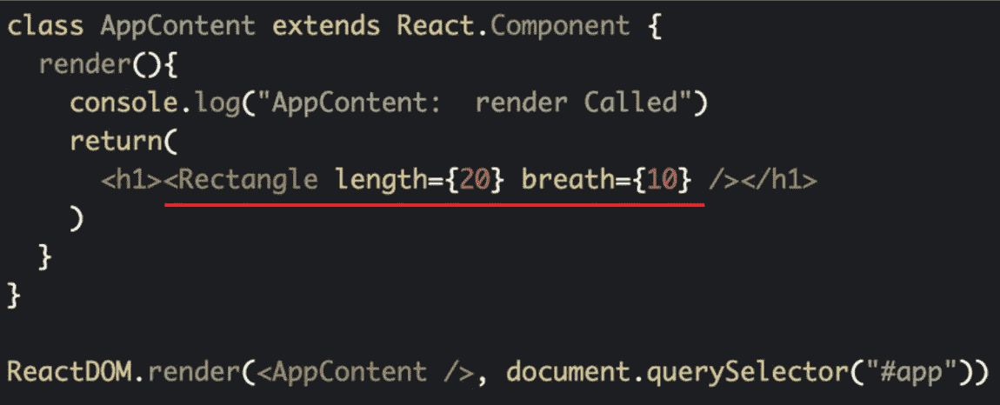**

**下面让我们看看子组件在初始渲染时的行为。
我们已经知道了初始渲染期间的生命周期调用层次。下面的类从父属性获取长度和宽度，并在方法***getDerivedStateFromProps***中更新子属性中的状态。只有状态值和 props 值或状态不同，在这种情况下，状态不是要更新的默认值。**

**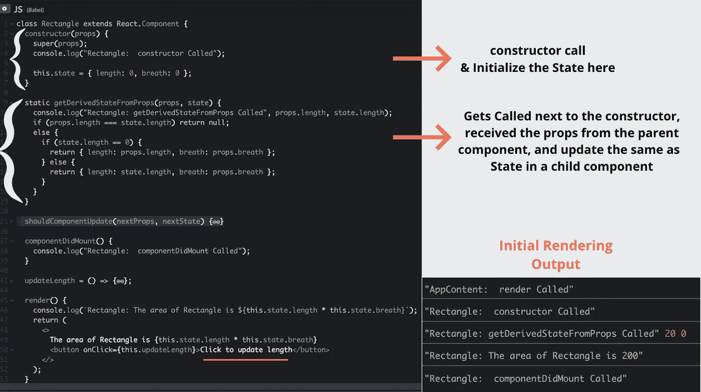**

*****更新*** 当我们点击按钮更新长度时，调用从 *updateLength* 方法开始，进行状态的改变。正如我们所知，当状态自动改变时，组件会重新呈现。在此之前，its 执行生命周期方法，如 getDerivedStateFromProps()&shouldcomponentdupdate**

******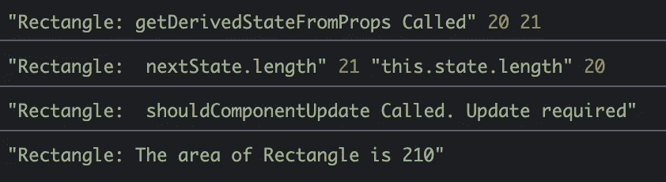**

****Output order of shouldComponentUpdate****

## **渲染()**

**在上面我们调用的方法中，render 方法会调用旁边的***shouldComponentUpdate***。在渲染中，我们只能读取状态而不能设置状态。我们已经看到了更多关于这些渲染调用的内容。所以，我们来看下一个更新的方法。**

## **`getSnapshotBeforeUpdate() [Code Pen](https://codepen.io/071eE211/pen/Rwpaebw)`**

***getsnapshotbefore update*方法存储 DOM 更新后状态的 *previous* 值，这意味着一旦 render 方法完成，在***componentDidMount***之前。**

**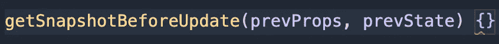**

*****什么时候真的需要这个方法？=渲染后提交前*后****

**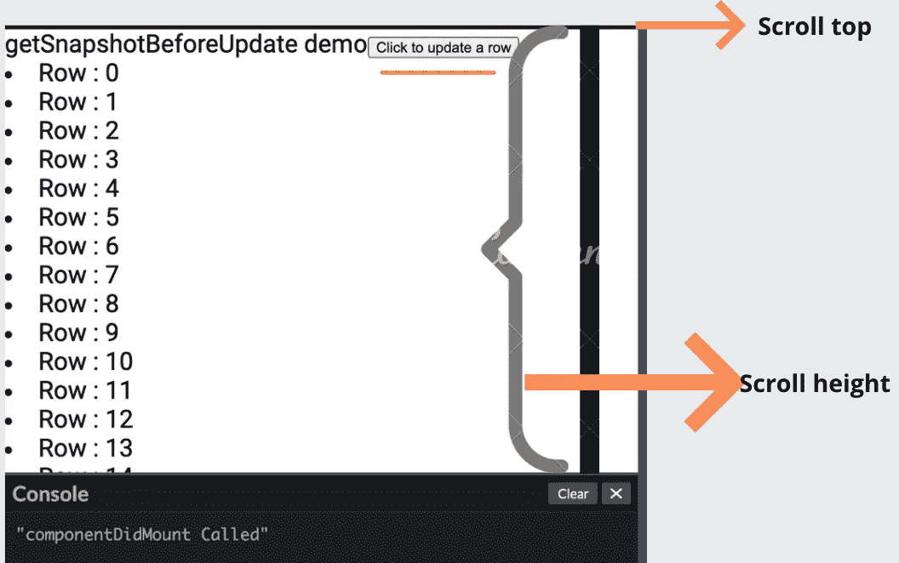**

**在给定的示例中，每次单击按钮都会创建一个新行，当行越来越多时，我们必须滚动窗口来查看新更新的行。在这种情况下，这种方法很有用。**

**这里的行数不应该超过显示框，如果超过，那么我们必须调整滚动位置，以查看最后更新的行。如果您将它与实时聊天消息连接，它会自动调整滚动位置，并始终显示最后一条消息。**

**我们知道， *componentDidUpdate* 会在 render 方法更新后开始。在这种情况下，需要更新来改变滚动位置。因此，`getSnapshotBeforeUpdate`帮助我们找到组件渲染后的滚动位置，最后*componentidmount*将更新 DOM 中的滚动位置。**

## **componentDIDUpdate()**

**我们已经在挂载部分看到了更多关于这些 *componentDIDMount* 调用的内容，这些调用在组件被挂载后立即被调用。类似地， *componentDIDUpdate* 在组件更新后立即调用的更新阶段调用。初始呈现时不调用此方法。**

**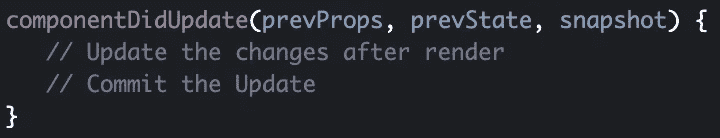**

# ****卸载****

**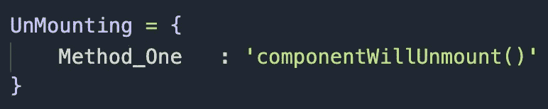**

## **componentWillUnmount()**

**当一个组件被从 DOM 中移除时，调用 componentWillUnmount 方法。它主要用于执行在取消网络请求或取消 componentDidMount 中的任何订阅时应该执行的清理。**

**例如，在聊天消息中，当加载聊天组件时，允许订阅发布或订阅消息。如果我们导航到其他页面，请删除 componentWillUnmount 部分中的订阅，以避免组件中发生不必要的调用。**

**希望它能给出 React 组件 的 ***生命周期的基本视图。如有疑问或修改，请写下您的问题。*****

**让我们在下一个故事中讨论 ReactJS 的下一个特性。**