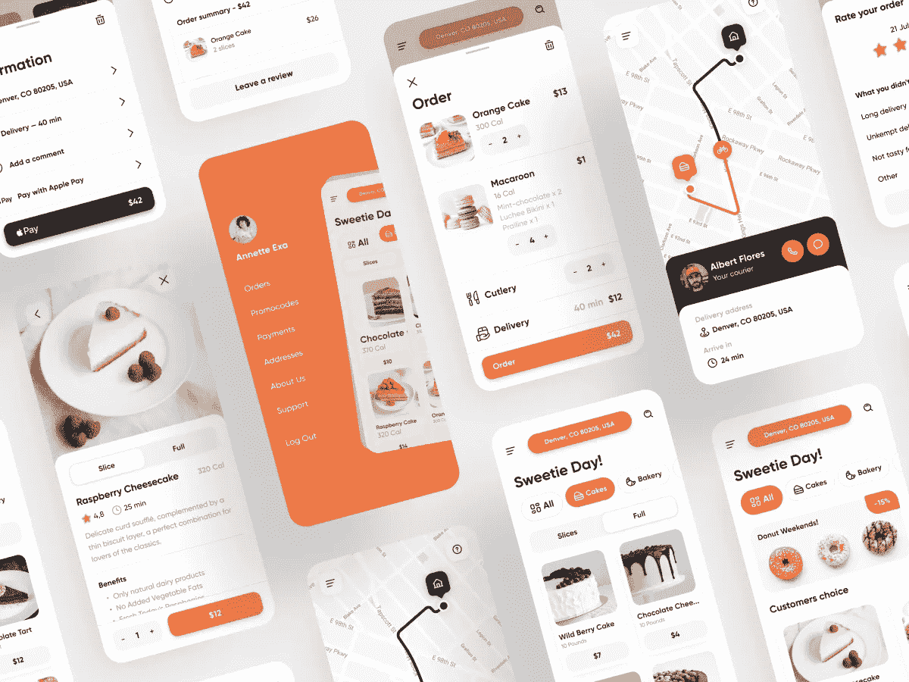
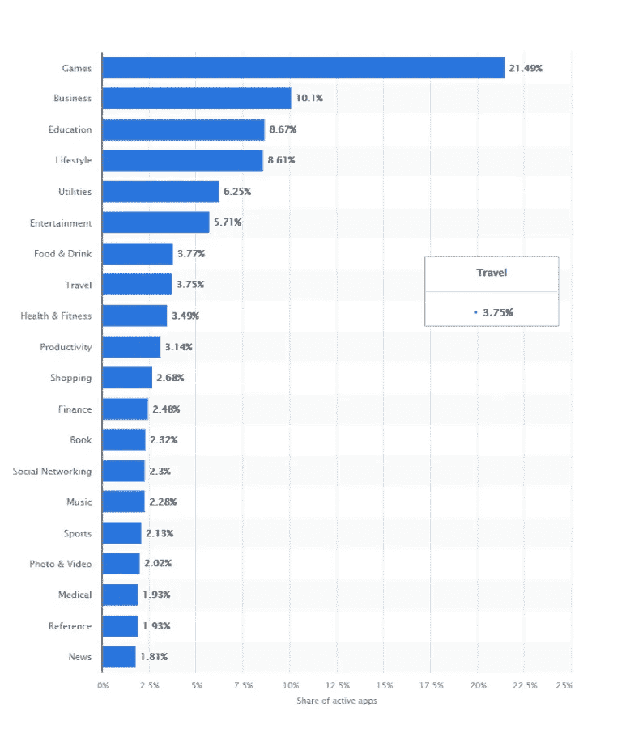
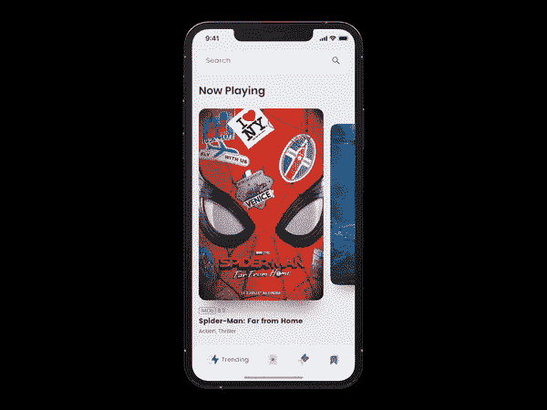
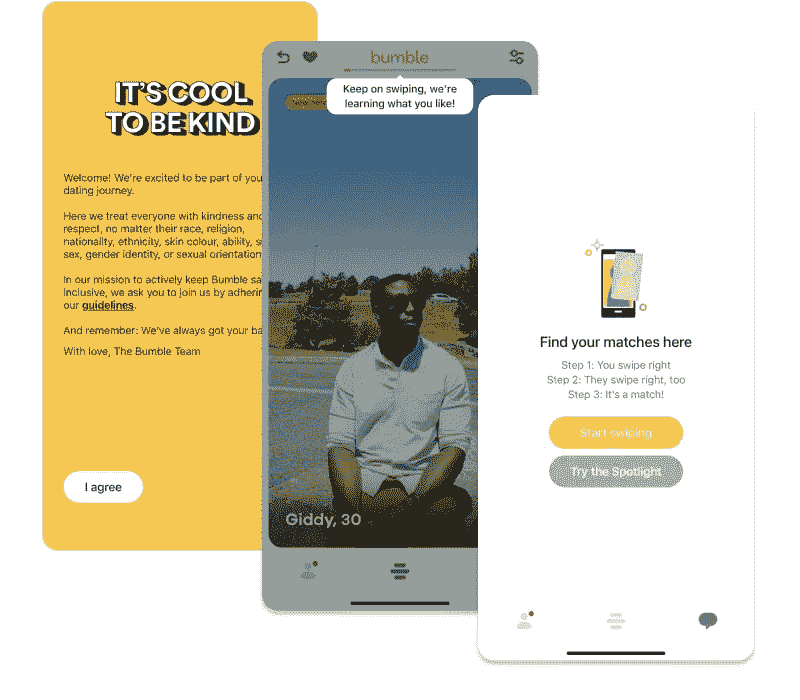
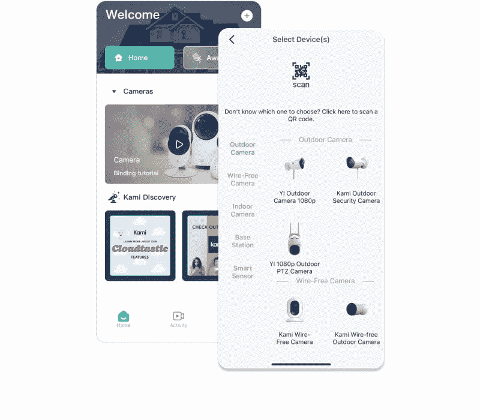
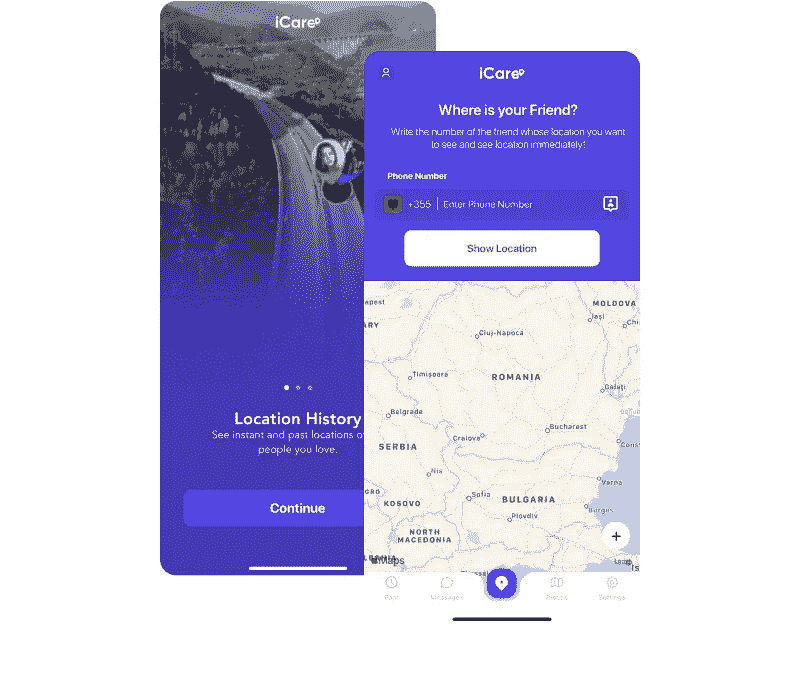
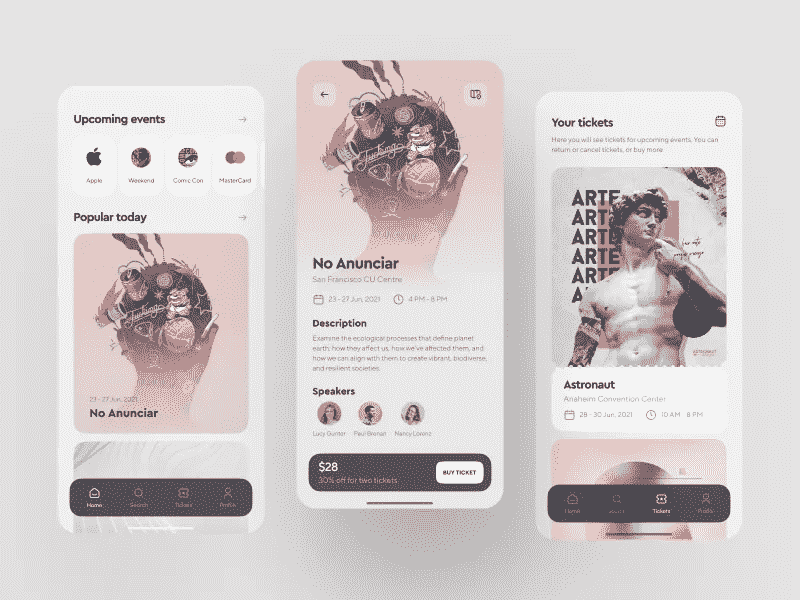

# 2022 年生活方式移动应用创意

> 原文：<https://medium.com/geekculture/lifestyle-mobile-app-ideas-for-2022-7343c93413ae?source=collection_archive---------3----------------------->

[*由堇富担任，文案由*三郎担任](https://shakuro.com/blog/author/vrychaha)

日常生活的数字化完美？这就是应用程序用户希望从生活方式应用程序中得到的！这就是为什么他们每年下载这样的应用[越来越多](https://www.businessofapps.com/news/lifestyle-app-consumer-spending-rises-30-in-q1-2021/)！这就是为什么，在这篇文章中，我们深入到应用商店生活方式类别的研究和想法。

# 生活应用流行度

你可以成为创造神奇助手的人，让每个用户的生活变得更美好。
看一看——这个应用类别在 App Store 上位列[前五名](https://www.statista.com/statistics/270291/popular-categories-in-the-app-store/):

顺便看看[商业](https://shakuro.com/blog/business-mobile-app-ideas-for-2022)和[教育](https://shakuro.com/blog/educational-mobile-app-ideas-for-2022)类别的移动应用创意。它们在 App Store 上也排在前五名。
考虑到移动市场的快速增长和一个应用程序的平均预期寿命(大约一年),创建一个成功且广泛的应用程序变得越来越具有挑战性。所以还是带着一个独家的，强大的想法进入市场比较好。在寻找新想法及其受众的过程中，统计和分析是创作者最好的朋友！

Music app concept by [Shakuro](https://dribbble.com/shots/6575546-Cinema-Tickets-App-Animation)

为了全面了解情况，最好在三个级别收集统计和分析数据:

1.  有关全球技术基础设施的信息，尤其是您希望为其创建应用的国家/地区的信息。这将有助于塑造产品开发的载体，并帮助确定可能适用于你的想法的趋势。
2.  有关移动应用市场的信息，以形成对未来应用的细节、必要元素和推广策略的愿景。
3.  关于生活方式类别中的应用程序市场的信息，以评估晋升的前景，查看其他玩家的错误。

Super popular dating app [Bumble](https://shakuro.com/blog/how-much-does-an-app-like-bumble-cost)

# 生活方式移动应用使用和收入的关键指标

统计数据显示，这一类别中票房最高的应用下载量巨大。如果我们估算一下前十名 app 中的平均数，那就是 22.6 万！这是一个很酷的指标来尝试这个类别！

有哪些生活类应用可供选择？根据使用方式和主题，有几十种不同的类型。最受欢迎的有:约会、美食、音乐、旅行、育儿、爱好、习惯、智能屋。只要浏览一下[类别列表](https://apps.apple.com/us/genre/ios-lifestyle/id6012)就可以发现，你几乎可以实现任何有助于改善用户生活方式的想法。

One of the most popular apps in the Lifestyle category — YI home

# 2021 年至 2022 年将会成功的生活应用创业的 8 个绝妙创意

这里有一些独家和病毒式的想法，让你得到启发，创建一个你的用户离不开的应用程序。

# 婚礼申请

将婚礼所需的一切整合到一个移动应用程序中是个不错的主意。第一次组织婚礼是一项艰巨的任务。如何挑选礼服？去哪里订花？谁将组织这次宴会？如何租豪华轿车？谁认识好的摄影师？蜜月旅行去哪里？还有请柬，玻璃杯，大厅装饰品，蛋糕。一场噩梦！一千件幸福的恋人们一周前还不知道的小事！

但是婚礼生意很赚钱。摄影师、花店、工作室、汽车租赁和旅游运营商是你潜在的应用广告客户。自己继续列表；它很大，有占用整篇文章的风险。

Dating app illustration by [Shakuro](https://dribbble.com/shots/15406419-Couple-Lounging)

# 育儿 app

与此同时，帮助抚养孩子的应用程序是一个不切实际的饱和市场。父母的需求变化很快——孩子长大后不再需要尿布、衣服和自行车。然后到了学习的时间，又是父母掏钱。

# 健康检查和膳食计划应用程序

这个应用程序每天检查你的健康状况，并为你提供保持健康所需的正确营养。它为你提供了许多由专业博主厨师提供的健康食品食谱。您可以根据自己的健康状况定制内容交付。例如，如果你有心脏问题，一个应用程序会推荐用有益心脏健康的成分制作的食谱。你可以与杂货店合作，通过应用程序直接提供健康产品。

# 购物中心导航地图

购物中心数字导航地图存储了该地区所有购物中心的数字地图，可用于导航购物中心以及显示如何到达那里。这对大型商场特别有用。游客可以找到确切的商店，甚至可以使用该应用程序检查餐厅类型、停车位或商场中的人群规模。

# 停车位搜索应用程序

这个应用程序可以帮助人们找到特定位置的免费停车位。该应用程序可以使用 GPS、网络摄像头、位置和实时停车数据，在您需要时随时找到免费停车位。

# 礼物建议应用程序

该应用程序可以查看您朋友的整个社交媒体故事，并根据他们发布的内容为您的朋友推荐最好的礼物。

One of the top lifestyle category apps — Icare

# 你的冰箱里有什么

这个应用程序会考虑你的储藏室或冰箱中的所有蔬菜、香料和其他配料，然后根据这些建议你可以在家烹饪什么。它还会告诉你如何准备一道特定的菜肴。

# 该洗你的车了

一个分析天气预报并给出洗车最佳时间建议的应用程序。

# 生活应用创建技巧

这个类别是如此庞大和多面性，你很容易迷失在其中！因此，我们对生活方式应用程序的创建没有什么建议:

*   不要试图用一个应用程序解决太多的问题。
*   用很少的预算，为一个最受客户欢迎的平台投资开发一个经过深思熟虑的应用程序。

Music app concept by [Shakuro](https://dribbble.com/shots/16396562-Podcast-App-Concept-UI)

*   即使在最基本的设备上，也能让你的生活方式应用变得快捷。
*   让你的应用程序简单、方便、实用、有吸引力、便宜(甚至免费)。
*   制作一个独特的应用程序——任何人都不会对克隆感兴趣。