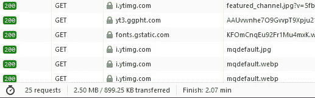

# 通过延迟加载 Youtube iFrame Embed 加快 Vue 应用程序页面加载

> 原文：<https://medium.com/geekculture/light-and-responsive-youtube-embeds-faster-vue-web-page-load-speeds-c8e477b93f0f?source=collection_archive---------20----------------------->

> 目标是以快速、轻量级的方式将 YouTube 视频嵌入到您的 Vue 网页上，减少加载时间并按需嵌入视频，从而减小您的网页大小，提高您的页面速度和 Google 排名。

嵌入一个 YouTube 视频对任何参与网络的人来说已经变得非常容易；复制，粘贴，完成。然而，引入像 YouTube 视频这样的外部资源会降低网页的加载性能，尤其是在同一页面上嵌入了两个或更多视频的情况下。

单个嵌入的 YouTube 视频相当于 25 个 HTTP 请求，总共下载了大约 899 KB(见截图)。随着我们在页面上嵌入更多视频，这些数字还会攀升。并且这些文件甚至在访问者点击播放按钮之前就被下载了。



如果你没有自动播放视频，那么为什么在你不需要的时候减慢你的初始页面加载速度？

默认 YouTube 嵌入代码的另一个缺点是，它提供了一个固定尺寸的视频播放器，并且没有响应能力。

# “延迟加载”——嵌入 YouTube 视频而不增加页面大小

它不是在页面加载时嵌入完整的播放器，而是只显示一个缩略图和视频标题，并覆盖一个播放按钮。YouTube 播放器的资源不会被加载，除非访问者真的点击了播放按钮，这 100%解决了上述问题。

要在 Vue 应用程序中实现这一点，您必须做到以下几点:

**第一步:**

在你的 vue.js 应用中添加 [**vue-lazytube**](https://github.com/seeratawan01/vue-lazytube) 包，有了这个你就可以轻松嵌入 YouTube 播放器，懒人加载视频，节省资源，减少初始加载大小。

```
npm install --save vue-lazytube
```

**第二步:**

现在你所要做的就是在你的项目中导入‘lazy Youtube’并传递 YouTube 视频链接作为道具。 *(* [*参见演示*](https://codesandbox.io/s/vue-lazytube-forked-17o8v?file=/src/App.vue) *)*

```
<template>
    <LazyYoutube
        src="https://www.youtube.com/watch?v=TcMBFSGVi1c"
    />
</template>

<script>
    import { LazyYoutube } from 'vue-lazytube' export default {
      name: "YourAwesomeComponent",
      components: {
        LazyYoutube
      },
    };
</script>
```

现在它只渲染一个缩略图和一个视频标题，并覆盖一个播放按钮，你可以使用[道具](https://github.com/seeratawan01/vue-lazytube#props)进一步定制。所以当访问者点击播放按钮时，它就会加载资源并播放视频。


**[](https://www.npmjs.com/package/vue-lazytube)****提供的所有特性:******

*   ****将每个视频的初始加载大小减少约 1.1 MB****
*   ****通过`props`全面响应和定制****
*   ****提供控制(`play`、`stop`、`pause`和`reset`)嵌入视频的方法****
*   ****提供选项来设置嵌入视频的自定义标题和预览****
*   ****支持的平台:Youtube 和 Vimeo****

****Complete Demo****

****这就是全部了。你只是把你的[谷歌页面速度洞察](https://developers.google.com/speed/pagespeed/insights/)分数减少了一两秒。****

*****谢谢……*****