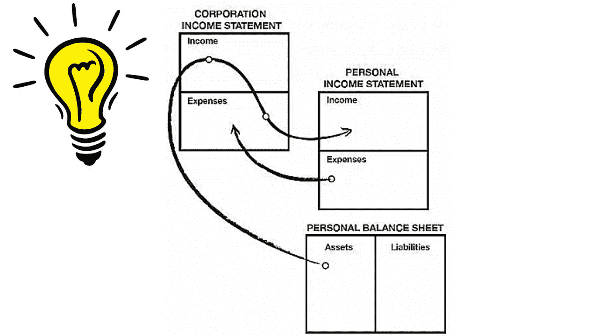

# 罗伯特清崎的“富爸爸，穷爸爸”对税收和企业权力的见解。

> 原文：<https://medium.com/geekculture/lightbulb-moment-on-robert-kiyosakis-rich-dad-poor-dad-s-insights-to-taxes-and-the-power-of-the-85a3092f3e5f?source=collection_archive---------15----------------------->

Source: Robert Kiyosaki- Rich Dad Poor Dad

如果你看这个图表，它显示了公司结构如何位于你的个人损益表和资产负债表之外。

你可能想知道“公司，这和我有什么关系？”。我过去认为公司只为拥有巨大…