# 闪电平台集成能力:迷你指南

> 原文：<https://medium.com/geekculture/lightning-platform-integration-capabilities-the-mini-guide-e9a407a20eba?source=collection_archive---------3----------------------->

在上一篇文章中，我们讨论了构成 Salesforce 平台的[互连部分，并总结了 API 和功能。](/geekculture/salesforce-apis-and-integration-capabilities-the-pocket-guide-2a1a8e97603d?source=friends_link&sk=8bc83d17960cd031782b0ea2e3011f8c)

在本帖中，我们将双击 lightning 平台，更深入地了解它的**集成能力**。

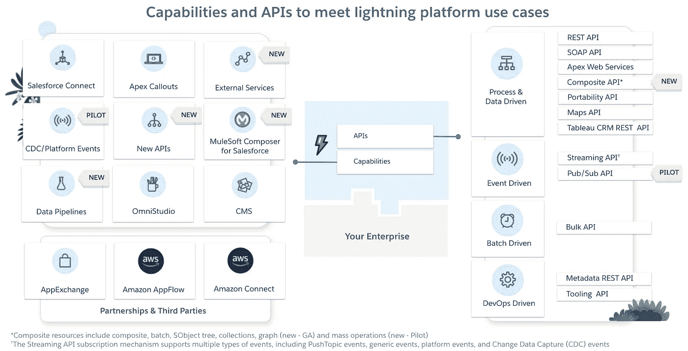

The lightning platform: APIs and key integration capabilities

# Salesforce 连接

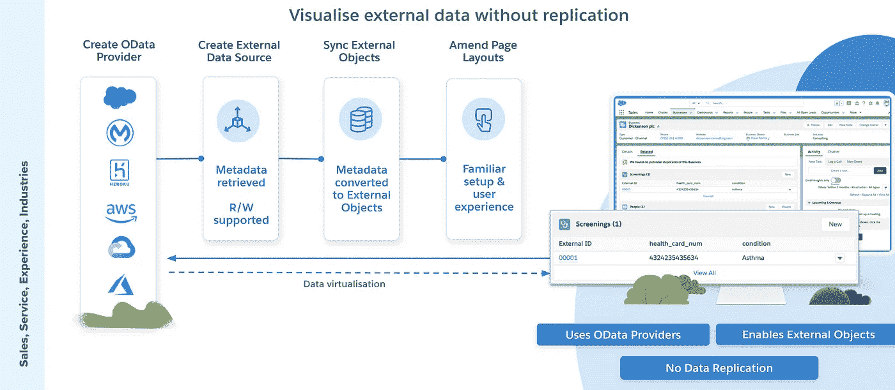

Using Salesforce Connect to interact with data (patient screening records in this example) stored outside the Salesforce Org.

[Salesforce Connect](https://trailhead.salesforce.com/en/content/learn/projects/quickstart-lightning-connect) 通过允许您的用户查看、搜索和修改存储在您的 Salesforce 组织外部的数据，提供跨系统边界的无缝数据集成。这可以在 ***完成，而*** 不必复制数据，但用户体验与您复制的数据非常相似。

Salesforce Connect 使用行业标准 OData 协议，该协议致力于简化跨不同系统的查询和共享数据。OData 是一个基于 REST 的协议，构建在 HTTP 和 JSON 之上，使用 URIs 实时寻址和访问数据馈送资源。

要设置 Salesforce Connect，您必须创建指向 OData 端点的外部数据源。然后，服务会对端点公开的模式进行自省，并允许您创建相应的外部对象。最后一步是将外部对象添加到页面布局中，并且可以选择将它们链接到标准对象。

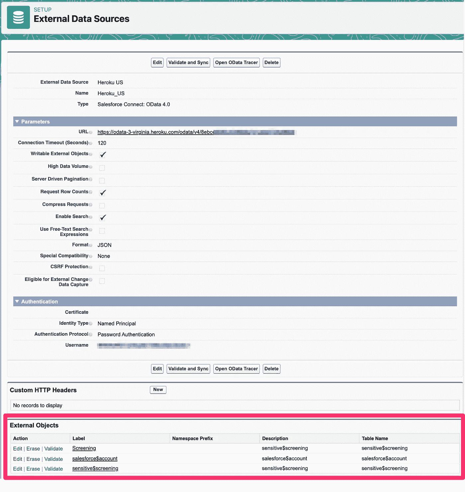

External objects sync’d from the OData endpoint

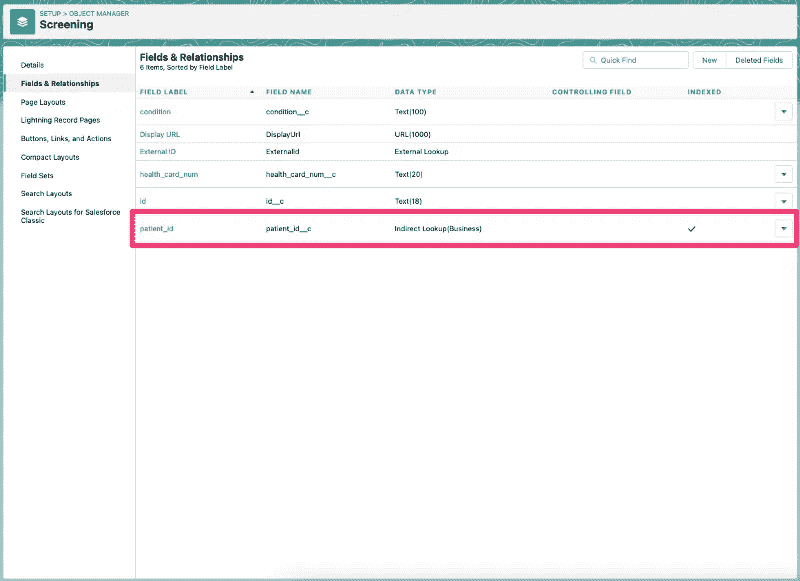

Relate fields in the external data source to fields on standard objects.

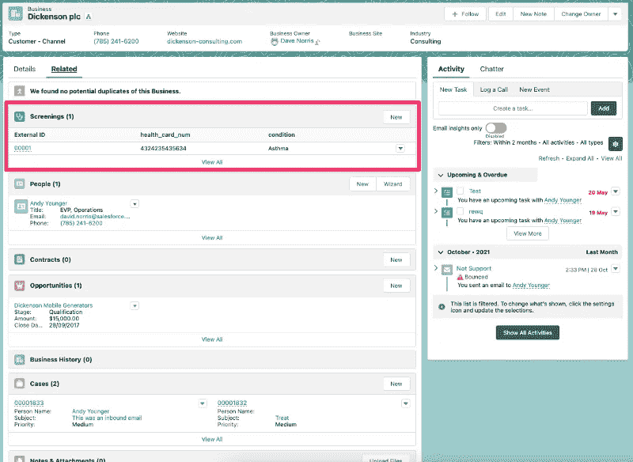

Adding External Objects to standard page layouts. They look and feel like standard objects but the data is accessed at runtime.

## [MuleSoft OData API 套件](https://docs.mulesoft.com/apikit/4.x/apikit-4-for-odata)

Salesforce Connect 需要 OData 提供程序。如果您的数据源本身不支持 OData，那么 MuleSoft 提供了一种方法，可以使用 OData 的 [API 工具包](https://docs.mulesoft.com/apikit/4.x/apikit-4-for-odata)快速搭建和实现 OData。

通过使用和企业数据模型 XML 文件(。edmx)和 MuleSoft 提供的一个插件，您可以将文件转换成一个 API 端点，其中包含支持 GET、PUT、PATCH 和 DELETE 资源所需的所有脚手架。的。edmx 文件包含目标数据库模式，并定义了 EDM 和底层数据库之间的映射。

然后，每个资源都可以有一些操作，这些操作使用 MuleSoft 连接器实现逻辑，将入站 OData 请求转换成可以在 DML 操作中使用的格式。

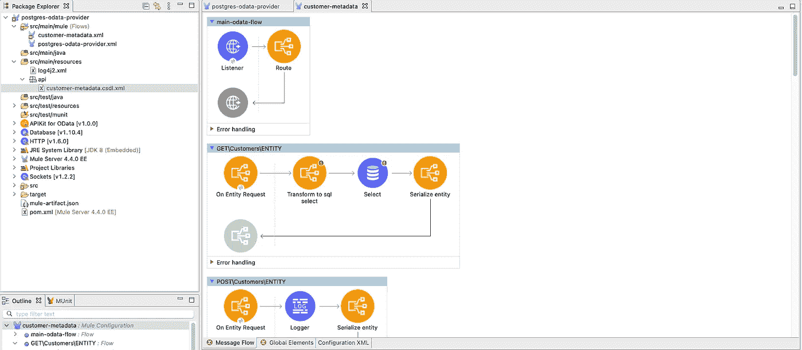

The MuleSoft OData API Kit with resources to transform requests and connectors to access your data sources with minimal code.

> 可以将 Salesforce Connect 视为一种无代码方法，用于搜索、查看和更新存储在 lightning 平台外部的数据，但可以方便地维护用户对数据的体验，就像数据存储在平台上一样。MuleSoft 提供了一个 API 工具包来帮助创建 OData 提供者。

# 顶点标注

通过调用外部 Web 服务或从 Apex 代码发送 HTTP 请求，然后接收响应， [Apex 标注](https://trailhead.salesforce.com/en/content/learn/modules/apex_integration_services)使您能够将 Apex 与外部服务紧密集成。Apex 提供与利用 SOAP 和 WSDL 或 HTTP 服务(RESTful 服务)的 Web 服务的集成。

在上图中，您可以看到一个显示客户当前余额的自定义 lightning web 组件。此信息存储在平台外，apex 标注允许实时检索数据并显示在屏幕上，而不必将其复制到 Salesforce 数据库中。

> 可以将 Apex 标注视为一种从 API 端点检索数据的方法，而不必将其复制到 lighting 平台中。这允许您显示存储在平台外的高度瞬态数据，并将其与存储在您的 Salesforce 组织中的数据一起显示。

# 外部服务

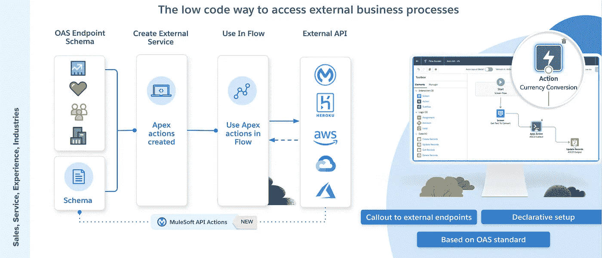

[外部服务](https://trailhead.salesforce.com/en/content/learn/modules/external-services)是一个集成产品，它使用 OpenAPI 标准声明性地连接外部 REST APIs。它将外部 web 服务引入了 lightning 平台，您可以使用指向和点击工具(如 Flow)来满足集成用例，而无需代码。外部服务只是检查 OAS API 规范，以确定可用的方法、输入和输出数据类型，从而代表您创建必要的 Apex 代码。

> 而对外服务并不新鲜。使用 MuleSoft APIs 作为外部服务基础的能力是。

一旦创建了外部服务，就创建了可调用的操作。这些可调用的操作在自动化工具 Flow Builder 中立即可用。管理员使用 Flow Builder 访问可调用的流操作，允许他们调用 API 并接收响应。不用写代码。

通过组合外部服务和像 Flow 这样的声明性特性，您可以在不编写一行代码的情况下创建询问第三方 API 的用户体验。

例如，我使用 flow 和第三方服务将用户输入转换成相应的 ASCII 艺术，并将结果保存在记录中。

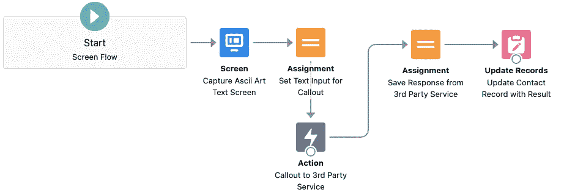

Example flow that uses auto generated Apex invocable actions from an OpenAPI spec to callout to a third party.

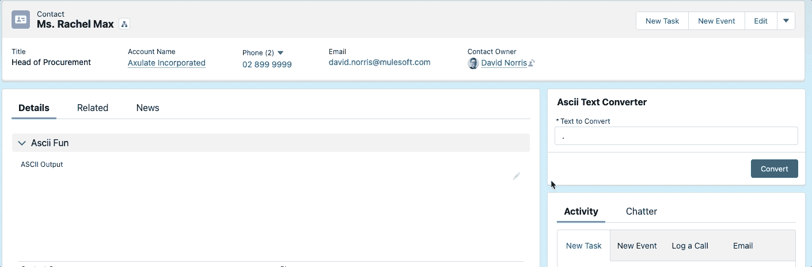

External Services and Flow in action. Converting user input to ASCII art using a third party API.

## MuleSoft 作为 API 源

从 Winter’22 开始，您现在可以导入 MuleSoft API 规范，作为外部服务创建过程的一部分。

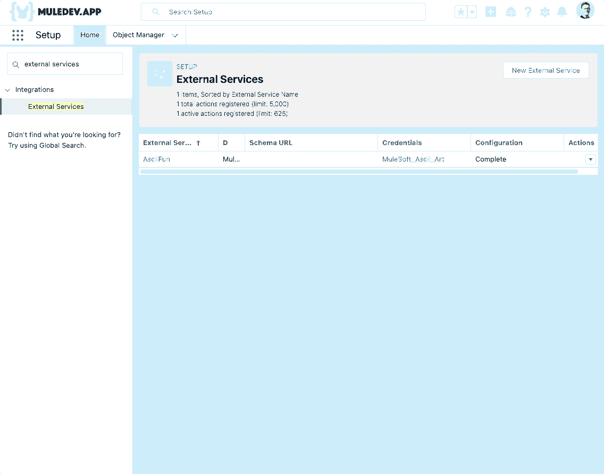

Importing MuleSoft APIs directly into an External Service.

# 平台事件和变更数据捕获

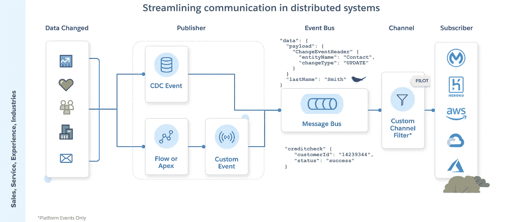

企业希望分离他们的分布式系统，并希望采用事件驱动的架构，在这种架构中，数据交换接近实时，而接口没有紧密耦合。

发布者和订阅者通过事件相互通信。一个或多个订户可以收听相同的事件并执行动作。您的 Salesforce 组织可以通过以下方式支持这些类型的架构。

[**变更数据捕获**](https://trailhead.salesforce.com/content/learn/modules/change-data-capture) **、CDC、**允许开发人员接收 Salesforce 记录的近实时变更，并在外部数据存储中同步相应的记录。变更数据捕获发布变更事件，表示对 Salesforce 记录的变更。变更包括创建新记录、更新现有记录、删除和取消删除记录。变更事件结构是一致的，并且包含标题字段，这些字段包含关于事件的信息，例如变更是更新还是删除，以及对象的名称，如 Account。还包括特定于事件的字段 replayId，用于检索过去的事件。

变更数据捕获通常用于向下游系统通知数据变更，以便采取措施或保持数据同步。

与 CDC 事件不同， [**平台事件**](https://trailhead.salesforce.com/en/content/learn/modules/platform_events_basics) 是开发者驱动的，与数据库操作无关。平台事件具有自定义有效负载，并由 Apex 代码或流触发。这允许开发人员创建和发布自定义事件通知。

一个**试验**程序允许通道有一个字段值过滤器(仅适用于平台事件)。CometD 频道的订阅者接收经过过滤的平台事件流，从而优化处理。

> 变更数据捕获和平台事件是接近实时的事件，通过将事件发布到共享事件总线来支持事件驱动的体系结构。外部应用程序和/或其他 lightning 平台功能可以大规模异步订阅和回复这些事件。

# 新 API

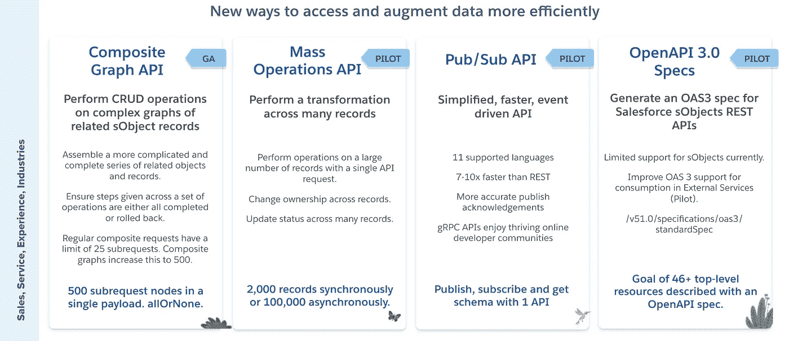

Salesforce 不断发展其 API 组合，为开发人员提供访问其数据的新方法。

[**复合图形 API**](https://developer.salesforce.com/docs/atlas.en-us.api_rest.meta/api_rest/using_resources_composite_graph.htm) 是对现有复合 API 的进化。它被设计为给单个 API 调用更大的能力。

**大规模运营 API** 是*试点*中的一个东西，用于解决一个常见的痛点。例如，您有大量记录需要执行操作(如更改所有权)。批量操作 API 允许我们进行一次 API 调用，并提供一组要操作的 id——这些 id 可以是列表或 SOQL 查询的形式。

使用流 API 订阅服务(以 pushtopic、generic、CDC 和 platform events 的形式)的开发人员需要使用 3 个 API 来发布、订阅和查询模式。为了简化事情，一个新的 [**发布/订阅 API**](https://developer.salesforce.com/blogs/2021/07/pub-sub-api-building-event-driven-integrations-just-got-even-easier) 现在正在试运行，旨在在一个 API 中提供所有功能。它还将使用 gRPC(谷歌远程过程调用)。

当谈到 lightning 平台的 OAS REST 规范时，几乎没有人支持。Salesforce 已经在*试点*中开始了一段旅程，通过为您提供一个端点，让您[下载反映您组织独特定制的 **OAS 3.0** 规范](https://help.salesforce.com/s/articleView?id=release-notes.rn_api_openapi_spec_pilot.htm&type=5&release=230)来改善这一点。目前对 sObject 资源的支持是有限的，但我们的愿景是在未来的版本中进一步开放支持。

# 用于 Salesforce 的 MuleSoft Composer

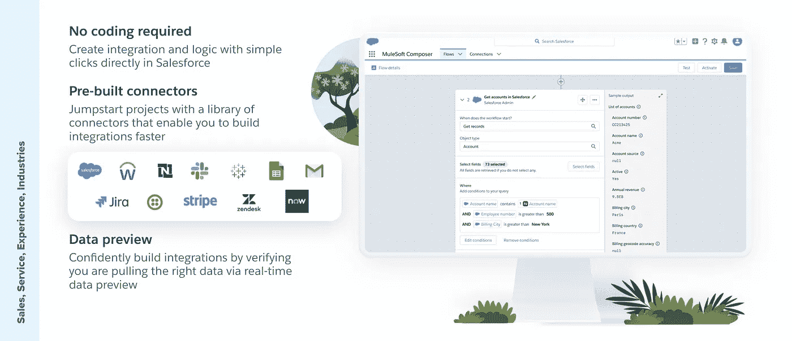

简单的点对点集成可以释放大量的价值，但是等待开发资源是不可持续的。[**MuleSoft Composer for Salesforce**](https://trailhead.salesforce.com/en/content/learn/trails/get-started-with-mulesoft-composer)旨在允许 Salesforce 管理员直接在 sales force 内部通过简单、有指导的点击创建集成和逻辑。

通用后台系统的预建连接器允许您简化销售、服务、IT 和营销部门的使用案例。这里有一些不需要开发人员的技能就可以满足的用例。

*   它—当某一类型的 Salesforce 案例打开时创建吉拉票证？
*   服务—当客户的工作订单进展时发送短信
*   人力资源—创建和同步关键员工属性
*   销售—当机会结束时，在您的 ERP 中创建订单

# 数据管道

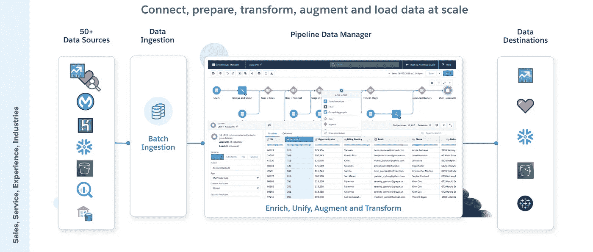

借助 Salesforce [**数据管道**](https://help.salesforce.com/articleView?id=release-notes.rn_bi_data_pipelines_enrich_salesforce_data.htm&type=5&release=232) ，您可以在 Salesforce 中本地集成、丰富和修改数据，而无需外部系统或在信任边界之外获取数据。

借助点击式工具和机器学习指导，您可以更快地大规模准备和转换数据**。管理员可以在他们熟悉的 Salesforce 环境中工作，而无需使用复杂的外部基础架构来满足常见的数据同步和清理需求。**

通过超过 **50 个现成的连接器**，可以轻松访问外部系统中保存的数据，并使您的传入数据与您的 Salesforce 方案相匹配。有了**数据处理**，复杂的转换可以轻松完成，即使是大数据量。数据是成批接收的，可以按计划启动，也可以使用 Tableau CRM REST API 启动作业。

# OmniStudio

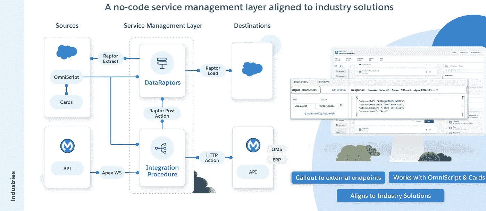

OmniStudio 是一套工具，旨在创建最适合特定行业用例的数字体验。OmniStudio 是一套基于任务的组件，是 lightning 平台的原生组件。DataRaptor 和集成过程是两个组件，它们允许客户更容易地与他们的数据源集成，无论是在平台上还是在平台外。

[**DataRaptor**](https://trailhead.salesforce.com/en/content/learn/modules/omnistudio-dataraptors?trail_id=get-to-know-omnistudio) 为 Salesforce 管理员提供从其 Salesforce 数据模型中提取、转换和加载数据的能力(DataRaptor 提取、DataRaptor 转换和 DataRaptor 加载)。它最常用于与 OmniStudio 附带的其他组件(即卡片和 OmniScript)进行交互，以创建交互式用户界面。Cards 和 OmniScript 提供了一个用户界面，可以使用 DataRaptors 来执行数据库操作——允许检索、显示信息或向数据库写入信息，以捕获关键细节。

一个 [**集成程序**](https://trailhead.salesforce.com/en/content/learn/modules/omnistudio-integration-procedures?trail_id=get-to-know-omnistudio) 可以自动生成一个可以从外部系统调用的 Apex REST 端点。它还可以调用外部系统，通过您定义的 *HTTP 动作*来检索数据，该动作还可以检索和转换结果负载——例如，当考虑到一家通信公司与他们的订单管理系统(OMS)进行交互时，这一点很重要。当有效负载需要一个用户界面作为更广泛的业务流程的一部分时，也可以从 OmniScript 调用一个过程。集成过程也可以启动 DataRaptor 进程来完成图像。

# 内容管理系统

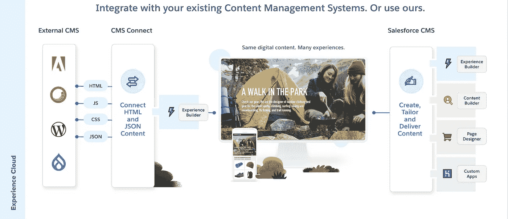

使用 [**CMS Connect**](https://developer.salesforce.com/docs/atlas.en-us.communities_dev.meta/communities_dev/communities_dev_cms_connect_intro.htm) 您可以连接 HTML、JSON、CSS 和 JavaScript 来定制您的体验云网站，并使其品牌和其他内容与您的公司网站保持一致。CMS Connect 官方支持 Adobe、Sitecore、WordPress、SDL (Tridion)和 Drupal。

实施 CMS Connect 后，您可以提供相对路径:

1.  HTML。页眉和页脚 html 片段就是一个例子。
2.  JSON(列表和项目)。博客文章就是一个例子，当它显示完整的博客文章时。内容列表是一组条目，如一系列博客，当它显示时，它是一个标题和摘要，带有完整文章的链接
3.  级联样式表(CSS) —提供一致的外观和感觉
4.  JavaScript——重用代码片段

使用 [**Salesforce CMS**](https://trailhead.salesforce.com/en/content/learn/modules/salesforce-cms-basics) 客户可以选择在 Salesforce 中创建内容，并将其与 Salesforce 生态系统中的其他资产共享，以及在其企业体验内部共享。Salesforce CMS 是一款[混合 CMS](https://www.salesforce.com/blog/2019/10/what-is-a-cms.html?d=7010M000001yv8PQAQ) ，这意味着您的团队可以在一个中心位置创建内容，并将其整合到任何数字接触点，无论是由 Salesforce 还是其他系统提供的体验。

# AppExchange

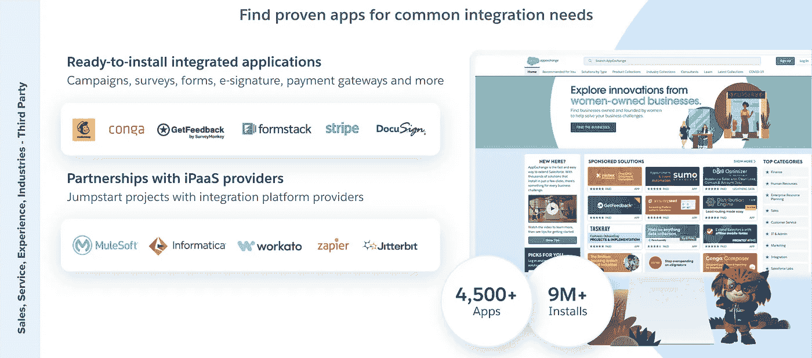

对于集成用例，我们的合作伙伴提供了可以集成到支付网关、调查工具、文档管理解决方案、营销工具等的应用程序。

# 亚马逊 AppFlow

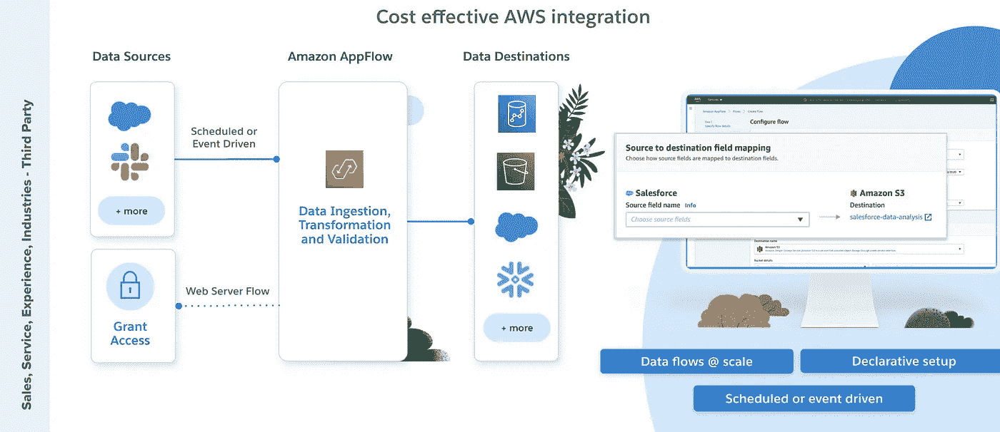

[Amazon AppFlow](https://trailhead.salesforce.com/en/content/learn/modules/amazon-appflow/get-started-with-amazon-appflow) 是 AWS 的一项集成服务，使您能够在 Salesforce 等云应用程序和 Amazon Simple Storage Service(Amazon S3)、Amazon EventBridge 和 Amazon Redshift 等 AWS 服务之间传输数据。您还可以使用 AppFlow 使用存储在亚马逊 S3 存储桶中的数据在 Salesforce 中创建新记录。数据双向流动。

使用 Salesforce 作为数据源，AWS 管理员可以选择安排信息提取或使用变更数据捕获事件来提供您的 Salesforce 组织中正在进行的变更的实时流。AppFlow 提供了一些基本的验证和转换功能。

# 亚马逊连接

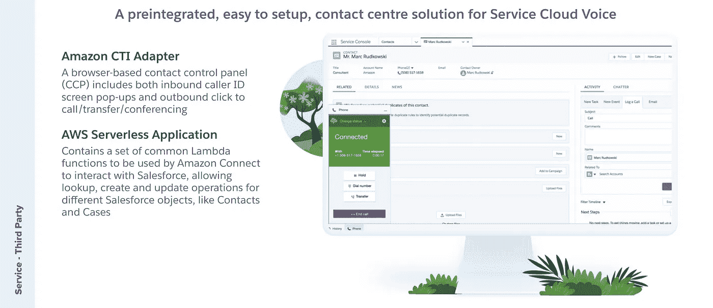

[**Amazon Connect**](https://trailhead.salesforce.com/en/content/learn/projects/build-an-amazon-connect-integration?trail_id=integrate-aws-and-salesforce) 是一项基于云的服务，旨在简化您的联络中心。

用于 Salesforce 的 **Amazon Connect 计算机电话集成(CTI)适配器**简化了集成电话系统的部署。直接从 Salesforce 接听来电和拨出电话。CTI 适配器在 Salesforce Lightning、控制台和经典 CRM 体验中提供了基于浏览器的联系人控制面板(CCP)。此功能包括呼入来电显示屏幕弹出和呼出点击呼叫/转接/会议。

Amazon Connect CTI 集成由两个组件组成，一个托管 Salesforce 包和一个 **AWS 无服务器应用程序**，它们可以部署到您的 AWS 环境中。预构建实用程序的集合支持这两个平台之间的集成。AWS 无服务器应用程序包包含 Amazon Connect 用来与 Salesforce 交互的一组常见 Lambda 函数。这允许您在 Salesforce 记录中嵌入呼叫记录，自动清理打开的选项卡以提高代理效率，并在 Salesforce 和 Amazon Connect 之间同步状态。

# 摘要

lightning 平台中的集成功能涵盖了 ETL、事务和事件驱动的用例。这些功能允许开发人员以最小的摩擦创建定制的用户体验。

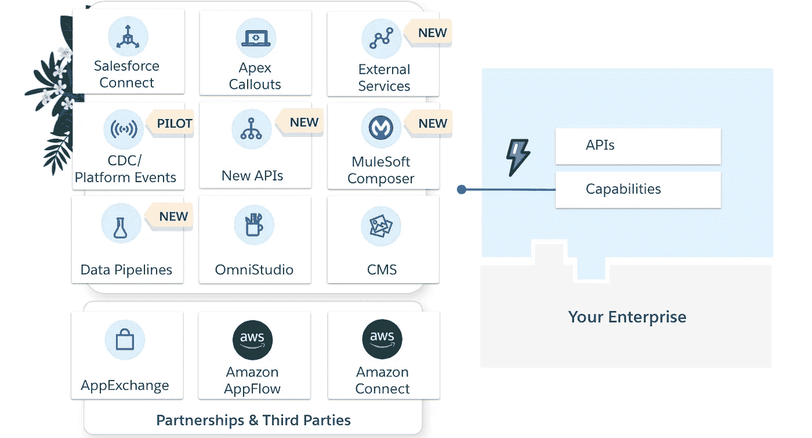