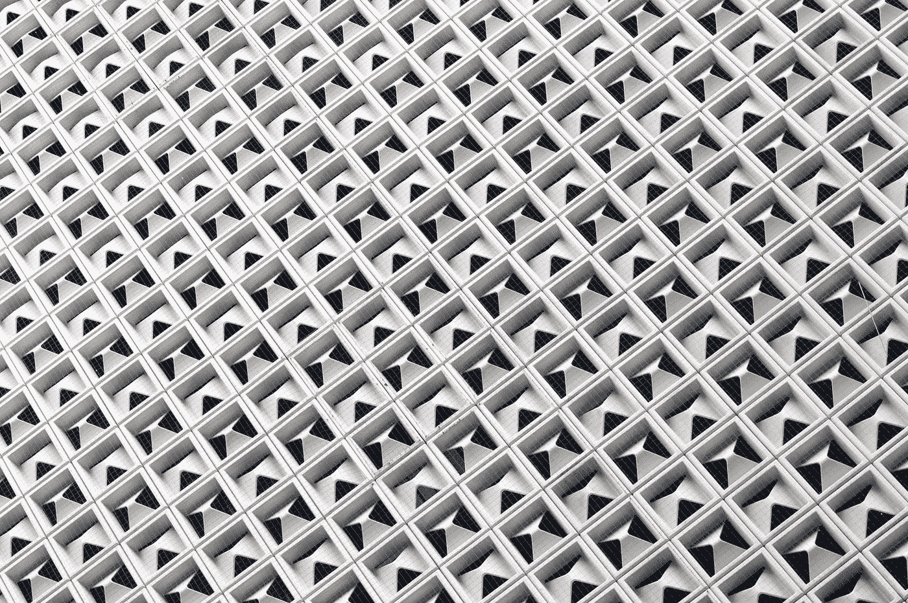

# 张量流线性代数

> 原文：<https://medium.com/geekculture/linear-algebra-with-tensorflow-755598b6eb46?source=collection_archive---------20----------------------->

## TensorFlow 为线性代数提供了易于使用的内置函数

Photo by [Bryan Colosky](https://unsplash.com/@bryancolosky?utm_source=unsplash&utm_medium=referral&utm_content=creditCopyText) on [Unsplash](https://unsplash.com/?utm_source=unsplash&utm_medium=referral&utm_content=creditCopyText)

深度学习和机器学习算法在计算中使用矩阵运算。当我们在 TensorFlow 中训练模型时，大多数矩阵操作都发生在幕后。但是，了解如何使用 TensorFlow 执行线性代数是值得的。TensorFlow 提供易于使用的…