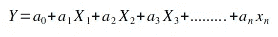
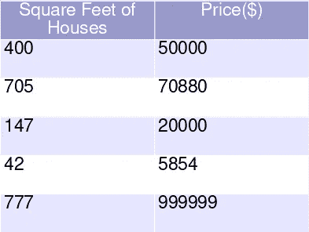
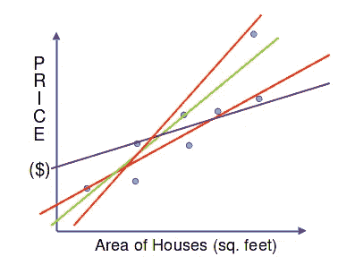
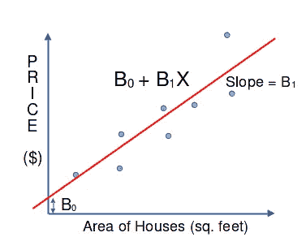
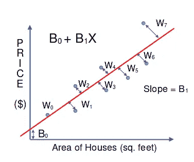
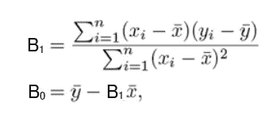

# 机器学习的概念|回归

> 原文：<https://medium.com/geekculture/linear-regression-465946664994?source=collection_archive---------25----------------------->

## 在本文中，我们将讨论简单的线性回归

Concept of Machine Learning | Introduction to Machine Learning

## 什么是回归？

一种用于估计因变量和自变量之间关系的统计监督学习技术。

## 因变量和自变量:

Example

这里 y 是因变量，X₁,X₂,X₃ ……，Xn 是独立变量。因变量也叫结果变量、反应变量，自变量也叫预测变量、解释变量。

## 线性回归:

线性回归是一种统计监督学习技术，通过与一个或多个自变量形成线性关系来预测因变量。

## 线性回归的类型:

1.  简单线性回归
2.  多元线性回归

## 1.简单线性回归

简单线性回归找出两个连续变量之间的线性关系，一个自变量，一个因变量。这两个变量之间的关系是一个直线方程。

例如，我们正在查找最近出售的房屋的 b/w 面积与其价格的关系:-

Datasets of Houses sold recently

在这个例子中，我们采用了一个小的房屋数据集，但在机器学习模型中，它们是大量的房屋。

现在，如果我们要预测一栋 300 平方英尺的房子的价格。ft，那怎么算？为此，我们必须找到房屋的 b/w 面积和价格之间的关系，通过这个关系，我们可以找到面积为 300 平方米的房屋的价格。制成

这就是回归的概念。

如果我们画出这些点，我们就找不到一条穿过所有点的直线。现在我们必须找到一条更接近所有点的线。因此，我们正在绘制许多线条。

Sq. Feet of House vs. Price

那么，哪条线最好？😢

为了找到最佳线，我们必须最小化残差平方和(RSS)。现在什么是 RSS？😧

## 普通最小二乘法或残差平方和(RSS):

假设 B₀ + B₁x 是最佳拟合线。那么 B₀,B₁的价值是什么呢？

为此，我们必须计算 RSS 最小值。

RSS = ∑Wᵢ

对于不同的圣线，即不同的 B₀,B₁值，RSS 是不同的。其中对于 B₀和 B₁来说，RSS 是最小最适合的行。

## 但是怎么找到这条线呢？😨

它可以通过求解超定方程组或梯度下降来找到。但这是一个简单的方法，对简单的线性回归有用。即

value of B0 and B1

对于这条 B0 和 B1 最好的线，我们将得到。该方法仅适用于简单线性回归，即单一特征。对于多重特征我们必须使用其他方法，稍后讨论。

## 为什么我们要取 RSS 的最小值呢？

仔细注意， **RSS 无非是机器学习模型**的错误。所以，如果我们把 B₀,B₁作为最小 RSS，我们会得到一个更好的结果，然后这里的误差是最低的。

## 为什么我们不拿下∑|Wᵢ|？

因为，y=|x|在 x=0 处不可微

## 全文系列:

 [## 机器学习的概念文章系列| Ujjwal Kar

### 回归入门|使用梯度下降的简单线性回归优化…

ujjwalkar.netlify.app](https://ujjwalkar.netlify.app/post/concept-of-machine-learning-tutorial-series/)