# 线性回归

> 原文：<https://medium.com/geekculture/linear-regression-939262ea5b83?source=collection_archive---------26----------------------->

## **什么是回归？**

回归是我们根据自变量预测某个因变量的值，它具有连续性。

让我们举一个例子，假设我们想预测一家公司的股价，我们知道许多因素影响股价。

source -mymoneysage

我们希望找到一个函数，在这些因素和股价之间建立联系。

## **线性回归**

说到机器学习中最简单化的模型，首先想到的就是线性回归。虽然与今天的现代算法相比，线性回归可能显得有些苍白，但它仍然是一种非常有用和广泛使用的统计学习方法。

**数学上的线性回归看起来像**

**其中:**

*   y 是我们的目标变量(因变量)
*   *β值称为*模型系数。这些值是在模型训练期间学习的。
*   *β0* 是截距
*   *β1，βn* 分别是 *X1，Xn 特征的系数。*

## **损失函数:**

当我们建立我们的模型时，我们主要关注最小化我们的估计预测的误差。这就是我们所认为的建立模型的规则。成本函数是测量误差平方和的函数。

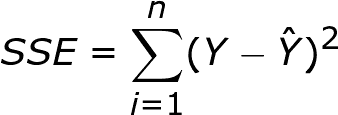

## **模型训练:**

模型训练是通过选择模型参数来定义特征和目标变量之间关系的过程。模型参数是函数常数，即 *β0，β1，β2…βn 等。*

我们如何计算这些参数？

高中的时候，我们学过，如何在微积分中计算一个函数的最优值。这里，我们想找出损失函数的最佳值，对于函数的最佳值，我们感兴趣的是找出函数参数。对于这个任务，有一个数学算法叫做**梯度下降**，我现在不打算详细介绍，但这里有一个它的概要:

*   从一些系数/参数值开始，例如 *β0* =0， *β1* =0
*   不断改变 *B0* 和 *B1* 以减少 J( *B0，B1* )，直到我们有希望达到最小值。

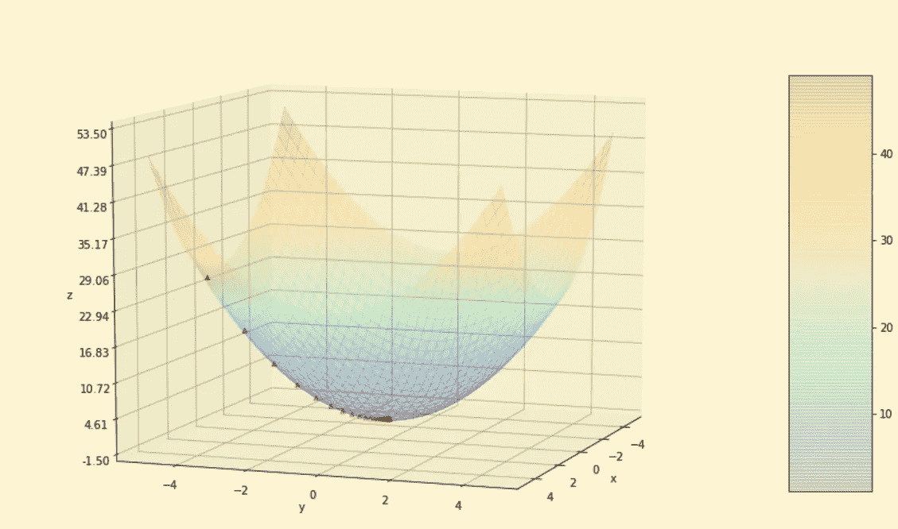

representative image of how we reach global minima starting from a random point by using **gradient descent**

## **线性回归的假设-**

*   因变量和自变量之间应该存在线性关系。
*   平均残差应该为零或接近零，这确保拟合的线是我们的*线**。***
*   *在我们的回归线周围应该有 ***同方差或等方差*** 。异方差正好与同方差相反，表示数据点在回归线上的不均匀分布。*

*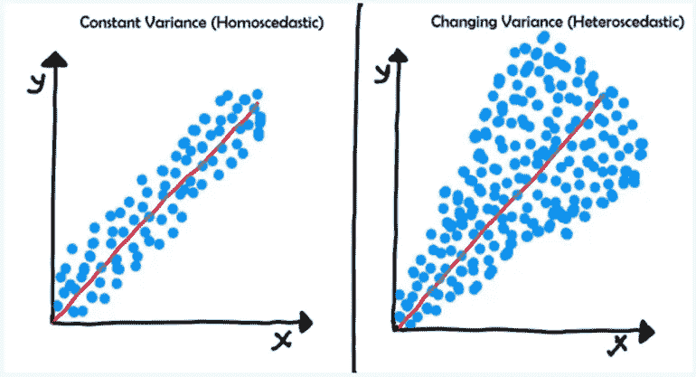*

*   *回归模型中不应有**多重共线性**。这意味着没有两个独立变量是相关的。简单地说，一个独立变量不应该从其他独立变量中预测出来。 ***VIF*** 是检测回归模型中是否存在多重共线性的常用工具。它测量估计回归系数的方差(或标准误差)因共线性而增大的程度。*

*VIF 可以通过下面的公式计算:*

**

*其中 **Ri2** 代表剩余变量中回归第 I 个自变量的未调整决定系数。VIF 的倒数被称为**公差**。VIF 或容差都可用于检测多重共线性，具体取决于个人偏好。*

## ***模型评估矩阵:***

*1.**均方误差(MSE):** 均方误差是拟合优度的绝对度量。*

*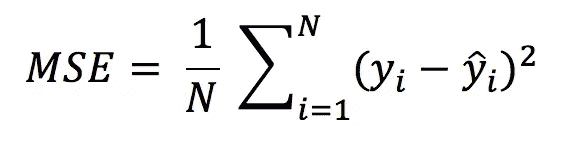*

*均方差公式*

*MSE 是通过预测误差的平方和(实际输出减去预测输出)然后除以数据点数来计算的。它给你一个绝对的数字，告诉你你的预测结果与实际数字有多大的偏差。您无法从一个单一的结果中解读许多见解，但它给了您一个真实的数字来与其他模型结果进行比较，并帮助您选择最佳的回归模型。*

***2。****【RMSE】均方根误差**是 MSE 的平方根。它比 MSE 更常用，因为首先有时 MSE 值可能太大而不容易比较。第二，MSE 是通过误差的平方计算的，因此平方根使它回到预测误差的相同水平，并使它更容易解释。*

*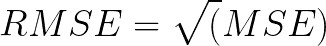*

***3。平均绝对误差(MAE):***

*平均绝对误差(MAE)类似于均方误差(MSE)。然而，MAE 取的不是 MSE 中误差的平方和，而是误差绝对值的和。*

*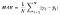**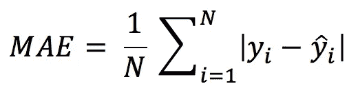*

*平均绝对误差公式*

*与均方误差或 RMSE 相比，平均误差是误差项总和的更直接表示。 **MSE 通过平方对大的预测误差给予较大的惩罚，而 MAE 对所有误差一视同仁**。*

***4。** **R 方/调整后的 R 方:***

*r 平方衡量模型可以解释因变量的多少可变性。它是相关系数(R)的平方，这就是它被称为 R 平方的原因。*

*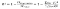****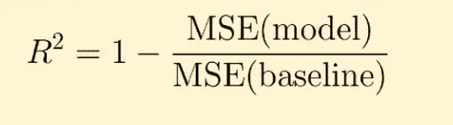*

*r 平方公式*

*通过预测误差的平方和除以用平均值代替计算预测的平方和来计算 r 平方。r 平方值在 0 到 1 之间，较大的值表示预测值和实际值之间的拟合较好。*

*r 平方是确定模型拟合因变量的好方法。然而，它没有考虑过拟合问题。如果您的回归模型有许多独立变量，由于模型太复杂，它可能非常适合定型数据，但对于测试数据来说表现很差。这就是引入调整后的 R 平方的原因，因为它将惩罚添加到模型中的额外独立变量，并调整度量以防止过度拟合问题。*

***范围:***

*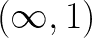*

*它通常取(0，1)之间的值。*

****解释 R :*** 如果 R 值为 0.8，则意味着目标变量的 80%方差可以从自变量的方差中预测出来。*

***5。调整后的 R :***

*它与 R 得分非常相似，但是调整后的 R 不会遇到这样的问题，即得分随着特征(独立变量)的增加而提高，这与 R 正好相反。*

*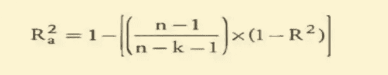*

*其中:*

*n =观察次数*

*k =独立变量的数量*