# 实践中的线性回归算法

> 原文：<https://medium.com/geekculture/linear-regression-algorithm-in-practice-526ce0e4b1d5?source=collection_archive---------43----------------------->

什么是线性回归算法，以及如何在回归任务中使用它。

Photo by [Stary Smok](https://unsplash.com/@starysmok?utm_source=medium&utm_medium=referral) on [Unsplash](https://unsplash.com?utm_source=medium&utm_medium=referral)

# 介绍

回归分析是在给定解释变量的情况下预测响应变量的过程。响应变量也称为因变量，解释变量称为自变量。给定一个问题陈述，当有多个解释变量和一个响应变量时，那么这个过程称为**多元线性回归**。相反，如果一个问题陈述只包含一个解释变量和一个响应变量，则称为**简单线性回归**。

**注** —为了实施回归分析，需要在解释变量和响应变量之间建立强有力的关系。

与预测类别标签(在分类任务中)不同，这里我们预测新的看不见的数据的真实值(连续值)。

# 数学模型

让我们将响应变量表示为`y`，将解释变量表示为`X`。这里的`X`，既可以取单个特征，也可以取多个特征。

在`X`有一个特征的情况下，模型将是-

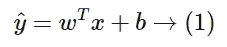

在`X`有多个特征的情况下，模型将是-

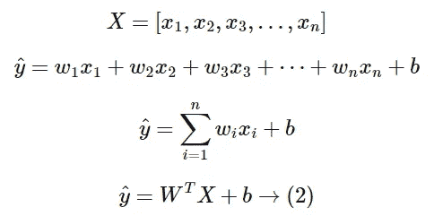

数学模型(1)用于简单的线性回归任务，而(2)用于多重线性回归任务。在这两种情况下，响应变量`y^`都是目标特征。

实际的响应变量表示为`y`，我们都知道机器学习模型无法非常准确地预测。如果它不能准确预测，它肯定包含一个错误。因此，现在的主要焦点转移到使误差尽可能小。

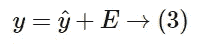

将(3)中的(1)代入简单线性回归，我们得到-

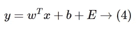

将(3)中的(2)代入多元线性回归，我们得到-

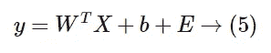

误差`E`是实际目标特征和预测目标特征之间的差异。

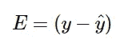

一切都写得很好，除了两件事还不知道。这两个东西就是参数`w`和`b`。模型中的误差取决于这两个参数值。这里，`w`是系数，`b`是截距。我们不能简单地为`w`和`b`分配随机值。相反，应该借助随机梯度下降过程明智地选择它们。

# 随机梯度下降

为了理解最优化，让我们考虑模型方程(1)。

SGD 是一个迭代过程，我们最初为`w`和`b`分配随机值(可能是 0)。在每次迭代中，

*   对于`w`，我们相对于`w`微分(1)，得到`dw`。
*   对于`b`，我们相对于`b`微分(1)，得到`db`。

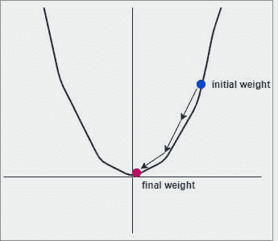

Image by Author

数学上，它可以表示为-

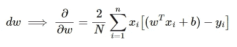

和

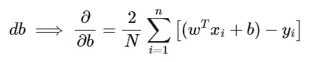

我们在每次迭代中分别用`dw`和`db`更新/替换实际的`w`和`b`，直到这些值没有完全最小化。更新过程可以按以下方式理解。

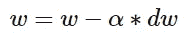

和

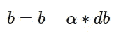

整个过程对于获得模型方程(2)的最小值`W`和`b`是相同的。

现在我们已经理解了完整的过程，让我们从头开始实现同样的过程。

# 线性回归—代码

我们将一如既往地从导入必要的库开始。

## 图书馆

## 数据创建

现在，我们将依赖于一个玩具数据集，我们可以通过模块`sklearn`轻松地创建它。

## 数据分离器

我们需要将数据分成两部分——`training`集合和`testing`集合。我们通过一个随机的分裂函数来实现。

**列车试分裂**

## 建筑

回归的名字是`LinearRegression`，它是一个我们定义其他方法的类。

## `__init__()`方法

上面的方法是一个接受五个参数的构造函数

*   `train_df` →指用于训练回归变量的数据子集。
*   `test_df` →指用于测试回归变量的数据子集。
*   `label` →指的是一系列数据，实际上是类标签的列名。
*   `lambda_` →指在 SGD 过程中用于更新参数的常数。
*   `n_iters` →指用于决定 SGD 过程总迭代次数的常数。

## `split_features_targets()`方法

上述方法用于从数据中分离特征和目标。它需要两个参数-

*   `df` →指通过分类的整个数据集。
*   `label` →指的是`df`的系列，其实就是类标签的列名。

## `diff_params_wb()`法

上述方法用于区分参数。它需要两个参数-

*   `w` →指 SGD 过程中使用的初始权重向量。
*   `b` →指 SGD 过程中使用的初始截距值。

## `find_best_params()`方法

上述方法用于获得参数`w`和`b`的最佳(最小)值。它不需要参数。该方法遵循 SGD 的过程，迭代更新`w`和`b`的初始值。

## `predict()`方法

上述方法用于预测新的看不见的数据的真实(连续)值。它有两个参数(可选)

*   `with_plot` →指一个布尔值，决定是否绘制最佳拟合线和数据点。
*   `save_process` →表示一个布尔值，决定是否以`GIF`格式保存 SGD 的进程。

默认情况下，这些功能参数采用`False`值，因此是可选的。

## `save_process_togif()`方法

以上方法用于以`GIF`的形式保存 SGD 的进程。它需要两个参数-

*   `test_x` →需要预测目标的特征。
*   `test_y` →指实际目标值。

## `score()`方法

上面的方法用于计算 R。它需要一个参数-

*   `preds` →指用于计算 R 的预测值。

**完整代码**

# 线性回归—测试

我们已经创建了一个玩具数据集。我们只需要在这些数据上测试模型。

**注意**:我们创建的数据是随机的。每次执行的结果可能不同。

## 对象创建

## 砝码

## 拦截

## 预言；预测；预告

**训练&测试地块**

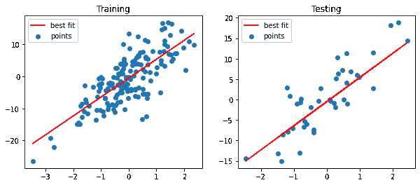

Image by Author

回归线充分穿过数据点。

**SGD 流程演示**

测试值用于执行 SGD 过程。随着每次迭代`w`和`b`的值改变，最佳拟合线相应地改变，并且在某个点，该线停止改变，这基本上意味着我们已经得到了`w`和`b`的最小值。

## 绩效得分

对于形状为`(200, 2)`的数据，精度几乎为`69%`。如果我们获取/创建了大量数据，那么就会有一些变化。

# 挑战

嗯，整个代码都是从头开始开发的，从性能上来说，肯定不如库方法高效。但是，理解这项工作背后的数学是很好的。

*   我的代码很慢。
*   尽管有各种类型的正则化，但没有实现正则化。
*   使用 **L1** 正则化的线性回归被称为**岭回归**。
*   带有 **L2** 正则化的线性回归被称为**套索回归**。
*   同时具有 **L1** 和 **L2** 正则化的线性回归被称为**弹性回归**。
*   如果数据中存在异常值，可能会对模型产生重大影响。

# 参考

*   YouTube 视频→[bit.ly/2TRmnxd](https://bit.ly/2TRmnxd)
*   维基百科文章→[en.wikipedia.org/wiki/Linear_regression](https://en.wikipedia.org/wiki/Linear_regression)

**结束**