# 线性回归速成班

> 原文：<https://medium.com/geekculture/linear-regression-crash-course-f6cd3dddb9b7?source=collection_archive---------7----------------------->

## 线性回归、假设和其他概念

线性回归通常被视为对两个变量之间的关系进行建模的线性方法，其中一个变量是独立的，另一个变量是相关的。当测量一个以上变量的关系时，通常被称为多元回归。

说到数据科学，线性回归是最基本的统计方法之一。

写线性方程最简单的方法是:


Credit: [https://www.r-bloggers.com/2020/12/machine-learning-with-r-a-complete-guide-to-linear-regression/](https://www.r-bloggers.com/2020/12/machine-learning-with-r-a-complete-guide-to-linear-regression/)

𝛽0 是与 y 轴的截距，其中𝛽1 表示直线的斜率。x 是在轴上移动的单位数。

这个公式概括了一个线性关系。这可以扩展或更改为更“复杂”的模型，以便更好地适应。这些模型包括二次方程或多项式函数。作为一名数据科学家，在线性回归被攻克后，你会很快了解到这些。

在统计学习的背景下，这里和通篇呈现的两种类型的数据是自变量和因变量。

自变量是无法控制的数据。自变量通常是预测变量、解释变量、特征或输入变量。

因变量是可以直接控制的数据，因此有关系。因变量通常是“Y”、结果变量、目标变量或响应变量。

自变量导致因变量的变化。

线性回归是一种统计模型，在这种情况下，可以将它视为一种转换方式，通过这种方式可以帮助表达预测或结果变量。(因变量)。

为了做一个线性回归模型，它需要满足‘最小二乘回归假设’。因为回归模型从它们的参数中学习，所以必须做出某些假设。这些构成了回归分析的范围，必须满足才能做回归模型。这三个假设是线性、正态和同方差。

1.  **线性度**。它必须显示响应变量和结果变量之间的线性关系。在这种情况下，术语“线性”指的是 Y 中的常数变化乘以 x 中的 n 单位变化。


Credit: [https://www.khanacademy.org/math/statistics-probability/describing-relationships-quantitative-data/introduction-to-scatterplots/a/scatterplots-and-correlation-review](https://www.khanacademy.org/math/statistics-probability/describing-relationships-quantitative-data/introduction-to-scatterplots/a/scatterplots-and-correlation-review)

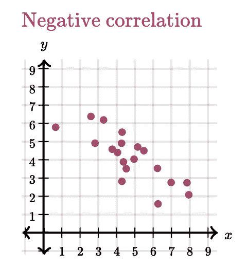

Credit: [https://www.khanacademy.org/math/statistics-probability/describing-relationships-quantitative-data/introduction-to-scatterplots/a/scatterplots-and-correlation-review](https://www.khanacademy.org/math/statistics-probability/describing-relationships-quantitative-data/introduction-to-scatterplots/a/scatterplots-and-correlation-review)

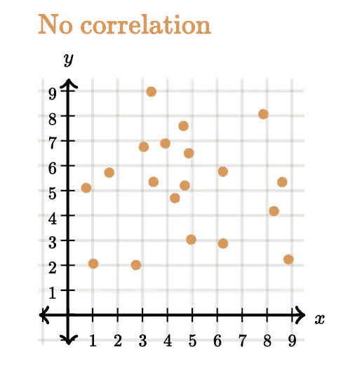

Credit: [https://www.khanacademy.org/math/statistics-probability/describing-relationships-quantitative-data/introduction-to-scatterplots/a/scatterplots-and-correlation-review](https://www.khanacademy.org/math/statistics-probability/describing-relationships-quantitative-data/introduction-to-scatterplots/a/scatterplots-and-correlation-review)

线性假设很重要，尤其是在进行普通最小二乘(OLS)汇总时。(下面会解释这个概念)。

如果没有线性关系，那么 OLS 将无法描述任何数学趋势。

当观察一个图像时，确定是否有异常值要容易得多。这是应该经常采取的额外措施。离群值会对回归模型产生巨大的影响。

2.**常态**。正态假设是表明模型中的残差遵循标准正态分布的假设。正态假设是一个必须遵循的假设。

检验正态性假设的最简单方法是直方图。下面我将简单谈谈用来测试这一点的 Q-Q 图。

3.**同方差**。不仅仅是一个大词，而是一种表明自变量之间因变量相等的方式。这是进行线性回归模型所必需的第三个假设。下面，重要的是要看到所有的点“有相同的分散”。这里我们不看最佳拟合线，而是看数据点的趋势，以及它们与该线的距离如何大致相同。

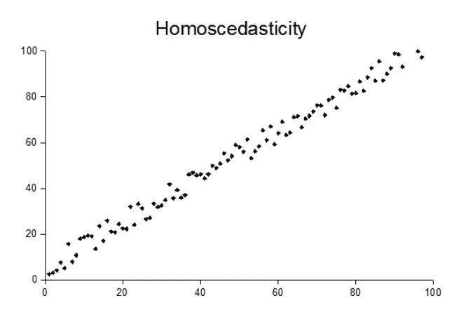

Credit: [https://www.statisticshowto.com/homoscedasticity/#:~:text=The%20assumption%20of%20equal%20variances,)%20and%20Student's%20T%2DTest](https://www.statisticshowto.com/homoscedasticity/#:~:text=The%20assumption%20of%20equal%20variances,)%20and%20Student's%20T%2DTest).

除了必须满足的假设之外，线性回归中还引入了多个概念，这些概念对于实践和用作更复杂模型的框架极其重要。这些概念是:

**决定系数** : R 平方，也称为决定系数，是一种用于评估回归模型拟合优度的方法。这在评估一个人的模型时很重要，因为它有助于减少任何偏差。一条直线不能完全描述其变量之间的关系。

R-squared 有一个简单而有效的基线模型。基线模型根据观察到的因变量响应的平均值来预测值，而不是使用自变量。

R-squared 根据线性回归的平方误差进行测量，然后拟合基线模型。

公式是:

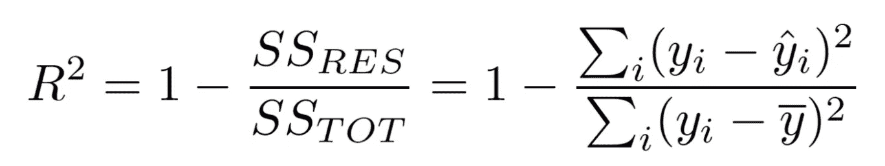

Credit: [https://medium.com/@erika.dauria/looking-at-r-squared-721252709098](/@erika.dauria/looking-at-r-squared-721252709098)

其中，SS_RES 是误差平方和的残差。它是 y 和 y hat 的平方差(预测的 y 值)。

SS_TOT 是误差平方和的总和。它是 y 和 y 条的平方差(样本 y)。

从本质上讲，r 平方是由“1——模型无法解释的方差的比例”导出的。这意味着我们想要最大化 r 平方的分数。最差值为 0。

r 平方值介于 0 和 1 之间。接近 0 的值表示不太适合，接近 1 的值表示“完美”适合。

**普通最小二乘**:普通最小二乘是一个自动化的度量测试，来自一个名为`statsmodels.` Statsmodels 的 Python 包，它提供了不同统计模型的负载，并进行统计测试。

普通最小二乘法(OLS)是一个很好的指标，也有助于测试线性回归。这是一种帮助估计回归模型中未知参数的方法。它减少了由它计算的线性回归估计值预测和观察到的值之间的距离平方和。

OLS 在数据科学社区中被广泛使用，尤其是在回归实验中。OLS 还在预测的背景下研究非正态分布。

Q-Q 图:Q-Q 图是针对标准正态分布使用的可视化。Q-Q 图检验了正态性假设。这种假设旨在直观地观察数据点是否偏离红线。通过从已运行的模型中获得误差项(残差)来评估该测试，然后根据正态分布绘制。如果数据点接近直线，则可以认为正态性假设已经满足。

Q-Q 图是评估回归模型的另一种方法。

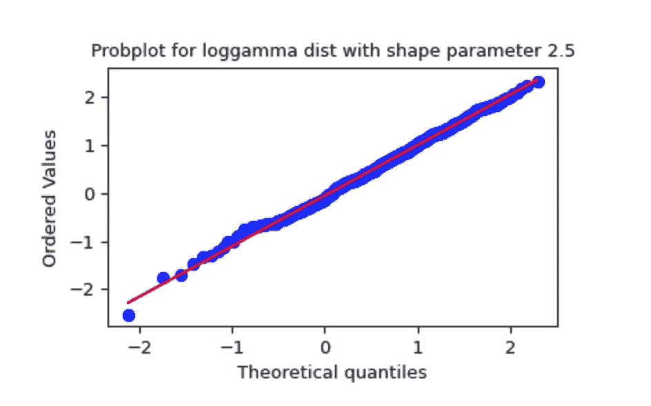

Credit: [https://docs.scipy.org/doc/scipy/reference/generated/scipy.stats.probplot.html](https://docs.scipy.org/doc/scipy/reference/generated/scipy.stats.probplot.html)

**解释显著性和 P 值**。显著性水平是对样本数据中必须存在的证据强度的一种度量，在此基础上，我们可以拒绝零假设，并得出结论，我们测试的结果具有统计学显著性。这也表示为α或α。显著性水平是当零假设为真时拒绝零假设的概率。标准的α值通常是 0.05，这表明有 5%的风险说存在差异，而实际上没有实际差异。

与α相比较的 p 值是表明总体的零假设是否成立的概率。p 值来自样本数据，并假设零假设为真。较低的 p 值表明有更多的证据拒绝零假设。

显著性和 p 值是分析回归模型的其他方法。进行 OLS 时，可以很容易地找到显著性值。

# 一个走过的例子

线性回归是根据其他变量预测值的一个很好的工具。

除了上面的速成课程，我将做一个回归模型的演练例子。

我决定选择一个基于房地产价格预测的数据集。该数据来自[https://www . ka ggle . com/quant Bruce/real-estate-price-prediction](https://www.kaggle.com/quantbruce/real-estate-price-prediction)。有 414 个数据条目和八列。

该数据集相对较小，纯粹用于应用和解释实践。

这 8 列是:

1.  不
2.  X1 交易日期
3.  X2 房屋时代
4.  X3 到最近的捷运站的距离
5.  X4 便利店数量
6.  X5 纬度
7.  X6 经度
8.  y 单位面积房价

我将通过首先导入必要的包和数据来开始本演练。在那里，我将进行一些探索性的数据分析。然后，我将创建一个基线模型，然后进行相应的调整和数据建模。然后我会解释我的结果。

```
#start by importing the necessary libraries
import numpy as np import pandas as pdimport matplotlib.pyplot as plt
∞matplotlib inline
import seaborn as snsfrom sklearn.model_selection import train_test_splitimport statsmodels.api as sm
from sklearn.model_selection import train_test_split, KFold, cross_validate
from sklearn.linear_model import LinearRegression
```

导入数据并检查

data = pd.read_csv('../linear regression/Real estate . CSV ')
print(data . shape)
print(data . keys())
data . head()

在单元运行之后，应该会出现这样的输出。

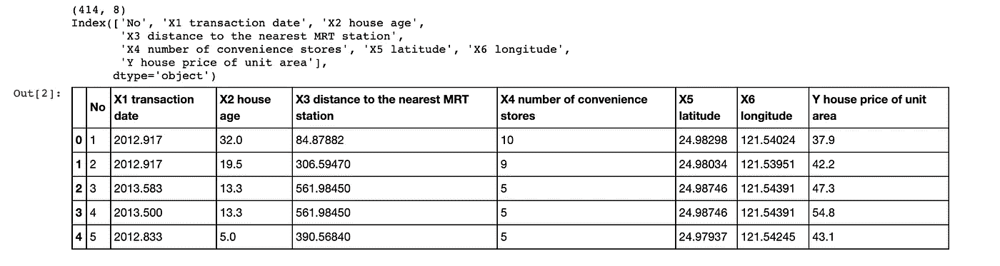

Credit: [https://github.com/anilaq/linearregression/blob/main/linear_regression.ipynb](https://github.com/anilaq/linearregression/blob/main/linear_regression.ipynb)

## 数据、清理和探索

我想删除任何空值。

```
#remove null values
data = data.dropna()
print(data.shape)
```

这将我的数据减少到(414，8)。

我现在想看看数据类型。

```
data.dtypes
```


Credit: [https://github.com/anilaq/linearregression/blob/main/linear_regression.ipynb](https://github.com/anilaq/linearregression/blob/main/linear_regression.ipynb)

我现在想检查重复的内容。这是有争议的，因为一栋房子可以出售不止一次。此外，房屋出售时的价格可能会因多种因素而变化。

```
#checking for duplicates
data_duplicates = data.duplicated
data_duplicates.shape()
```

这里的输出是相同的，没有重复。

我想知道是否有分类变量。

```
#I will create subplits of the features against the price to identify categorical variables
fig, axes = plt.subplots(nrows=1, ncols=6, figsize=(18,5))

**for** xcol, ax **in** zip(data[['X1 transaction date','X2 house age','X3 distance to the nearest MRT station','X4 number of convenience stores', 'X5 latitude', 'X6 longitude']], axes):
    data.plot(kind='scatter', x=xcol, y='Y house price of unit area', ax=ax, alpha=0.4, color='r')
```

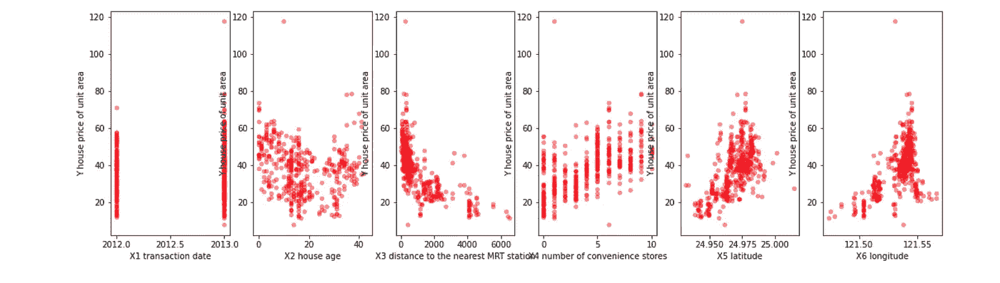

Credit: [https://github.com/anilaq/linearregression/blob/main/linear_regression.ipynb](https://github.com/anilaq/linearregression/blob/main/linear_regression.ipynb)

```
*#checking the distribution*
print('Median House Age: ', data['X2 house age'].median())
print('Median Price Per Square Foot: $', data['Y house price of unit area'].median())
```

房子的年龄中位数是 16 岁。每平方英尺的中间价格是 38.45 美元。

我们来看看单位面积的价格是如何分布的。我将为这个可视化使用直方图。

```
fig, ax = plt.subplots(figsize=(12,8))

sns.kdeplot(data['Y house price of unit area'], shade=**True**, color='navy',alpha=0.8)
sns.despine()

plt.yticks([])
ax.tick_params(axis='both', which='major', labelsize=15)

ax.set_title('House Price Per Unit Area Distribution', fontsize=25, loc='center', weight='bold', pad=20)
ax.set_xlabel('Price ($)', fontsize=18, weight='bold')
ax.set_ylabel('Count', fontsize=18, weight='bold')

plt.xlim(0,200)
```

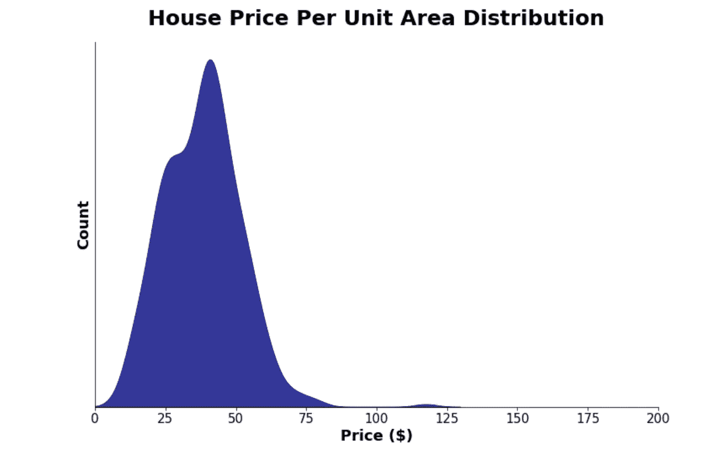

Credit: [https://github.com/anilaq/linearregression/blob/main/linear_regression.ipynb](https://github.com/anilaq/linearregression/blob/main/linear_regression.ipynb)

现在我想更仔细地看看特征变量。我将通过检查多重共线性来做到这一点。

```
*#Multicollinearity* 
data_multicollinearity = data.drop(['No'], axis = 1)

fig, ax = plt.subplots(figsize=(16,10))
sns.heatmap(data_multicollinearity.corr(), center=0, annot=**True**)

ax.set_title('Feature Correlation Matrix', fontsize=25, loc='center', weight='bold', pad =15)
ax.set_xlabel('Features', fontsize = 14, weight='bold')
ax.tick_params(axis='both', which='major', labelsize=13)

plt.autoscale()
plt.show()
```

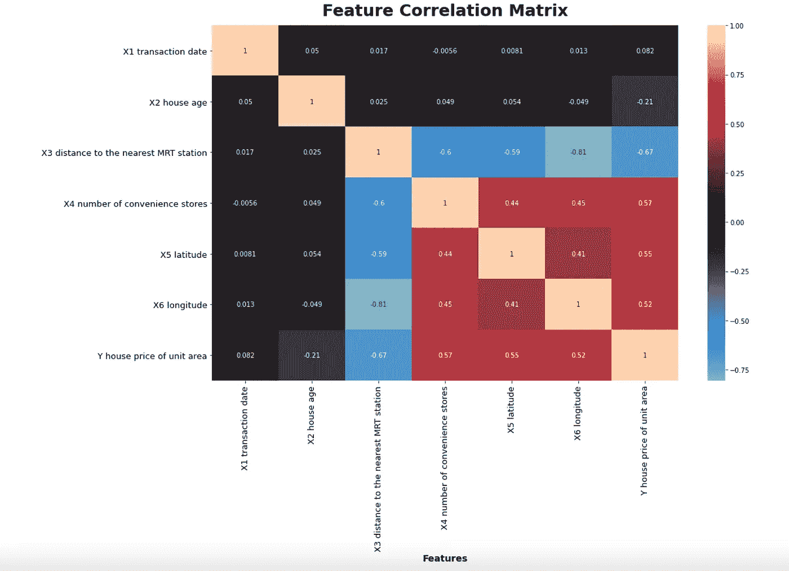

Credit: [https://github.com/anilaq/linearregression/blob/main/linear_regression.ipynb](https://github.com/anilaq/linearregression/blob/main/linear_regression.ipynb)

我现在想做一个箱线图，显示特征的方差随着它的增加而增加(这与异方差有关，我们需要在后面的步骤中注意)

```
var = 'X4 number of convenience stores'
feature_var_data = pd.concat([data['Y house price of unit area'], data[var]], axis=1)

f, ax = plt.subplots(figsize=(14, 10))
fig = sns.boxplot(x=var, y = 'Y house price of unit area', data=feature_var_data, palette='dark')

ax.set_title('Feature Variance: ', fontsize=25, loc='center', weight='bold', pad=10)
ax.set_xlabel('X4 number of convenient stores', fontsize=14, weight='bold')
ax.set_ylabel('Y house price of unit area', fontsize=14, weight='bold')
ax.tick_params(axis='both', which='major', labelsize=13)

sns.despine()
fig.axis(ymin=0, ymax=120);
```

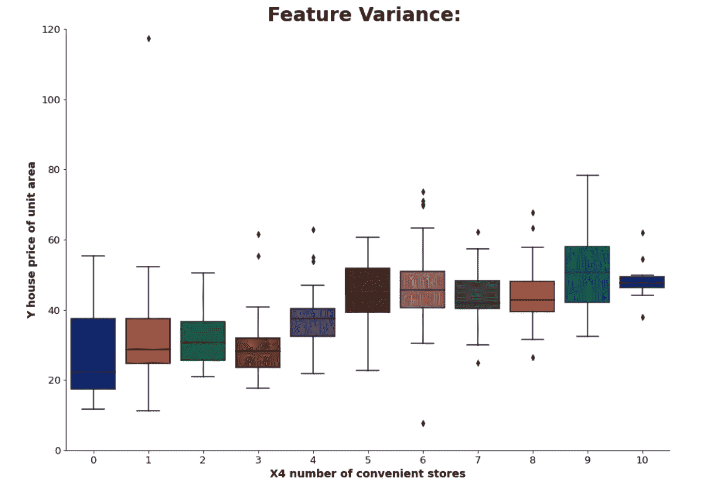

Credit: [https://github.com/anilaq/linearregression/blob/main/linear_regression.ipynb](https://github.com/anilaq/linearregression/blob/main/linear_regression.ipynb)

## 数据建模

```
*# X variables will contain our continuous and discrete features - we drop the dependent as well as non-predictors*
X_base = data.drop(['Y house price of unit area'], axis = 1)

*# Y variable is the dependent variable - what we want to predict*
Y_base = data[['Y house price of unit area']]
```

现在我的火车测试分裂。我会一直做 80/20 分割！

```
X_train_original, X_test_original, Y_train_original, Y_test_original = train_test_split(X_base, Y_base, test_size=.2, random_state=7)
X_train = X_train_original.copy()
X_test = X_test_original.copy()
Y_train = Y_train_original.copy()
Y_test = Y_test.copy()

print(X_train.shape)
print(X_test.shape)
print(Y_train.shape)
print(Y_test.shape)
```

(331, 7)

(83, 7)

(331, 1)

(83, 1)

接下来，我将为我的普通最小二乘法添加一个常数，并将斜率和截距拟合到我的模型中。

```
*#Statsmodels for Ordinary Least Square for the training set*
*#adding in a constant to fit both the slope and intercept*
X_train_constant = sm.add_constant(X_train)
base_training_model = sm.OLS(Y_train, X_train_constant);training_results = base_training_model.fit()
```

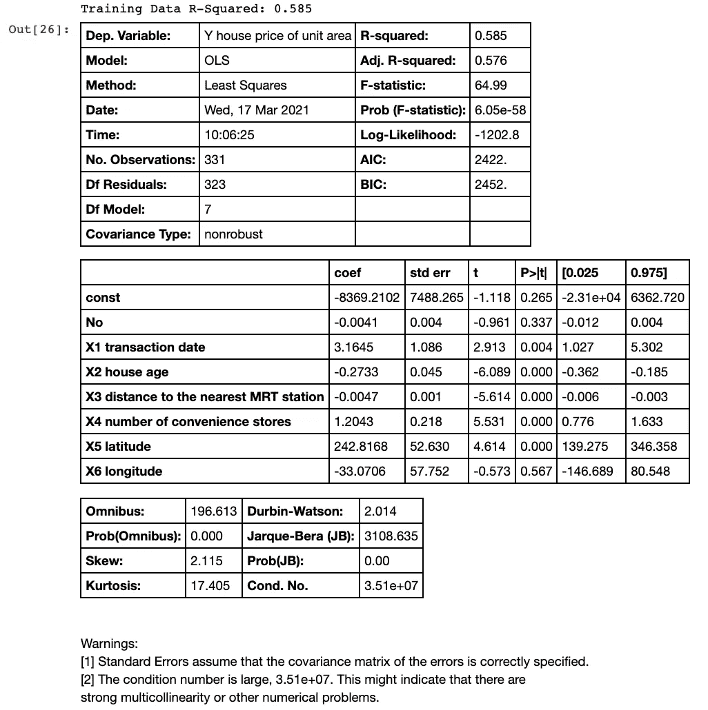

Credit: [https://github.com/anilaq/linearregression/blob/main/linear_regression.ipynb](https://github.com/anilaq/linearregression/blob/main/linear_regression.ipynb)

训练模型返回 0.585 的 r 平方，这不是一个理想的分数。好的一面是，它没有过度拟合。让我们看看我是否能改进这一点。

## 评估和重新定义模型。

根据汇总表中的 p 值，我可以看到存在无关的要素。我只想选择 p 值小于 0.05 的要素。

```
*#discarding features with p-values less than .05*
base_summary = training_results.summary()
base_p_table = base_summary.tables[1]
base_p_table = pd.DataFrame(base_p_table.data)
base_p_table.columns = base_p_table.iloc[0]
base_p_table = base_p_table.drop(0)
base_p_table = base_p_table.set_index(base_p_table.columns[0])

base_p_table['P>|t|'] = base_p_table['P>|t|'].astype(float)
x_cols = list(base_p_table[base_p_table['P>|t|'] < 0.05].index)*#x_cols.remove('const')*
print(len(base_p_table), len(x_cols))
print(x_cols)
```


Credit: [https://github.com/anilaq/linearregression/blob/main/linear_regression.ipynb](https://github.com/anilaq/linearregression/blob/main/linear_regression.ipynb)

我现在将重新调整新的特征子集。

```
X_train = X_train[x_cols]
Y_train = Y_train[['Y house price of unit area']]X_train_const = sm.add_constant(X_train)
base_training_model = sm.OLS(Y_train, X_train_const)results1= base_training_model.fit()print("Training Data R-Squared", round(results1.rsquared,3)) results1.summary()
```

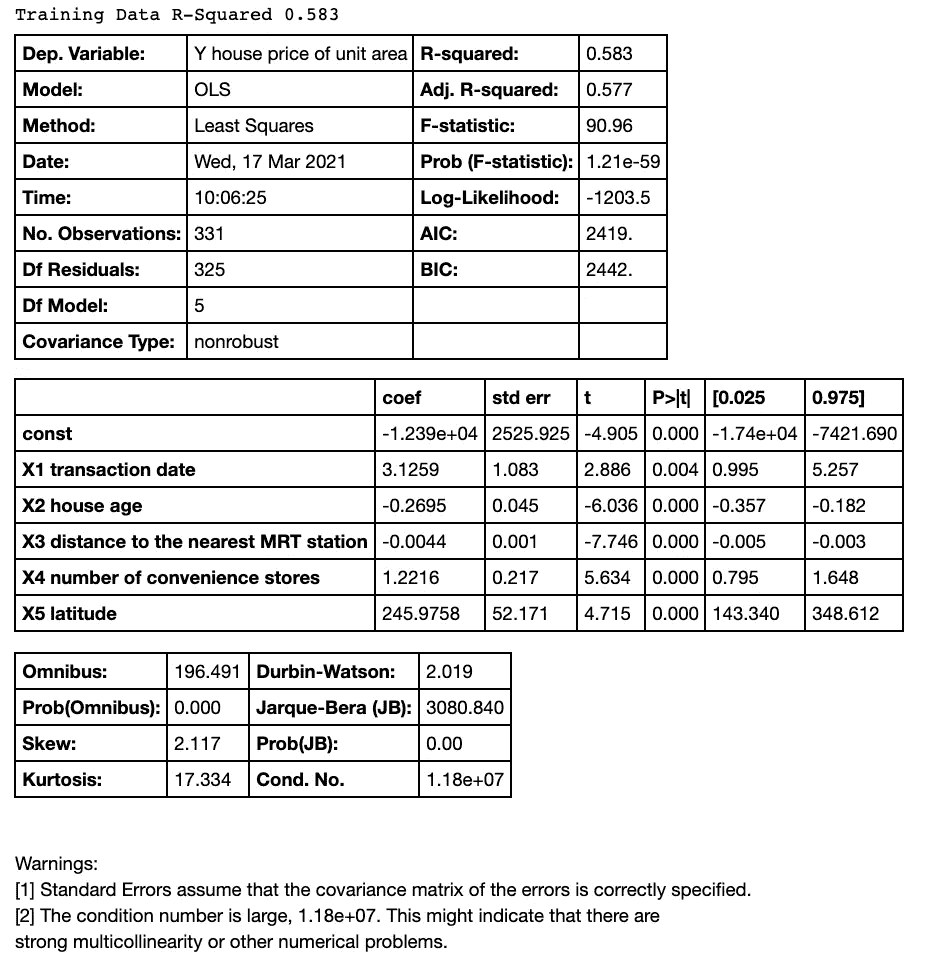

Credit: [https://github.com/anilaq/linearregression/blob/main/linear_regression.ipynb](https://github.com/anilaq/linearregression/blob/main/linear_regression.ipynb)

我将执行另一个多重共线性测试，但这次我将使用方差膨胀因子。

```
**from** **statsmodels.stats.outliers_influence** **import** variance_inflation_factor*#Here I will perform a variance inflation factor test to identify features that display multicollinearity* X = data[x_cols] vif = [variance_inflation_factor(X.values, i) **for** i **in** range(X.shape[1])] list(zip(x_cols, vif))
```

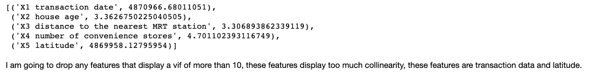

Credit: [https://github.com/anilaq/linearregression/blob/main/linear_regression.ipynb](https://github.com/anilaq/linearregression/blob/main/linear_regression.ipynb)

```
x_cols.remove(‘X1 transaction date’) 
x_cols.remove(‘X5 latitude’)x_cols
```

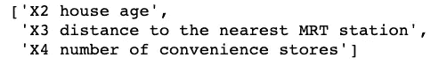

Credit: [https://github.com/anilaq/linearregression/blob/main/linear_regression.ipynb](https://github.com/anilaq/linearregression/blob/main/linear_regression.ipynb)

```
*#refit with subset features*
X_train = X_train[x_cols]
Y_train = Y_train[['Y house price of unit area']]X_train_const = sm.add_constant(X_train)
base_training_model = sm.OLS(Y_train, X_train_const);results2 = base_training_model.fit()print("Training Data R-Squared:", round(results2.rsquared,3))
results2.summary()
```

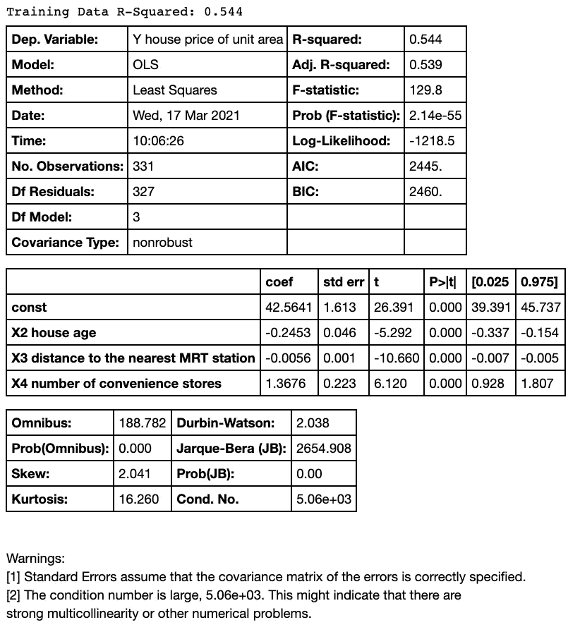

Credit: [https://github.com/anilaq/linearregression/blob/main/linear_regression.ipynb](https://github.com/anilaq/linearregression/blob/main/linear_regression.ipynb)

我的模型达到了 0.544 的 r 平方，这进一步打击了我的准确性得分，但我也删除了与一个数字高度相关的特征。

我现在要尝试建立一个自下而上的模型。

```
*#recall the original 80/20 split for train and test data* X_train, X_test, Y_train, Y_test = train_test_split(X_base, Y_base, test_size=.2, random_state=42) print(X_train.shape) print(Y_train.shape)
```

(331, 7) (331, 1)

```
*Select features that are known to predict house prices within a strong degree of accuracy and taking into account* 
*#multicollinearity*
X_train = X_train[['X2 house age', 'X3 distance to the nearest MRT station', 'X4 number of convenience stores']]
Y_train = Y_train[['Y house price of unit area']]
X_test = X_test[['X2 house age', 'X3 distance to the nearest MRT station', 'X4 number of convenience stores']]
Y_test = Y_test[['Y house price of unit area']]X_train_const = sm.add_constant(X_train)
base_training_model = sm.OLS(Y_train, X_train_const);results3 = base_training_model.fit()results3.summary()
```

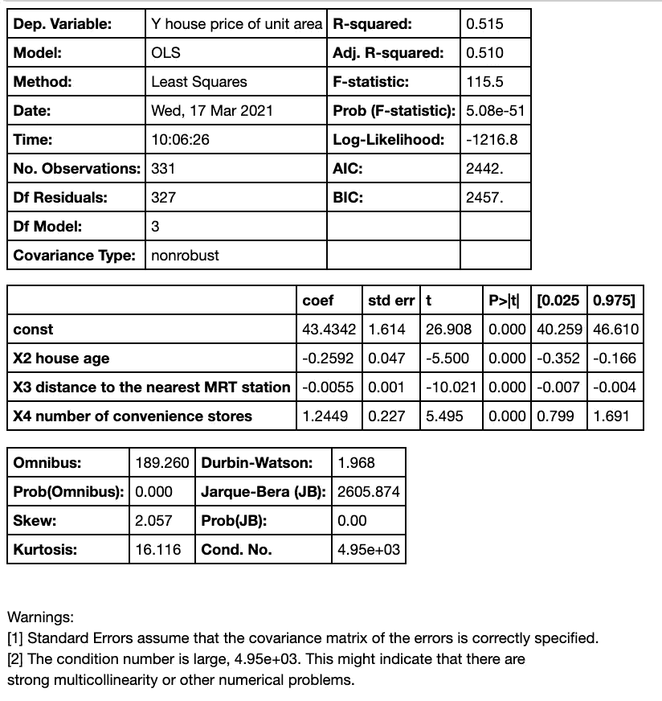

Credit: [https://github.com/anilaq/linearregression/blob/main/linear_regression.ipynb](https://github.com/anilaq/linearregression/blob/main/linear_regression.ipynb)

我的模型的性能甚至比以前更低。这是在去掉额外的变量之后。

我现在要检查一下这篇文章开头提到的假设。

```
*#I now want to check for the normality assumption*
**import** **scipy.stats** **as** **stats**
fig == sm.graphics.qqplot(results3.resid, dist=stats.norm, line='45', fit=**True**)
```

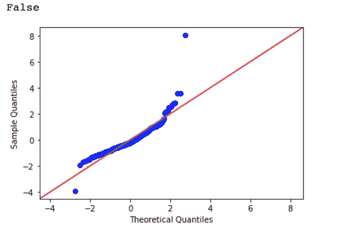

Credit: [https://github.com/anilaq/linearregression/blob/main/linear_regression.ipynb](https://github.com/anilaq/linearregression/blob/main/linear_regression.ipynb)

在这里，正态假设似乎成立，但看起来有异常值。

```
*#I want to check for homoscedasticity*
plt.scatter(results3.predict(X_train_const), results3.resid)
plt.plot(results3.predict(X_train_const), [0 **for** i **in** range(len(X_train_const))])
plt.show()
```

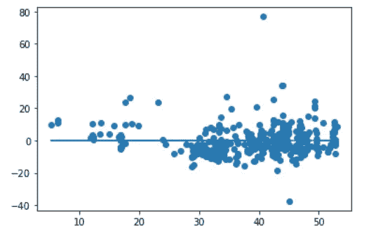

Credit: [https://github.com/anilaq/linearregression/blob/main/linear_regression.ipynb](https://github.com/anilaq/linearregression/blob/main/linear_regression.ipynb)

在这里，同方假设被违反了。

这表明我的数据并不具有线性关系。

我现在将删除异常值，看看是否有帮助。

```
df_outliers = pd.concat([X_train, Y_train], axis=1)

**for** i **in** range (80,100): 
    q = i/100
    print("**{}** percentile: **{}**".format(q, Y_train['Y house price of unit area'].quantile(q=q)))

Y_train['Y house price of unit area'].hist()
plt.show
```

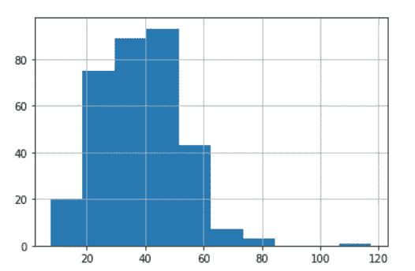

Credit: [https://github.com/anilaq/linearregression/blob/main/linear_regression.ipynb](https://github.com/anilaq/linearregression/blob/main/linear_regression.ipynb)

```
*#I will now drop everything past the 99 percentile* 
original_total = len(df_outliers)
df_outlier_dropped = df_outliers[df_outliers['Y house price of unit area'] < 73.0] *#subsetting to remove outliers*
print("Percent removed:", (original_total - len(df_outlier_dropped))/original_total)
df_outlier_dropped['Y house price of unit area'].max()

X_train = df_outlier_dropped.drop(['Y house price of unit area'], axis=1)
Y_train = df_outlier_dropped['Y house price of unit area']
```

移除的百分比:0.01。56860.68868868661

```
*#Now I will use my training data where I have dropped my outlier data and use it on my best performing model* 
*# this is the refined baseline model* 
X_train = X_train[x_cols]
Y_trainX_train_const = sm.add_constant(X_train)
base_training_model = sm.OLS(Y_train, X_train_const);results4 = base_training_model.fit()print(round(results4.rsquared,3))
results4.summary()
```

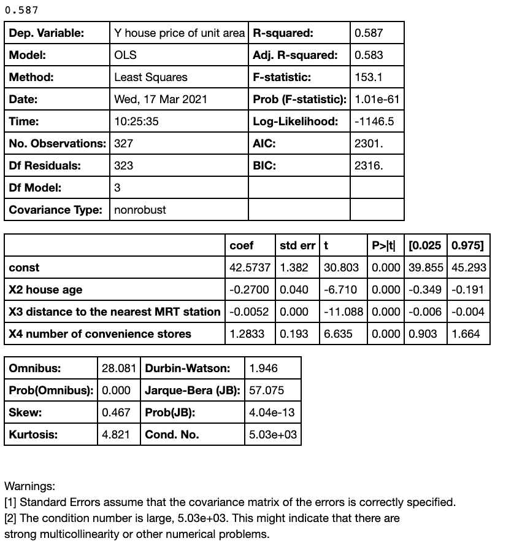

Credit: [https://github.com/anilaq/linearregression/blob/main/linear_regression.ipynb](https://github.com/anilaq/linearregression/blob/main/linear_regression.ipynb)

丢弃异常值帮助我的模型跳到了 0.587，这比我的第一个 r 平方分数好得多！

我将再次检查正态假设。

```
*#I am going to check normality again to see if it has improved*
fig = sm.graphics.qqplot(results4.resid, dist=stats.norm, line ='45', fit=**True**)
```

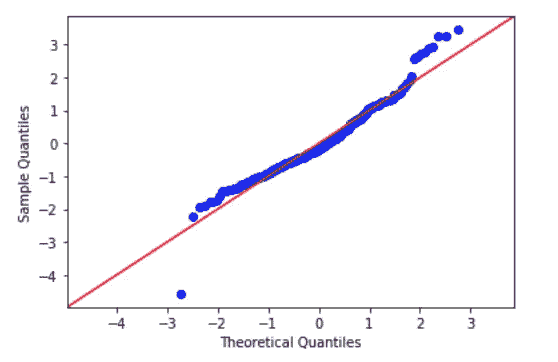

Credit: [https://github.com/anilaq/linearregression/blob/main/linear_regression.ipynb](https://github.com/anilaq/linearregression/blob/main/linear_regression.ipynb)

事实上，通过剔除异常值，常态得到了改善。

最后，我将运行我的测试数据。

```
*#standardize test data*
**for** col **in** X_test_original: 
    X_test_original[col] = (X_test_original[col] - X_test_original[col].mean())/X_test_original[col].std()

X_test_original.head()
```

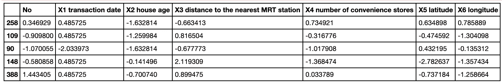

Credit: [https://github.com/anilaq/linearregression/blob/main/linear_regression.ipynb](https://github.com/anilaq/linearregression/blob/main/linear_regression.ipynb)

```
X_test = X_test_original[x_cols]
Y_test = Y_test_originalfinal_model_skl = LinearRegression(fit_intercept=**True**)

*#Learning*
final_model_skl.fit(X_train, Y_train)

*#Evaluating performance*
r2 = final_model_skl.score(X_test, Y_test)
r2 = r2.round(3)

print("R2 = **{}**".format(r2))
```

我得到 0.511 的 r 平方。

**数据能告诉我们什么:**

一所房子的便利店数量，以及经度和纬度似乎是单位面积房价的最强决定因素。

我确信我们可以使用不同的机器学习模型来研究变量之间更强的相关性。但为了这个目的，它纯粹是做一个线性回归。

本教程结束后，我要做的一件事是尝试逻辑回归。逻辑回归对分类变量特别有用。

在现实世界中，获得 0.587 或 0.511 的 r 平方并不坏。最常见的是在现实世界的数据驱动问题中，很少能得到高分。

*来源*:

”线性回归”；耶鲁在线课程:LinReghttp://www.stat.yale.edu/Courses/1997-98/101/linreg.htm

”线性回归”；阿库雷西；[https://github . com/anilaq/linear regression/blob/main/linear _ regression . ipynb](https://github.com/anilaq/linearregression/blob/main/linear_regression.ipynb)

”线性 V 逻辑回归”；Sourav[https://www . analyticsvidhya . com/blog/2020/12/beginners-take-how-Logistic-regression-is-related-to-Linear-regression/#:~:text = Linear % 20 regression % 20 is % 20 used % 20 to，Logistic % 20 regression % 20 provides % 20 discreet % 20 output](https://www.analyticsvidhya.com/blog/2020/12/beginners-take-how-logistic-regression-is-related-to-linear-regression/#:~:text=Linear%20Regression%20is%20used%20to,Logistic%20regression%20provides%20discreet%20output)。

”P 值”；弗罗斯特，吉姆；[https://statisticsbyjim.com/glossary/p-value/](https://statisticsbyjim.com/glossary/p-value/)