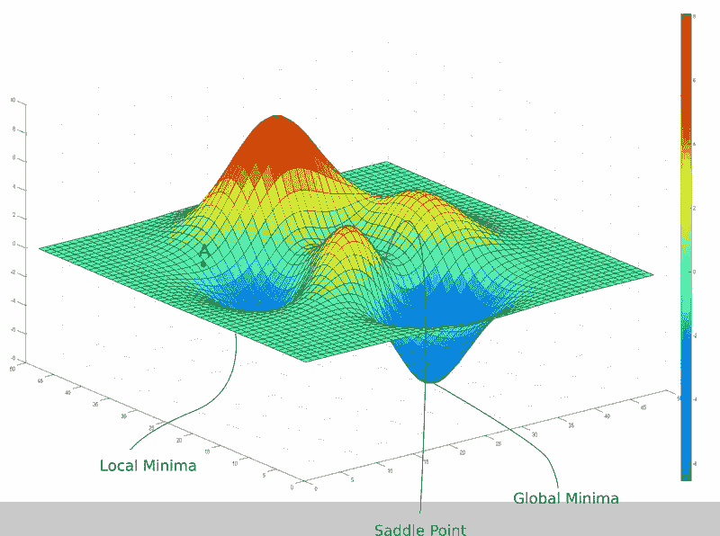
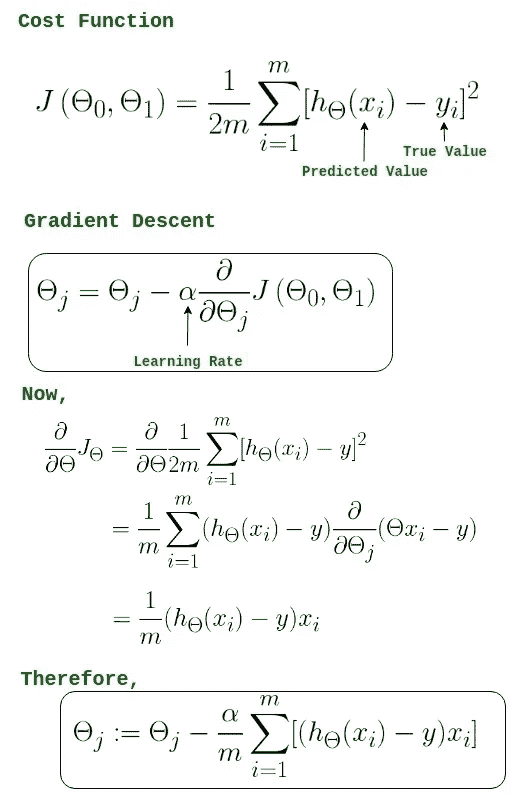

# 线性回归-ML 的第一模型

> 原文：<https://medium.com/geekculture/linear-regression-first-model-for-ml-cce82b2468e?source=collection_archive---------20----------------------->

线性回归是进入机器学习算法时要研究的基本模型。它是一种 ML 模型，用于预测数据集的数值(离散/连续)或问题，如预测房价、股票价格、票价、空气污染等。它不能用于分类值预测。它是监督最大似然算法中的基本算法之一(其中标签是已知的)。

> 回归一词最早是由弗朗西斯·高尔顿创造的，用来描述高个子祖先的后代的身高向正常平均值回归的生物现象。这就是高尔顿如何把“回归”这个词带进现实的，后来尤德内·尤尔和卡尔·皮尔逊把高尔顿的工作扩展到更一般的统计范围和使用。

线性回归模型由一个因变量或预测变量或输出变量以及一个或多个自变量或预测变量或输入变量组成。因变量和自变量之间的关系必须是线性的。因此，线性回归方程与直线方程 y=mx+c + e 相同，其中 m =变量 x 的斜率，c=y 截距，x =独立变量，e =误差或噪声，y =因变量。

这个等式也可以用不同的变量写成不同的形式，但是变量的含义是相同的。例如:y=B0 + B1X +e。

线性回归的挑战是找出数据误差或噪声最小的最佳拟合线，即 min(SSE)=σ(I = 1ton)(y-yi)。通过改变不同的参数值(Bp ),可以确定预测值，给出最小 SSE 的值产生最佳拟合线。这里，xp 系数的线性方程可以取无穷多个值，因此存在像梯度下降这样的优化技术，可以用来获得最佳拟合线。

Gradient descent

用于最小化线性回归模型的函数是 MSE。MSE 用于代替 SSE，以节省空间并避免大型数据集的内存爆炸。在平滑变化的函数中，最大值或最小值总是在函数变平的地方(鞍点除外)。当斜率为零时，它变平，当斜率为零时，f1(x)=0-> x 的 f 导数= 0。要知道该点是最大值还是最小值，F11(x)<0 ->f x 的二重导数=> x0 是最大值点，否则，如果 F11(x)> 0-> f x 的二重导数=> x0 是最小值点。

Multivariate Linear regression with gradient descent

学习率是重要的超参数，需要仔细设置，以便找到全局最小值。当它太低时，函数达到全局最小值需要很多时间，而如果它太高，那么函数可能越过全局最小值。它必须在太低和太高之间，因此必须选择一个最佳的学习速率。下图显示了各种学习率的影响:

Learning rate effects

线性回归的假设:

1.  **线性**:X 和 Y 的关系是线性的。
2.  **同方差**:残差的方差对于 x 的任意值都是相同的
3.  **独立性**:观测值相互独立。误差项之间没有相关性。没有这种现象就是自相关。
4.  **无多重共线性**:回归模型中不应有多重共线性。当两个独立变量之间高度相关时，就会出现多重共线性。
5.  **正态性**:对于 X 的任意固定值，Y 是正态分布的。误差项必须呈正态分布。

*   异方差正好与同方差相反。当误差项的大小在独立变量的值之间不同时，异方差就出现了。(可以通过在残差和拟合值之间绘制散点图得知)。异方差可以通过特征的对数变换、异常值处理和多项式拟合来减少。
*   VIF(方差膨胀因子)用于检测多重共线性。VIF=1/(1-R2)，当 VIF=1 = >不相关时，VIF = 1–5 = >中度相关，VIF>5 = >高度相关。当多重共线性存在时，必须去除高度相关变量，线性组合独立变量，例如将它们相加，使用降维技术 PCA 或 SVD，...

线性回归的优势:

1.  这易于实现，并且更容易解释输出系数。
2.  当您知道目标变量和预测变量之间存在线性关系时，这是最好的选择，因为与其他模型相比，它没有那么复杂。
3.  不管数据大小如何，它都能很好地工作。

线性回归的局限性:

1.  离群值对这个模型有巨大的影响
2.  该模型假设 X 和 y 之间存在线性关系，而现实世界中的问题并非如此。
3.  这种模型容易不合适

线性回归的评估指标:

*   均方误差(mean square error)
*   均方根误差
*   平均绝对误差
*   multidimensional assessment of philosophy of education 教育哲学的多维评价
*   R2 (R 平方)
*   调整后的 R2(调整后的 R2 广场)

这就是线性回归的工作方式，假设非常重要，并成为模型理解和实现的基础。这通常是已知的学习 ML 算法的第一个模型。

> 如果你不能做大事，就用伟大的方式做小事
> 
> 为了成功，你对成功的渴望必须大于对失败的恐惧。
> 
> 成功是准备和机遇的结合

> 如果你想飞，放弃一切让你沮丧的事情，总是让事情发生。

Photo by [Sharon McCutcheon](https://unsplash.com/@sharonmccutcheon?utm_source=medium&utm_medium=referral) on [Unsplash](https://unsplash.com?utm_source=medium&utm_medium=referral)

如果你喜欢这个故事，而且它对学习线性回归或任何东西有所帮助，那就通过喜欢它来表示支持，并与有用的人分享。如果你有任何观点或任何疑问或想说什么，评论框随时欢迎你的建议和善意。保持积极，保持安全，继续尽最大努力，给世界带来光明。