# 不使用 Scikit 在 Python 中从头开始线性回归-学习

> 原文：<https://medium.com/geekculture/linear-regression-from-scratch-in-python-without-scikit-learn-a06efe5dedb6?source=collection_archive---------0----------------------->

在本教程中，我将简要介绍一种最常用的机器学习算法，线性回归，然后我们将学习如何在没有 sci-kit-learn 的情况下使用 python 从头开始使用最小二乘法来实现它。我们还将看看回归分析中 R 平方的解释，以及如何用它来衡量回归模型的好坏。

线性回归是一种预测分析算法，显示因变量(x)和自变量(y)之间的线性关系。

基于给定的数据点，我们试图绘制一条最符合这些点的直线。直线方程如下所示:

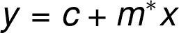

其中，
**x:** 输入数据点
**y:** 预测值，因变量(监督学习)

**模型通过寻找最佳 m，c 值获得最佳拟合回归线**。
**m:** 回归线的偏差或斜率
**c** :截距，显示估计回归线穿过𝑦轴的点

## 成本函数(J)

如上所述，我们的目标是找到预测值和实际值之间差异(误差/残差)最小的回归线或最佳拟合线。这就是成本函数发挥作用的地方，因为我们广泛使用成本函数来计算(c，m)的值，以达到使预测 y 值(y^)和真实 y 值(y)之间的误差最小化的最佳值。

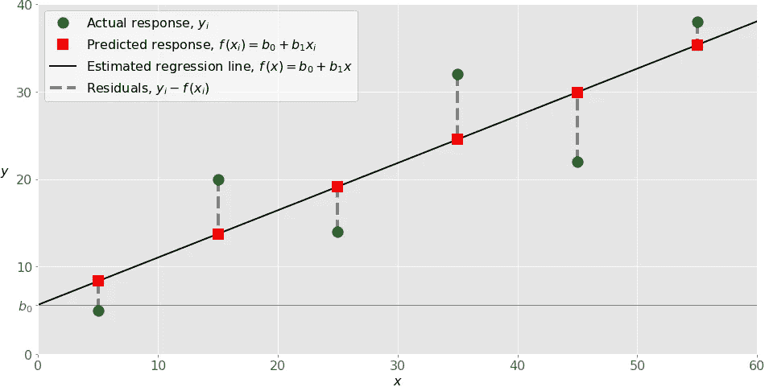

Image Source: [Linear Regression By Real Python](https://realpython.com/linear-regression-in-python/)

> 线性回归的成本函数(j)是预测 y 值(y^)和真实 y 值(y)之间的**均方根误差(RMSE)** 。

## 均方差(MSE)

给定我们简单的线性方程 y = c + m*x，我们可以计算 MSE 为:

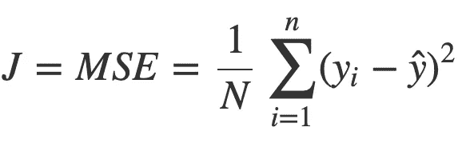

在哪里，

*   𝑁是观测值的总数(数据点)
*   yᵢ是观测值的实际值，y^是预测值
*   j 是成本函数，在这种情况下是均方误差

## 从头开始 Python 实现:

是时候学习算法的数学实现了。对于本教程，我将使用一个简单的 x 和相应的 y 值的数据集，如下所示。

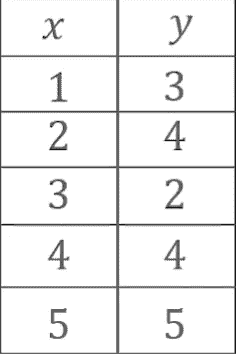

让我们计算 x 和 y 的平均值，我们将它们表示为 x̅ & y̅.

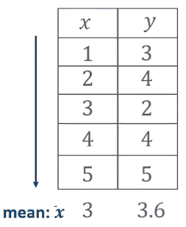

看，我们的目标是使用最小二乘法预测最佳回归直线。所以要找到它，我们必须先找到这条线的方程。因此，如果 y = c+ m*x，其中“m”是斜率/偏差，用 x 的变化除以 y 的变化表示。

> x 的变化是实际输入值 xᵢ和 x̅之间的差异，类似地，y 的变化是标签 yᵢ和 y̅.之间的差异

下面是 **m** 的数学表示，

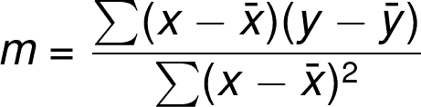

因此，根据“m”的公式，我们要做的是为我们非常简单的数据集中的每个数据点计算(x-x̅)和(y-y̅)。

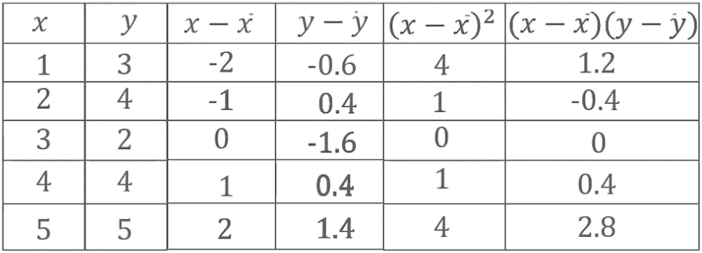

Image Source: [Linear Regression by Edureka](https://www.youtube.com/watch?v=E5RjzSK0fvY&ab_channel=edureka%21)

现在我们已经准备好了公式中的所有元素，我们将计算分子和分母的总和，并找到“m”的最终值。

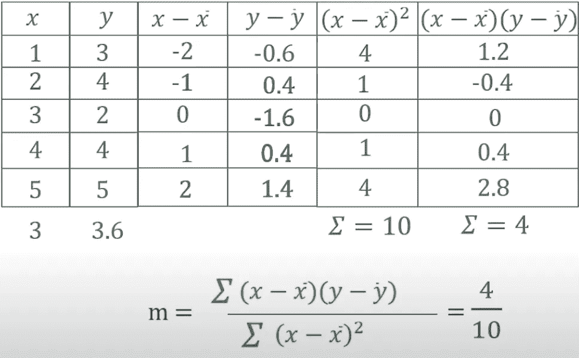

Image Source: [Linear Regression by Edureka](https://www.youtube.com/watch?v=E5RjzSK0fvY&ab_channel=edureka%21)

现在我们有了最后一个等式:

3.6 = 0.4 * 3 + c

c = 2.4

现在，对于给定的 m = 0.4 & c=2.4，让我们预测所有输入值 x ={1，2，3，4，5}的 y

y = 0.4*1 + 2.4 = 2.8

y = 0.4*2 + 2.4 = 3.2

y = 0.4*3 + 2.4 = 3.6

y = 0.4*4 + 2.4 = 4.0

y = 0.4*5 + 2.4 = 4.4

现在，如果我们绘制它们，穿过所有这些预测 y 值并在 2.4 处切割 y 轴的线就是我们的回归线。

Image by Author

现在我们的工作是计算实际值和预测值之间的距离，并缩小这个距离。或者换句话说，我们必须减少实际值和预测值之间的误差。误差最小的线就是线性回归的线。

## **这就是它的内部工作方式:**

1.  ***对不同的‘m’值做多次迭代，***
2.  ***然后计算直线 y = c + m*x 的方程，随着 m 值的变化，直线也会变化。***
3.  ***每次迭代后，根据直线计算预测值，并比较实际&预测值之间的距离。***
4.  ***预测值与实际值距离最小的线将被确定为回归线。***

# r 平方值:

既然我们已经找到了最佳拟合的回归线，那么是时候来衡量它的好坏或检查我们的模型表现得有多好了。

> r 平方值是数据与拟合回归线接近程度的统计度量。

它也被称为决定系数或多重决定系数。

这是我们计算 R 平方值的方法，

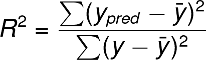

其中，yₚᵣₑ𝒹是预测的 y 值，y̅是平均值，y 是实际值

基本上，我们是在计算预测值和平均值之间的差值，然后除以实际值和平均值之间的差值。

下面是将预测值和实际值之间的所有差异相加后的最终 R 平方值

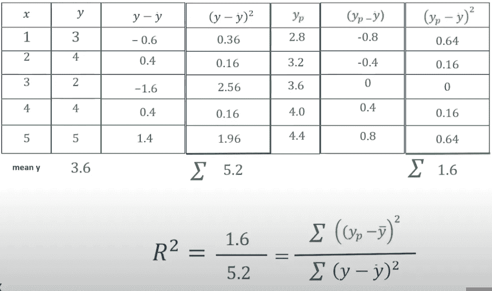

Image Source: [Linear Regression by Edureka](https://www.youtube.com/watch?v=E5RjzSK0fvY&ab_channel=edureka%21)

这是个近似值，

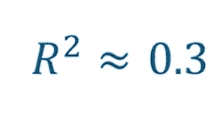

意味着我们的数据点离回归线很远。嗯，那可不好，是吧？

基本上，R 平方值越高，我们的模型性能就越好。因此，随着 R 平方值逐渐增大，实际点与回归线的距离会减小，模型的性能会提高。

## Python 中的实现:

既然我们已经学习了线性回归背后的理论& R 平方值，让我们继续学习编码部分。我将使用 python 和 Google Colab。

我将使用一个来自 Kaggle 的名为 head brain [的简单数据集。](https://www.kaggle.com/saarthaksangam/headbrain)它有 237 行和 4 列，这意味着 237 个观察值和 4 个标签。我们必须根据给定的头部尺寸(厘米)来预测一个人的大脑重量。

第一步:

导入必要的库，如 pandas、NumPy 和 matplotlib

第二步:

将 CSV 文件导入为熊猫数据框。

这是我们的样本数据集:

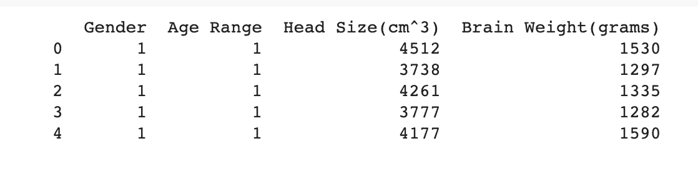

第三步:

我们可以发现头部大小和大脑重量之间的线性关系。下一步是收集我们的 X 和 Y 值。x 由头部尺寸值组成，Y 由大脑重量值组成。我们还需要找到' m '和' c '的值，因此，我们需要找到 X & Y 值的平均值。

第四步:

用公式计算 m & c，如果你记得我们在本文前面讨论过，

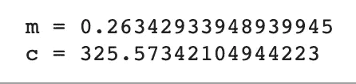

第五步:

现在我们有了 m & c，让我们画出输入点和回归线。

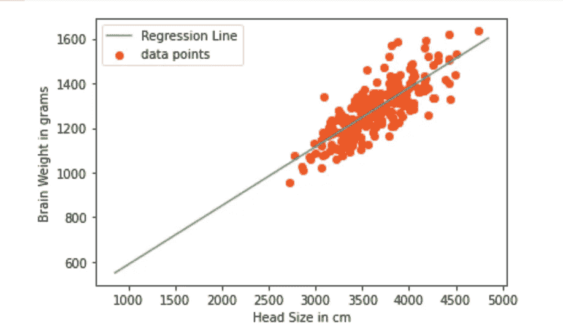

Image by Author

第六步:

现在是时候衡量我们的模型有多好了。为此，如上所述，我们将计算 R 平方值并评估我们的线性回归模型。如果你需要复习 R 平方的公式:

上面的代码生成 R 平方值，

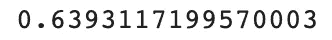

这就是不使用 sklearn 库从头实现的线性回归。

Image Source: Google

如果你不想被所有这些数学和理论所困扰，并且非常想寻找一种更简洁的方法，sklearn 库有一个惊人的内置线性回归函数供你使用。下面是相关的代码片段:

## 结束注释:

在本教程中，我们已经学习了线性回归算法背后的理论，以及在不使用 sklearn 内置线性模型的情况下从头开始实现该算法。

你可以在我的 GitHub 上找到数据和 iPython 笔记本[。](https://github.com/sindhuseelam/linear-regression-implementation)

## 参考资料:

[1][YouTube 上 Edureka 的线性回归](https://www.youtube.com/watch?v=E5RjzSK0fvY&ab_channel=edureka%21)

[2][https://www.geeksforgeeks.org/ml-linear-regression/](https://www.geeksforgeeks.org/ml-linear-regression/)

在 [LinkedIn](https://www.linkedin.com/in/sindhuseelam/) 和 [Twitter](https://twitter.com/SindhuSeelam_) 上与我联系，获取更多关于机器学习、统计学和深度学习的教程和文章。