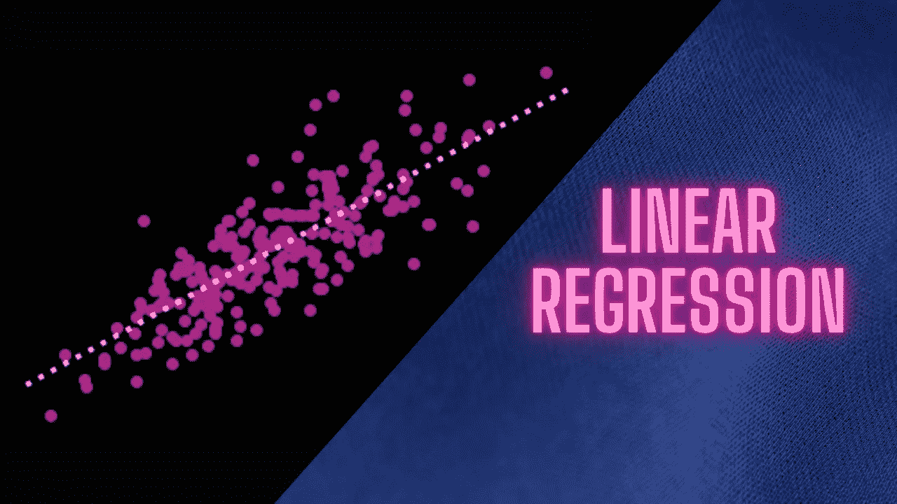
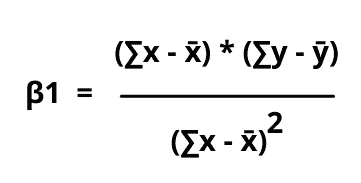
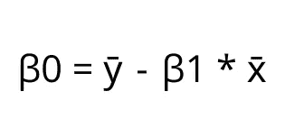
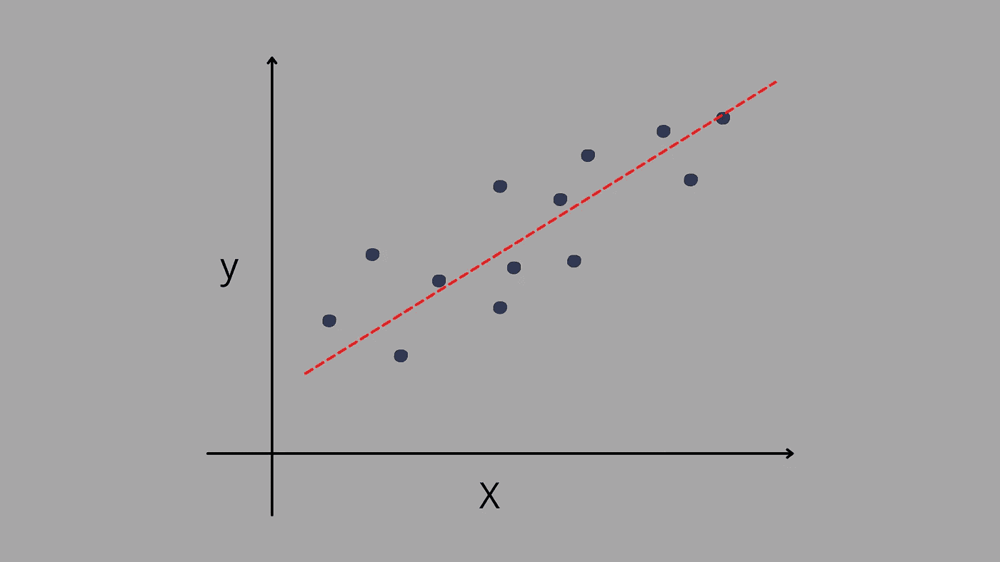
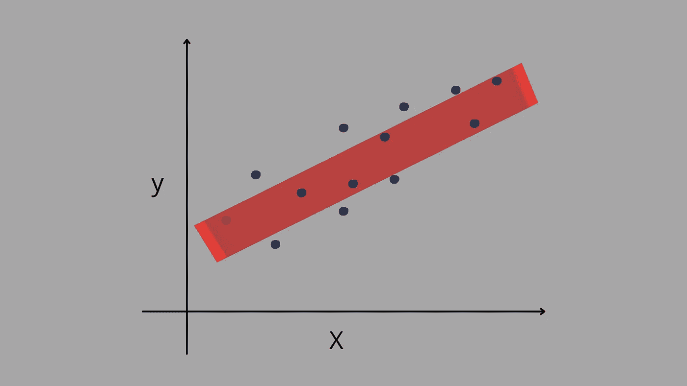
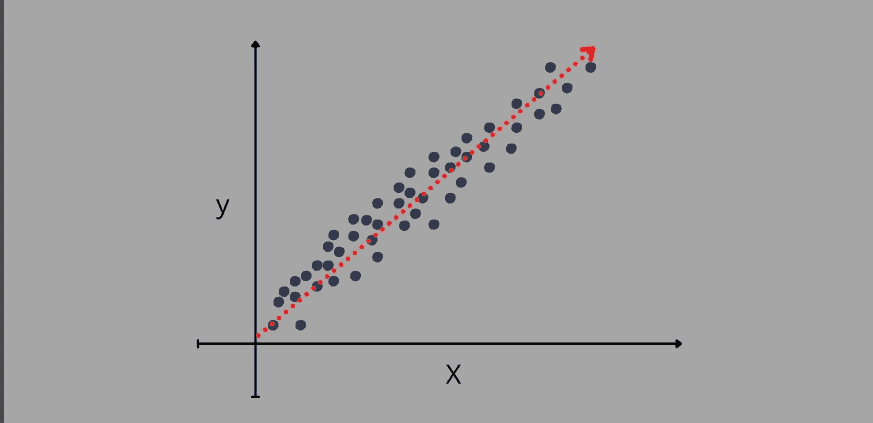
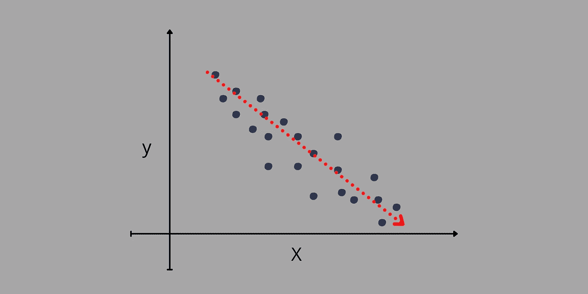
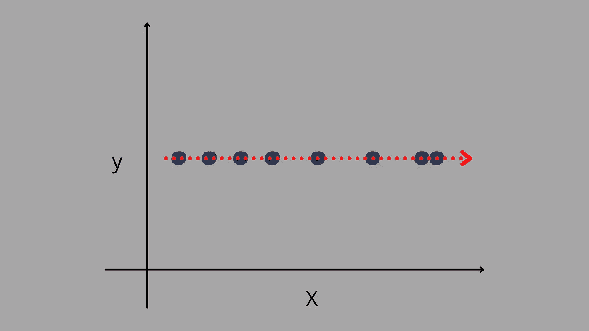
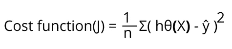

# 线性回归:温和介绍

> 原文：<https://medium.com/geekculture/linear-regression-gentle-introduction-cc04ffda4267?source=collection_archive---------35----------------------->

回归分析是一套统计方法，用于找出因变量(y)和自变量(X)之间的关系。自变量不受其他变量的影响，但随着自变量的变化，它会直接影响因变量，这意味着我们必须研究因变量，以找到数据集中的模式。为了找到这种模式或预测产量，我们使用回归模型。

现在，我们已经有了一些关于回归的基本概念，让我们深入到线性回归的解释中去，以便更好地理解。

# 线性回归

线性回归试图通过拟合线性方程来找出两个变量(即 X 和 y)之间的关系:

> ***y***=**β0****+*β*1X*+ε***

*在哪里，*

> *x 是独立变量，沿 x 轴绘制*
> 
> *y 是因变量，沿 y 轴绘制*
> 
> *β0 是截距*
> 
> *β1 是 X 的系数(斜率)*
> 
> *ε是残差(误差)的和*

*误差项(即ε)用于说明因变量和自变量之间的线性关系无法解释的 y 的可变性。*

*上面的等式是从我们上学时在数学中用过的线的等式推导出来的，即*

> *y = mx + c*

*在哪里，*

> *m 是直线的斜率*
> 
> *c 是常数*

*在线性回归中，等式的书写方式发生了变化，但目标保持不变，即找到数据的最佳拟合线。*

*现在，我们需要找到截距和系数，这样我们就可以找到我们的线，为此，我们使用*

****

> *x̄是 x 的意思*
> 
> *ȳ是 y 的意思*

# *简单线性回归*

**

*当只有一个自变量(X)和一个因变量时，这个问题称为简单线性回归。这种回归的方程式表示为:*

> *y = β0 + β1X*

# *多元线性回归*

*当一个因变量的数据集中有多个要素时，该类型的回归属于多元线性回归。这种回归的方程式表示为:*

> *y = β0 + β1X + β2X2 + β3X3 + ………..+ βnXn*

*在多元线性回归中，方程会根据数据集中找到的变量数量进行扩展。对于每一个增加的变量，我们都要计算系数。*

**

*随着变量数量的增加，这意味着我们的任务无法通过应用或找到一条线来完成，因此，为了完成您的任务，我们必须在适当的位置拟合一个平面或一条线，以便每个特征都获得相同的偏好，并且没有特征会陷入困境，因为每个特征在预测时都会给出一些权重。*

*现在，我们知道了如何找到最佳拟合线，让我们看看线性回归中的关系。*

## *线性回归中的关系*

*   ***正相关:**当一个变量的值随着另一个变量的值的增加而增加时，这意味着它是正相关的。*

**

*如上图所示，当 x 轴的值增加时，y 轴的值也会增加。这种关系被称为积极关系。*

*   ***负相关:**当一个变量减少，而另一个变量增加时，则为负相关。*

**

*上图显示了负相关，因为一个变量随着另一个变量的增加而减少。*

*   ***无关系:**当回归曲线中的曲线平坦时，该关系称为无关系。*

**

*在上图中，对于 x 轴的每个新变量，y 值都是常数，它形成了一条平坦的线(斜率值为 0)。*

# *线性回归线*

*寻找最佳拟合线最常用的方法是**最小二乘法。**该方法减少了每个数据点到直线的垂直偏差的平方和，如果点位于拟合直线上，则偏差为 0。简而言之，它减少了实际点和预测点之间的距离，并给出了最佳拟合线。*

# *价值函数*

*成本函数用于衡量预测的 y 值与实际 y 值的接近程度。线性回归的成本函数是均方误差，它取 y 的实际值和预测值之间的平均误差。如果预测的直线距离实际数据点很远，则意味着误差更大，此时我们必须更新β0 和β1 的值，直到误差最小，我们尝试不断更新我们的值。*

*我们可以发现成本函数可以由下式计算:*

**

*在哪里，*

> **n 是数据点的总数**
> 
> *h *θ(X)是我们的实际数据**
> 
> *ŷ是我们的预测值*

*这就是为什么代价函数在每个机器学习问题中起着重要作用。*

# *结论*

*这都是关于线性回归。我希望你得到了一些知识，随时分享你对这篇文章的看法。感谢任何形式的反馈。谢谢！*