# 简而言之，线性回归

> 原文：<https://medium.com/geekculture/linear-regression-in-a-nutshell-1714d5665fd2?source=collection_archive---------11----------------------->

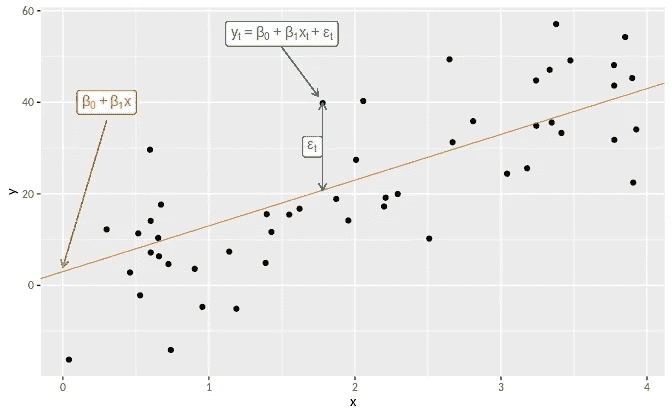

回归分析是最广泛使用的预测方法之一。线性回归可能是最重要的机器学习方法，是所有数据科学家分析的高级分析方法的开始。

> [**线性回归是两个或多个变量之间因果关系的线性近似。**](https://365datascience.com/tutorials/python-tutorials/linear-regression/#:~:text=A%20linear%20regression%20is%20a,to%20make%20inferences%20and%20predictions.)

回归模型非常有价值，因为它们是进行推断和预测的最常用方法之一。除此之外，回归分析也被用来以有意义的方式确定和评估影响某一结果的因素。与许多其他统计技术一样，回归模型帮助我们根据样本数据对总体进行预测。

在我们深入研究线性回归之前，让我们先了解响应或因变量和自变量

**自变量(预测值)**

*   这就是原因。它的值与研究中的其他变量无关。
*   独立变量或预测值被表示为“x₁，x₂，。……xₙ

**因变量(预测值)**

*   因变量是效果。它的值取决于自变量的变化。
*   因变量或预测变量表示为“y”
*   y '是独立变量的函数，如下所示

> y = f ( x₁，x₂，。… xₙ)

## 简单线性回归

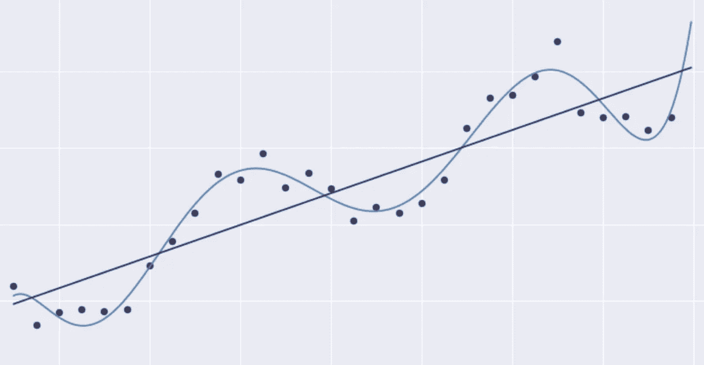

简单线性回归是一种统计方法，允许我们总结和研究两个连续(定量)变量之间的关系。

*   一个用 x 表示的变量，被认为是预测变量、解释变量或独立变量。
*   另一个变量表示为 y，被视为响应、结果或因变量

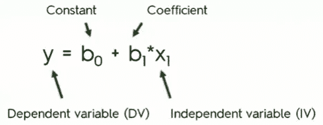

**简单线性回归方程分解:**

*   **因变量(DV):** 正如你可能已经从名字中猜到的，DV 是一个变量，你试图根据它对另一个变量的依赖性来理解它。
*   **自变量(IV):**IV 是影响因变量的变量。学习时间是各自情况下的独立变量。

有时候，静脉注射对静脉注射没有同样的直接影响。

*   **系数:**自变量的系数基本上决定了 IV 中一个单位的变化如何影响 DV。

我们需要这个中间人的原因是，IV 的变化率通常与 DV 的变化不成比例。

*   **常数(b₀):** 直线(回归)与 y 轴相交的点。

> **例如:**
> 
> 你的 GPA 和你的学习时间有什么关系？
> 
> 在这种情况下，GPA 是因变量，学习时间是自变量。

## 多元线性回归

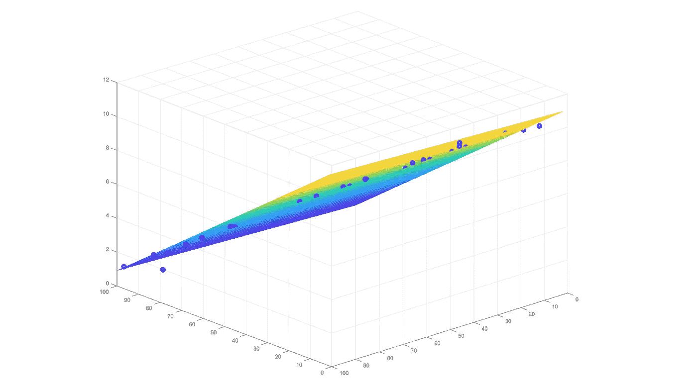

多元线性回归用于估计两个或多个自变量和一个因变量之间的关系。

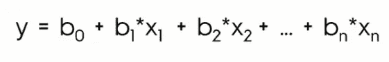

The mathematical equation of Multiple linear regression

在哪里，

*   y 相关变量
*   x₁，x₂。… xₙ独立变量
*   b₀截距，独立变量为零时 y 的值
*   b₁，b₂。… bₙ -独立变量的回归系数

在线性回归中，我们考虑一个称为误差项(ε)的附加项。

> **误差项本质上是指模型不完全准确，在实际应用中会导致不同的结果。**

# 线性回归的矩阵表示

使用多个预测变量，对于 n 个输入，我们将得到以下线性方程:

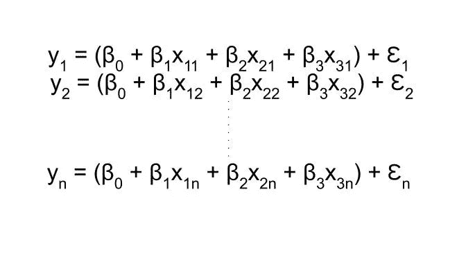

***上式的矩阵表示***

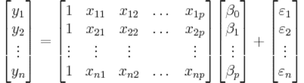

# 线性回归的几何表示

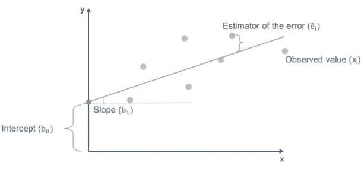

让我们举一个例子，这样你就可以看到所有这些实际上是如何工作的。

**举例:工资&经验**

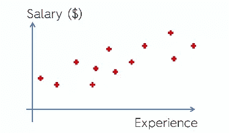

在上面的例子中，工资是因变量(y)，而经验是自变量(x₁).

在这种情况下，等式将是

> 薪资= b₀ + b₁ *经验

使用这个等式，你可以继续画一条最符合这些结果的直线

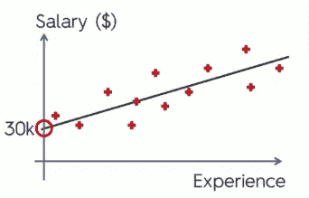

你可以看到，这里的常数是 30k。这意味着，当你开始没有任何经验时，工资从 3 万美元开始。

> 在这个例子中，b₁是每增加一年经验的工资增长率。

如果我们在 x 轴(经验)上标出变化，将其与直线联系起来，并将其投影到 y 轴(薪水)上，我们就能够得出薪水的变化。

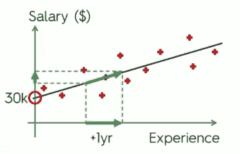

# 最佳拟合线到底是什么？

让我们考虑一下早先的工资和经验的例子

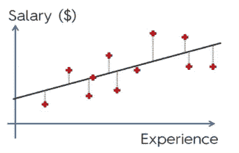

如您所见，我们在整个图表中绘制了观察数据，以及贯穿各点的简单回归线。

现在，让我们随机选择一个点，更仔细地检查它。

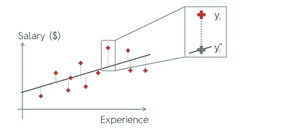

这里我们有一个有 x 年经验的人的工资。

根据我们简单的线性回归模型，直线代表此人的工资水平，而红点代表此人的实际收入。

通常，这两个对应点的命名如下图所示。

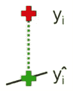

两者的区别在于我们的观察和我们的模型之间的差距。测量连接它们的绿线。这就是差距的价值。

对图上的每两个对应点做同样的操作，将它们平方，然后，最后，将它们相加。

计算出总和之后，你就可以找到最小值。

> 因此，简单的线性回归过程帮助我们使用一组数据绘制所有可能的直线，然后通过计算每条直线的平方和并记录下来，它能够检测出最小平方和。

具有最小平方和的直线是最佳拟合直线。

## 普通最小二乘法

普通最小二乘回归(OLS)是一种用于估计线性回归中未知参数的线性最小二乘法[……(更多)](https://arunaddagatla.medium.com/ordinary-least-squares-regression-41f40400a58d)

## 回归的性能度量

回归算法已被证明在许多领域进行预测是有效的。机器学习的一个关键阶段是模型的评估。评估的目的是[……(更多)](https://arunaddagatla.medium.com/performance-measures-for-regression-fa49dbaef8cf)

## 可变性的分解

您需要了解一些指标来确定回归模型是准确的还是误导的。跟随一个有缺陷的模型是一个坏主意，所以重要的是 […(更多)](https://arunaddagatla.medium.com/decomposition-of-variability-da4ba31b4ceb)

## 回归与相关

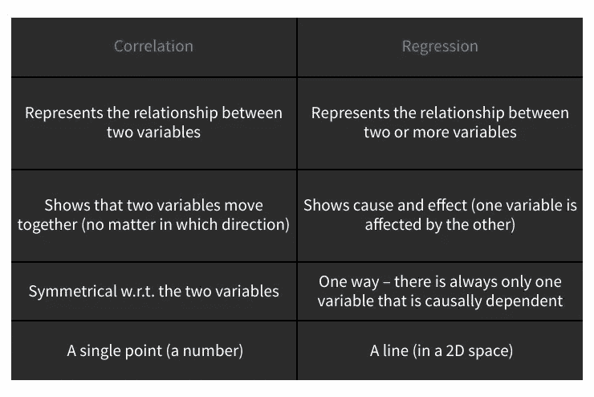

*感谢阅读本文！如果你有任何问题，请在下面留言。请务必关注*[*@ arunadagatla*](https://arunaddagatla.medium.com/)*，获取关于数据科学和深度学习的最新文章通知。*

> 可以在[**LinkedIn**](https://www.linkedin.com/in/arun-addagatla/)[**Github**](https://github.com/arun2728)[**ka ggle**](https://www.kaggle.com/arun2729)上与我联系，或者通过访问[**Medium.com**](https://arunaddagatla.medium.com/)。