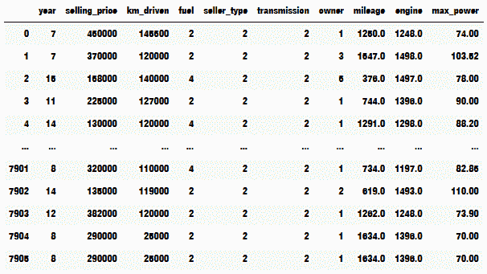
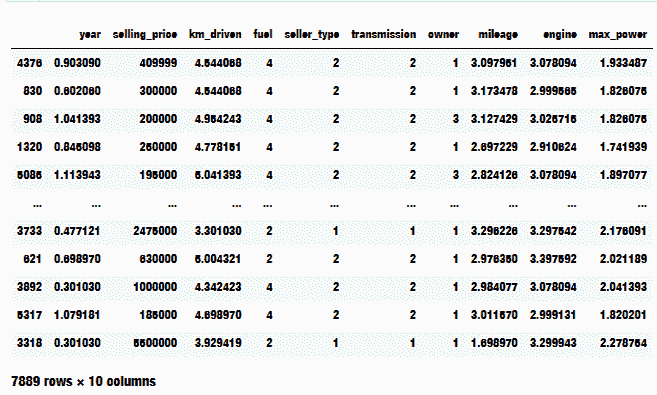
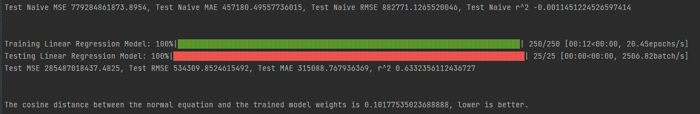
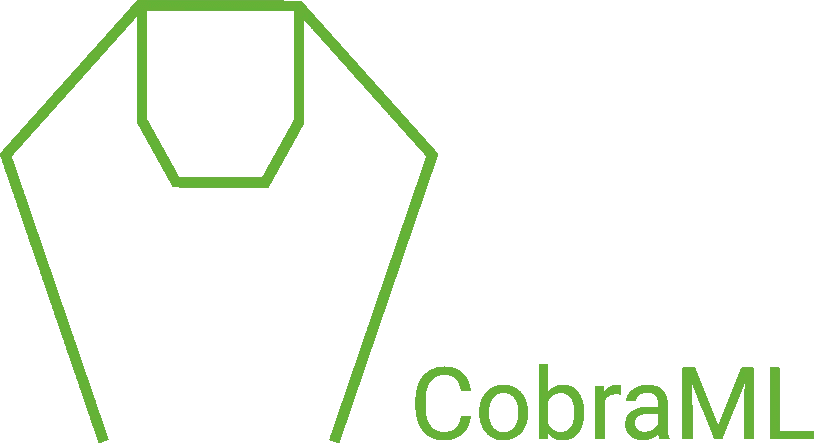

# PyTorch 中的线性回归

> 原文：<https://medium.com/geekculture/linear-regression-in-pytorch-262a4b7ed610?source=collection_archive---------25----------------------->

# **免责声明**

如果你正在寻找对机器学习基础或线性回归如何工作的深入解释，那么恐怕这篇文章不适合你。本文将深入探讨线性回归的实现，以及我们的模型在真实数据集上的表现。如果你确实想自己学习这些概念，在文章的底部，我们附上了几个来自可靠资源的链接以供参考。

# 前提

机器学习不再是为最聪明的计算机科学家保留的精英领域。我们生活在一个任何背景的人都可以轻松实现机器学习模型的时代。然而，虽然这种进步对社区来说是巨大的，但对我和许多其他人来说，有一种可定制性的深刻渴望，这是 sci-kit learn 等机器学习库无法满足的。他们给出的分类器虽然是顶级的，但并没有授予我们许多人在训练模型时渴望的深度个性化，也不允许在 GPU 上训练模型。正因为如此，我们决定远离 Sci-Kit Learn，转而选择一个能给我们带来渴望已久的
开放性的图书馆。PyTorch 是这个库，它为我们预先构建了许多复杂的工作，同时在实现 M.L .算法时给我们留下了我们想要的自由。第一种算法是线性回归。

# 线性回归模型

Pytorch 是一个深度学习框架，因此具有易于使用和健壮的模型制作系统。我们利用这个系统的易用性，简单地改变它，使我们的线性回归模型，而不是神经网络。

The Linear Model

在初始化中，我们不使用任何类型的层，而是使用常规张量作为权重参数，在向前传递中，我们只使用参数和输入要素进行矩阵乘法。

# 数据集

线性回归模型准备就绪后，就该在数据集上试验该模型了。我们选择的数据集是卡德霍数据集，具体来说是它的第三个版本。这些数据从一开始就没有准备好使用，因此需要一些数据清理和扩充。

列“里程”、“发动机”、“最大功率”都包含需要转换成浮点值的字符串值。为了实现这一点，删除了单位字符串，必要时将数据转换为标准单位，所有空值行也随着扭矩列一起删除。

接下来，其值为字符串的列被转换为分类列，这使得转换为数字数据更加容易。

从那里，基于数据的特征矩阵进行分析。从中我们可以看出，姓名和座位这两列与其他数据几乎没有关联。因此这些列被删除。数据看起来是这样的。

进一步分析数据后，很明显，许多色谱柱在不同的尺寸和规模下运行。为了解决爆炸梯度的问题，对相应的柱进行了归一化。为了标准化数据，我们使用了对数标度，因为我们的数据非常密集。结果数据看起来如此。

# 训练模型

为了训练模型，我们遵循基本 PyTorch 结构。

我们选择的损失函数是均方误差，大多数训练的优化器是随机梯度下降，但是我们也添加了使用 Adam 优化器的功能。

# 测试模型

为了测试该模型，我们遵循了训练该模型的相同结构，但是确保从不调用反向传播。我们还有一个更强大的误差系统来衡量我们模型的准确性。误差函数如下图所示。

它返回均方误差、平均绝对误差、均方根误差和决定系数。

# 超参数

在训练模型时，调整了几个超参数以获得最佳模型。在我们的例子中，我们将模型的动量设置为 0.09，并将学习率设置为 0.001。我们决定在每个训练实例中随机化权重，而不是从 0 开始。我们为 250 个时期训练模型，批次大小为 64。

# 比较指标

为了看看我们的模型是否真的有什么技巧，我们将它与其他几个度量标准和模型进行了比较。第一个模型是一个天真的模型。天真的模型总是在每次预测中使用平均汽车价格。如果我们的模型做得比这更好，那么我们知道这不仅仅是猜测。我们使用的第二个比较度量是查看正常方程权重和训练参数权重之间的余弦距离。法线方程是一个特殊的公式，仅用于线性回归，它为拟合数据的直线找到最佳参数。如果正常方程权重和训练权重之间的距离很小，我们知道我们的模型尽可能做得好。

# 结果

那么模型表现如何呢？从结果来看还不错！

它达到了相当高的 r，非常接近正常的方程权重。

# 结束语

最后，我们的模型做得很好。这绝不是线性回归的最佳实现，它只是一个基本实现，其目的是表明我们的线性回归算法是可行的。其他模型可能会做得更好，通过对此模型进行更好的调整，您可能会获得更好的结果。如果您发现我的代码有任何错误，找到更好的方法来实现代码，或者获得比我更好的结果，请随时告诉我。我很想听听这件事！我们使用 PyTorch 实现的下一个模型将是逻辑回归，请密切关注。

# 科布拉姆尔

CobraML 是一个开源的 ML 库，它在 PyTorch 中实现了机器学习算法，为最终用户提供了更多的可定制性以及 GPU 功能。如果你对这个图书馆感兴趣，请填写这张表格。

# 资源

查看这些令人敬畏的资源，不要羞于给 CobraML 一颗星，并连接到我们的 LinkedIn

## 资料组

*   [https://www . ka ggle . com/nehalbirla/vehicle-dataset-from-cardek ho](https://www.kaggle.com/nehalbirla/vehicle-dataset-from-cardekho)

## 标准化资源

*   [https://developers . Google . com/machine-learning/data-prep/transform/normalization](https://developers.google.com/machine-learning/data-prep/transform/normalization)

## ML 教程，以便更好地理解

*   https://www.youtube.com/watch?v=kHwlB_j7Hkc&list = pllsst 5 z _ DsK-H9 vyzkqkynwcitqhlrjln&index = 5

## 准确度测量

*   [https://machine learning mastery . com/regression-metrics-for-machine-learning/](https://machinelearningmastery.com/regression-metrics-for-machine-learning/)

## CobraML GitHub(这也是本文中使用的相同代码，请查看分支算法-测试)

*   [https://github.com/govindansriram/CobraML](https://github.com/govindansriram/CobraML)

## 作者的 LinkedIn

*   [https://www.linkedin.com/in/saatvik-anumalasetty-8214b8167/](https://www.linkedin.com/in/saatvik-anumalasetty-8214b8167/)
*   [https://www.linkedin.com/in/sriram-govindan/](https://www.linkedin.com/in/sriram-govindan/)