# 使用梯度下降的线性回归:直觉和实现

> 原文：<https://medium.com/geekculture/linear-regression-using-gradient-descent-intuition-and-implementation-522d43453fc3?source=collection_archive---------16----------------------->


Photo by [Isaac Smith](https://unsplash.com/@isaacmsmith?utm_source=medium&utm_medium=referral) on [Unsplash](https://unsplash.com?utm_source=medium&utm_medium=referral)

这是我正在撰写的系列文章中的第二篇，其中我们将讨论和定义介绍性的机器学习概念。如果你没有读过我的第一篇关于数据预处理的文章，一定要去看看。

在本文中，我们将讨论线性回归，以及在处理带标签的数据时如何使用线性回归进行预测。

让我们开始吧。

# 个案研究

理解线性回归概念的最好方法是通过一个例子。因此，在阅读本文的其余部分时，想象自己处于以下场景中:

> 你是住在波士顿的数据科学家。你的朋友找到你，告诉你他很难卖掉他的房子，他在市场上标价 50 万美元。你问他房子的细节，从他的描述中注意到他对房产的估价太高了。因此，您希望通过编写一个算法来帮助您的朋友，该算法将查看当前的房地产市场，并预测他的房子可以卖多少钱。

# 几个定义

在描述线性回归之前，我们必须了解一些基本概念:

1.  **因变量 vs 自变量:****根据其他变量的变化而变化*的变量，称为因变量。在我们的住房场景中，因变量的一个例子是房子的价格，它根据房子的大小、卧室的数量等而变化。尺寸、卧室数量和浴室数量都是独立变量的例子。这些变量的行为不依赖于任何其他变量。***
2.  ****监督与非监督学习算法:**监督学习算法是一种从预先存在的、*标记为*的数据中学习的算法，以便理解其行为并对未来数据进行预测。正如我们将看到的，回归算法是*监督*学习算法。另一方面，无监督学习算法是一种分析*未标记*数据集的算法，它自己学习并将不同的数据组分成具有共同属性的数据点集。如果你想了解更多的区别，这里有一篇关于[监督和非监督学习](https://towardsdatascience.com/supervised-vs-unsupervised-learning-14f68e32ea8d)的文章。**
3.  ****回归 vs 分类:**回归是一种统计方法，利用一个或多个自变量来预测因变量的值。在回归中，我们的目标是找到一条最能描述我们的数据的直线，试图在以后预测新的、即将到来的数据。预测房价是回归问题的一个例子。在分类中，目标是根据属性将数据分类到离散的组中。例如，我们可以将一个有新冠肺炎症状的人分为携带者或非携带者。在这里，我们将患者分为两个不同的组。**

# **线性回归**

**线性回归预测一个**连续**因变量的值。这里的关键术语是连续。在线性回归中，我们不希望将数据分成离散的不同组。相反，我们的预测理论上可以取任何实数。当因变量和自变量之间的关系是线性时，我们使用这种回归变量。**

## **直觉**

**我们都见过直线的方程，对吧？**

**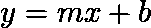**

**该等式通过定义一条线，将`m`作为其斜率，将`b`作为其y 轴截距，即该线与 y 轴相交的位置，给出了`y` *、*的值及其各自的`x` *、*的值。根据`m`和`b`*的值，我们的线会发生变化。***

***为了后面会变得更清楚的目的，我们可以用下面的方式来表达直线的方程:***

***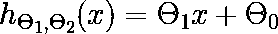***

*****Equation 1:** Univariate Linear Regression***

***其中`Theta_1`和`Theta_0`分别对应`m`和`b`,`h`对应`y` *。我们也可以改变我们解释`x`和`h`T42 的方式。*不要将`x`视为任意实数，而是将其视为影响`h`的描述性特征。例如，如果`h`是价格，那么`x`可能是房子的房间数。下图显示了改变`Theta_0`和`Theta_1`的效果***

***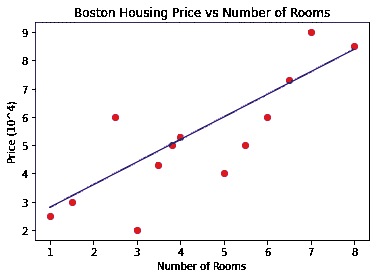***

*****Figure 1:** m=0.8 and b=2***

***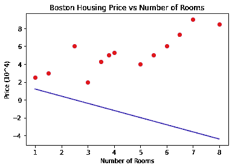***

*****Figure 2:** m=-0.8 and b=2***

***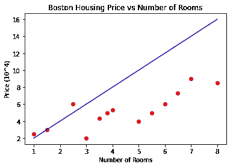***

*****Figure 3:** m=2 and b=0***

***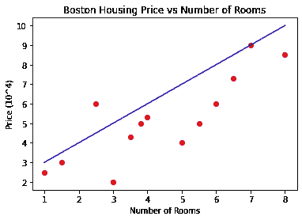***

*****Figure 4:** m=1 and b=2***

***哪条线最好地描述了我们的点的行为？目测可以看出，要么是**图 1** 画的，要么是**图 4** 画的。有了这个，我们可以开始使用我们的图表进行预测。例如，**图 4** 告诉我们，一栋有八个房间的房子大约要花费 10 万美元。***

***但是我们的模特不懂视觉。那么我们如何比较一条线和另一条线呢？我们如何知道哪个直线方程最能描述我们的数据点？为此，我们使用**均方误差**公式:***

***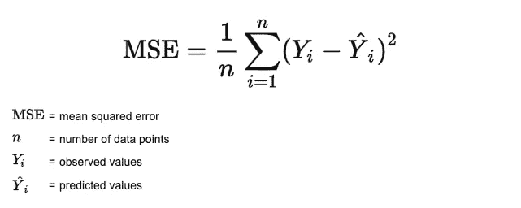***

*****Equation 2:** Mean Squared Errors***

***这个等式非常简单。以**图 4** 为例，MSE 将计算每个红点和蓝线之间的平均距离。这个平均值越大，我们的线在描述数据点方面就越差。很直观吧？如果我们的点离线很远，那么它就不能恰当地描述我们数据的行为。由于我们处理的是线性回归，我们可以用直线方程代替`Y^_i`:***

***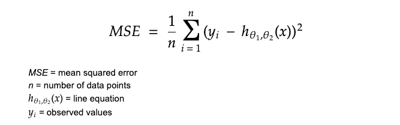***

*****Equation 3:** Mean Squared Errors for Linear Regression***

***线性回归背后的想法并不比确定`Theta_0`和`Theta_1`的值更复杂，这将给我们一条最适合我们的训练数据的线，即**一条具有最小 MSE** 的线。***

***然而，房子的价格仅仅是由房间数量决定的吗？当然不是。我们需要看它的大小，它的位置等等。为了说明这一点，我们可以推广**等式 1** :***

***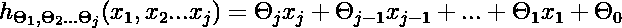***

*****Equation 4:** Multivariate Linear Regression***

***其中`{x_1, x_2,...,x_j}`对应于房屋的不同特征，并且是由方程`h`接收的输入，以便得出预测。为了简单起见，我们将主要使用**等式 1** 中所示的单变量公式，但是所有的概念都可以扩展到**等式 4** 中所示的多变量场景。***

***那么，我们如何决定哪一个`{Theta_1, Theta_2,...,Theta_j}`最能描述我们的数据呢？回车，*梯度下降*。***

# ***梯度下降***

***在线性回归的情况下，梯度下降用于找到将**最小化**MSE 的θ。请注意，这不是它唯一的用例。我们可以在许多其他优化和机器学习问题中使用这种算法，但我们不会在本文中深入讨论这一点。***

***关于梯度下降算法可以说很多(我指的是很多)。在本文中，我们将触及对线性回归最重要的几点。如果你想得到更详细的理解，看看[梯度下降算法及其变体](https://towardsdatascience.com/gradient-descent-algorithm-and-its-variants-10f652806a3)。***

## ***直觉***

***我们希望找到最符合以下几点的线条:***

***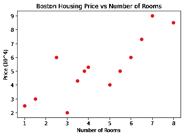***

*****Figure 5:** Boston Housing Prices vs Number of Rooms***

***为了使我们的图表更容易理解，让我们假设`Theta_0 = 0`。我们只剩下`Theta_1`要找了。下图比较了我们根据任意选择的`Theta_1`得到的 MSE:***

***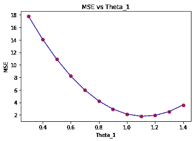***

*****Figure 6:** MSE vs Different Choices of Theta_1***

***用这个图很容易找到最好的`Theta_1`，不是吗？我们只需要看看最低点，就能意识到我们的 MSE 在`Theta_1~=1.1`时处于最小值。同样，我们需要一种方法来精确计算这个值。这就是梯度下降的作用。基本想法是这样的:***

***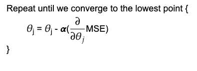***

***我们来分析一下。***

***最重要的部分是偏导数。为什么我们要部分推导 MSE？这么想吧:你的偏导数代表某一点的斜率。这个斜率可以是正的、负的或零。当它为正时，我们减小`Theta_j`的值。当它为负时，`Theta_j`增加。当它为零时，意味着我们已经达到最小值，并且`Theta_j`没有发生任何事情。考虑图 6**中的点`(0.8, 4)`。该点的斜率为负。如果我们运行梯度下降算法的一次迭代，值`Theta_1`将增加并越来越接近最小值。*****

*****Alpha** 被称为**学习率**，它代表我们向最小值前进了多大的一步。这个值不能太小，否则你的算法会运行得很慢，但也不能太大，否则你的算法永远不会终止。***

# ***履行***

***让我们看看如何使用 scikit learn [线性回归](https://scikit-learn.org/stable/modules/generated/sklearn.linear_model.LinearRegression.html)和内置 [Boston Housing Dataset](https://scikit-learn.org/stable/modules/generated/sklearn.datasets.load_boston.html) 类来找到最佳拟合线。***

***首先，我们导入我们需要的库:***

```
*# Scikit learn's built-in Boston Housing dataset
from sklearn.datasets import load_boston# Library for scikit-learn compatible arrays and matrices
import numpy as np# Library for plotting nice graphs
import matplotlib.pyplot as plt*
```

***然后将我们的特征(房间数量)与我们的目标变量(价格)分开:***

```
*dataset = load_boston() # Loads sklearn's Boston datasetX = dataset.data[:100,5] # Set x_1 as the number of roomsy = dataset.target[:100] # Set h as the house's price*
```

***然后将它们分开，这样 20%的数据用于测试，其余的用于训练我们的模型:***

```
*# Split data into 20% testing and 80% training
from sklearn.model_selection import train_test_splitX_train, X_test, y_train, y_test = train_test_split(X, y, test_size = 0.2, random_state = 0)*
```

***我们的数据现在可以用于我们的线性回归模型了。我们需要做的第一件事是使用我们的训练集来训练它。请记住，线性回归是一种*监督学习算法，*意味着它从以前的数据中学习，以预测新的输入数据的值:***

```
*# Train the model with our training set using linear regreesionfrom sklearn.linear_model import LinearRegressionregressor = LinearRegression()# Run Gradient Descent to get the values of Theta_1 and Theta_0
regressor.fit(X_train.reshape(-1,1),y_train)*
```

***我们可以看到获得的`Theta_1`和`Theta_0`的值:***

```
*print(regressor.coef_) # Theta_1
print(regressor.intercept_) # Theta_0
>> [9.79185794]
>> -38.79201598312946*
```

***让我们通过绘制图表来看看我们的模型相对于我们的训练集的表现如何。请注意，该数据集着眼于中间价格:***

```
*plt.scatter(X_test,y_test,color='red')plt.plot(X_test, regressor.predict(X_test.reshape(-1,1)), color='blue')plt.title('Boston Housing Price vs Number of Rooms')plt.xlabel('Number of Rooms')plt.ylabel('Median Price (1000s)')plt.show()*
```

***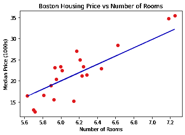***

*****Figure 7:** Linear Regression Predictions On Test Data***

***最后，我们可以开始用这条线做预测:***

```
*regressor.predict([[8]])
>>> array([39.54284755])*
```

***因此，一个有 8 个房间的房子的中间价格大约是 40 000 美元。***

# *****结论*****

***在本文中，我们介绍了线性回归背后的理论，以及如何使用梯度下降算法来查找参数，从而为我们的数据点提供最佳拟合线。我们还研究了如何使用 Scikit Learn 的线性回归类在我们选择的数据集上轻松使用该模型。***

***尽管线性回归很有用，但它只是回归的开始。以下是一些需要你思考的事情:***

*   ***在本文看到的所有例子中，自变量和因变量之间的相关性大多是线性的。如果情况不是这样，会发生什么？还能用线性回归吗？***
*   ***我们将`Theta_0`设置为零，以简化我们的图表。梯度下降如何扩展到多个特征(多个`Theta`)？***
*   ***图 6 中**的图形是二次形状，这令人惊讶吗？*****
*   ***我建议你至少在纸上为你选择的数据集描绘一次梯度下降迭代。这个练习会让你更好地理解如何找到`Theta`的最小值。***

# ***参考***

1.  ***[Investopedia 回归定义](https://www.investopedia.com/terms/r/regression.asp#:~:text=Regression%20is%20a%20statistical%20method,(known%20as%20independent%20variables))***
2.  ***[编码序列:梯度下降线性回归——智力和学习](https://www.youtube.com/watch?v=L-Lsfu4ab74&ab_channel=TheCodingTrain)***
3.  ***[机器学习基础(1):成本函数和梯度下降](https://towardsdatascience.com/machine-learning-fundamentals-via-linear-regression-41a5d11f5220)***
4.  ***[吴恩达的机器学习 Coursera 课程](https://www.coursera.org/learn/machine-learning?page=1)***
5.  ***[监督与非监督学习](https://towardsdatascience.com/supervised-vs-unsupervised-learning-14f68e32ea8d)***
6.  ***[概率、统计和随机过程介绍:均方误差](https://www.probabilitycourse.com/chapter9/9_1_5_mean_squared_error_MSE.php#:~:text=The%20mean%20squared%20error%20(MSE)%20of%20this%20estimator%20is%20defined,MSE%20among%20all%20possible%20estimators.)***