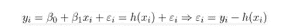
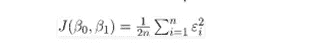
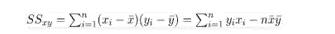
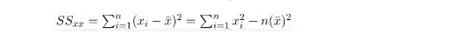
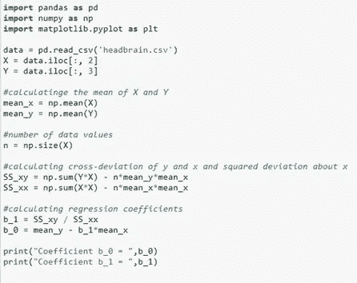
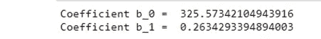
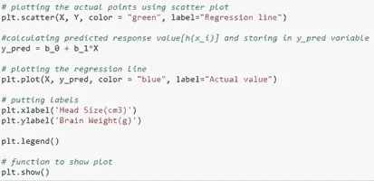
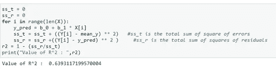
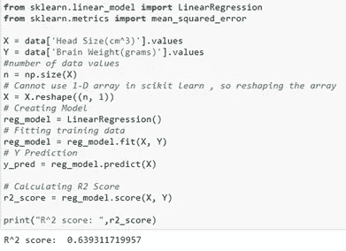

# 使用 Python 进行线性回归

> 原文：<https://medium.com/geekculture/linear-regression-using-python-7ce93ba8ff2a?source=collection_archive---------14----------------------->

在这篇博客中，你将全面了解什么是线性回归，它的应用，以及这种算法是如何工作的。在实现中，我们将看到如何从头开始在模型中应用线性回归，以及如何使用 Scikit-learn python 包。那么，让我们开始吧。

**线性回归**

线性回归通常是第一个也是最容易实现的机器学习算法之一。该回归模型使用直线显示因变量和一个或多个自变量之间的线性关系，其中两个变量都应该是定量的。

回归线的方程表示为: **h(x_i)=b_0+b_1*(x_i)** ，其中 h(x_i)表示第 I 次观测预测的响应值，b_0 表示 y 截距，b_1 表示回归线的斜率。B0 和 B1 都是回归系数。

**寻找最佳拟合回归线**

为了找到最佳拟合回归线，我们使用**最小二乘法**。

最小二乘法用于通过最小化数据点和回归线之间距离的平方和来找到最佳拟合线。最佳回归直线是具有最小值的直线。

现在让我们考虑一下

这里，E0 是剩余误差

现在，平方误差函数(J)定义为

如前所述，最佳回归直线是具有最小值的直线。因此，我们必须使残差最小，并找到 J 最小的 B0 和 B1 的值。
经过详细的数学计算，我们有了这些结论:
SS_xy 是 x 和 y 的交叉偏差之和。

SS_xx 是 x 的离差平方和。

因此，B0 和 B1 的值为:

B1 = SS _ xy/SS _ xx

b_0 = ȳ- (b_1)* x̅

**R 分数**

r 分数用于评估回归线的拟合程度，即实际数据与拟合回归线的接近程度。这个分数并不能说明这条线是否合适。低 R 值表示回归线与数据拟合不佳，而高 R 值表示模型良好，回归线拟合良好。

R = 1- (SS_r / SS_t)其中，

SS_r 是残差的平方和。

SS_t 是误差的总和。

假设 R = 0.72，我们可以说

可以参考的是，该模型解释了因变量的 72%的变化，而剩余的 28%的变化仍未被解释。

**现在让我们看看实现:**

首先，我们将计算回归系数

现在，我们将找到 h(x_i)(预测响应值)并绘制回归线

现在，我们终于可以找到 R 分数了

在这里，我们可以看到 R 值为 0.64(约为 0.64)。)表明模型是好的，可以解释因变量 72%的变异。

**使用 Scikit-learn 实现一个机器学习库应用的线性回归**

**线性回归的应用**

*   它提供了对消费者行为的洞察，并分析了定价的影响。
*   它有助于分析趋势和理解影响盈利能力的因素。
*   它有助于检查业务中的风险。
*   它有助于根据该地区的降雨量预测作物产量，根据多年的经验预测一个人的工资。

我希望这篇博客能帮助你理解什么是线性回归，它的应用，如何从头开始实现它，以及如何使用 Scikit 学习库。

谢谢大家！