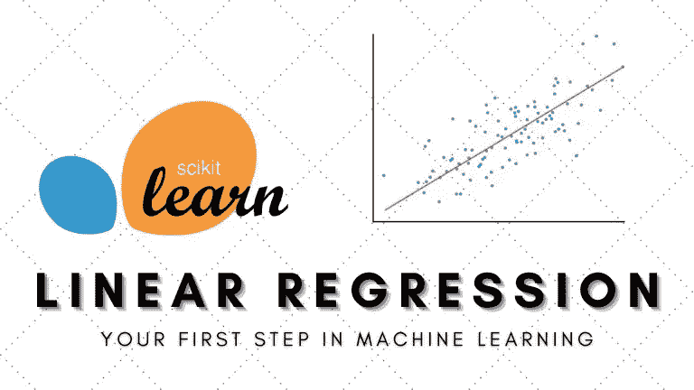
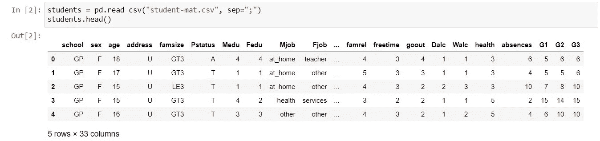
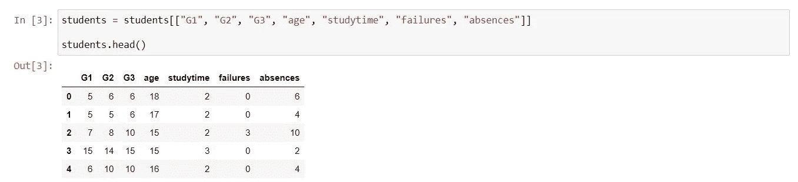
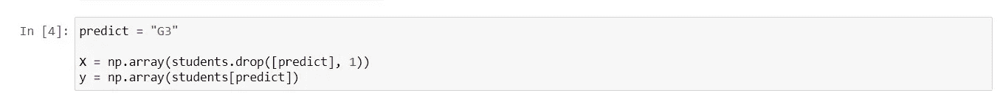
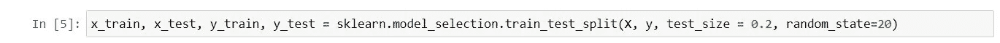
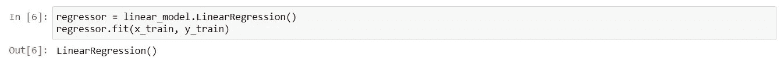
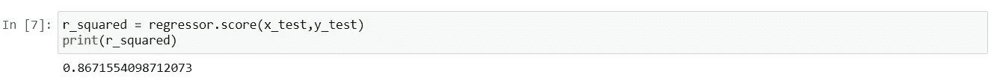
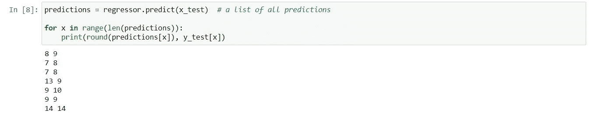

# 使用 Scikit-Learn 进行线性回归

> 原文：<https://medium.com/geekculture/linear-regression-with-scikit-learn-84730e49eb9c?source=collection_archive---------9----------------------->

## 用 Python 实现线性回归的快速指南



# 介绍

线性回归是最简单的机器学习算法，非常适合初学者。事实上，它是如此简单，以至于你今天就可以开始学习机器——就像现在。所以想开始你的机器学习之旅吗？这是一个好的开始。

# **什么是线性回归？**

线性回归的目的是确定自变量(解释变量)如何影响因变量(响应变量)。

你可以把自变量和因变量看成因果关系。自变量是你认为是原因的变量，因变量是结果。例如，在考试环境中，答对问题的数量会导致及格分数。所以答对的题(q)是因(自变量)，那么及格分数(p)就是果(因变量)。

# 使用样本数据集解释线性回归

为了分享我对我所知道的概念和技术的理解，我们将以 UCI 机器学习知识库上可用的[学生表现数据集](https://archive.ics.uci.edu/ml/datasets/Student+Performance)为例，并尝试基于学生行为和学生过去的成绩来预测成绩。

出于我们的目的，构建线性回归模型将涉及以下五个步骤:

**步骤 1:** 导入库/数据集
**步骤 2:** 数据预处理
**步骤 3:** 将数据集拆分成训练集和测试集
**步骤 4:** 将线性回归模型拟合到训练集
**步骤 5:** 进行预测

# 1.导入库/数据集

我们将从使用熊猫导入数据集开始(遗憾的是，不是这些🐼)并且还导入了 numpy、sklearn 等其他库。

```
import numpy as np
import pandas as pd
import sklearn
from sklearn import linear_model
```

注意:无论我能得出什么样的推论，我都提到了要点。



Image by Author

*   原始数据用分号分隔符隔开，我们需要做 sep = "；"。
*   `students.head()`显示了数据框中前 5 名学生的属性。

# 2.数据预处理

由于我们有如此多的属性，并且不是所有的都相关，我们需要选择我们想要使用的属性。我们可以通过键入以下命令来实现。在本演练结束时，您可以随意尝试不同的属性以及对模型的影响。

注意:记住你可以在这里看到每个属性[的描述。](https://archive.ics.uci.edu/ml/datasets/Student+Performance)



Image by Author

*   基于这些属性，我们希望预测学生的最终成绩(G3)。我们的下一步是将数据分为 X“特征”(解释变量)和 y“目标”(响应变量)。



Image by Author

# 3.将数据集分成训练集和测试集

## 为什么要进行拆分？

我们希望我们的算法学习数据中的相关性，然后根据它所学习的内容做出预测。将数据分成两个不同的集合可以确保我们的线性回归算法不会过度学习。

想想这个场景:


Image: [Unsplash](https://unsplash.com/photos/ORDz1m1-q0I)

假设你教一个孩子乘法，让他在小乘法表上练习，也就是从 1*1 到 9*9 的所有数字。接下来，你要测试这个孩子是否能够完成同样的乘法运算。结果是成功的。这孩子几乎每次都答对了。

问题？你根本不知道这个孩子是否理解乘法，或者只是简单地记住了这个表！所以你要做的是测试孩子的乘法，比如 10*12，这是在桌子之外。

这正是为什么我们需要在*看不见的*数据上测试机器学习模型。我们检查模型对测试集数据做出的预测是否与数据集中给出的预测相匹配。如果匹配，这意味着我们的模型是准确的，并且做出了正确的预测。否则，我们无法知道该算法是否已经学习了一个可概括的模式，或者只是记住了训练数据。

我们可以通过键入以下内容来拆分该数据集:



Image by Author

对于训练:测试分割，没有理想的比率。但是在本教程中，我们将使用 80: 20 的比例。即 80%作为训练集，20%作为测试集。当然，您可以随意使用其他比率，例如 70:30、90:10 等

# 4.将线性回归模型拟合到训练集

现在我们的数据已经准备好了，我们的第一步是使简单的线性回归模型适合我们的训练集。为此，我们将调用 **fit** 方法——函数来将回归变量拟合到训练集。

我们需要将 X_train(特征矩阵的训练数据)拟合到目标值(y_train)中。因此，该模型学习相关性，并学习如何根据自变量预测因变量。



Image by Author

# 5.做预测

为了了解我们的算法在测试数据上的表现，我们将使用度量𝑅。𝑅分数显示了回归模型与观察数据的拟合程度。例如，70%的 r 平方表明 70%的数据符合回归模型。通常，较高的 r 平方表示模型更适合。但是，需要注意的是，高 r 平方并不总是对回归模型有利。

我们可以使用`.score().`获得𝑅的值



Image by Author

对于这个特定的数据集，得分约为 87%。现在，如果我们回想一下为什么我们开始这个项目，我们的目标是训练一个线性回归模型，根据学生的行为和学生过去的成绩来预测成绩。看到一个分值很酷，但我们更想看到的是我们的算法在特定学生身上的表现。为此，我们将用这行代码打印模型的预测成绩和我们的实际最终成绩:



Image by Author

我们看到大多数的分数都非常接近实际分数，例如，我们预测第一个学生的最终分数是 8 分，结果是 9 分。

## 完整代码:GitHub Gist

您可以在该数据集中尝试不同的属性，并查看它如何提高或降低模型的𝑅分数。

# 一些线性回归假设

1.  **线性**:X 和 y 的关系是线性的。
2.  **没有或很少多重共线性**:当自变量之间的相关性太高时，就会出现多重共线性。
3.  **正态**:对于 X 的任意固定值，Y 是正态分布的。

# 线性回归的其他实际应用

*   **业务:**随着房屋面积的增加预测房价。
*   **农业:**测量肥料和水对作物产量的影响。
*   **医疗保健:**预测烟草消费的影响及其与心脏病的关联。

# 结论

请注意，我们关注的是使用 Python 的 Scikit-Learn 库实现线性回归，我们没有对线性回归进行任何数学解释。为了有所帮助，我在下面的资源列表中添加了非常棒的教程，以最简单的方式解释了线性回归背后的数学原理。

# **资源:**

[1][Tech With Tim 的 Python 机器学习播放列表](https://www.youtube.com/watch?v=ujTCoH21GlA&list=PLzMcBGfZo4-mP7qA9cagf68V06sko5otr)

[2] [吴恩达的线性回归](https://www.youtube.com/watch?v=kHwlB_j7Hkc)

[3] [通过 StatQuest 进行线性回归](https://www.youtube.com/watch?v=nk2CQITm_eo)