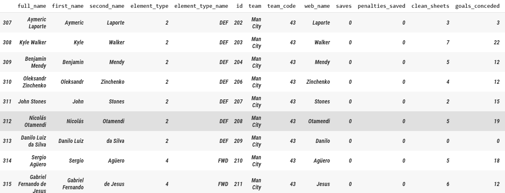
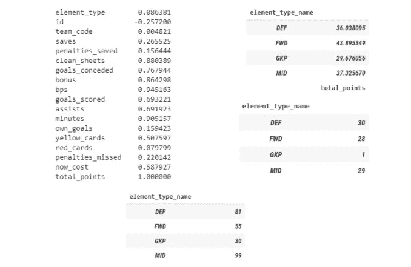
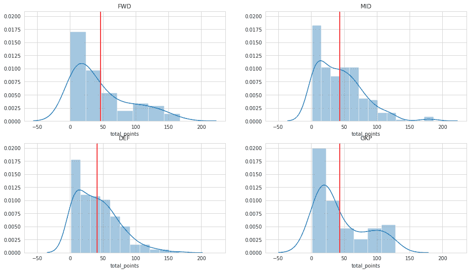
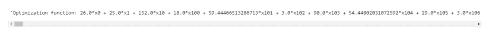
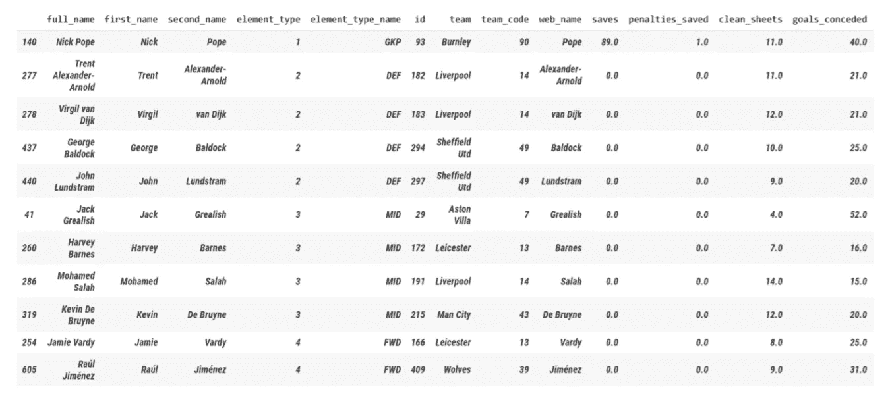

# 线性优化 PL 梦幻联盟的团队

> 原文：<https://medium.com/geekculture/linearly-optimising-teams-for-pl-fantasy-league-11931aed18b7?source=collection_archive---------27----------------------->

## 使用 Google Colab (IPython)上的线性编程，使用 PL 的球员数据预测您自己优化的 FPL 队


Participating in Football from Home | Photo by [JESHOOTS.COM](https://unsplash.com/@jeshoots?utm_source=medium&utm_medium=referral) on [Unsplash](https://unsplash.com?utm_source=medium&utm_medium=referral)

就观众和参与者的数量而言，足球是世界上最受欢迎的运动之一。规则很简单，因此这项运动可以在任何地方进行，从足球场到公园到你自己的街道。

虽然不可能每个人都专业地参与这项运动，但联合会已经设计了一些方法来让更多的人参与进来，无论是视频游戏还是通过手机上这些令人上瘾的小应用程序，称为幻想联盟。

# 什么是幻想联盟？

梦幻联盟是一项团队运动比赛，球迷们可以根据不同球员的工资、状态、天赋和其他标准组建他们认为最好的球队。得分最高的队伍将从比赛组织者那里获得某种奖励，而得分的高低又取决于运动员在比赛周的表现。

> 对于非专业人士来说，幻想联盟是展示他们分析这项运动的天赋的一个很好的方式，但也可能变得非常上瘾，并可能在涉及真实金钱的联盟中变得危险(特别是在非官方幻想联盟的情况下)。

## 梦幻英超

梦幻超级联赛(FPL)是英格兰足球超级联赛的梦幻联赛。它是比赛的官方梦幻联赛，由英超联赛自己管理。

他们有一套特定的规则，根据这套规则进行比赛和计分，球员的价格也由英超联赛根据球员的表现、状态和其他属性自行决定。

> 一旦用户注册了这个联赛，他们将获得 1 亿英镑(虚拟货币)，他们需要花这笔钱从 20 支球队中选择 15 名球员参加英超联赛，该赛季将持续一整年，共分为 38 个比赛周。

他们选出的每名球员都根据他们在英超联赛现场比赛中的表现得分。这些分数根据每个玩家的活动而有所不同。

例如，玩家通过以下方式获得积分:

1.  *打比赛*
2.  *进球*
3.  *协助队友继续前进并进球*
4.  *如果玩家玩得特别好，奖励点数*
5.  *保持球门不失(不针对前锋)*
6.  *保存罚款*

以下提到的部分或全部原因可能会导致扣分:

1.  *收到黄牌或红牌*
2.  *失球(仅限守门员和后卫)*
3.  *罚失一个点球*
4.  *打进乌龙球*

# 什么是线性规划？

线性规划(LP，也称线性优化)是一种在数学模型中**达到最佳结果**(如最大利润或最低成本)的方法，其要求由**线性关系表示。**

> 线性规划最好的一点是，一旦你写下了一个线性目标和约束，你就完成了。之后你需要做的就是把它插入一个求解器，然后从结果中受益。

# FPL 和线性规划有什么关系？

FPL 团队的选择被证明是一个约束优化问题。在本文中，我通过考虑不同的约束条件，如价格、球员形式等，将这个问题转化为一个线性规划问题。线性目标是使团队获得的分数最大化。

此外，这些约束被用来产生一个团队，该团队基于当前场景中可用的数据表现最佳。

# FPL 的规则

有许多基于各种事物的规则，但是主要的规则和为了本文的目的应该考虑的规则是:

1.  你被限制在 **1 亿**的预算内选择玩家(其中更好的玩家要花更多的钱)；
2.  你可以挑选总共 **15 名球员**，其中应该有 **2 名守门员**、 **5 名后卫**、 **5 名中场**、 **3 名前锋**(球员类别由 FPL 决定)；
3.  在这 15 名玩家中，你必须选择 11 名玩家在某个游戏周进行游戏。这 11 人应该包含 1 名门将，至少 3 名后卫，至少 2 名中场，至少 1 名前锋。*只有这 11 位玩家会获得积分*；
4.  一个队最多只能选 3 名队员；

# 方法学

考虑到所有的规则，我决定根据我的成本和其他限制因素选择最好的 15 名球员；并从那里购买 11 个最好的球员和 4 个最便宜的球员(因为替补球员没有得到积分)。此外，值得注意的是，我正在考虑与预测相关的先前数据，但由于足球也是一项涉及球员状态的游戏，这似乎是一个公平的考虑。

现在，必须将规则转换为约束条件，并将目标转换为线性目标，使其成为线性规划问题，因此线性目标函数变为**最大化点数**，约束条件如下:

1.  选择 15 名球员(约束 1)
2.  选择 2 个守门员(约束 2)
3.  选择 5 名防守队员(约束 3)
4.  选择 5 名中场队员(限制 4)
5.  选择 3 名前锋(约束 5)
6.  使用少于 1 亿(约束 6)
7.  不要从一个团队中选择超过 3 名球员(限制 7)

这显然像是一个线性规划问题，因此我决定继续把它作为一个问题来处理。

> 我决定使用 Google Colab，因为它既高效又快捷。我还使用了 Python 的`PuLP`编程库，因为它允许我们以非常直观的方式写下目标函数和约束，并立即解决它们。

## 导入数据

首先，我从这个[](https://fantasy.premierleague.com/api/bootstrap-static/)**链接，借助他们 JSON 格式的 API，从梦幻英超网站导入了 FPL 球员的数据。现在，为了在`Google Colab`中使用它，我必须使用 Python 的`Pydrive`库。**

```
!pip install pydrivefrom pydrive.auth import GoogleAuth
from pydrive.drive import GoogleDrive
from google.colab import auth
from oauth2client.client import GoogleCredentialsauth.authenticate_user()
gauth = GoogleAuth()
gauth.credentials = GoogleCredentials.get_application_default()
drive = GoogleDrive(gauth)
```

**这段代码简单地验证了使用 Google Drive 的用户，输出中出现了一个链接，用户必须单击该链接，然后他们必须将给定的文本复制回提供的空间。**

**接下来，必须将 JSON 文件上传到他们的 Google Drive 上，并使用它的文件 id。可以通过链接共享给定的文件来找到文件 id，在链接中，您将获得类似于“1 F4 zbura 1 uq 6 kki 2 xmuon 37 atwakrsk 8”的字符串，只需复制它并在下一个代码片段中使用它来将文件添加到您的 Google Colab。**

```
downloaded = drive.CreateFile({'id':"1f4ZbuRae1uQ6kkI2XMuon37ATWAKrsK8"})   
# replace the id with id of file you want to accessdownloaded.GetContentFile('data.json')        
# replace the file name with your file
```

**现在，JSON 文件有许多不同玩家的数据列，其中一些对我们有用，而另一些则没有用。**

## **提取玩家数据**

**这里，数据集中有许多要素。我清理了这些数据，只考虑有用的特性。我还连接了球员的名字，以便在一列中更好地识别球员。我从原始 json 文件的其他区域绘制了每个玩家的位置和团队，以制作一个更全面的数据集。**

****

**Players data extracted from the JSON file | Image by Author**

## **探索提取的数据**

**我想看看玩家在赛季中获得的总积分与哪些特征相关。**

****

**Correlation of total points with different columns, mean of total points in relation to the position, median of total points in relation to the position and the number of players in a position | Image by Author**

**这里，可以清楚地看到，这些点与以下各项高度相关:**

1.  **干净的床单:就像干净的床单给玩家分数一样，显然干净床单多的玩家有更多的分数。**
2.  **失球:虽然不应该是这样，但是失球也随着球员比赛次数的增加而增加，这进一步导致分数的增加。**
3.  **奖励分(bps):这意味着一个球员发挥得好，显然与总积分直接相关。**
4.  **分钟:和上一个游戏一样，玩家玩的时间越长，分数越高。**

**现在，更深入地观察数据细节，从平均值和中位数可以看出*前锋得分最高，而守门员得分最低*。但是，我们也必须记住，前锋和守门员的数量远远少于中场和后卫，因为这将有助于以后对数据做出结论。**

## **可视化探索数据(核密度函数)**

**考虑到点数的差异，我认为查看一些内核密度估计来显示基于玩家位置的点数分布是一个好主意。这应该给出了关于每个位置的*分数分布的更多指示。***

****

**Kernel Density Estimations in relation to players’ positions | Image by Author**

**大部分数据都是正偏态，略偏轻点(`kurtosis > 3`)，然而门将分布似乎是双峰的。这是有意义的，因为大多数俱乐部一次会有 2-3 名守门员，并且在大多数时间里会扮演更好的守门员，从而有更多的时间获得积分，而其他的 0 到几场比赛，因为其他人只会在第一选择守门员受伤或需要休息的时候被调换。**

## **归罪**

**现在，我们在数据上有一些限制，其中一个导致了正偏差和 leptokurtic 数据，解释是*有许多球员被转移到英超联赛，没有历史数据，在前几个赛季没有积分*，这使得很难做出最佳选择。**

**但这进一步显示了我假设*玩家会复制他们前几季的表现或者至少表现类似*的方法的幼稚。本质上，我想选择一些新转会的球员，因为我认为他们会努力给人留下深刻印象，并有可能表现得更好。**

**现在，我开始输入这些数据以使其可用。价值被分配给球员的基础上，他们的成本，然后球员有相同的成本和立场，他们各自的价值统计的帮助下，平均或中位数相同。一些高斯噪声乘以特定统计的标准差被添加到估算值，以模拟没有数据的球员的随机表现机会，并添加一些方差到数据集，因为有大量的 0 得分球员(25.55%)。为了确保方差不会太不稳定，我使用了除以 1.5 的受控高斯分布。**

**在这里，我使用了许多嵌套循环来存储基于特征列的特定于玩家位置和成本的中位数和标准差。我确保使用绝对值，以避免负插补，并帮助将数据倾斜到更正态的分布，并与转会球员希望表现出色以留下深刻印象的假设保持一致。我稍微柔化了高斯噪声以避免不稳定的数据。插补后，我将分布和核密度估计可视化，数据开始类似于高斯曲线，除了守门员估计似乎仍然是双峰，其原因已在前面说明。**

****

**Kernel Density Estimations in relation to players’ positions after accreditation | Image by Author**

## **建模线性问题**

**因为我的数据集现在已经可以使用了，所以我开始将问题建模成线性元素系统。我从问题建模开始，尽我所能选择 11 名最好的球员。我从`PuLP`导入了所有东西，并声明了我的线性规划问题，并将其命名为*“梦幻团队”*，并指出这是一个最大化线性规划问题，因为我希望最大化我可以得到的点数。**

****决定决策变量****

**我决定使用每个可用的玩家作为决策变量，他们的值是二进制的，我选择他们(1)或者我不选择他们(0)。这是通过将变量转换为整数变量来实现的。有 628 名球员供我选择，因此有 *628 个决策变量*。**

****开发优化功能****

**接下来，我分配了*优化函数*。这就是我试图最大化的，正如之前在我的问题模型中所陈述的。每个玩家在前一个赛季都获得了给定的点数，或者他们已经被估算了基于中位数+(软高斯噪声*标准偏差)的值，这取决于该玩家和该成本范围内相同位置的其他玩家的给定成本和位置。这些数据被分配给每个决策变量(参与者),并用于构建如下所示的函数。**

****

**Optimisation Function | Image by Author**

****考虑现金限制****

**记住，我只有 1 亿英镑(代码中的 1000 英镑)可以花在整个球队上，我的策略是在购买了最便宜的 4 名替补球员后，根据我的可用现金选择最好的 11 人。我能选择的最便宜的播放器总共花费了 1700 万英镑(代码为 170 英镑)。因此，这给我留下了 8300 万(代码 830)来挑选表现最好的 11 名球员。我设置了限制，这样我就可以花 830 英镑或更少的钱来选择最好的 11 名球员。**

****考虑玩家约束****

**接下来，我根据我要选择的玩家数量分配约束。决定采用传统的 4-4-2 阵型(4 名后卫，4 名中场和 2 名前锋以及守门员)，因为数据和我们所做的探索中有大量的后卫和中场可用。我让约束反映了这一点。约束所代表的是，在所有的决策变量中，有些是后卫，有些是中场，有些是前锋；我确定我选择了 4 名后卫，4 名中场和 2 名前锋。**

1.  ***守门员约束— 1 名守门员***
2.  ***防守队员约束— 4 名防守队员***
3.  ***中场约束——4 名中场***
4.  ***正向约束— 2 个正向***

****考虑团队约束****

**我确保了从任何一个给定的队伍中选择最多 3 名球员，而不是更多。为了实现这一点，我使用了一个`hash table`来存储所有的球队和球队中的球员(决策变量),其中每个球员的值都等于 1，这样我就只能选择尽可能多的球员，在本例中是 3 个。**

****解线性问题****

**现在我们已经输入了所有的决策变量、约束和优化函数，是时候最终解决线性规划问题了！我也曾断言这个结果是最佳结果。**

# **结果**

**最后，为优化模型之后做出的所有决策构建了一个`pandas dataframe`,并将其附加到原始数据集，以查看谁被选入梦之队！**

****

**Team created for FPL following the rules and constraints | Image by Author**

**这是由模型建立的团队。作为一个足球迷(也是一个经常和 FPL 比赛的人)，我可以肯定地说，这是一支非常强大的球队，当赛季在新冠肺炎之后重新开始时，它实际上给了我很多分。**

# **结论**

**虽然足球是一项任何球员都可以改变比赛的比赛，统计数据也可以改变，但数据和统计数据通常倾向于真相。此外，这项运动不仅是在球场上进行的，也是在精神上进行的，形式很重要，这反过来又与价格有关。考虑到所有这些事情，我可以说我能够建立一支在那个赛季看起来非常强大的球队。足球赛季在那个时候受到了新冠肺炎的阻碍，但当它恢复时，我使用了这支球队，实际上作为一次实验，我自己得到了很多分。**

**我仍然使用几乎相同的脚本，每周更新数据，以使正确的团队做出一些统计上正确的决策，尽管我不完全依赖相同的脚本，因为它仍然是一种幼稚的方法。**

**总之，可以说，无论足球比赛多么复杂，但是如果我们考虑正确的方程、约束和变量，我们可以借助线性规划预测几乎所有接近完全准确的结果*。***

****最后，* *如果你面临任何困难，请随时联系我，或者你可以看看我的 github gist* [***这里***](https://gist.github.com/shashankcic/2a54a8dc49112ed20e851e61aca93fe4) *(它可能有点更新，但有足够的评论来帮助你通过它)任何疑问。****