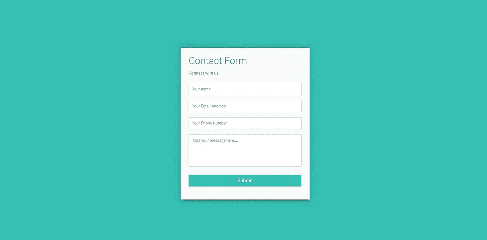
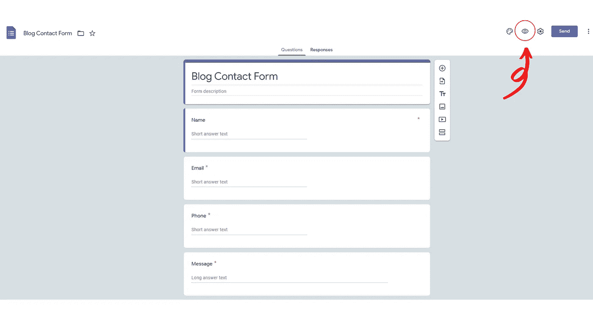
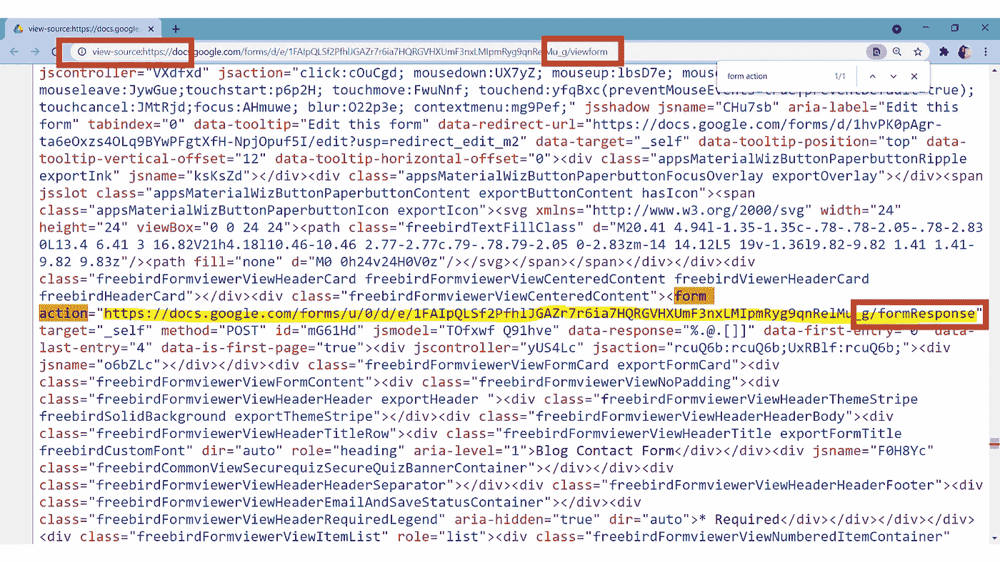
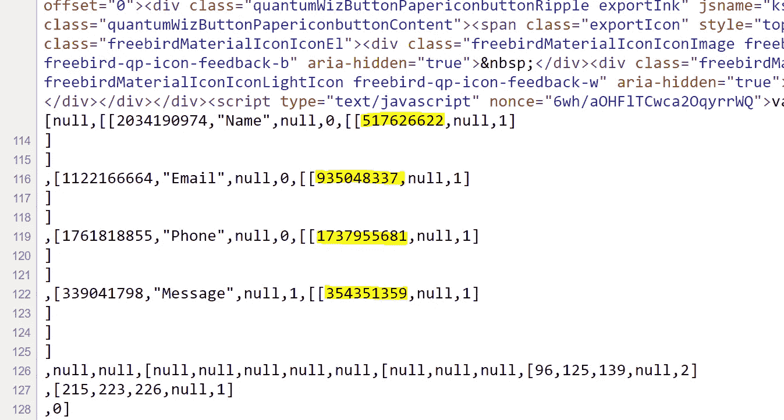
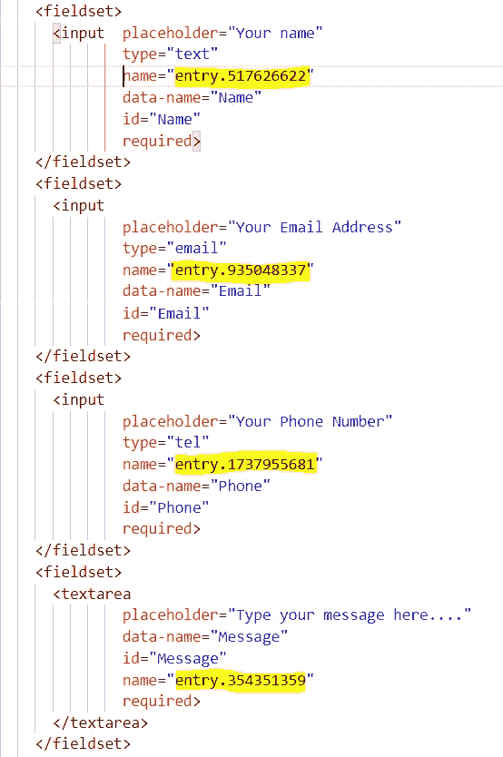
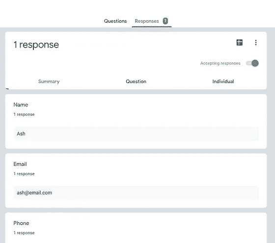
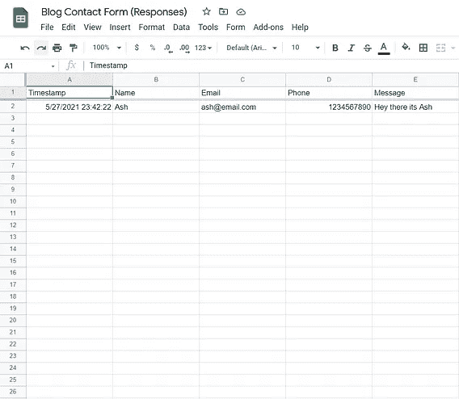

# 通过 Google Forms 将 HTML 表单链接到电子表格。

> 原文：<https://medium.com/geekculture/link-your-html-form-to-a-spreadsheet-via-google-forms-9024f0611d82?source=collection_archive---------5----------------------->

## 用最简单的方法在你的网站上记录联系方式回复！

我们经常在投资组合或公司网站上找到联系方式。他们充当公司和社会之间的媒介。如果我们可以将网站上的表单链接到 google forms，并在动态更新的电子表格中获取数据，那该有多酷？这篇博客将带你通过一系列的步骤来达到同样的目的。我发现这个方法非常简单，万无一失，所以我们开始吧。

先决条件—在开始本教程之前，准备好基本的 HTML 表单代码。

我首先创建了一个 HTML 表单示例。我从这个神奇的代码笔中获得了样式表和格式。我要感谢造物主创造了这件美丽的作品。它现在看起来像这样—

Sample contact form

让我们开始吧。首先，创建一个与 HTML 表单具有相同字段的 google 表单。甚至标记你想要标记的字段 ***'*** *必填* ***'*** 。它看起来会像这样。

现在点击表格右上方的 ***眼睛图标*** 。这将生成表单的预览。确保它的 URL 以`**‘…/viewform’**`结尾

现在在这个页面上按`**ctrl+u**` 可以看到源代码。然后按下`**ctrl+f**` 以便在该页面中搜索短语。现在我们要搜索的短语是`**form action**`。结果应该会给你一个标签，标签的 URL 以`**‘…/formResponse’**` 结尾。复制这个 URL 并保存在某个地方以备将来使用(可能在一个. txt 文件中)。

向下滚动同一页面，您会看到类似这样的内容。将这些数字(以同样的顺序)和上面的 URL 一起复制下来。

回到你的 index.html，稍微修改一下你的表单组件。现在，我们将把`**name**`属性添加到我们的每个输入字段中，并赋予它们与上面看到的数字相对应的值。像这样。注意我们是如何为每个字段编写`**name = “entry.number”**`的。确保每个输入字段都有一个 id。

现在，在关闭`**</body>**`标记之前，将下面的代码复制并粘贴到`**<script>**`标记中。将您之前提到的`**…/formResponse**`网址添加到下面的变量网址中。这里，我们使用 ajax 提交表单。不要忘记用你自己的 google 表单生成的**来更新字段编号。您甚至可以添加警告消息来显示您的表单是否已提交。**

最后一步是在提交表单时返回这个函数的结果。这可以通过您需要在您的`**<form>**`标签的开头添加的下面一行代码来完成。

`**<form id=”contact” onsubmit=”return postToGoogle();”>**`

我们完了。我们的表单应该启动并运行。你可以生成谷歌电子表格，在一个地方查看所有的回复和统计数据。

这就是我们如何使用 ajax 在 HTML 中创建一个全功能的联系人表单。希望你能从这个小教程中学到一些新东西。谢谢你。
链接到 HTML 文件:[此处](https://drive.google.com/file/d/1_qIIVSOwcCpz7L-vWTTiQ6JqFRjVtFAg/view?usp=sharing)