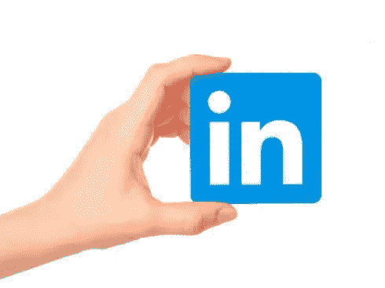

# Linkedin 2021 功能—将您的个人资料保存为 PDF 格式

> 原文：<https://medium.com/geekculture/linkedin-2021-feature-save-your-profile-to-pdf-32a667424ad0?source=collection_archive---------6----------------------->

Linked in

# 介绍

LinkedIn 是一个社交网络平台，我们可以在这里与来自世界各地的不同人联系，它也专注于职业发展和职业网络。它帮助我们与同事联系，发展业务联系，展示技能和工作经验。我们可以在许多方面使用 LinkedIn，但最重要和最关键的功能…