# Linkedin 发布 Python 的参与度综合得分

> 原文：<https://medium.com/geekculture/linkedin-posts-engagement-composite-score-with-python-9e7e4d80d64a?source=collection_archive---------9----------------------->


Photo by [Tierra Mallorca](https://unsplash.com/@tierramallorca?utm_source=medium&utm_medium=referral) on [Unsplash](https://unsplash.com?utm_source=medium&utm_medium=referral)

## **如何通过三层综合评分(金、银、铜)对贵公司的帖子参与度进行评级。**

## **简介**

**Youhosty** 是一家意大利物业管理初创公司，具有很高的技术影响力，提供与中短期租赁相关的优质服务。

他们提供广泛的服务，从物业的管理到客人的管理，从物业的清洁到维护，从市场营销到资金流动的管理。

他们是一个专业团队，多年来一直在该领域工作，并决定联手为业主提供完整的服务。

要了解更多关于 Youhosty 的信息，请访问他们的英文网站[这里](https://www.youhosty.com/en-gb)。

## **数据项目概述**

在这个项目中，我们参考 Youhosty 的 Linkedin 个人资料帖子数据来分析帖子的参与度。收集的数据涉及 2021 年 1 月 1 日至 2022 年 1 月 31 日期间。

这些帖子的主题是混杂的，其中一些专注于推广出租物业，另一些专注于行业洞察和更新。

主要范围是寻找是否有模式之间的职位组成部分(词，句子等)和用户参与度，以创建一个评分系统，以评估参与的职位。

评分系统将基于一个等级系统(金、银、铜)，其中每个等级将有不同的分数。

层级越高，分数越高。评分系统实施后，我们将创建一个词云，以查看帖子中使用最多的词，以确定最重要的主题。

这些帖子是意大利语的。我将提供最重要的单词和句子的翻译。你可以在我的 [github 库](https://github.com/marcello-calabrese/Linkedin_engagement_composite_score)中找到完整的代码

**关键问题是**:

*考虑到 LinkedIn 是一个专业社交网络，除了工作之外，与职位相关的帖子主要用于推广见解和思想领导力内容，公寓租赁推广帖子是金牌和银牌的一部分，还是见解帖子是金牌和银牌的获得者？*

## **关于数据集**

该数据集是通过从 Youhosty 帐户下载 Linkedin 帖子数据收集的。数据集包含以下列:

- **发文日期:**发文日期

- **更新帖子**:帖子的文本

- **浏览量**:帖子的浏览量

- **点击量**:帖子的点击量

- **点击率**:帖子点击率

- **赞**:帖子上的赞数

- **评论**:帖子的评论数

- **股份**:帖子上的股份数

- **关注**:帖子关注人数

- **啮合**:岗位上的啮合数

## **行动计划:**

-清理数据(数据类型调整、缺失值、特殊字符、表情符号、标签)

-描述性分析:喜欢、分享、评论和参与计数、相关模式(如果有)

-评分系统的实施

-最终确定数据框架，以实施最具吸引力的帖子的综合评分和词云

## **1。清理数据(数据类型调整、缺失值、特殊字符、表情符号、标签)**

在这一部分，我们将清理数据，删除丢失的值、特殊字符、表情符号和标签。我们还将调整列的数据类型。

但是首先，让我们导入分析所需的库。

我们将使用的库包括:

- **熊猫:**操纵数据

- **Numpy:** 操作数据

- **Matplotlib:** 绘制数据

- **Seaborn:** 绘制数据

- **清理文本:**清理文本

- **文字云:**绘制文字云

```
#import main libraries for reading the excel file, cleaning the text

import pandas as pd
import numpy as np
import matplotlib.pyplot as plt
import seaborn as sns
import neattext as nfx

# Reading the file with posts into a dataframe

df = pd.read_excel('youhosty_updates_1_jan_2021_23_jan_2021.xls', sheet_name='Update engagement')
```

*数据集概述:*

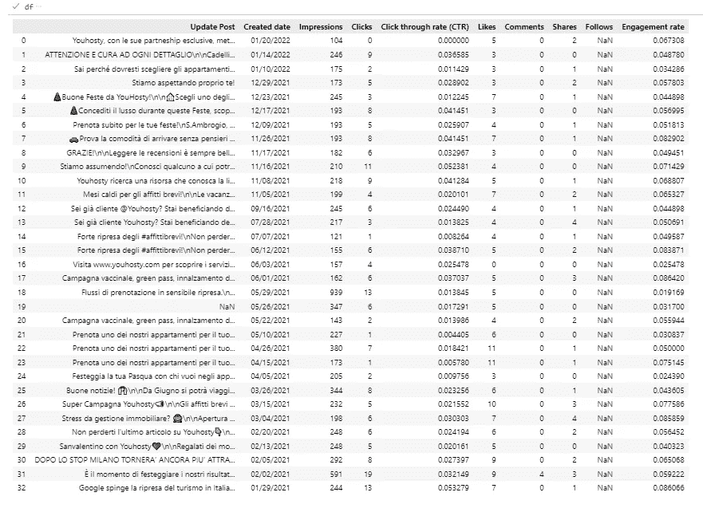

Image by author

*删除缺少值的行:跟随*

```
# drop the column with missing values ==> Follows

df.drop(columns='Follows', axis=1, inplace=True)

# drop the rows with missing values in the column Update Post and reset the index

df.dropna(axis=0, inplace=True)

df.reset_index(drop=True)
```

*已清理的数据集:*

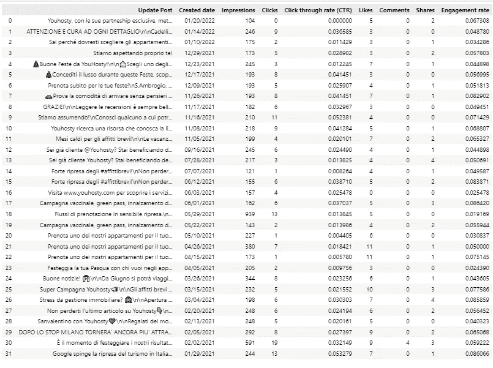

Image by author

> **帖子指标摘要**

- **总印象数:** 7852

- **总点击量:** 192

- **平均点击率:** 0.02

- **总点赞数** : 175

- **总评论** : 4

- **总股份** : 42

- **平均参与率** : 0.06

*使用 neattext 库从特殊字符、表情符号、标签等更新文章栏中清除文本..*

```
# apply the  cleaning text function to the column Update Post

def clean_column(column):
    # remove user handles
    df['Cleaned_posts'] = df['Update Post'].apply(nfx.remove_userhandles)
    # remove emojis
    df['Cleaned_posts'] = df['Cleaned_posts'].apply(nfx.remove_emojis)
    # remove hashtags
    df['Cleaned_posts'] = df['Cleaned_posts'].apply(nfx.remove_hashtags)
    # remove special characters
    df['Cleaned_posts'] = df['Cleaned_posts'].apply(nfx.remove_special_characters)
    # remove website
    df['Cleaned_posts'] = df['Cleaned_posts'].apply(nfx.remove_urls)
    # remove punctuations
    df['Cleaned_posts'] = df['Cleaned_posts'].apply(nfx.remove_punctuations)
    # remove short words
    df['Cleaned_posts'] = df['Cleaned_posts'].apply(nfx.remove_puncts)
    df['Cleaned_posts'] = df['Cleaned_posts'].apply(nfx.remove_stopwords)
    df['Cleaned_posts'] = df['Cleaned_posts'].apply(nfx.remove_shortwords)
    df.drop(columns='Update Post', axis=1, inplace=True)
    return df

clean_column(df['Update Post'])

# move a the cleaned posts column before impression column

def move_column(df, col_name, before_col_name):
    col_index = df.columns.get_loc(col_name)
    before_col_index = df.columns.get_loc(before_col_name)
    col_index_before = col_index - 1
    df.insert(before_col_index, col_name, df.pop(col_name))
    return df

move_column(df, 'Cleaned_posts', 'Impressions')
```

*数据集已清理:*

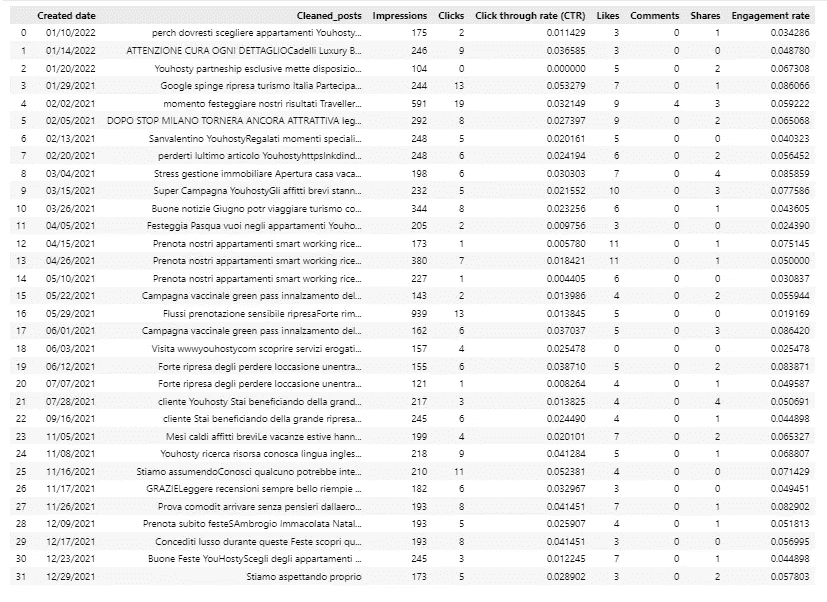

Image by author

## **2。描述性分析:喜欢、分享、评论和参与计数、相关模式(如果有)**

检查数字变量之间的相关性，以确定更强的关系，从而确定为敬业度评分模型选择的关键指标

```
corr = df.corr()

sns.heatmap(corr, annot=True)
```

*关联热图*

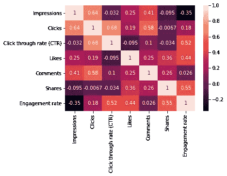

*数字特征的方框图*

```
# boxplots of key numerical metrics

df.boxplot(['Likes','Clicks','Shares', 'Comments', 'Click through rate (CTR)'], figsize=(15, 10))
```

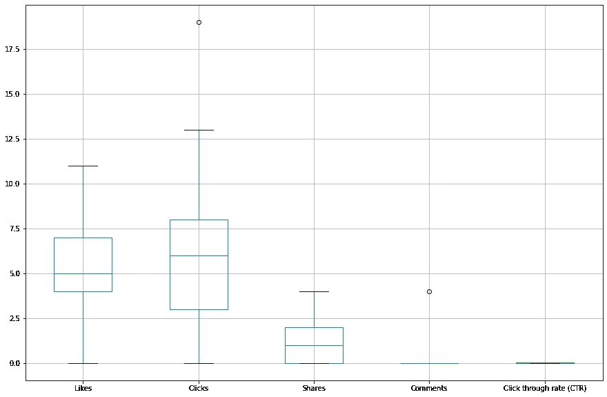

Image by author

*将入职率按降序排列，以掌握哪类岗位的入职率最高*

```
# sort by Engagement rate descending to start to graps which kind of posts topics are getting highest engagement rate

df.head(5).sort_values(by='Engagement rate', ascending=False)
```


Image by author

**观察热图和箱线图:**

-点击率和点击量高度相关，因此我们可以降低点击率

-分享和喜欢显示相关性(不高)

-点击也显示了与喜欢的一些相关性

-点击、喜欢和分享应该是我们要考虑的参与度

-印象和参与度之间呈负相关

-查看点击、喜欢、分享等的前 5 名，似乎涉及行业话题、见解和研究的帖子推动了大部分参与

**特色工程的下一步:**

*   仅保留分享、喜欢、点击、印象和点击率以及参与度，以建立我们自己的参与度比率，作为创建参与度评分的基础
*   我们排除 CTR 是为了让我们的参与度评分更清晰，不会扭曲数据。
*   我们排除评论，因为它们提供了太多的“零”值，对我们自己的参与度效率没有任何帮助。

## **3。综合评分系统实施**

我们将在清理数据集(不包括评论、CTR 点击率和 LinkedIN 参与度)后创建我们的参与度指标。我们自己的参与度的功能将只包含分享，喜欢，点击，印象，评论，创建日期

```
df_clean.loc[:, 'Own_Eng_rate'] = (df_clean['Clicks'] + df_clean['Likes'] + df_clean['Shares']) / df_clean['Impressions']
```

*根据我们自己的参与度对前 10 个帖子进行排序，我们创建了*

```
df_clean.head(10).sort_values(by='Own_Eng_rate', ascending=False)
```

*按最高 Own_Eng_rate 排序的数据集*

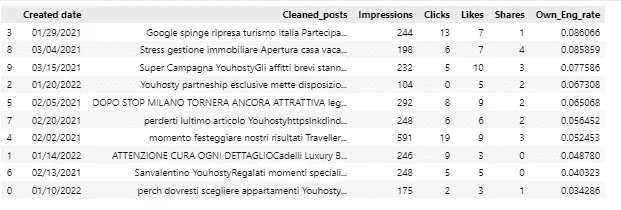

Image by author

**初步观察结果**

查看参与度排名前 10 的帖子，我们已经看到与行业洞察或更新相关的帖子位于顶部。

**eng 率最高的话题(8.6%)** 比如说(意大利语:‘Google spinge ripresa turismo ..’)英文:“谷歌推动意大利旅游业复苏

此外，“与您的物业一起参与恢复短期租金……”**指的是谷歌关于短期市场复苏的文章，并邀请业主参与复苏**(提醒读者，这些帖子指的是 2021 年 1 月至 2022 年 1 月的日期范围，因此介于 COVID 疫情和最后一波之间。

意大利是受 COVID 重创的国家之一，租赁行业也遭受重创。

## **为帖子创建综合评分，以显示最吸引人的帖子**

为了创建合成分数，我们将导入 sklearn 库 Standard Scaler 和 MinMaxScaler。

```
# Import of the normalizer and scalers from sklearn

from sklearn.preprocessing import StandardScaler, MinMaxScaler
#initialize the scaler and the Min Max scaler
scale = StandardScaler()
min_max = MinMaxScaler()

# we isolate the numerics columns to calculate the scaling and after generate the composite score.

numerics = ['int64', 'int64', 'int64', 'int64', 'float64']
df_clean.select_dtypes(numerics)

# create a copy to attach the composite score to the original data frame

df_clean_feat_2 = df_clean.copy()

# scale the data and we check the first 5 rows

df_clean_feat_2[numerical_columns] = scale.fit_transform(df_clean_feat_2[numerical_columns])
df_clean_feat_2.head()
```

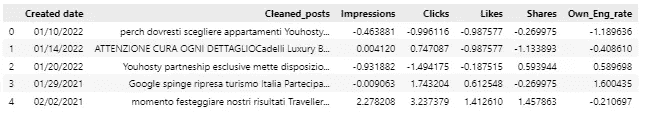

Image by author

*创建添加列的综合得分*

```
# Create a composite score adding the columns

df_clean_feat_2['Composite_Score'] = df_clean_feat_2.sum(axis=1)

df_clean_feat_2.head(5)
```

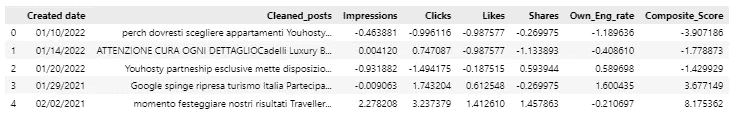

Image by author

```
# Scale the Composite_Score table with a min max scaler of a scale of 0 to 5

df_clean_feat_2['Composite_Score'] = min_max.fit_transform(df_clean_feat_2[['Composite_Score']]) * 5

# Sort the Composite Score from highest to lowest

df_clean_feat_2.sort_values(by='Composite_Score', ascending=False)
```

*综合得分范围在 0(低)到 5(高)之间的最终数据集*

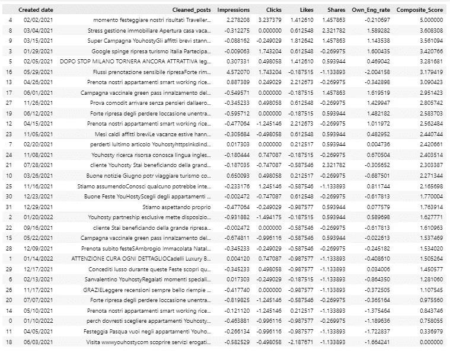

Image by author

*现在，下一步是使用 Pandas 创建一个包含金、银、铜等级的帖子参与等级系统。qcut*

```
# Now we create a posts engagement tier system with Gold, silver and bronze tiers using Pandas.qcut

df_clean_feat_2['Eng_tiers'] = pd.qcut(df_clean_feat_2['Composite_Score'], 3, labels=['Bronze', 'Silver', 'Gold'])

# After creating the Composite score tiers Gold, Silver, Bronze, we sort them to show Gold on top and we visualize how many posts there are in the different tiers using DEX
df_clean_feat_2.head(25).sort_values(by='Composite_Score', ascending=False)

# Now we add composite score and eng tiers score to the original dataframe

df_clean['Composite_Score'] = df_clean_feat_2['Composite_Score']

df_clean['Eng_tiers'] = df_clean_feat_2['Eng_tiers']
```

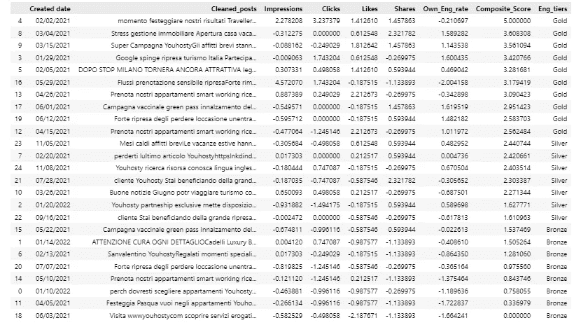

Image by author

## 4.根据综合得分等级(金、银、铜)创建包含前 25 篇帖子的单词云

```
# To create the wordcloud we select the top 25 posts based on the composite score tiers

df_cl_top25 = df_clean.head(25).sort_values(by='Composite_Score', ascending=False)
```

*前 25 篇帖子的数据集*

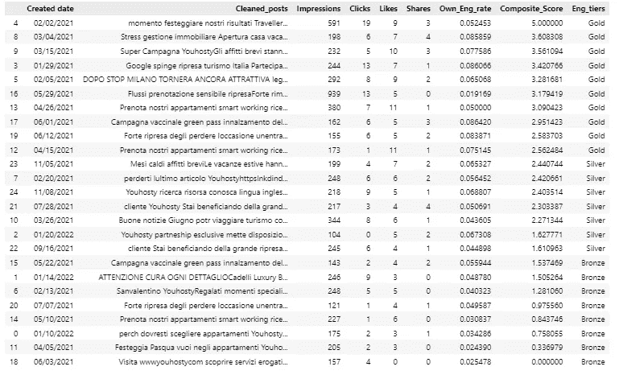

Image by author

*使用 wordcloud 库创建 word cloud*

```
#import wordcloud library
from wordcloud import WordCloud
#function to get the wordcloud
def create_wordcloud_from_column(df, col_name, title, figsize=(20, 20)):
    wordcloud = WordCloud(background_color="white", max_words=1000, max_font_size=40, scale=3,
                          random_state=1).generate(str(df[col_name]))
    fig = plt.figure(figsize=figsize)
    plt.imshow(wordcloud, interpolation="bilinear")
    plt.axis("off")
    plt.title(title)
    plt.show()

create_wordcloud_from_column(df_cl_gold, 'Cleaned_posts', 'Wordcloud of gold posts tier')
```

*文字云图片*

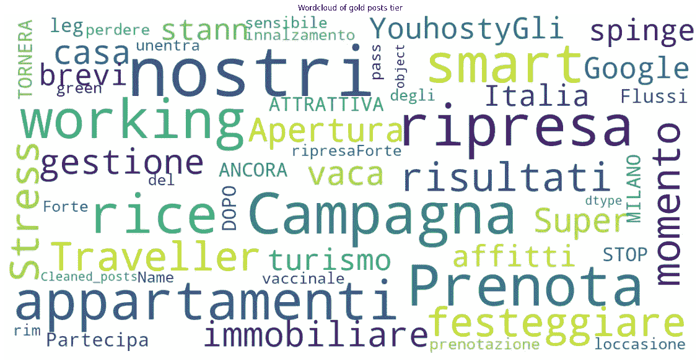

Image by author

## **最终意见:**

-涉及行业趋势的帖子推动更多参与(**词:复苏、旅游、流量、结果、重新开放、增量、疫苗..)**

-具有明确行动号召或强烈判断(阅读、赠送)的帖子显示出较高的参与度

-推广优惠和产品的帖子不太吸引人，因为它们属于“铜牌类别”

-为了提高社交渠道的参与度，建议关注提供行业趋势和更新见解的帖子。

基于这一分析和综合得分的结果，我们可以确认使用 LinkedIn 分享/推广为追随者提供价值的行业见解、研究、思想领导力内容的**重要性。**

**Instagram 和脸书是更适合在特定领域推广产品和服务的社交网络，比如短租/房地产业务。**

# 作者:

我写关于数据科学、python 编码项目和数据驱动营销的文章。我还为数据新手或数据入门者提供数据和业务指导。

你可以在[媒体](/@Marcello_Dichiera)和[推特](https://twitter.com/ItalyMarcello)上关注我，或者访问我的[网站](https://marcello-personal-website.netlify.app/)和 [Github 页面](https://github.com/marcello-calabrese)。