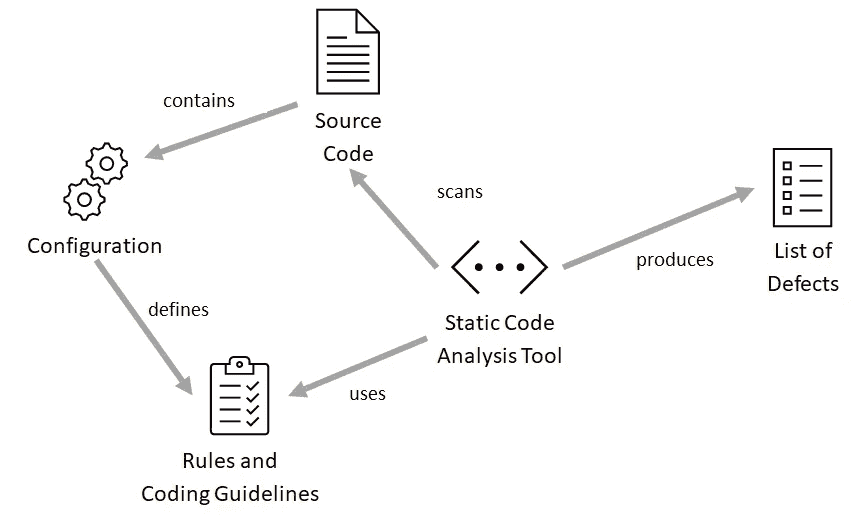
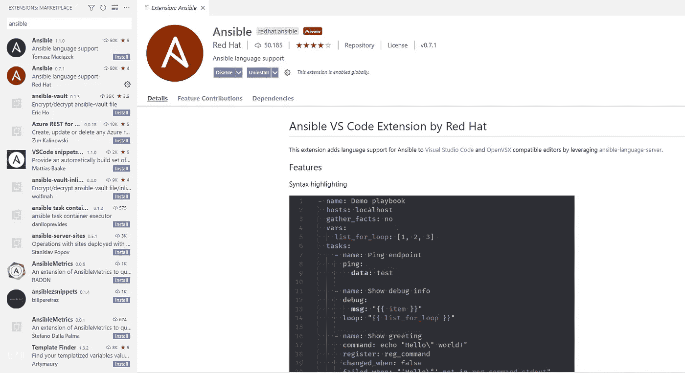
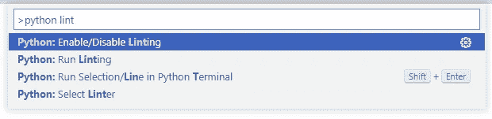
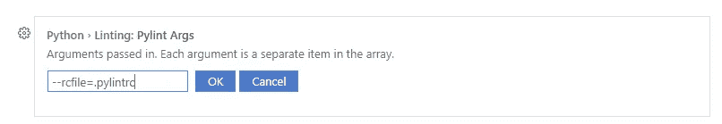
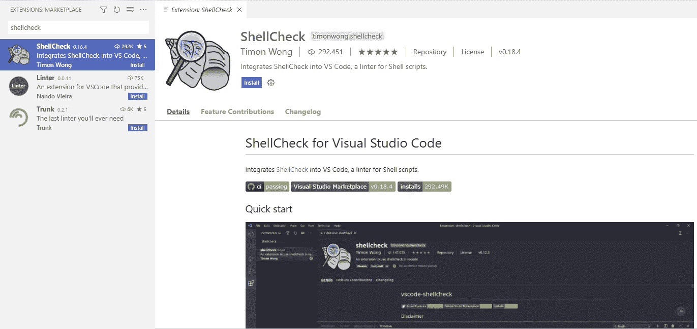

# 林挺 4 Ops——如何 Lint 您的 Ansible、Shell 和 Python 代码

> 原文：<https://medium.com/geekculture/linting-4-ops-how-to-lint-your-ansible-shell-and-python-code-1b51b3148585?source=collection_archive---------3----------------------->


Source code has to fulfil certain requirements in order to be coherent. 📸 Photo by [Kamakshi subramani](https://unsplash.com/@prasi898?utm_source=unsplash&utm_medium=referral&utm_content=creditCopyText) on [Unsplash](https://unsplash.com/t/textures-patterns?utm_source=unsplash&utm_medium=referral&utm_content=creditCopyText)

## 林挺在代码质量保证中起着核心作用。但通常情况下，基础设施代码不会这样做。本文解释了如何在 Ansible / Shell / Python 项目中设置林挺。

# 什么是林挺？

林挺是一种静态代码分析，检查代码是否满足预定义的规则和标准。集成到自动化过程中，例如，在存储库中每次提交后的持续集成运行，有助于开发人员保持高代码质量。

Linters 通过解析源代码而不是执行它来工作，这使得它快速而高效。他们通过检测设计问题或代码风格违规来支持开发人员。

林挺在应用程序开发方面非常普遍，但在基础设施工程方面仍不先进。然而，随着基础设施自动化代码的增加和基础设施即代码(IaC)的趋势，这种需求也在增加。

# 林挺是如何工作的？

linter 或静态代码分析工具使用代码需要满足的编码、格式和风格指南的列表。源代码库的根级别上的配置文件定义了策略，并告诉 linter 哪些策略被启用或禁用。配置文件还可以参数化特定的规则，例如符号或数值，如行长度或方法长度。

有了这些指导方针，代码就会被扫描，违规行为就会在缺陷列表中被报告。下面的概念图展示了整个林挺过程。



Concept Map of Static Code Analysis

当 linter 被用作 IDE 的扩展时，缺陷通常是在打开或保存单个文件时报告的。有时有必要将配置文件的位置添加到 IDE 设置中。

# Ansible 林挺

Ansible-Lint 是一个林挺工具，它根据社区定义的规则检查 Ansible 项目的所有剧本、角色和集合。

要在本地机器上安装 Ansible-Lint，以管理员身份打开命令行[，并使用 pip](https://ansible-lint.readthedocs.io/en/latest/installing.html#using-pip-or-pipx) 和`pip install ansible-lint`安装它。

将名为`.ansible-lint`的配置文件添加到项目存储库的根目录中。[ansi ble-Lint 文档中列出了配置选项。](https://ansible-lint.readthedocs.io/en/latest/configuring.html)下面的`.ansible-lint`示例文件包含从林挺排除的路径，以及在分析代码时不应应用的规则的跳过列表。在本地运行时，将临时目录包括到排除路径列表和其他配置和不可解析文件中是有意义的。

```
# .ansible-lint
exclude_paths:
  - .vscode/  
  - .github/

skip_list:
  - 306
  - 208
```

跳过列表可以包含上面显示的规则编号，也可以包含下面代码片段中显示的规则名称。

```
skip_list:
  - risky-shell-pipe
  - risky-file-permissions
```

## VSCode 集成

当本地 Ansible 和 Ansible-Lint 安装存在时，可以安装 [RedHat Ansible 语言支持扩展](https://marketplace.visualstudio.com/items?itemName=redhat.ansible)。它允许在打开或保存文件时对不可解析的代码进行林挺。但是，Ansible 和 Ansible-Lint 安装需要预先安装(例如使用`pip install ansible`和`pip install ansible-lint`)。



Ansible Language Support Extension in VSCode supports ansible-lint execution.

当在信息面板上源代码下方的`Problems`选项卡中打开文件时，会显示结果。

## CI 渠道中的集成

Ansible-Lint 提供命令行选项，允许在 CI 管道中自动执行。确保在每次更改时 lint 你的代码，给开发者快速的反馈。此外，如果没有达到代码质量标准，优先考虑管道中的林挺，使其快速失败。

# 蟒蛇林挺

Ansible-Lint 包括检查剧本、角色和集合，但不支持检查用 Python 编写的 Ansible 模块。这就是为什么需要像`pylint`这样的 Python Linter 来 lint Python 文件。

`pylint`可以使用`pip`安装。使用`pip install pylint`，所有需要的依赖项都被安装在本地机器上。

`pylint`的配置文件被称为`.pylintrc`，可以用`pylint --generate-rcfile > .pylintrc`在项目存储库的根级别上生成。生成`.pylintrc`文件后，您可以从文件中删除所有未使用和不相关的配置。

需要使用`reportMissingImports`设置禁用选项，以忽略缺少可解析导入的错误。其他设置可以定制，如下所示，作为最大线长度。

```
[MESSAGES CONTROL]
disable=reportMissingImportsmax-line-length=150
```

## VSCode 集成

要在 VSCode 中启用`pylint`，使用`CTRL+Shift+P`进入命令面板并搜索`>python lint`，如下图所示。



VSCode command palette with python lint options

通过选择`Select Linter`选项，可以设置`pylint`或任何其他可用的棉绒。不要忘记`Enable Linting`在 IDE 中激活 Python 林挺。

如果你已经创建了一个`.pylintrc`文件，它需要在 IDE 配置中被指定，所以 linter 应用这个配置。用`CTRL+,`打开设置窗口，搜索`Python Linting pylint`，在`Pylint Args`设置参数`--rcfile=.pylint`，以引用项目根目录中的配置文件。



VSCode Python Linting: Pylint Args — set rcfile location

配置完成后，结果也会显示在源代码下方信息面板上的`Problems`选项卡中。

## CI 渠道中的集成

`pylint`构建为从命令行运行。[广泛的命令行选项可用于](https://pylint.pycqa.org/en/latest/user_guide/run.html)在 CI 管道中运行它。

# 壳牌林挺公司

shellcode 最广泛使用的 linter 是 [ShellCheck](https://www.shellcheck.net/) 。ShellCheck 可以用作基于浏览器的工具，也可以用作 [VSCode 扩展](https://github.com/vscode-shellcheck/vscode-shellcheck)。

ShellCheck 配置文件名为`.shellcheckrc`，也存储在项目存储库的根层。如下面的代码片段所示，它允许[禁用单个规则或一系列规则](https://github.com/koalaman/shellcheck/wiki/Ignore#ignoring-one-or-more-types-of-errors-forever)。

```
# ~/.shellcheckrc
disable=SC2059,SC2034 # Disable individual error codes
disable=SC1090-SC1100 # Disable a range of error codes
```

## VSCode 集成

安装 ShellCheck 扩展后，可以在 VSCode 中使用该功能。要在 VSCode 中安装 ShellCheck，请使用`CTRL+Shift+P`进入命令面板并键入`Install Extensions`。选择安装扩展然后搜索`ShellCheck`，如下截图所示。



VSCode — Installation of ShellCheck extension.

安装后，一旦在 IDE 中打开外壳文件并在保存文件时刷新，ShellCheck 将报告外壳代码问题。

## CI 渠道中的集成

在 CI 管道中执行 Shellcheck 有多种不同的方式。ShellCheck 项目还[提供了在各种 CI 工具中运行它的例子](https://github.com/koalaman/shellcheck#in-your-build-or-test-suites)。

# 讨论

林挺是检查代码是否满足定义的编码标准的一个好方法。每个开发人员都需要在他们的 IDE 中检查开发期间的代码违规，以便快速做出反应并尽早发现错误。

请记住，如果开发人员没有做到，应该自动分析每一个代码更改。这就是为什么林挺应该在 CI 流程中实现自动化，并在 CI 流程的早期执行，以便向开发人员提供快速反馈。

# 参考

 [## 易翻译 Lint 文档

### Ansible Lint 是一个面向任何 Ansible 用户的林挺剧本、角色和集合的命令行工具。它…

ansible-lint.readthedocs.io](https://ansible-lint.readthedocs.io/en/latest/) [](https://www.shellcheck.net/) [## 外壳检查

### ShellCheck 是一个开源的静态分析工具，可以自动发现 shell 脚本中的 bug。

www.shellcheck.net](https://www.shellcheck.net/) [](https://github.com/vscode-shellcheck/vscode-shellcheck) [## GitHub-VS Code-shellcheck/VS Code-shell check:将 shell check 集成到 VS 代码中，这是一个…

### 将 ShellCheck 集成到 VS 代码中，这是一个 Shell 脚本的 linter。vscode-shellcheck(这个“扩展”)，需要…

github.com](https://github.com/vscode-shellcheck/vscode-shellcheck) [](https://marketplace.visualstudio.com/items?itemName=redhat.ansible) [## Ansible - Visual Studio 市场

### 这个扩展通过利用…为 Visual Studio 代码和 OpenVSX 兼容的编辑器增加了对 Ansible 的语言支持

marketplace.visualstudio.com](https://marketplace.visualstudio.com/items?itemName=redhat.ansible) [](https://marketplace.visualstudio.com/items?itemName=timonwong.shellcheck) [## ShellCheck - Visual Studio 市场

### 将 ShellCheck 集成到 VS 代码中，这是一个 Shell 脚本的 linter。vscode-shellcheck(这个“扩展”)，需要…

marketplace.visualstudio.com](https://marketplace.visualstudio.com/items?itemName=timonwong.shellcheck)  [## 可转换用法的 Lint 文档

### 该工具会在和上生成输出，第一个用于显示任何匹配的规则违规，而第二个…

ansible-lint.readthedocs.io](https://ansible-lint.readthedocs.io/en/latest/usage.html#command-line-options)  [## 运行 Pylint - Pylint 2.13.0-dev0 文档

### Pylint 应该从命令行调用。用法是你应该给 Pylint 一个 python 包的名字或者…

pylint.pycqa.org](https://pylint.pycqa.org/en/latest/user_guide/run.html)