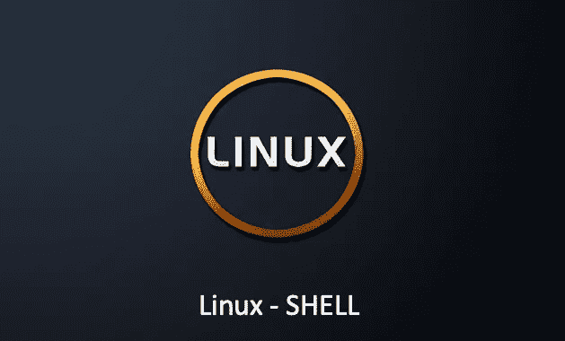

# Linux —经典的 Shell 问题

> 原文：<https://medium.com/geekculture/linux-classic-shell-questions-52492e135e75?source=collection_archive---------5----------------------->

## 你能在采访中回答这些 Linux shell 问题吗？

# 为什么叫壳牌？

我们知道计算机的操作离不开硬件，但用户不能直接操作硬件。硬件的驱动只能通过一个叫`Operating System`的软件来控制。