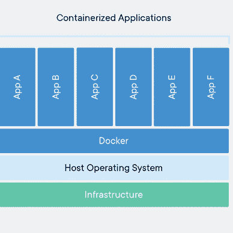

# Linux 命令:dmesg | uname

> 原文：<https://medium.com/geekculture/linux-command-dmesg-uname-d2e4f98d6c98?source=collection_archive---------4----------------------->

## Linux“dmesg”和“uname”命令概述


Photo by [Lucas Kapla](https://unsplash.com/@aznbokchoy?utm_source=medium&utm_medium=referral) on [Unsplash](https://unsplash.com?utm_source=medium&utm_medium=referral)

# 内核环形缓冲区

内核环形缓冲区是记录与内核操作相关的消息的数据结构。它是一种特殊的缓冲区，大小不变，因此在接收新消息时会自动删除旧消息。

# dmesg ( **诊断消息)**

命令在类 Unix 系统上显示内核相关的消息。它用于控制内核环形缓冲区。使用`**dmesg**`命令可以随时看到该环形缓冲区的内容，并且其内容也被保存到`**/var/log/dmesg**` 文件中。

```
>> dmesg | less

[    0.000000] Linux version 5.4.0-131-generic (buildd@lcy02-amd64-108) (gcc version 9.4.0 (Ubuntu 9.4.0-1ubuntu1~20.04.1)) #147-Ubuntu SMP Fri Oct 14 17:07:22 UTC 2022 (Ubuntu 5.4.0-131.147-generic 5.4.210)
[    0.000000] Command line: BOOT_IMAGE=/boot/vmlinuz-5.4.0-131-generic root=LABEL=cloudimg-rootfs ro console=tty1 console=ttyS0
[    0.000000] KERNEL supported cpus:
[    0.000000]   Intel GenuineIntel
[    0.000000]   AMD AuthenticAMD
[    0.000000]   Hygon HygonGenuine
[    0.000000]   Centaur CentaurHauls
[    0.000000]   zhaoxin   Shanghai  
[    0.000000] x86/fpu: Supporting XSAVE feature 0x001: 'x87 floating point registers'
[    0.000000] x86/fpu: Supporting XSAVE feature 0x002: 'SSE registers'
[    0.000000] x86/fpu: Supporting XSAVE feature 0x004: 'AVX registers'
....
....
```

## 一些重要选项:

```
>> dmesg -h

Options:
 -f, --facility <list>       restrict output to defined facilities
 -k, --kernel                display kernel messages
 -l, --level <list>          restrict output to defined levels
 -S, --syslog                force to use syslog(2) rather than /dev/kmsg
 -u, --userspace             display userspace messages
 -w, --follow                wait for new messages
 -T, --ctime                 show human-readable timestamp (may be inaccurate!)
```

## 支持来自以下工具的日志:

> ***kern*** *—内核消息* ***用户*** *—随机用户级消息* ***邮件*** *—邮件系统* ***守护进程*** *—系统守护进程* ***auth***

## 按设施过滤日志:

```
>> dmesg -f syslog | less     

[   10.250252] systemd-journald[355]: Received client request to 
flush runtime journal.
```

## 支持以下日志级别(优先级):

> ***emerg*** *—系统不可用* ***alert****—必须立即采取行动* ***crit****—临界条件* **err***—错误条件*

## 按标签过滤日志:

```
# filter by log level
>> dmesg -l warn

-----------------------------------------------------------------------------
[    5.731996] platform eisa.0: EISA: Cannot allocate resource for mainboard
[    5.741485] platform eisa.0: Cannot allocate resource for EISA slot 1
[    5.749957] platform eisa.0: Cannot allocate resource for EISA slot 2
[    5.758032] platform eisa.0: Cannot allocate resource for EISA slot 3
[    5.766090] platform eisa.0: Cannot allocate resource for EISA slot 4
[    5.774110] platform eisa.0: Cannot allocate resource for EISA slot 5
[    5.782202] platform eisa.0: Cannot allocate resource for EISA slot 6
[    5.790189] platform eisa.0: Cannot allocate resource for EISA slot 7
[    5.798505] platform eisa.0: Cannot allocate resource for EISA slot 8
[   97.074307] kauditd_printk_skb: 18 callbacks suppressed
[  768.502491] clocksource: timekeeping watchdog on CPU0: Marking clocksource 'tsc' as unstable because the skew is too large:
[  768.502492] clocksource:                       'kvm-clock' wd_now: b61df70527 wd_last: b5ff72e7d3 mask: ffffffffffffffff
[  768.502493] clocksource:                       'tsc' cs_now: 1915e3e8a70 cs_last: 190f92c9366 mask: ffffffffffffffff

# Filter by multiple log level

>> dmesg -l warn,notice 
```

## 使用“grep”过滤

```
>>  dmesg | grep -i memory

-----------------------------------------------------------------------------
[    0.016691] check: Scanning 1 areas for low memory corruption
[    0.017233] ACPI: Reserving FACP table memory at [mem 0x7ffe1e29-0x7ffe1f1c]
[    0.017234] ACPI: Reserving DSDT table memory at [mem 0x7ffe0040-0x7ffe1e28]
[    0.017235] ACPI: Reserving FACS table memory at [mem 0x7ffe0000-0x7ffe003f]
[    0.017236] ACPI: Reserving APIC table memory at [mem 0x7ffe1f1d-0x7ffe1f94]
[    0.017237] ACPI: Reserving MCFG table memory at [mem 0x7ffe1f95-0x7ffe1fd0]
[    0.017238] ACPI: Reserving WAET table memory at [mem 0x7ffe1fd1-0x7ffe1ff8]
```

# 乌梅

Uname 是一个显示基本系统信息的 Linux 命令行实用程序。

```
>> uname
Linux
```

## 重要选项:

```
>> uname --help

  -a, --all                print all information
  -s, --kernel-name        print the kernel name
  -n, --nodename           print the network node hostname
  -r, --kernel-release     print the kernel release
  -v, --kernel-version     print the kernel version
  -m, --machine            print the machine hardware name
  -p, --processor          print the processor type (non-portable)
  -i, --hardware-platform  print the hardware platform (non-portable)
  -o, --operating-system   print the operating system
      --version  output version information and exit

>> uname -s
Linux

>> uname -n
node01

>> uname -r
5.4.0-131-generic

>> uname -v
#147-Ubuntu SMP Fri Oct 14 17:07:22 UTC 2022

>> uname -m
x86_64

>> uname -p
x86_64

>> uname -i
x86_64

>> uname -o
GNU/Linux

>> uname -a
Linux controlplane 5.4.0-131-generic #147-Ubuntu SMP Fri Oct 14 17:07:22 UTC 2022 x86_64 x86_64 x86_64 GNU/Linux
```

## **🖥所有关于 Linux 的文章**👇


[Md 沙米姆](/@shamimice03?source=post_page-----d2e4f98d6c98--------------------------------)

## 所有关于 Linux 的文章

[View list](/@shamimice03/list/all-articles-on-linux-1339e15e3304?source=post_page-----d2e4f98d6c98--------------------------------)12 stories