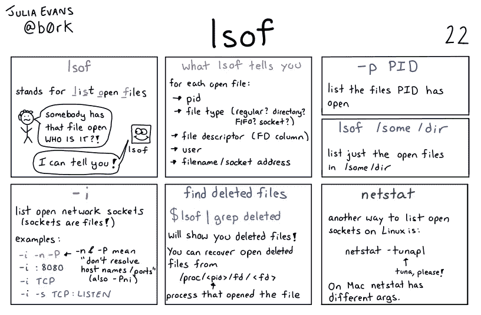

# Linux 命令:lsof(列出打开的文件)

> 原文：<https://medium.com/geekculture/linux-command-lsof-list-open-files-b36b756dc8f?source=collection_archive---------2----------------------->

## Linux“lsof”命令概述



`**lsof**`命令代表**列出打开的文件**并显示打开的文件以及哪个[进程](/geekculture/linux-command-ps-process-status-8a1a76e7bafc)使用它们。

在 Linux 中，一切都是以文件的形式存在的。有时，特别是出于故障排除的目的，我们需要知道哪些文件当前被哪些进程使用，并且我们还可以检查由系统中的一些网络连接打开的文件等等。

```
>> lsof | more

COMMAND     PID   TID TASKCMD  USER   FD      TYPE             DEVICE  SIZE/OFF       NODE NAME
systemd       1                root  cwd       DIR              252,1      4096          2 /
systemd       1                root  rtd       DIR              252,1      4096          2 /
systemd       1                root  txt       REG              252,1   1620224       3318 /usr/lib/systemd/systemd
systemd       1                root  mem       REG              252,1   1369384       4764 /usr/lib/x86_64-linux-gnu/libm-2.31.so
systemd       1                root  mem       REG              252,1    178528       4736 /usr/lib/x86_64-linux-gnu/libudev.so.1.6.
...
...
```

让我们看看可以和`**lsof**`命令一起使用的一些重要选项。

> *●按* ***用户名*** 过滤打开的文件夹

```
#  Filter open files by username
>> lsof -u　root

COMMAND     PID USER   FD      TYPE             DEVICE SIZE/OFF       NODE NAME
systemd       1 root  cwd       DIR              252,1     4096          2 /
systemd       1 root  rtd       DIR              252,1     4096          2 /
systemd       1 root  txt       REG              252,1  1620224       3318 /usr/lib/systemd/systemd
...

#  Filter open files  by except a particular username
>> lsof -u ^root

COMMAND     PID   TID TASKCMD               USER   FD      TYPE             DEVICE SIZE/OFF       NODE NAME
systemd-n   401                  systemd-network  cwd       DIR              252,1     4096          2 /
systemd-n   401                  systemd-network  rtd       DIR              252,1     4096          2 /
...
```

> *●按* ***特定流程*** 过滤打开的文件

```
#  Filter open files by a particular process
>> lsof -c nginx

COMMAND   PID     USER   FD      TYPE             DEVICE SIZE/OFF   NODE NAME
nginx   23267     root  cwd       DIR              252,1     4096      2 /
nginx   23267     root  rtd       DIR              252,1     4096      2 /
nginx   23267     root  txt       REG              252,1  1195152  77095 /usr/sbin/nginx
```

> *●通过* ***过滤打开的文件，进程 ID***

```
#  Filter open files by a process ID
>> lsof -p 23267

COMMAND   PID USER   FD   TYPE             DEVICE SIZE/OFF   NODE NAME
nginx   23267 root  cwd    DIR              252,1     4096      2 /
nginx   23267 root  rtd    DIR              252,1     4096      2 /
nginx   23267 root  txt    REG              252,1  1195152  77095 /usr/sbin/nginx
nginx   23267 root  mem    REG              252,1   180792 786469 /usr/lib/nginx/modules/ngx_stream_module.so
```

> *●按* ***目录*** *过滤打开的文件。它列出了由特定目录打开的文件。*

```
# Filter open files by a Directory

>> lsof +D /usr/bin

COMMAND     PID       USER  FD   TYPE DEVICE  SIZE/OFF  NODE NAME
dbus-daem   548 messagebus txt    REG  252,1    249032  1660 /usr/bin/dbus-daemon
networkd-   559       root txt    REG  252,1   5502744  1614 /usr/bin/python3.8
bash      21135       root txt    REG  252,1   1183448  1572 /usr/bin/bash
```

> *●通过* ***网络连接过滤打开的文件。***

```
# Filter open files by network connection

>> lsof -i 

COMMAND     PID            USER   FD   TYPE DEVICE SIZE/OFF NODE NAME
systemd-n   401 systemd-network   19u  IPv4  25326      0t0  UDP 172.30.1.2:bootpc 
sshd        632            root    3u  IPv4  20842      0t0  TCP *:ssh (LISTEN)
sshd        632            root    4u  IPv6  20853      0t0  TCP *:ssh (LISTEN)
container 13459            root   12u  IPv4  43290      0t0  TCP localhost:46111 (LISTEN)
node      21195            root   18u  IPv4  52391      0t0  TCP *:40205 (LISTEN)
```

> *●通过* ***端口过滤打开的文件。***

```
# Filter open files port

>> lsof -i :80

COMMAND   PID     USER   FD   TYPE DEVICE SIZE/OFF NODE NAME
nginx   23267     root    6u  IPv4  66992      0t0  TCP *:http (LISTEN)
nginx   23267     root    7u  IPv6  66993      0t0  TCP *:http (LISTEN)
nginx   23268 www-data    6u  IPv4  66992      0t0  TCP *:http (LISTEN)
nginx   23268 www-data    7u  IPv6  66993      0t0  TCP *:http (LISTEN) 
```

> *●通过* ***协议过滤打开的文件。***

```
# Filter open files by protocol

>> lsof -i TCP

COMMAND     PID            USER   FD   TYPE DEVICE SIZE/OFF NODE NAME
sshd        632            root    3u  IPv4  20842      0t0  TCP *:ssh (LISTEN)
sshd        632            root    4u  IPv6  20853      0t0  TCP *:ssh (LISTEN)
container 13459            root   12u  IPv4  43290      0t0  TCP localhost:46111 (LISTEN)
node      21195            root   18u  IPv4  52391      0t0  TCP *:40205 (LISTEN)
node      21195            root   19u  IPv4  59053      0t0  TCP 172.30.1.2:40205->10.244.5.61:35534 (ESTABLISHED)
kc-termin 21208            root   11u  IPv4  52388      0t0  TCP *:40200 (LISTEN)
kc-termin 21208            root   12u  IPv4  59028      0t0  TCP 172.30.1.2:40200->10.244.3.164:51234 (ESTABLISHED)
sshd      21229            root    4u  IPv4  52517      0t0  TCP 172.30.1.2:ssh->10.48.0.6:44226 (ESTABLISHED)
systemd-r 21460 systemd-resolve   13u  IPv4  55313      0t0  TCP 127.0.0.53:domain (LISTEN)
runtime-s 21532            root    3u  IPv6  55949      0t0  TCP *:40300 (LISTEN)
runtime-i 21567            root    3u  IPv6  56441      0t0  TCP *:40305 (LISTEN)
app1      21971            root    3u  IPv4  59009      0t0  TCP *:1234 (LISTEN)
```

> *如果你觉得这篇文章很有帮助，请点击* ***跟随*** *和* ***拍拍*** *按钮，帮我写更多这样的文章。
> 谢谢🖤*

## 🖥所有关于 Linux 的文章👇


[Md 沙米姆](/@shamimice03?source=post_page-----b36b756dc8f--------------------------------)

## 所有关于 Linux 的文章

[View list](/@shamimice03/list/all-articles-on-linux-1339e15e3304?source=post_page-----b36b756dc8f--------------------------------)12 stories