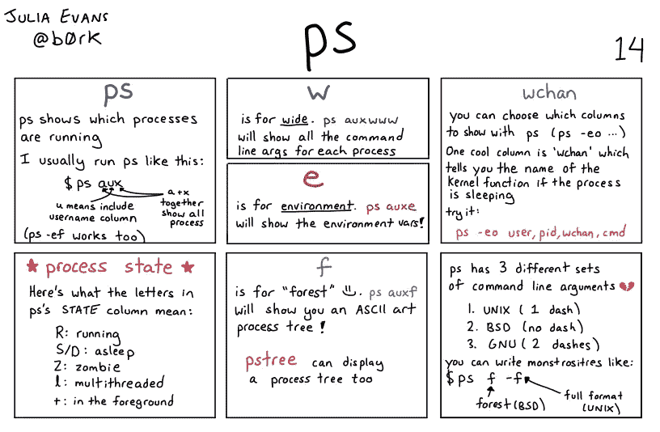

# Linux 命令:PS(进程状态)

> 原文：<https://medium.com/geekculture/linux-command-ps-process-status-8a1a76e7bafc?source=collection_archive---------0----------------------->

## Linux“PS”命令概述



From: [https://wizardzines.com/comics/ps/](https://wizardzines.com/comics/ps/)

# `**ps**` —过程状态

`**ps**`命令显示与 Linux 系统中运行的进程相关的信息。

```
**$** **ps**--------------------------------------------------------------------
 **PID TTY          TIME CMD**
  54316 pts/0    00:00:00 bash
  54341 pts/0    00:00:00 ps
```

`**PID**` —唯一进程 ID
`**TTY**` —用户当前登录的终端类型。
`**TIME**` —该进程自首次开始运行以来消耗的 CPU 时间。`**CMD**` —用于启动相应进程的命令。

## 带参数的 ps

如果我们用(-)破折号传递参数**，那么我们将得到标准语法的输出。相反，如果我们传递参数**而不带任何(-)破折号**，那么我们将得到 BSD(Berkeley Software Distribution)语法的输出。**

> ***查看所有正在运行的进程:*** `***ps -e***` ***或*** `***ps -A***` ***查看所有正在运行的进程的完整格式化列表:*** `***ps -efL***`

```
$ **ps -efL | more **  # more for viewing from the beginning**-------------------------------------------------------------------**UID          PID    PPID     LWP  C NLWP STIME TTY          TIME CMD
root           1       0       1  1    1 03:44 ?        00:00:20 /sbin/init
root           2       0       2  0    1 03:44 ?        00:00:00 [kthreadd]
...
...
```

我们可以使用`**grep**` 连同`**ps**` 命令来搜索特定的进程；
假设我们想看看我们的“httpd”服务器是否正在运行。我们可以通过以下方式实现:

```
$  **ps -efL | grep httpd****--------------------------------------------------------------------**root       48778   39025   48778  0    1 04:22 pts/0    00:00:00 grep --color=auto **httpd**
```

要按用户名和组查看所有正在运行的进程:

```
$ **ps -u root**   # by username
$ **ps -G admin**  # by group
```

查看流程树。一个流程内可以有多个流程运行，我们可以使用`**ps -ejH**` 来查看流程树:

```
$ **ps -ejH | grep sshd** --------------------------------------------------------------------
    614     614     614 ?        00:00:00   **sshd**
  22310   22310   22310 ?        00:00:00     **sshd**
  30267   30267   30267 ?        00:00:00     **sshd**
  33871   33871   33871 ?        00:00:00     **sshd**
```

在上面的演示中，我们可以看到“ **sshd** ”流程的流程树。

使用最广泛的`**ps**` 命令是`**ps aux**`:它将使用 BSD 语法输出所有正在运行的进程。`**ps aux**`显示了用户通常需要了解其系统运行进程的当前状态的最大量的信息。

```
$ ps aux |　more--------------------------------------------------------------------**USER  PID %CPU %MEM   VSZ   RSS  TTY   STAT START  TIME   COMMAND**
root  1   0.6  0.5  169396 11312  ?    Ss   03:44   0:24  /sbin/init
root  2   0.0  0.0       0     0  ?    S    03:44   0:00  [kthreadd]
...
```

`**ps aux**`提供附加信息，例如:

`**%CPU**` 本进程使用的 CPU 时间(以百分比表示)

`**%MEM**`该进程使用的物理内存(百分比)

`**VSZ**`显示进程消耗的虚拟内存量。

`**RSS**`是正在使用的实际物理*连线*内存。

`**START**`显示流程开始的日期或时间。

`**TIME**`显示该进程使用的总 CPU 时间。

`**STAT**`显示一个进程的状态。最常见的状态代码描述如下:

> ***R:*** *正在运行或可运行的。* ***S:****可中断睡眠，等待一个事件完成，如从
> 终端输入。* ***D:****不间断睡眠，不能被信号杀死或中断的进程，通常要让它们消失你必须重启或修复问题。* ***Z:****僵尸是正在等待状态被收集的终止进程。* ***T:****停止，已经暂停/停止的流程。*

> *如果你觉得这篇文章很有帮助，请* ***别忘了*** *来点击* ***跟随*** *和* ***拍拍*** *按钮，帮我写更多这样的文章。
> 谢谢🖤*