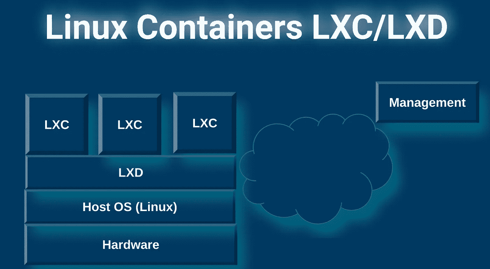
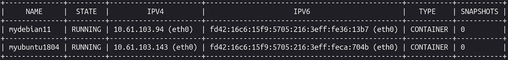
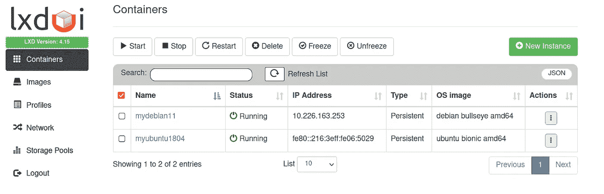
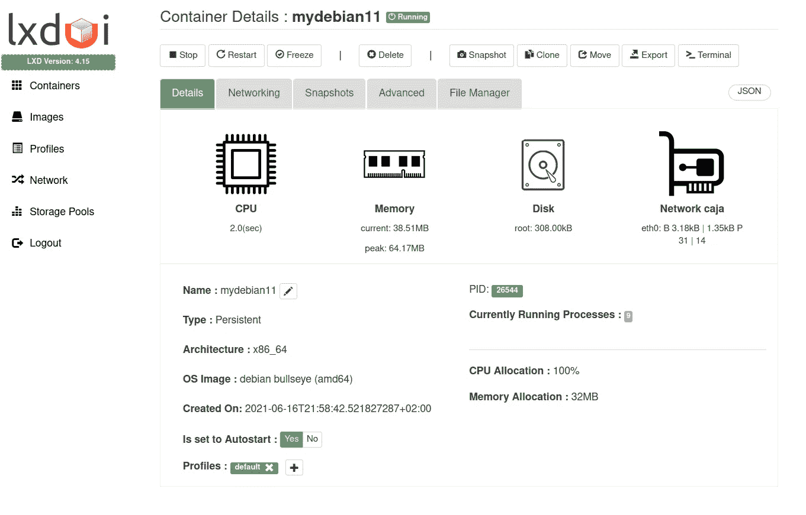
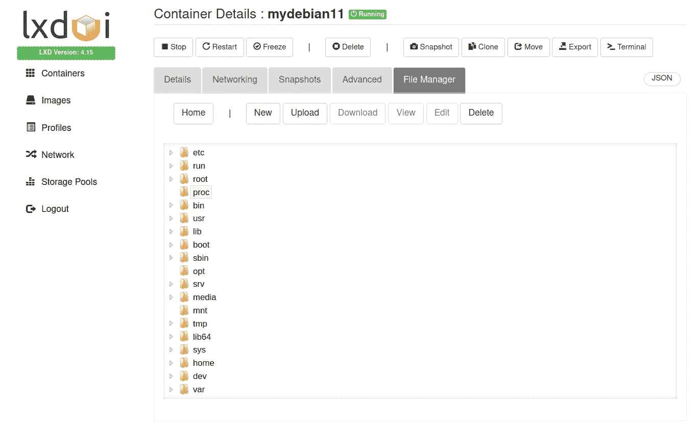

# Linux 容器 LXC/LXD。WebUI 中的容器管理。

> 原文：<https://medium.com/geekculture/linux-containers-lxc-lxd-container-management-from-webui-5cf7c7625a08?source=collection_archive---------9----------------------->



by author

在下面的文章中，我将描述 Linux 容器 LXC 的基本概念，并将重点放在该技术的实践方面。您将看到如何在您的主机(Linux OS)上运行和管理不同的 Linux 发行版。这篇文章只能被认为是对 LXC/LXD 技术的介绍，该技术是 origin 在 Canonical company 中拥有的。文章的想法不是要与 Docker、虚拟机或 Kubernetes 等其他类似技术进行比较。这些想法简单明了地提出了可以利用的可能性(很高兴知道)。

在我们开始划分细节和运行 Linux 容器(LXC)之前，理解容器的主要架构和技术背后的想法似乎更合理。首先，我们需要看看下图，我在图中描绘了虚拟机、DXC 和 Docker 的主要架构级别。除了所有呈现的体系结构都适应虚拟化概念之外，虚拟机略有不同，因为虚拟化是从硬件级别开始的。该体系结构的主要组件是虚拟机管理程序，它是负责启动虚拟机并为正在运行的虚拟机提供资源(CPU、RAM、存储磁盘、网络等)的过程。
更进一步，你可以考虑容器与主机(Linux 操作系统)共享内核资源。这个概念与虚拟机及其内核之间的一对一映射相反。虚拟机管理程序对常见的可用资源提供更精细的控制和分配。可以说，使用虚拟机管理程序的缺点是开销和有限的可伸缩性。

然而，LXC 容器可以被认为是一个运行在主机(Linux)操作系统上的独立应用程序(普通的 Linux 操作系统发行版)。没有硬件仿真，因为 LXC 容器可以使用所有可用的硬件资源(也可以是有限的)。就我个人而言，我使用 LXC 容器(不同的 Linux 发行版)在网络中运行相同的应用程序，并强调性能。我可以在几毫秒内启动或停止 LXC。正如我提到的，我不打算比较这些技术，因为我们每个人都有自己的偏好，开发的应用程序有不同的架构和用途，优于 Docker 的功能是 LXC 让我可以直接将数据存储在容器中，充分利用网络的能力，坦率地说，LXC 是一个标准的隔离和完全可配置的操作系统。
根据 concept principles，LXD 提供了一种在其 network REST APIs 之上构建的方法，以完全自动化多容器部署和管理流程。


by author

在接下来的一节中，你将会熟悉用你最喜欢的 Linux 操作系统启动你的容器的一组基本命令，所有的命令都已经在 [**斯蒂芬·格雷勃**](https://stgraber.org/author/stgraber/) 网站上讨论过了。我将向您展示如何使用 SSH 访问容器。最后，我将描述 web 应用程序，它允许您使用自己喜欢的浏览器来管理容器。

如果你的操作系统是 Ubuntu，那么你可能不会安装 LXD。但是，为了以防万一，您可以使用以下命令安装软件:

```
sudo snap install lxd
```

安装 LXD 后，您必须初始化环境。我建议你(你的熟悉阶段)在弹出新问题时按回车键。

```
lxd init
```

可以作为容器 LXC 运行的可用容器在 [Linux 容器项目](https://uk.images.linuxcontainers.org/)中列出，但是你也可以在你的终端上查看完整的列表。运行命令:

```
lxc remote list
```

运行该命令后，可以抓取图像的四个区域将会出现:**图像、本地(这是你的机器)、ubuntu 和 ubuntu-daily** 。
您可以使用以下命令检查每个位置:

```
lxc image list images:
lxc image list local:
lxc image list ubuntu:
lxc image list ubuntu-daily:
```

让我们假设我们对 ubuntu 库运行命令，在那里我们发现对我们感兴趣的图像 ubuntu 18.04，并且在我们运行相同的命令之后，但是这次指向正确的库。这次我们有兴趣安装 Debian 11。这两个容器的安装(启动)可以通过以下命令来执行:

```
lxc launch ubuntu:18.04 myubuntu1804lxc launch images:debian/11 mydebian11
```

myubuntu1804 和 mydebian11 是我们自己的本地名。

现在，您可以运行命令来验证您以前的工作:

```
lxc list
```

您应该会收到类似的:



by author

如您所见，您的容器正在运行，但是为了访问终端，您应该对特定容器执行以下命令:

```
lxc exec myubunty1804 bash
or
lxc exec mydebian11 bash
```

[**有用的命令**](https://gist.github.com/berndbausch/a6835150c7a26c88048763c0bd739be6) 开始/停止等 LXC:

```
lxc start myubunty1804
lxc stop myubunty1804 [--force] # --force if it doesn't want to stop
lxc restart myubunty1804 [--force]
lxc pause myubunty1804 lxc move CONTAINER_NAME NEW_NAME
```

**现在，我们将看到如何使用 SSH 访问容器。请遵循以下步骤。
运行以下命令，使用 SSH 访问您的容器。**

(主机)登录到来宾 myubunty1804 容器:

```
lxc exec myubunty1804 bash
```

(来宾)添加新的远程用户“我的名字”

```
adduser myname//add user to sudo groupsudo usermod -aG sudo myname
```

(来宾)编辑/etc/ssh/sshd_config 文件

```
nano /etc/ssh/sshd_config fileInside the file adjust the flag from "no" to "yes", as follows PasswordAuthentication yes
```

(来宾)重新启动 sshd 守护程序

```
systemctl restart sshd
```

(客人)检查 IP

```
ip aor on HOST:hypersivisonlxc list
```

(主机)使用用户 id 和密码通过 ssh 连接到客户机

```
ssh myname@guest_ip
```

**在本文中，我将展示的最后一件事是从浏览器管理 LXC 的可能性。**在这个简短的介绍中我将简短地描述一下工具 [**LXDUI**](https://github.com/AdaptiveScale/lxdui) **。** 查看链接，获得如何安装(非常简单)和使用的灵感。



by author

LXDUI 是一个无需输入命令就能轻松支持终端管理容器的工具。它允许您分别搜索和管理每个容器。该工具穷尽了终端中所有可用的终端命令。它让您清楚地了解您的容器环境。这些工具非常方便，我认为应该使用。如你所知，我们创建了两个容器:myubunty1804 和 mydebian11。在我们的机器上运行 Web 管理器，我们可以管理创建的容器。

从下面的选项卡中，您可以控制所有与 mydebian11 容器相关(在本例中)的特性——与虚拟机相同或相似。记住容器在毫秒内开始/停止，像 Docker。



by author

您还可以访问容器操作系统中的文件夹。



by author

感谢您的阅读。