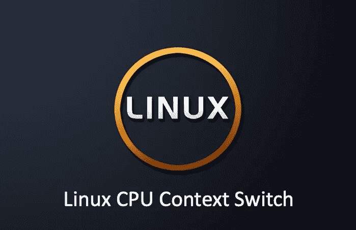

# Linux CPU 上下文切换深度探讨

> 原文：<https://medium.com/geekculture/linux-cpu-context-switch-deep-dive-764bfdae4f01?source=collection_archive---------1----------------------->

## 你对 CPU 上下文切换了解多少？

我们都知道 Linux 是一个多任务操作系统，支持同时运行的任务远远大于 CPU 的数量。当然，这些任务实际上并不是同时运行的(单个 CPU)，而是因为系统在很短的时间内将 CPU 依次分配给任务，造成了多个…