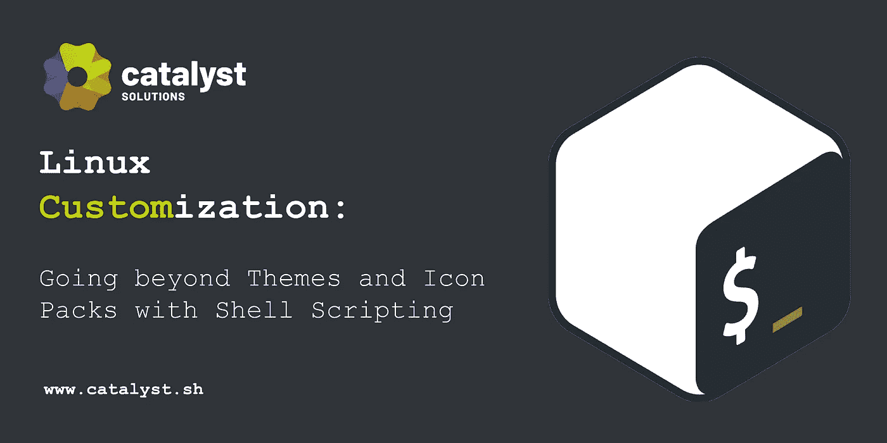
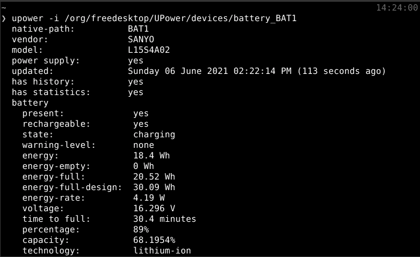
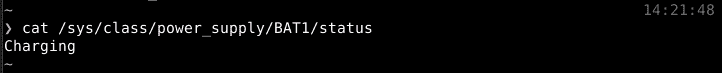
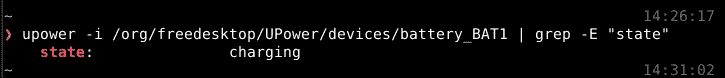
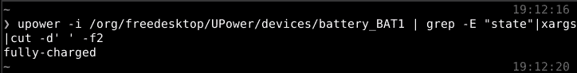
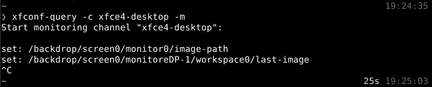
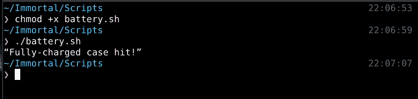
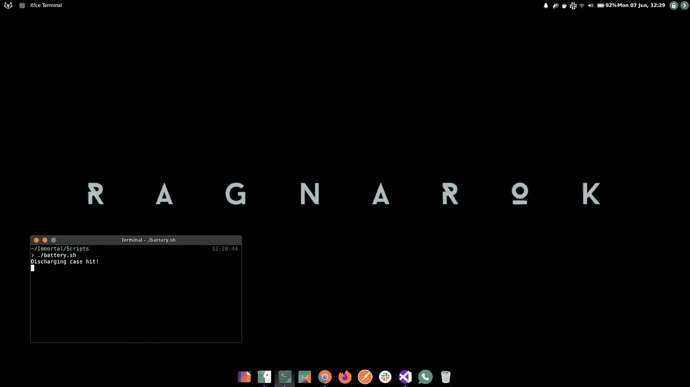
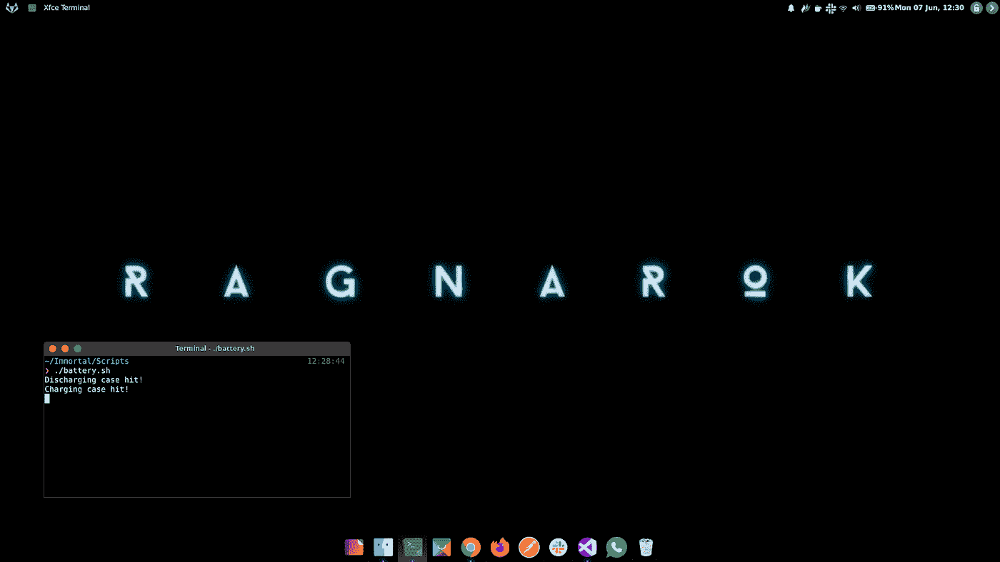

# Linux 定制:用 Shell 脚本超越主题和图标包

> 原文：<https://medium.com/geekculture/linux-customization-going-beyond-themes-and-icon-packs-with-shell-scripting-d33f2f96c7c4?source=collection_archive---------13----------------------->



# **这篇文章是写给谁的？**

无聊的初级-中级 Linux 用户想让他们的机器使用起来更有趣。

# **有什么先决条件吗？**

没有什么特别的，但是有编程概念的基础知识，比如 if 条件和循环就很好。

在这篇文章中，我们将从不同的角度来看 Linux 定制。如果你使用 Linux 作为你的主要操作系统，或者只是为了工作安装它，偶尔，你必须修补不同的主题和图标包，给你的系统尽可能个性化的感觉。当你完成后，问题出现了—

> 下一步是什么？我能把它带到另一个水平吗？也许我的系统可以问候我，或者它可以根据时间改变它的颜色，或者别的什么？

答案是肯定的。是的，您可以将您的 Linux 定制提升到另一个层次，超越您的日常桌面体验，获得尽可能个性化的体验。当然，可能性是无穷无尽的。随着本文的深入，我们将尝试探索其中的一些可能性。

我们不会不必要地延长这篇文章的篇幅来解释什么是 Linux 或者 Linux 发行版是如何工作的，假设你们已经知道了。但是如果你是一个初学者并且想更好地理解这些东西，你可以参考我们的文章 [*一个完美的 Linux 发行版*](/swlh/a-perfect-linux-distribution-ca80fe8e443d) 。所以事不宜迟，让我们开始吧。

## **什么是 Shell 和 Shell 脚本**

简而言之，外壳是提供给我们用户的一个界面，帮助我们与操作系统进行交互。它充当用户和内核之间的一层，从最终用户那里获取高级命令，并以内核能够理解的形式提供给内核。通常，用户可以通过命令行界面(如终端和命令提示符)访问 shell。

shell 脚本是一个文本文件，由一组命令组成，这些命令将被直接或基于某种逻辑执行/解释。通常，外壳脚本文件有一个。sh '扩展。

shell 脚本的一些使用案例:

*   为了避免重复的任务
*   自动化
*   操作文件
*   系统监控等

但这些不仅限于工作。我们使用 shell 脚本的一些有趣案例:

*   登录时的音频问候。
*   检测互联网连接状态以切换壁纸和播放声音。
*   检测电池的状态(充满、充电、放电)。为什么你可能会问。当然是换壁纸了。如果使用正确的图片，这个看起来很吸引人。这正是我们在下一节要做的。

## **有趣的脚本**

每当你写这样一个脚本时，你需要首先弄清楚两件事。

*   **Source** :这里，我们指的是我们的脚本将对其值起作用的数据。
*   **行动**:这里，我们指的是基于从我们的源头获得的价值，我们希望完成的事情。

一旦你弄清楚了你到底需要什么，用一个小的谷歌搜索就可以获得我们脚本的源代码部分。在这个脚本中，我们的来源将是与电池状态相关的值。经过小修小补，我发现了两种方法来做到这一点。

1.  UPower-I/org/free desktop/UPower/devices/battery _ BAT1



2.卡特彼勒/系统/等级/电源/BAT1/状态



我们将使用第一个，因为它为我们提供了更多的信息，并保持了可伸缩性的窗口。

现在的问题是，我们如何从使用***【upower】***获得的信息池中检索我们需要的确切信息。答案是***【grep】***。grep 命令用于过滤基于特定字符模式的搜索。我们将需要管道命令来正确地完成这项工作。现在， ***pipe*** 命令的作用是，它将让我们使用一个命令的输出作为另一个命令的输入，看起来像“|”。

因此，现在我们的源命令将如下所示:

```
upower -i /org/freedesktop/UPower/devices/battery_BAT1 | grep -E “state”
```



( ***注*** :在某些设备上可能是 battery_BAT0)

但仍不处于可用状态。我们将利用 xargs，它对于从字符串和 cut 中删除不必要的空格也很有用，它允许我们以期望的方式来剪切一行。

在应用这些之后，我们的源命令将变成这样:

```
upower -i /org/freedesktop/UPower/devices/battery_BAT1 | grep -E “state” | xargs | cut -d’ ‘ -f2
```



其中参数-d ' '告诉它在空格处切割该行，而-f2 告诉它拾取该行的第二部分。

现在我们已经准备好了我们的资源，我们需要考虑行动。这将取决于您使用的桌面环境。在 i3wm 之类的东西上，feh 会很好用。在我们的例子中，我们使用了 xfce4，所以您必须首先运行这个命令来检查在更改壁纸时哪些属性发生了变化:
`xfconf-query -c xfce4-desktop -m`

运行该命令后，它将进入监控模式。使用 GUI 方法更改壁纸，以查看这里的属性。



因此，我们最终的操作命令将如下所示:

```
xfconf-query -c xfce4-desktop -p /backdrop/screen0/monitoreDP-1/workspace0/last-image -s /home/wolfian/Pictures/Wallpapers/wallpaper.jpg
```

既然我们已经收集了我们的原料，是时候做真正的菜了。首先，我们将把源的输出存储在某个地方。让我们将它存储在一个名为“电池”的变量中:

```
#!/bin/bash
battery=$(upower -i /org/freedesktop/UPower/devices/battery_BAT0 | grep -E "state"|xargs|cut -d' ' -f2|sed s/%//)
```

表达式$()在这里是命令替换。

请注意，我们使用了“#！/bin/bash”在我们脚本的开头，它被称为“shebang”。它的目的是告诉操作系统调用指定的 shell 来执行我们的命令。

现在我们将利用**if-elif-else** 结构来放置我们的动作:

```
#!/bin/bash
battery=$(upower -i /org/freedesktop/UPower/devices/battery_BAT1 | grep -E "state" | xargs | cut -d' ' -f2)if [ "$battery" = "charging" ]; then
	$(xfconf-query -c xfce4-desktop -p /backdrop/screen0/monitorHDMI-1/workspace0/last-image -s /home/wolfian/Pictures/Wallpapers/ragnarok1.png)
	echo "Charging case hit!"elif [ "$battery" = "discharging" ]; then
	$(xfconf-query -c xfce4-desktop -p /backdrop/screen0/monitorHDMI-1/workspace0/last-image -s /home/wolfian/Pictures/Wallpapers/ragnarok0.png)
	echo "Discharging case hit!"elif [ "$battery" = "fully-charged" ]; then
	$(xfconf-query -c xfce4-desktop -p /backdrop/screen0/monitorHDMI-1/workspace0/last-image -s /home/wolfian/Pictures/Wallpapers/ragnarok1.png)
	echo "Fully-charged case hit!"else
        echo "Something went wrong!"
fi
```

现在，我们的脚本应该可以工作了。不要忘记用 chmod +x filename.sh 使它成为可执行文件，然后像这样运行它。/filename.sh。输出应该如下所示:



但这只是一次性的事情。为了让它继续在后台运行，我们将使用循环。在这种情况下，我们将使用 while 循环。因此，让我们在脚本中添加一个 while 循环。

```
#!/bin/bash
while true
do
	battery=$(upower -i /org/freedesktop/UPower/devices/battery_BAT1 | grep -E "state" | xargs | cut -d' ' -f2)	 if [ "$battery" = "charging" ]; then
		$(xfconf-query -c xfce4-desktop -p /backdrop/screen0/monitorHDMI-1/workspace0/last-image -s /home/wolfian/Pictures/Wallpapers/ragnarok1.png)
		echo "Charging case hit!" elif [ "$battery" = "discharging" ]; then
		$(xfconf-query -c xfce4-desktop -p /backdrop/screen0/monitorHDMI-1/workspace0/last-image -s /home/wolfian/Pictures/Wallpapers/ragnarok0.png)
		echo "Discharging case hit!" elif [ "$battery" = "fully-charged" ]; then
		$(xfconf-query -c xfce4-desktop -p /backdrop/screen0/monitorHDMI-1/workspace0/last-image -s /home/wolfian/Pictures/Wallpapers/ragnarok1.png)
		echo "Fully-charged case hit!"	
        else
	        echo "Something went wrong!"
	fi	sleep 5
donedone
```

注意，我们在循环的末尾添加了“sleep”命令，所以我们的脚本不会像疯子一样执行这个命令。现在一切看起来和工作都很棒，不是吗？如果你没有注意到，我们每 5 秒就更换一次壁纸。因为我们大部分时间都是一样的情况，所以没人注意到。让我们来解决这个问题！

添加辅助变量和嵌套 ifs 后，我们的最终脚本如下所示:

```
#!/bin/bash
while true
do
	battery=$(upower -i /org/freedesktop/UPower/devices/battery_BAT1 | grep -E "state" | xargs | cut -d' ' -f2) if [ status = "" ]; then
		status="none"	
	fi if [ "$battery" = "charging" ]; then
		if [ "$status" != "charging" ]; then
			status="charging"
			$(xfconf-query -c xfce4-desktop -p /backdrop/screen0/monitorHDMI-1/workspace0/last-image -s /home/wolfian/Pictures/Wallpapers/ragnarok1.png
			)
			echo "Charging case hit!"
		fi elif [ "$battery" = "discharging" ]; then
		if [ "$status" != "discharging" ]; then
			status="discharging"
			$(xfconf-query -c xfce4-desktop -p /backdrop/screen0/monitorHDMI-1/workspace0/last-image -s /home/wolfian/Pictures/Wallpapers/ragnarok0.png
			)
			echo "Discharging case hit!"
		fi elif [ "$battery" = "fully-charged" ]; then
		if [ "$status" != "fully-charged" ]; then
			status="fully-charged"
			$(xfconf-query -c xfce4-desktop -p /backdrop/screen0/monitorHDMI-1/workspace0/last-image -s /home/wolfian/Pictures/Wallpapers/ragnarok1.png
			)
			echo "Fully-charged case hit!"
		fi else
	        echo "Something went wrong!"
	fi sleep 5
done
```

正如我们之前提到的，效果有多吸引人，很大程度上取决于你选择的壁纸。我们的最终结果看起来像这样，

**放电**:



**充电:**



( ***注*** :不要忘记添加启动时运行的脚本。)

这篇文章就到这里。玩得开心！另外，如果你对这个话题有什么要补充的，或者想让我们特别介绍一些与 Linux 相关的内容，请在下面的评论中告诉我们。

通过[***insta gram***](https://www.instagram.com/ctsolutions.sh/)*[***Twitter***](https://twitter.com/catalyst_sh)*[***LinkedIn***](https://www.linkedin.com/company/13707239/admin/)联系我们**

**或者给我们发电子邮件✉️到 **admin@catalyst.sh.****

**点击查看我们的其他博客[。](/@alka.jha_87549)**

**[](/swlh/a-perfect-linux-distribution-ca80fe8e443d) [## 完美的 Linux 发行版

### 与 Windows 和 macOS 不同，Linux 发行版不是在单一组织下构建的。

medium.com](/swlh/a-perfect-linux-distribution-ca80fe8e443d) [](https://ct-solutions.medium.com/should-i-learn-flutter-in-2021-e5e5d9d0046d) [## 2021 年该不该学 Flutter？

### 如果你一直在问自己这个问题，那么让我告诉你，你是在正确的地方，短…

ct-solutions.medium.com](https://ct-solutions.medium.com/should-i-learn-flutter-in-2021-e5e5d9d0046d) [](/swlh/headless-cms-integrating-gatsby-with-wordpress-f68b0b8f163) [## 无头 CMS——集成 Gatsby 和 WordPress

### headless CMS 是一个后端内容管理系统，允许内容创作，将内容作为…

medium.com](/swlh/headless-cms-integrating-gatsby-with-wordpress-f68b0b8f163)**