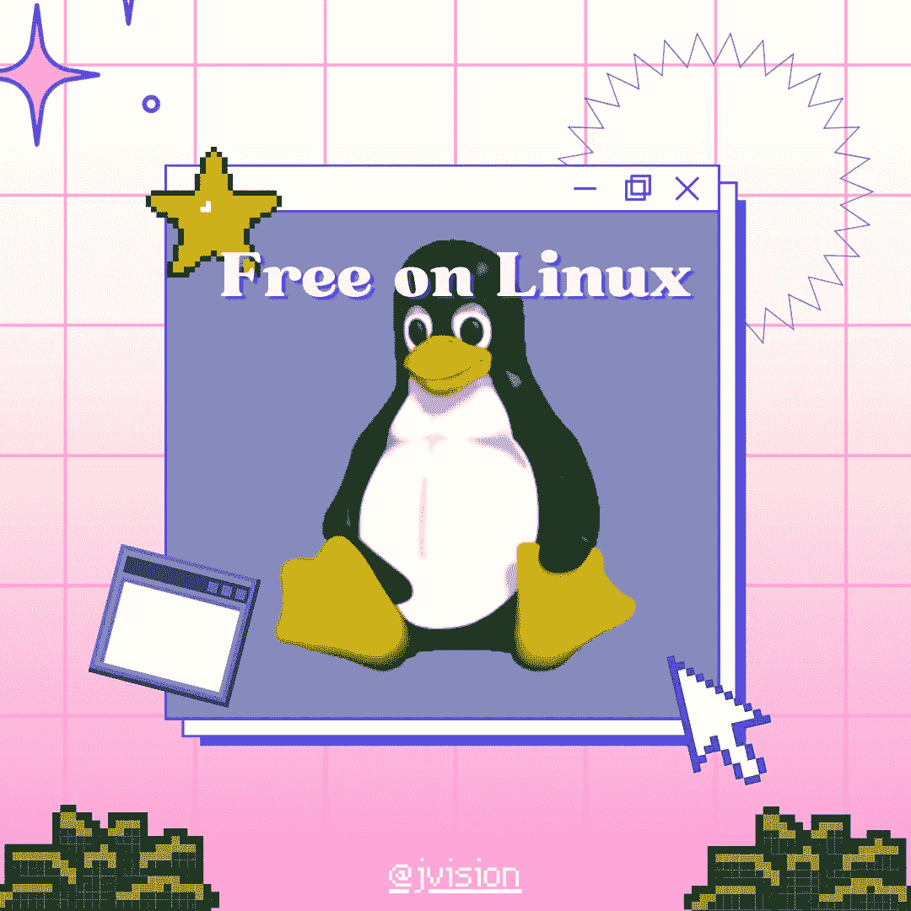

# Windows 应用程序的 Linux 替代方案

> 原文：<https://medium.com/geekculture/linux-for-windows-users-e75fd63d37ff?source=collection_archive---------7----------------------->

## Linux:专业技巧

## 免费学习和使用

Figure created by the author.

本文将帮助您发现一些最适合您的 Linux 操作系统的应用程序。我们将探索如何使用像 Adobe Photoshop 或 Microsoft Office 这样的软件，而不需要昂贵的许可证，此外还有很多其他的来源！