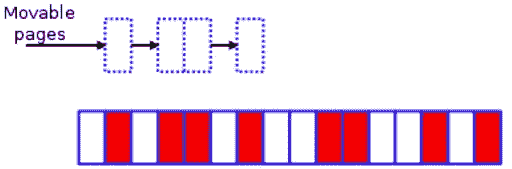
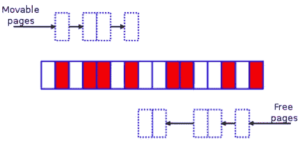
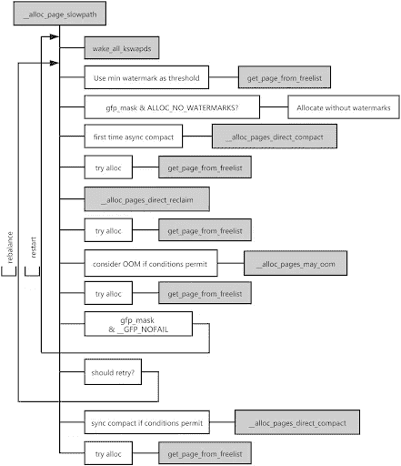
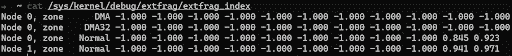

# Linux 内核与内存碎片(第二部分)

> 原文：<https://medium.com/geekculture/linux-kernel-vs-memory-fragmentation-part-ii-9eab96030b6d?source=collection_archive---------39----------------------->

作者:[张文波](https://github.com/ethercflow)(ping cap EE 团队 Linux 内核工程师)

Transcreator: [夏洛特刘](https://github.com/CharLotteiu)；编辑:汤姆·万德

在 [Linux 内核与内存碎片(第一部分)](https://pingcap.medium.com/linux-kernel-vs-memory-fragmentation-part-i-acb943f3f777)中，我的结论是，按迁移类型分组只是延缓了内存碎片，并没有从根本上解决。随着内存碎片的增加，并且没有足够的连续物理内存，性能会下降。

因此，为了减轻性能下降，Linux 内核社区在内核中引入了内存压缩。

在这篇文章中，我将解释内存压缩的原理，如何查看碎片索引，以及如何量化内存压缩导致的延迟开销。

# 存储器压缩

在内存压缩之前，内核使用块状回收进行碎片整理。但是，这个特性在 3.10 版(目前使用最广泛的内核版本)中被删除了。如果你想了解更多，你可以阅读我在[碎片整理简史](https://pingcap.com/blog/linux-kernel-vs-memory-fragmentation-1#a-brief-history-of-defragmentation)中列出的文章。现在，让我把你的思想带到记忆压缩。

## 算法介绍

LWN.net 的文章[内存压缩](https://lwn.net/Articles/368869/)详细解释了内存压缩的算法思想。您可以将以下碎片化区域作为一个简单的示例:

*A small fragmented memory zone — LWN.net*

白色方框是空闲页面，而红色方框是分配页面。

该区域的内存压缩分为三个主要步骤:

1.  从左到右扫描该区域，查找 MIGRATE _ MOVABLE 迁移类型的红色页面。

Search for movable pages

2.同时，从右到左扫描该区域，寻找空闲页面。

Search for free pages

3.将底部的可移动页面移动到顶部的空闲页面，从而创建一个连续的空闲空间块。

The memory zone after memory compaction

这个原理看起来比较简单，内核也提供了`/proc/sys/vm/compact_memory`作为手动触发内存压缩的接口。

然而，正如在[第一部分](https://pingcap.com/blog/linux-kernel-vs-memory-fragmentation-1)和[内存压缩问题](https://lwn.net/Articles/591998/)中提到的，内存压缩在实践中并不是非常有效——至少对于最常用的内核 v3.10 来说——无论它是自动触发还是手动触发。由于它导致的高开销，它反而成为性能瓶颈。

开源社区并没有放弃这个特性，而是在后续版本中继续优化它。例如，社区[在 4.6 版中向内核引入了 kcompactd](https://github.com/torvalds/linux/commit/698b1b3064) ，在 4.8 版中[使直接压缩更具确定性](https://lwn.net/Articles/686801/)。

## 当执行内存压缩时

在 3.10 版内核中，内存压缩是在以下任何情况下执行的:

*   在失败的高阶分配之后，调用`kswapd`内核线程来平衡区域。
*   调用`khugepaged`内核线程来折叠一个巨大的页面。
*   内存压缩通过`/proc`界面手动触发。
*   系统执行直接回收以满足更高阶的内存需求，包括处理透明大页面(THP)页面错误异常。

在[为什么我们禁用 Linux 的数据库 THP 特性](https://pingcap.com/blog/why-we-disable-linux-thp-feature-for-databases)中，我描述了 THP 如何降低性能，并建议禁用这个特性。在本文中，我将把它放在一边，主要关注内存分配路径。

*Memory allocation in the slow path*

当内核分配页面时，如果 buddy 系统的空闲列表中没有可用页面，则会发生以下情况:

1.  内核以慢速路径处理这个请求，并尝试使用低水位线作为阈值来分配页面。
2.  如果内存分配失败，这表明内存可能略有不足，页面分配器会唤醒`kswapd`线程来异步回收页面，并尝试再次分配页面，同样使用低水位线作为阈值。
3.  如果分配再次失败，则意味着内存严重不足。在这种情况下，内核首先运行异步内存压缩。
4.  如果异步内存压缩后分配仍然不成功，内核将直接回收内存。
5.  在直接内存回收之后，如果内核没有回收足够的页面来满足需求，它将执行直接内存压缩。如果它不回收单个页面，就调用 OOM 黑仔来释放内存。

以上步骤只是对实际工作流程的简化描述。在实际应用中，它会更加复杂，并且会根据所请求的内存顺序和分配标志而有所不同。

至于直接内存回收，它不仅在内存严重不足时由内核执行，而且在实际场景中也会因内存碎片而触发。在一定时期内，这两种情况可能同时出现。

## 如何分析内存压缩

**量化性能延迟**

如前一节所述，内核在分配内存时可能会执行内存回收或内存压缩。为了更容易地量化每个参与线程的直接内存回收和内存压缩所导致的延迟，我向 [BCC](https://github.com/iovisor/bcc) 项目提交了两个工具， [drsnoop](https://github.com/iovisor/bcc/blob/master/tools/drsnoop_example.txt) 和 [compactsnoop](https://github.com/iovisor/bcc/blob/master/tools/compactsnoop_example.txt) 。

这两个工具都是基于内核事件的，并且附带了详细的文档，但是有一点我要注意:为了降低引入 Berkeley Packet Filters (BPF)的成本，这两个工具捕获了每个相应事件的延迟。因此，您可以从输出中看到，每个内存请求都对应于多个延迟结果。

多对一关系的原因是，对于 v3.10 这样的旧内核，在慢速路径的内存分配过程中，内核将尝试分配多少次是不确定的。这种不确定性也使得 OOM 黑仔要么太早要么太晚开始工作，导致服务器上的大多数任务被长时间挂起。

内核合并补丁 [mm:修复了 4.12 版中不可回收节点](https://github.com/torvalds/linux/commit/c73322d0)上的 100% CPU kswapd busyloop，直接内存回收的最大数量限制为 16。让我们假设直接内存回收的平均延迟是 10 毫秒(对于当今具有数百 GB RAM 的服务器来说，收缩活动或非活动 LRU 链表是非常耗时的。如果服务器需要等待脏页被写回，也会有额外的延迟。)

如果线程向页面分配器请求页面，并在仅一次直接内存回收后获得了足够的内存，则此分配的延迟会增加 10 毫秒。如果内核在回收足够的内存空间之前尝试了 16 次，则此分配增加的延迟是 160 毫秒，而不是 10 毫秒，这可能会严重降低性能。

## 查看碎片索引

让我们回到记忆压缩。内存压缩的核心逻辑有四个主要步骤:

1.  确定内存区域是否适合内存压缩。
2.  设定扫描的起始页框号码。
3.  隔离 MIGRATE _ MOVABLE 类型的页面。
4.  将 MIGRATE _ MOVABLE 类型的页面迁移到区域的顶部。

如果在一次迁移后该区域仍然需要压缩，内核将上述过程循环三到四次，直到压缩完成。该操作消耗大量 CPU 资源；所以经常可以从监控中看到系统 CPU 使用率是满的。

那么，内核如何确定一个区域是否适合内存压缩呢？

如果您使用`/proc/sys/vm/compact_memory`接口强制要求对一个区域进行内存压缩，那么内核就不需要确定它。

如果自动触发内存压缩，内核将计算所请求订单的碎片索引，以确定该区域是否有足够的内存用于压缩。索引越接近 0，内存分配就越有可能因内存不足而失败。这意味着此时内存回收比内存压缩更合适。指数越接近 1000，分配越有可能由于过度的外部碎片化而失败。因此，在这种情况下，应该进行内存回收，而不是内存压缩。

内核选择执行内存压缩还是内存回收取决于外部碎片阈值。可以通过`/proc/sys/vm/extfrag_threshold`界面查看这个阈值。

您可以通过`/sys/kernel/debug/extfrag/extfrag_index`执行`cat /sys/kernel/debug/extfrag/extfrag_index`来直接查看碎片指数。请注意，以下屏幕截图结果除以 1，000:

## 利弊

基于`/proc`文件系统的监控接口和基于内核事件的工具( [drsnoop](https://github.com/iovisor/bcc/blob/master/tools/drsnoop_example.txt) 和 [compactsnoop](https://github.com/iovisor/bcc/blob/master/tools/compactsnoop_example.txt) )都可以用来分析内存压缩，但是各有利弊。

监控界面使用简单，但无法对延迟结果进行定量分析，采样周期过长。基于内核事件的工具可以解决这些问题，但是你需要对内核相关子系统的工作原理有一定的了解才能使用这些工具，并且对客户端的内核版本有一定的要求。

因此，监控接口和基于内核事件的工具实际上是相辅相成的。将它们结合使用可以帮助您彻底分析内存压缩。

## 如何减少内存碎片

内核被设计用来处理慢速的后端设备。例如，它实现了基于 LRU 算法的第二次机会方法和再次默认距离，并且不支持限制`page cache`的百分比。以前有公司定制自己的内核来限制`page cache`，并尝试提交给上游内核社区，但社区不接受。我觉得可能是因为这个特性导致了工作集重发等问题。

因此，为了减少直接内存回收的频率和缓解碎片问题，增加`vm.min_free_kbytes`(最多占总内存的 5%)是一个不错的选择。这间接限制了`page cache`对于 I/O 操作多的场景的百分比，机器内存超过 100 GB。

虽然将`vm.min_free_kbytes`设置为一个更大的值会浪费一些内存，但这是可以忽略的。例如，如果一个服务器有 256 GB 内存，并且您将`vm.min_free_kbytes`设置为`"4G"`，那么它只占总内存空间的 1.5%。

社区显然也注意到了内存的浪费，所以内核在 v4.6 中合并了补丁 [mm: scale kswapd watermarks 与内存的比例](http://lkml.iu.edu/hypermail/linux/kernel/1602.3/02009.html)来优化它。

另一种解决方案是在合适的时间执行`drop cache`，但这可能会给应用程序性能带来更多的抖动。

# 结论

在本系列文章的第一部分中，我简要解释了为什么外部碎片会影响性能，并介绍了社区多年来在碎片整理方面所做的努力。在第二部分中，我重点介绍了 3.10 版内核中的碎片整理原则，以及如何定量和定性地观察内存碎片。

希望这个帖子系列对你有帮助！如果你对 Linux 内存管理还有其他想法，欢迎加入 [TiDB 社区 Slack](https://slack.tidb.io/invite?team=tidb-community&channel=everyone&ref=pingcap-blog) 工作区与我们分享讨论。

*原载于 2021 年 5 月 3 日*[*【www.pingcap.com】*](http://www.pingcap.com)